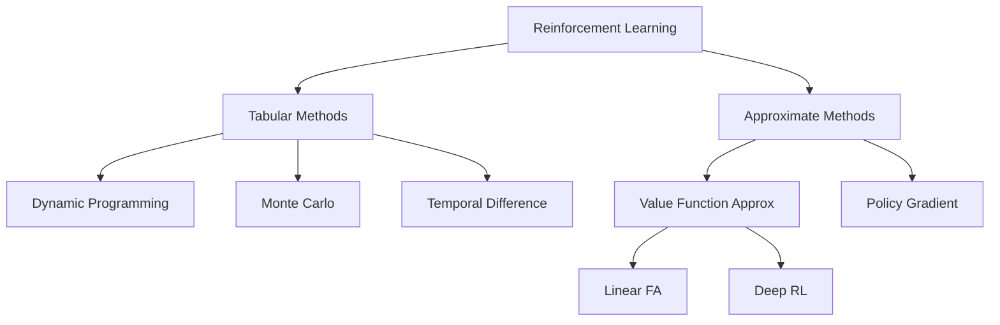

# Reinforcement Learning

> [!definition] Reinforcement Learning
> **Reinforcement Learning** is a computational approach to learning from interaction. An agent learns to make decisions by taking actions in an environment and receiving reward signals, with the goal of maximizing cumulative reward over time.

## Key Characteristics

- **Trial and error**: No supervisor tells the agent what to do — it must discover good actions through experience
- **Delayed reward**: Actions may not yield immediate benefit; their consequences play out over time
- **Exploration-exploitation trade-off**: Must balance trying new things vs. using known good strategies
- **Sequential decision-making**: Current actions affect future states and rewards

## Elements of RL

1. **[[Policy]]** $\pi$: Maps states to actions (what to do)
2. **[[Value Function]]**: Estimates long-term value of states/actions (what's good)
3. **Reward signal**: Immediate feedback (what's good right now)
4. **Model** (optional): Agent's representation of environment dynamics

## The RL Landscape

## Appears In

- [[RL-L01 - Intro, MDPs & Bandits]]
- [[RL-Book Ch1 - Introduction]]
