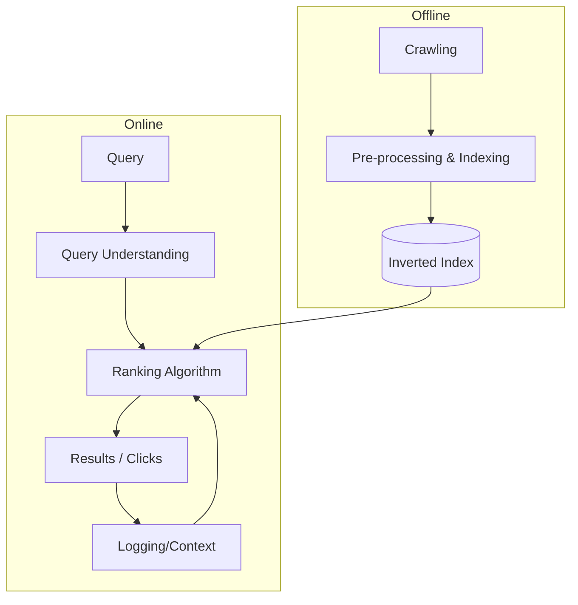

# IR Fundamentals: Introduction, Indexing, and Classic Models

This lecture covers the transition from physical libraries to digital information retrieval (IR) systems, the core challenges of dealing with massive text corpora, and the formal frameworks (Boolean and Vector Space Models) that underpin search technology.

---

## 1. What is Information Retrieval?

> [!definition] Information Retrieval (IR)
> IR is the field concerned with the **structure, analysis, organization, storage, and retrieval of information** (Salton, 1968). Its primary goal is to **connect people to the information** they need to satisfy a specific information need or human/societal requirement.

### 1.1 Evolution of IR
- **The Library:** Historically, knowledge was stored in physical repositories (e.g., Library of Alexandria, Library of Congress). Retrieval was handled by human librarians using physical catalogues (Author, Title, Subject).
- **The Information Explosion:** As document counts grew (from 700k scrolls in 280 BC to 100M docs in 1990), human catalogues became insufficient.
- **The Memex (Vannevar Bush, 1945):** A theoretical "supplement to memory" — a device in which an individual stores books/records and consults them with exceeding speed/flexibility. This laid the conceptual groundwork for modern digital libraries.

### 1.2 The Core Problem: Ad-hoc Retrieval
In an **ad-hoc retrieval** task, a user provides a **query** to a system, which then returns a ranked list of **relevant documents** from a static collection.
- **Document ($d$):** A unit of information (usually text).
- **Query ($q$):** A representation of the user's information need.
- **Relevance:** Whether the document actually satisfies the user's need (subjective and context-dependent).

---

## 2. Key Challenges in IR

IR is hard because it must solve several competing problems:

1.  **Scalability & Efficiency ($C1$):** Systems must handle billions of documents and millions of queries per second with sub-second latency.
2.  **Ranking Optimization ($C2$):** Unlike classification (single prediction), IR must optimize the *entire ordering* of items, often focusing on the top-$k$ results.
3.  **Lexical Mismatch ($C3$):** Users and authors use different words for the same thing (**Synonymy**) or the same word for different things (**Polysemy**).
4.  **Relevance Modeling ($C4$):** Relevance is subjective and evolves during a search session.
5.  **Relevance Judgments ($C5$):** Creating labeled data is expensive; implicit feedback (clicks) is noisy and biased.
6.  **Algorithmic Bias ($C6$):** Systems can amplify existing biases in data.

---

## 3. IR System Architecture

The typical IR engine split into **Offline** (Indexing) and **Online** (Querying) components.



---

## 4. Text Preprocessing Pipeline

Before indexing, text must be converted into a machine-readable format.

### 4.1 Bag of Words (BoW)
Historically, IR models documents as "bags of words" where word order is ignored ($"dog bites man" = "man bites dog"$). While modern models (transformers) preserve order, classic IR relies heavily on BoW.

### 4.2 The Pipeline Steps
1.  **Tokenization:** Breaking character sequences into **tokens**.
    - *Issues:* Hyphens ("e-bay"), apostrophes ("o'donnell"), compounding, and special characters (URLs, code).
2.  **Normalization:** Converting to a canonical form (e.g., lowercase).
3.  **Stop Word Removal:** Removing high-frequency words with low semantic content (e.g., "to", "be", "or").
    - *Methods:* Frequency thresholding or dictionary-based.
4.  **Stemming / Lemmatization:** Reducing variations to a common root/stem.
    - **Suffix-s Stemmer:** Removes 's' (e.g., "cats" $\to$ "cat").
    - **Porter Stemmer (Common):** A rule-based algorithmic stemmer for English.
5.  **Phrase Detection:** (Optional) Identifying noun phrases or n-grams.

---

## 5. Boolean Retrieval

The earliest formal framework for IR.

> [!definition] Boolean Retrieval
> Documents and queries are represented as sets of words. Queries use Boolean operators (`AND`, `OR`, `NOT`). The output is a **set** of documents that logically satisfy the expression.

### 5.1 Term-Document Incidence Matrix
We represent the collection as a 0/1 matrix where rows are terms and columns are documents.

| Term | Doc 1 | Doc 2 | Doc 3 | ... |
| :--- | :---: | :---: | :---: | :-- |
| Brutus | 1 | 1 | 0 | ... |
| Caesar | 1 | 1 | 0 | ... |
| Calpurnia | 0 | 1 | 0 | ... |

To answer `Brutus AND Caesar AND NOT Calpurnia`:
- Get incidence vectors: `110`, `110`, `NOT 010` $\to$ `101`.
- Bitwise AND: `110 & 110 & 101 = 100`. Result: Doc 1 matches.

**Pros:** Easy to understand, clean formalism.
**Cons:** Sparse matrix (inefficient storage), no ranking (all matches equal), difficult to control result size.

---

## 6. The Inverted Index

To solve the scalability issues of the incidence matrix, we use an **Inverted Index**.

### 6.1 Structure
An inverted index consists of a **Dictionary** and **Postings**.
- **Dictionary:** A set of terms. Each term points to its postings list.
- **Postings List:** A list of document IDs (and metadata) containing that term.

> [!example] Index Entry
> **Brutus** $\to [1, 2, 4, 11, 31, 45]$
> **Caesar** $\to [1, 2, 4, 16, 57, 132]$

### 6.2 Query Processing (Merging)
To process `Brutus AND Caesar`, we **merge** the sorted postings lists.

```pseudo
Algorithm: MergePostings(L1, L2)
────────────────────────────────
Initialize: Result = [], i = 0, j = 0
While i < len(L1) and j < len(L2):
  if L1[i] == L2[j]:
    Append L1[i] to Result
    i++, j++
  else if L1[i] < L2[j]:
    i++
  else:
    j++
Return Result
```
- **Complexity:** $O(x + y)$ where $x, y$ are lengths of the lists (linear time).

### 6.3 Positional Indexes
To support **phrase queries** (e.g., "to be or not to be"), we store the **position** of each token in the postings.
- `be` $\to [Doc1: \langle 7, 18, 33 \rangle, Doc2: \langle 3, 149 \rangle]$

---

## 7. Vector Space Model (VSM)

The VSM moves beyond binary "match/no match" to **ranked retrieval**.

### 7.1 Intuition
Documents and queries are represented as vectors in a high-dimensional space (one dimension per term in the vocabulary). Relevance is measured by the proximity (angle) between vectors.

### 7.2 Term Weighting: TF-IDF
We need weights that reflect how "important" a term is to a document.

#### A. Term Frequency ($TF$)
Measure of how frequent a word is in a document.
> [!axiom] TF Constraints
> - **TFC1:** Higher TF $\to$ Higher Score.
> - **TFC2:** Marginal utility of TF should decrease (**Sub-linear scaling**).

$$wf_{t,d} = \begin{cases} 1 + \log_{10} tf_{t,d} & \text{if } tf_{t,d} > 0 \\ 0 & \text{otherwise} \end{cases}$$

#### B. Inverse Document Frequency ($IDF$)
Measure of a term's "discrimination value". Rare terms are more informative.
- Defined by **Zipf's Law**: A few words are very frequent, most are rare.

$$idf_t = \log_{10} \frac{N}{df_t}$$
where:
- $N$ — total number of documents in collection.
- $df_t$ — number of documents containing term $t$.

#### C. TF-IDF Weight
The final weight $w_{t,d}$ is the product:
$$w_{t,d} = tf_{t,d} \times idf_t$$

### 7.3 Cosine Similarity
To rank documents for a query, we compute the cosine of the angle between the query vector $\vec{q}$ and document vector $\vec{d}$.

> [!formula] Cosine Similarity
> $$\text{score}(q, d) = \frac{\vec{q} \cdot \vec{d}}{|\vec{q}| |\vec{d}|} = \frac{\sum_{i=1}^{|V|} q_i d_i}{\sqrt{\sum q_i^2} \sqrt{\sum d_i^2}}$$
> By normalizing by Euclidean length ($|\vec{d}|$), we prevent long documents from unfairly outranking short ones just by having more words.

---

## 8. Summary of Retrieval Foundations

| Feature | Boolean Retrieval | Vector Space Model |
| :--- | :--- | :--- |
| **Document Rep** | Set of words (Binary) | Weighted Vector (TF-IDF) |
| **Logic** | Boolean Logic (Exact) | Similarity (Probabilistic/Geometric) |
| **Output** | Unordered set | Ranked list |
| **Normalization** | None | Length normalization (Cosine) |

> [!tip] Exam Note
> Understand the **$O(x+y)$ Merge** for inverted indexes and be able to compute **TF-IDF weights** manually given raw counts. Zipf's Law and the "Bag of Words" assumption are critical foundational concepts.
