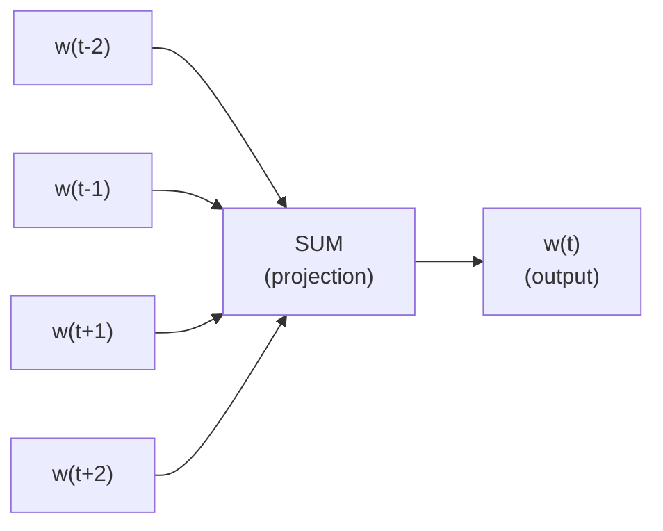
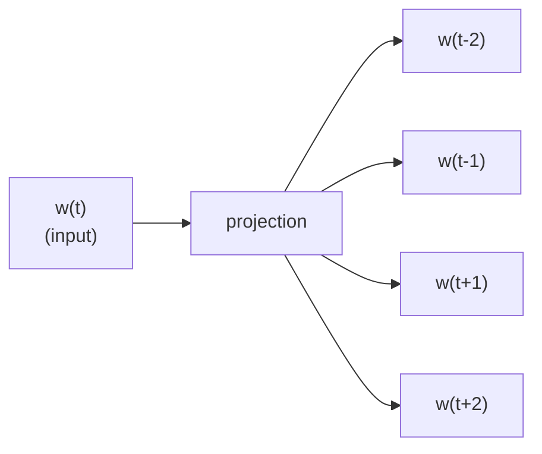
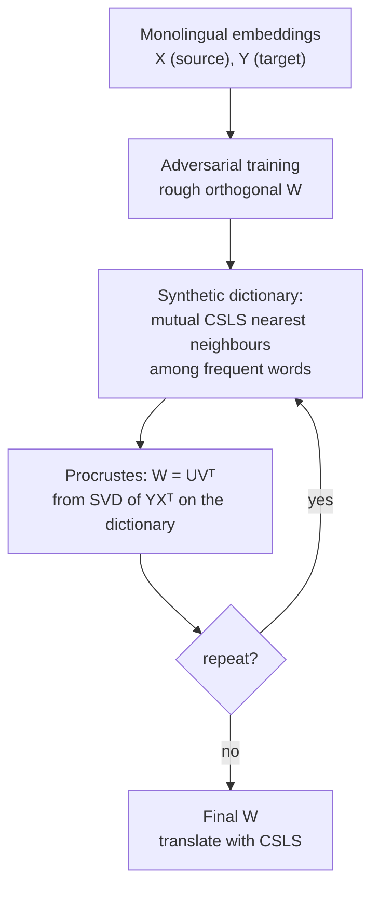

# MNLP-L05: Static Embeddings

> [!abstract] Overview
> A model that sees words as integer IDs knows that `dog` is word 4711 and `cat` is word 812, and nothing else. It has no way to know that whatever it learned about dogs should transfer, partially, to cats, and not at all to carburettors. Everything in this lecture is an answer to one question: how do you give each word a vector such that geometric closeness means linguistic similarity, using only raw text?
>
> The answer the field converged on is Firth's: a word is characterised by the company it keeps. The lecture builds that idea up in three steps. First, literally count the context words (distributional semantics, sparse and interpretable). Then learn dense low-dimensional vectors by training a small network to predict context (Word2Vec CBOW and Skip-gram, made affordable by negative sampling), or by regressing on global co-occurrence counts (GloVe). Then fix the one-vector-per-word-type blindness to morphology with character n-grams (fastText), which matters most for exactly the morphologically rich languages this course cares about.
>
> The second half is the multilingual payoff. If English and Spanish embedding spaces have roughly the same shape, one rotation should map `king` onto `rey`, and you can build a bilingual dictionary from two monolingual corpora plus a small seed dictionary, or, with adversarial training, from no dictionary at all. The lecture ends by taking that claim apart: the "same shape" assumption breaks for typologically distant languages (English and Finnish give 0.0% precision), for mismatched domains and for mismatched embedding algorithms. These vectors are **static**: one vector per word type, regardless of the sentence. The next lecture, [[MNLP-L06 - Contextual Embeddings]], removes that restriction.

The lecture outline (slide 1, repeated as the recap on slide 71):

- Word semantics: distributional semantics
- Embeddings: CBOW and Skip-gram, negative sampling, GloVe
- Evaluation of embeddings
- Morphologically sensitive embeddings: fastText
- Cross-lingual embeddings: supervised alignment, unsupervised alignment, semi-supervised alignment, and a critical evaluation of unsupervised alignment

## 1. What we want from a word representation

We want word representations that let us **compute similarity along multiple dimensions**:

- **meaning**, which itself has several dimensions: synonyms (`car`/`automobile`), topical relatedness (`car`/`road`), and so on
- **morphology** (`run`/`runs`/`running` should be recognisably related)

> [!definition] The distributional hypothesis
> "*You shall know a word by the company it keeps.*" (Firth, 1957)
>
> Produce vector representations of words **based on the contexts in which they occur**. Two words that occur in similar contexts get similar vectors, and are therefore taken to have similar meaning.

There are **two types of approaches**:

| Approach | Also called | How the vector is obtained | Covered in |
|---|---|---|---|
| **count based** | distributional semantics | count context words directly | section 2 |
| **prediction based** | neural embeddings | train a network to predict words from context (or the reverse), keep its weights | sections 3 to 6 |

GloVe (section 7) is the hybrid of the two.

## 2. Distributional semantics: count-based context vectors

### 2.1 The recipe

> [!definition] Count-based approach
> - Define a vocabulary $V_c$ of **context words**.
> - Define a vocabulary $V_t$ of **target words** (can be the same as $V_c$).
> - Define a **window of size $n$** (a sliding window, but the context can also be the whole sentence or document).
> - For each occurrence of a word $w \in V_t$: count how often each word $w' \in V_c$ occurs **within $n$ words to the left or right** of $w$.
> - For each word $w \in V_t$ store the co-occurrence counts in a vector $c_w$.

As pseudocode (assembled from slide 3, which gives the procedure in prose):

```pseudo
Algorithm: Count-based context vectors
──────────────────────────────────────────────────────────
Input:  corpus (sequence of tokens t_1 ... t_N),
        target vocabulary V_t, context vocabulary V_c, window size n
Output: one vector c_w ∈ ℕ^{|V_c|} per target word w

for each w ∈ V_t:
    c_w ← zero vector of length |V_c|
for pos = 1 to N:
    w ← t_pos
    if w ∉ V_t: continue
    for off = -n to n, off ≠ 0:                    // n words left and right
        if 1 ≤ pos+off ≤ N and t_{pos+off} ∈ V_c:
            c_w[index(t_{pos+off})] += 1
return {c_w : w ∈ V_t}
```

### 2.2 Worked example (slides 4 and 5)

The corpus snippets on slide 4. On the slide the target word is in bold and the context words that fall inside the window are underlined; here they are listed after the arrow:

```
...he took the dog for a walk...                 dog  → walk   (3 to the right)
...owner of the dog did not clean...             dog  → owner  (3 to the left)
...people have a dog as a pet...                 dog  → pet    (3 to the right)
...they spotted the car and its owner...         car  → owner  (3 to the right)
...and the cheapest car to run in...             car  → run    (2 to the right)
```

- Context size $n = 3$
- $V_c = \{\textit{leash}, \textit{walk}, \textit{run}, \textit{owner}, \textit{pet}, \textit{bark}\}$

Every underlined word is within 3 tokens of the target, which is why it counts. `took`, `did` or `cheapest` are also within 3 tokens but are not in $V_c$, so they are ignored.

Slide 5 then shows the context vectors for six target words over a larger corpus (the counts are larger than the five snippets alone would give, so the table should be read as illustrative counts over more text):

| word | leash | walk | run | owner | pet | bark |
|---|---|---|---|---|---|---|
| dog | 3 | 5 | 2 | 5 | 3 | 2 |
| cat | 0 | 3 | 3 | 2 | 3 | 0 |
| lion | 0 | 3 | 2 | 0 | 1 | 0 |
| light | 0 | 0 | 0 | 0 | 0 | 0 |
| bark | 1 | 0 | 0 | 2 | 1 | 0 |
| car | 0 | 0 | 1 | 3 | 0 | 0 |

> [!definition] Context vector
> In distributional semantics every word $w$ is represented as a $V$-dimensional context vector $c_w$, where $V = |V_c|$, and
> $$c_w[i] = f$$
> where $f$ is the frequency with which context word $i$ occurs within the (fixed-size) context of $w$.

This is the [[Vector Space Model]] idea from information retrieval applied to words: a document there is a vector of term counts, a word here is a vector of context-word counts.

### 2.3 Similarity as cosine

Word similarity is measured as **cosine similarity in the context vector space**:

> [!formula] Cosine similarity #key-formula
> $$\cos(\mathbf{u}, \mathbf{v}) = \frac{\mathbf{u} \cdot \mathbf{v}}{\lVert \mathbf{u} \rVert_2 \, \lVert \mathbf{v} \rVert_2} = \frac{\sum_i u_i v_i}{\sqrt{\sum_i u_i^2}\,\sqrt{\sum_i v_i^2}}$$
>
> where:
> - $\mathbf{u}, \mathbf{v}$ are the two word vectors (here context vectors $c_w$)
> - $\mathbf{u} \cdot \mathbf{v}$ is the dot product
> - $\lVert \mathbf{u} \rVert_2$ is the Euclidean length of $\mathbf{u}$
>
> It is the cosine of the angle between the vectors: 1 for the same direction, 0 for orthogonal. With non-negative counts it lies in $[0,1]$.

Cosine ignores vector length, which is the point: a frequent word has large counts everywhere, a rare word small ones, and only the *proportions* of the contexts should decide similarity.

**The 2D example on slide 6.** Two context words only, `runs` and `legs`:

| word | runs | legs |
|---|---|---|
| dog | 1 | 4 |
| cat | 1 | 5 |
| car | 4 | 1 |

The slide plots these as arrows from the origin (x-axis `runs`, 0 to 6; y-axis `legs`, 0 to 6), with a dotted arc marking the angle between the animal vectors and the car vector:

```
 legs
  5 ┤    ● cat (1,5)
  4 ┤    ● dog (1,4)          both arrows leave the origin almost vertically
  3 ┤
  2 ┤ ·.                      dotted arc: the large angle between
  1 ┤    ·.                   the animal arrows and the car arrow
    ┤       ·           ● car (4,1)
  0 ┼────┬────┬────┬────┬────┬────┬──
    0    1    2    3    4    5    6   runs
```

Working it out:

$$\cos(\text{dog},\text{cat}) = \frac{1\cdot1 + 4\cdot5}{\sqrt{17}\sqrt{26}} = \frac{21}{21.02} = 0.999 \quad (\approx 2.7^\circ)$$

$$\cos(\text{dog},\text{car}) = \frac{1\cdot4 + 4\cdot1}{\sqrt{17}\sqrt{17}} = \frac{8}{17} = 0.471 \quad (\approx 61.9^\circ)$$

$$\cos(\text{cat},\text{car}) = \frac{1\cdot4 + 5\cdot1}{\sqrt{26}\sqrt{17}} = \frac{9}{21.02} = 0.428 \quad (\approx 64.7^\circ)$$

`dog` and `cat` point almost the same way; `car` points elsewhere.

**The same computation on the slide 5 table** (not on the slides, worked here as practice):

| pair | dot product | cosine |
|---|---|---|
| dog, cat | 40 | 0.824 |
| cat, lion | 18 | 0.864 |
| dog, lion | 22 | 0.674 |
| bark, car | 6 | 0.775 |
| dog, bark | 16 | 0.749 |
| dog, car | 17 | 0.617 |
| lion, bark | 1 | 0.109 |
| anything, light | 0 | undefined |

(Norms: $\lVert c_\text{dog} \rVert = 8.718$, $\lVert c_\text{cat} \rVert = 5.568$, $\lVert c_\text{lion} \rVert = 3.742$, $\lVert c_\text{bark} \rVert = 2.449$, $\lVert c_\text{car} \rVert = 3.162$, $\lVert c_\text{light} \rVert = 0$.)

Three things show up. The animals cluster (cat and lion 0.864, dog and cat 0.824). `bark` and `car` come out at 0.775, more similar than `dog` and `car`, purely because both co-occur with `owner`: one shared context word dominates when vectors are this short, which is the "signal versus noise" problem of section 2.4. And `light` has a zero vector because none of its contexts are in $V_c$, so its cosine with anything is $0/0$: a word whose contexts you did not include has no representation at all.

> [!note] Properties of these vectors
> In distributional semantics context vectors are **high-dimensional** (one dimension per context word, so tens or hundreds of thousands), **discrete** (integer counts) and **sparse** (almost all entries are zero, since any one word co-occurs with a tiny fraction of the vocabulary).

### 2.4 Advantages and disadvantages

| Advantages | Disadvantages |
|---|---|
| **Unsupervised** way to induce word similarity | Context vectors **remain relatively sparse**, despite methods such as stemming to alleviate this |
| **Dimensions are interpretable**: $c_w[i]$ is the frequency of an actual word | **No explicit criterion to discriminate between signal and noise** in the context |

The noise problem in detail:

- some words occur in the context **just due to chance**
- **which context words are the most important discriminators** of a word's meaning? A word like `the` co-occurs with everything and discriminates nothing.

One fix the slide suggests is to weight context words by **inverse document frequency** (the slide writes "ifd", a typo for idf):

> [!formula] Inverse document frequency
> $$\text{idf}(w) = \log \frac{N}{n_w}$$
>
> where:
> - $N$ is the number of contexts
> - $n_w$ is the number of contexts in which $w$ occurs
>
> A context word that appears in nearly every context gets $\text{idf} \approx \log 1 = 0$ and is effectively removed; a word that appears in few contexts gets a large weight.

Example with numbers (not on the slides): with $N = 1000$ contexts, a word in 10 of them gets $\log(1000/10) = 4.61$, a word in 900 of them gets $\log(1000/900) = 0.105$. So the rare, discriminative context word counts about 44 times as much.

## 3. From projections to embeddings

### 3.1 Are projections the same as embeddings?

"Projections" here refers to the projection (lookup) layer of a neural language model such as the probabilistic neural language model (PNLM) referred to on slide 12: the first layer maps each one-hot word to a dense vector $C(w)$, and those vectors are learned along with the rest of the network.

> [!definition] What a good word embedding is
> $C(w) \approx C(w')$ **if and only if**
> - $w$ and $w'$ **mean the same thing**, and
> - $w$ and $w'$ **exhibit the same syntactic behaviour**.
>
> where $C(w)$ is the vector (projection, embedding) assigned to word $w$.

- **For most models, the projections/embeddings are by-products.** The main objective is to optimise a task (next-word prediction, classification, etc.), and the projections are learned only because they help achieve it.
- **Representation learning** is the setting where the *main* objective is to learn good projections/embeddings. Word2Vec is designed this way: the prediction task is a pretext, and the network is thrown away after training except for the embedding matrices.

### 3.2 Word embeddings versus context vectors

> [!definition] Word embeddings
> Same underlying intuition as distributional semantics (a word is characterised by its contexts), but the word vectors are
> - **low dimensional** (e.g. 100, against $|V_c|$ for context vectors)
> - **dense** (no zeros)
> - **continuous** ($c_w \in \mathbb{R}^m$, real-valued, where $m$ is the embedding dimension)
> - **learned by performing a task** (predict)

| Property | Count-based context vectors | Prediction-based [[Word Embeddings]] |
|---|---|---|
| Dimensionality | $\lvert V_c \rvert$ (huge) | $m \approx 100$ to $1000$ |
| Values | discrete counts | real numbers |
| Sparsity | mostly zeros | dense |
| Dimensions interpretable? | yes, each is a context word | no |
| Obtained by | counting | training a predictor |

A popular approach is **Word2Vec** (Mikolov et al.), which consists of two approaches:

- **Continuous Bag of Words (CBOW)**: predict the word from its context
- **Skip-Gram**: predict the context from the word

## 4. Word2Vec: Continuous Bag of Words (CBOW)

### 4.1 The task

> [!definition] CBOW task
> Given a position $t$ in a sentence, the $n$ words to its left $\{w_{t-n}, \ldots, w_{t-1}\}$ and the $m$ words to its right $\{w_{t+1}, \ldots, w_{t+m}\}$, **predict the word in position $t$**.
>
> *the man X the road*, where $X = ?$

> [!warning] Typo on slide 10
> The slide writes the right context as $\{w_{t+1}, \ldots, w_{t+n}\}$ while calling its size $m$. It should end at $w_{t+m}$. In practice the two are equal anyway ($n = m$, see below), which is why every later formula on the slides uses $n$ for both sides.

- It is **seemingly similar to n-gram language modelling**, where $n = \text{LM order} - 1$ and $m = 0$: an n-gram LM predicts a word from the $n$ words to its left only. CBOW also looks to the right, so it is useless as a language model and only good for learning representations.
- It uses a **feed-forward neural network**, with these design choices:
  - **focus on learning the embeddings themselves**
  - a **simpler network** than the PNLM (no hidden non-linear layer)
  - **bring the embedding/projection layer closer to the output**, so the gradient reaching the embeddings is not diluted by layers in between
  - **typically $n = m$, and $n \in \{2, 5, 10\}$**

The name: "bag of words" because the context words are summed, so their order is thrown away, exactly as in a [[Bag of Words]] document representation; "continuous" because the bag is a sum of dense vectors.

### 4.2 Architecture

Slide 11 shows the network for $n = 2$: four input boxes `w(t-2)`, `w(t-1)`, `w(t+1)`, `w(t+2)` in an INPUT column, all with arrows into a single box labelled SUM in the PROJECTION column, which feeds one box `w(t)` in the OUTPUT column.



### 4.3 The model

> [!formula] CBOW #key-formula
> **No non-linearities. One hidden layer:**
> $$h = \frac{1}{2n} W \, w_C, \qquad w_C = \sum_{\substack{i = t-n \\ i \neq t}}^{t+n} w_i$$
>
> **Output layer:**
> $$\hat{y} = \operatorname{softmax}(W' h)$$
>
> where:
> - $w_i$ is the **1-hot vector** (length $\lvert V \rvert$) for the word in position $i$
> - $w_C$ is the sum of the $2n$ context one-hot vectors (so it is a count vector over the vocabulary)
> - $W$ is a $\lvert h \rvert \times \lvert V \rvert$ matrix, the input (projection) matrix
> - $h$ is the hidden layer, of size $\lvert h \rvert$ (the embedding dimension)
> - $W'$ is a $\lvert V \rvert \times \lvert h \rvert$ matrix, the output matrix
> - $\hat{y} \in \mathbb{R}^{\lvert V \rvert}$ is the predicted distribution over the word at position $t$
> - $W'$ and $W$ are **not (necessarily) shared**, i.e. $W' \neq W^T$
>
> **Loss:** cross entropy. **Training:** SGD.

Reading it:

- Multiplying $W$ by a one-hot vector $w_i$ selects **column** $i$ of $W$. So $W w_C$ is the sum of the context words' columns, and $h$ is their **average**. No matrix multiplication is actually performed in an implementation, only lookups.
- There is no non-linearity between $h$ and the output, so the score of a candidate word $j$ is simply the dot product of row $j$ of $W'$ with the averaged context vector.
- **Cross entropy** with a one-hot target reduces to $-\log \hat{y}[w_t]$, the negative log-probability of the correct word (the same loss as in the PNLM, which is what "see PNLM" refers to).
- The softmax normalises over all $\lvert V \rvert$ words, so every training example touches all of $W'$: cost $O(\lvert V \rvert \cdot \lvert h \rvert)$ per prediction. With $\lvert V \rvert$ in the hundreds of thousands this is the bottleneck that negative sampling (section 6) removes.

### 4.4 Where do the embeddings live?

- **Column $i$ of $W$** ($\lvert h \rvert \times \lvert V \rvert$) is the embedding of word $i$ as an *input* (context) word.
- **Row $i$ of $W'$** ($\lvert V \rvert \times \lvert h \rvert$) is the embedding of word $i$ as an *output* (predicted) word.

Which one is "the" embedding? **Typically $W$**, or

$$W_s = W^T + W'$$

which **combines both into one** $\lvert V \rvert \times \lvert h \rvert$ matrix whose row $i$ is the embedding of word $i$ (the transpose turns $W$'s columns into rows so the shapes match).

## 5. Word2Vec: Skip-gram

### 5.1 The task and architecture

> [!definition] Skip-gram task
> An alternative to CBOW. **Given the word at position $t$, predict the words occurring between positions $t-n$ and $t-1$ and between $t+1$ and $t+n$.**

It is CBOW turned around: one input word, $2n$ predictions. Slide 14 shows one input box `w(t)`, an arrow into a single PROJECTION box, and from there four arrows to OUTPUT boxes `w(t-2)`, `w(t-1)`, `w(t+1)`, `w(t+2)`.



### 5.2 The model

> [!formula] Skip-gram #key-formula
> **One hidden layer:**
> $$h = W \, w_I$$
> where $w_I$ is the 1-hot vector for the word at position $t$ (the input word).
>
> **$2n$ output layers**, with the context words assumed independent given the input word:
> $$p(w_{t-n} \ldots w_{t-1} w_{t+1} \ldots w_{t+n} \mid w_I) \;\propto\; \prod_{\substack{i=t-n \\ i \neq t}}^{t+n} p(w_i \mid w_I)$$
> $$\hat{y}_i = \operatorname{softmax}(W' h) \qquad (t - n \le i \le t + n \text{ and } i \neq t)$$
>
> where:
> - $W$ ($\lvert h \rvert \times \lvert V \rvert$) and $W'$ ($\lvert V \rvert \times \lvert h \rvert$) are as in CBOW and are not (necessarily) shared, $W' \neq W^T$
> - $\hat{y}_i$ is the predicted distribution for context position $i$
>
> **Loss:** cross entropy. **Training:** SGD.

Two details worth seeing clearly:

- $h$ is just column $w_I$ of $W$, with no averaging: the input word's embedding is used directly.
- The $2n$ "output layers" all use the **same** $W'$ and the **same** $h$, so they produce the **same** distribution $\hat{y}$. What differs is the target each one is scored against. The loss is the sum $-\sum_{i \neq t} \log \hat{y}[w_i]$. Equivalently, Skip-gram is trained on $2n$ independent (input word, context word) pairs per position, which is how negative sampling treats it.

| | CBOW | Skip-gram |
|---|---|---|
| Input | $2n$ context words | 1 centre word |
| Output | the centre word | each of the $2n$ context words |
| Hidden layer | average of context embeddings | embedding of the centre word |
| Predictions per position | 1 | $2n$ |

## 6. Negative sampling

### 6.1 The problem and the idea

- **Both CBOW and Skip-gram benefit from large amounts of data.**
- **Computing activations for the full output layer becomes an issue**: the softmax needs a score for every word in $V$ for every single training example.

> [!definition] Negative sampling
> Replace "predict which word appears in the context" with "**distinguish between words that do and words that do not occur in the context of the input word**":
> - a **classification task** (binary: real context pair or not)
> - **1 positive example** (from the ground truth, the word that actually occurred)
> - **$k$ negative examples** (drawn from a random noise distribution)

Per training example the cost drops from $\lvert V \rvert$ dot products to $k+1$. See [[Negative Sampling]] for the general technique, and [[Contrastive Learning]] for the family it belongs to: pull the true pair together, push sampled pairs apart.

### 6.2 The objective

> [!formula] Negative sampling objective #key-formula
> Given the input word $w$ and a context word $c$ we want
> $$\arg\max_\theta \prod_{(w,c) \in D} p(D = 1 \mid c, w; \theta) \prod_{(w,c) \in D'} p(D = 0 \mid c, w; \theta)$$
>
> where:
> - $D$ is the set of **observed** (word, context) pairs from the data
> - $D'$ is a set of pairs drawn from a **noise distribution**
> - $D = 1$ means "this pair came from the data", $D = 0$ "this pair is noise"
> - $\theta$ are the parameters (the matrices $W$ and $W'$)
>
> The probability of a pair being real is
> $$p(D = 1 \mid c, w; \theta) = \sigma(v_c \cdot v_w), \qquad v_w = W w, \quad v_c = W'^T c$$
> where $\sigma(x) = 1/(1+e^{-x})$ is the logistic sigmoid, $w$ and $c$ are one-hot vectors, so $v_w$ is column $w$ of $W$ (input embedding) and $v_c$ is row $c$ of $W'$ (output embedding).
>
> And $p(D = 0 \mid c, w; \theta) = 1 - p(D = 1 \mid c, w; \theta)$. Since $1 - \sigma(x) = \sigma(-x)$:
> $$\arg\max_\theta \prod_{(w,c) \in D} \sigma(v_c \cdot v_w) \prod_{(w,c) \in D'} \sigma(-v_c \cdot v_w)$$
>
> Taking logs:
> $$\arg\max_\theta \sum_{(w,c) \in D} \log \sigma(v_c \cdot v_w) + \sum_{(w,c) \in D'} \log \sigma(-v_c \cdot v_w)$$

The identity $1 - \sigma(x) = \sigma(-x)$ in one line: $1 - \frac{1}{1+e^{-x}} = \frac{e^{-x}}{1+e^{-x}} = \frac{1}{e^{x}+1} = \sigma(-x)$.

Intuition: the dot product $v_c \cdot v_w$ is a compatibility score. Training pushes it up for pairs seen in the data and down for random pairs. Words that share many contexts get pushed towards the same output vectors, and therefore towards each other.

### 6.3 Practical settings (slide 18)

> [!note] Word2Vec practical considerations
> - **Skip-gram:**
>   - for each observed occurrence $(w, c)$ **add 5 to 20 negative samples** to the data
>   - draw the negative $c$ from the **unigram distribution $P(w)$**
>   - **scale the unigram distribution to $P(w)^{0.75}$ to bias towards rarer words**
> - **Context size typically around 2 to 5.**
> - **The more data, the smaller the context and the negative sample set** can be.

Why the 0.75 power helps (worked here with made-up frequencies, not on the slides). Three words with unigram probabilities 0.9, 0.09 and 0.01:

| word | $P(w)$ | $P(w)^{0.75}$ | renormalised |
|---|---|---|---|
| frequent | 0.90 | 0.924 | 0.825 |
| medium | 0.09 | 0.164 | 0.147 |
| rare | 0.01 | 0.032 | 0.028 |

The raised values sum to 1.12, so they are renormalised. The rare word's sampling probability almost triples (1% to 2.8%) and the frequent word's drops (90% to 82.5%). Without this, nearly every negative would be `the`, `of` or `and`, and the model would learn little about the rest of the vocabulary.

### 6.4 Skip-gram with negative sampling as an algorithm

The slides give the pieces; here they are assembled into one procedure (the update rules are the gradients of the objective above, derived below):

```pseudo
Algorithm: Skip-gram with negative sampling (SGNS)
──────────────────────────────────────────────────────────
Input:  corpus, window n (2 to 5), negatives k (5 to 20),
        embedding dim |h|, learning rate η
Init:   W  (|h| × |V|) small random      // input embeddings, columns v_w
        W' (|V| × |h|) small random      // output embeddings, rows v_c
        P_n(w) ∝ P(w)^0.75               // noise distribution

for each position t in corpus:
    w ← word at t
    for each context position i ∈ [t-n, t+n], i ≠ t:
        c ← word at i                                 // positive pair (w, c)
        draw n_1 .. n_k from P_n                      // k negative pairs (w, n_j)
        g_w ← 0
        // positive: push σ(v_c·v_w) towards 1
        e ← σ(v_c · v_w) − 1
        g_w ← g_w + e · v_c
        v_c ← v_c − η · e · v_w
        // negatives: push σ(v_nj·v_w) towards 0
        for j = 1 to k:
            e ← σ(v_nj · v_w)
            g_w ← g_w + e · v_nj
            v_nj ← v_nj − η · e · v_w
        v_w ← v_w − η · g_w
return W  (or W^T + W')
```

**Where the updates come from** (not on the slides). For one positive pair and $k$ negatives, the loss to minimise is
$$\mathcal{L} = -\log \sigma(v_c \cdot v_w) - \sum_{j=1}^{k} \log \sigma(-v_{n_j} \cdot v_w)$$
Using $\frac{d}{dx} \log \sigma(x) = 1 - \sigma(x)$:
$$\frac{\partial \mathcal{L}}{\partial v_w} = \big(\sigma(v_c \cdot v_w) - 1\big)\, v_c + \sum_{j=1}^{k} \sigma(v_{n_j} \cdot v_w)\, v_{n_j}$$
The coefficient on the positive term is negative (so gradient descent moves $v_w$ towards $v_c$), and the coefficient on each negative is positive (moves $v_w$ away from $v_{n_j}$). Both shrink to zero as the classifier gets the pair right.

> [!example] One step with numbers (illustrative values, not from the slides)
> Suppose $v_c \cdot v_w = 2$ for the true context word, and two negatives score $v_{n_1} \cdot v_w = 0.5$ and $v_{n_2} \cdot v_w = -1$.
>
> | term | score | probability | loss contribution |
> |---|---|---|---|
> | positive $c$ | 2 | $\sigma(2) = 0.881$ | $-\log 0.881 = 0.127$ |
> | negative $n_1$ | 0.5 | $\sigma(-0.5) = 0.378$ | $-\log 0.378 = 0.974$ |
> | negative $n_2$ | $-1$ | $\sigma(1) = 0.731$ | $-\log 0.731 = 0.313$ |
>
> Total loss $\mathcal{L} = 1.414$. The gradient with respect to $v_w$ is
> $$-0.119\, v_c + 0.622\, v_{n_1} + 0.269\, v_{n_2}$$
> so the largest correction comes from $n_1$, the negative the model currently mistakes for a real context word. The positive pair is already mostly right and contributes little.

## 7. GloVe

### 7.1 Motivation: combine counting and predicting

There are **two main strategies** for learning word representations:

| | Count-based | Prediction-based |
|---|---|---|
| How | directly (section 2), or as **global matrix factorisation** (latent semantic analysis: factorise the co-occurrence matrix with SVD) | **local context window** (CBOW or Skip-gram) |
| Strength | **uses global information** (co-occurrence counts) directly | **still tends to outperform** count-based approaches |
| Weakness | **tends to perform worse** than prediction-based approaches | **treats each instance of a context window as an independent event**: it has to repeatedly "rediscover" the association between two words every time they co-occur |

> [!definition] GloVe
> **GloVe** (Pennington et al., 2014) **combines global co-occurrence statistics with local prediction-based updating**: it first counts, once, over the whole corpus, and then trains vectors with gradient updates to fit those counts.

### 7.2 The model

Notation:

- $X_{ij}$ is the **number of times word $j$ occurs in the context of word $i$** (the co-occurrence matrix, built as in section 2)
- $X_i = \sum_k X_{ik}$ is the **number of times any word occurs in the context of word $i$**
- $P_{ij} = P(j \mid i) = X_{ij} / X_i$ is the **probability of word $j$ occurring in the context of word $i$**

> [!formula] GloVe objective #key-formula
> $$J = \sum_{(i,j)} f(X_{ij}) \cdot \left( w_i \cdot \tilde{w}_j + b_i + \tilde{b}_j - \log X_{ij} \right)^2$$
>
> where:
> - $w_i$ is the learned vector for word $i$ (as a target word)
> - $\tilde{w}_j$ is the learned vector for context word $j$
> - $b_i$ and $\tilde{b}_j$ are scalar bias terms for words $i$ and $j$
> - $\log X_{ij}$ is the log co-occurrence count, the regression target
> - $f(X_{ij})$ is a weighting function (below)

Read it as **weighted least-squares regression**: find vectors whose dot product (plus biases) predicts the log of how often the two words co-occur. Words with similar co-occurrence rows end up with similar vectors.

Not on the slides, but useful to see why logs: if $w_i \cdot \tilde{w}_k \approx \log X_{ik}$, then $(w_i - w_j) \cdot \tilde{w}_k \approx \log \frac{X_{ik}}{X_{jk}}$, a log *ratio* of co-occurrence probabilities. Ratios are what separate meaning: `ice` and `steam` both co-occur with `water`, but the ratio for `solid` is large and for `gas` small. Vector differences then encode such ratios, which is also why analogy arithmetic (section 8.3) works.

> [!formula] GloVe weighting function
> $$f(x) = \begin{cases} (x / x_\text{max})^{\alpha} & \text{if } x < x_\text{max} \\ 1 & \text{otherwise} \end{cases}$$
>
> Typically $x_\text{max} = 100$ and $\alpha = 0.75$.

Its purpose is to **de-emphasise very rare (noisy) and very frequent (uninformative) co-occurrences**. It **increases smoothly from zero for rare pairs** (down-weighting noise) and **caps at 1 for frequent pairs** (preventing uninformative co-occurrences from taking over).

| $X_{ij}$ | 0 | 1 | 5 | 10 | 25 | 50 | $\geq 100$ |
|---|---|---|---|---|---|---|---|
| $f(X_{ij})$ | 0 | 0.032 | 0.106 | 0.178 | 0.354 | 0.595 | 1 |

```
 f(x)
 1.0 ┤                                  ●━━━━━━━━━━━━━  capped at 1
     ┤                         ●·····
 0.5 ┤                 ●····
     ┤          ●···
     ┤     ●··
 0.0 ●···┬────────┬────────┬────────┬────────┬─────
     0   10       25       50       75      100    x = X_ij
```

A detail that makes the objective well defined (not on the slides): $\log X_{ij}$ is $-\infty$ for pairs that never co-occur, but $f(0) = 0$, so those terms vanish. The sum effectively runs only over the non-zero entries of $X$, which is also what makes GloVe cheap: the matrix is sparse.

### 7.3 The algorithm

Reproduced verbatim from the slides:

```pseudo
Build co-occurrence matrix X by a single pass over the corpus:
for each center word i and each context word j within the window:
    X_ij += weight     // often 1/distance, nearer words more important

Initialize w_i, w̃_j, b_i, b̃_j randomly for all words

Repeat (for several epochs):
for each pair (i,j) (sampled/shuffled):
    weight  ← f(X_ij)
    error   ← w_iᵀw̃_j + b_i + b̃_j − log X_ij
    loss_ij ← weight · error²
    update w_i, w̃_j, b_i, b̃_j by AdaGrad on this loss

Final embedding for word i ← w_i + w̃_i   (sum the two vector sets)
```

Notes:

- **One pass over the corpus** builds $X$. After that, training never looks at the corpus again, only at the non-zero cells of $X$. This is the "global" part.
- The count increment is **weighted by distance**: a word 1 position away adds 1, a word 3 positions away adds $1/3$. So $X_{ij}$ is not necessarily an integer.
- **AdaGrad** (not explained on the slides) is SGD with a per-parameter learning rate that shrinks for parameters that have received large gradients, useful here because frequent words get many updates and rare words few.
- **Final embedding $= w_i + \tilde{w}_i$**: the same trick as $W_s = W^T + W'$ in CBOW. With a symmetric window $X$ is symmetric, so the two sets of vectors play interchangeable roles and differ only by random initialisation; summing them averages out that noise.

### 7.4 GloVe versus Word2Vec

| | Word2Vec | GloVe |
|---|---|---|
| **Training procedure** | individual local context windows | global co-occurrence matrix |
| **Training objective** | predict context word(s) | weighted least-squares regression on log-counts |
| **Addresses frequency imbalances by** | subsampling frequent words (can include negative sampling) | explicit weighting function $f(X_{ij})$ |
| **Interpretability** | indirect: the model learns to predict context | directly fits log co-occurrence counts |

"Subsampling frequent words" is not defined on the slides. In Word2Vec it means randomly discarding occurrences of very frequent words before training (each occurrence of $w$ is dropped with a probability that grows with $w$'s frequency), so that `the` does not dominate the training pairs.

## 8. Evaluating word embeddings

### 8.1 Two axes of evaluation

| | Meaning |
|---|---|
| **Intrinsic** | how good are the word embeddings **by themselves**? |
| **Extrinsic** | how useful are they **for downstream tasks**, such as summarisation, MT, IR, etc.? |
| **Qualitative** | **examine the characteristics of selected examples** (nearest neighbours, plots) |
| **Quantitative** | use some **overall (task-dependent) score** |

The two axes are independent: a 2D plot is intrinsic and qualitative, a word similarity correlation is intrinsic and quantitative, a BLEU score after plugging embeddings into MT is extrinsic and quantitative.

### 8.2 Intrinsic evaluation: word similarity

> [!definition] Word similarity task
> - **Rank a list of word pairs**, e.g. (*car*, *bicycle*), **by similarity** (cosine of their embeddings).
> - Compare with human judgements using **Spearman correlation**.
> - Benchmarks: **WS-353** (annotates **relatedness**), **SimLex-999** (annotates **similarity**).
> - These benchmarks **mix all kinds of similarities** (synonyms, topical, unrelated...).

Spearman correlation (definition not on the slides) is the Pearson correlation between the *ranks* of the two lists, so only the ordering of the pairs matters and the scale of the cosine is irrelevant. With no ties, $\rho = 1 - \frac{6 \sum_k d_k^2}{N(N^2-1)}$, where $d_k$ is the difference between the two ranks of pair $k$ and $N$ the number of pairs.

The relatedness/similarity distinction matters (illustration not on the slides): `coffee` and `cup` are highly *related* (topical) but not *similar* (a cup is not a kind of coffee). A relatedness benchmark like WS-353 rewards an embedding for putting them close, a similarity benchmark like SimLex-999 penalises it. Which one an embedding does well on depends on what its training context captures, so the two benchmarks can rank the same embeddings differently.

**WS-353 examples** (slide 25; human scores on a 0 to 10 scale):

| word 1 | word 2 | score |
|---|---|---|
| tiger | cat | 7.35 |
| tiger | tiger | 10.00 |
| plane | car | 5.77 |
| train | car | 6.31 |
| television | radio | 6.77 |
| media | radio | 7.42 |
| bread | butter | 6.19 |
| cucumber | potato | 5.92 |
| doctor | nurse | 7.00 |
| word | similarity | 4.75 |
| peace | plan | 4.75 |
| drink | ear | 1.31 |
| energy | secretary | 1.81 |
| production | hike | 1.75 |

Note `media`/`radio` (7.42) scoring above `television`/`radio` (6.77), and `bread`/`butter` at 6.19: these are relatedness judgements, since bread and butter are not the same kind of thing.

### 8.3 Intrinsic evaluation: analogies

> [!definition] Analogy task
> - *Paris is to France as Berlin is to X*
> - **Evaluated by accuracy** (is the top answer exactly the right word?)
> - **Arithmetic "magic"**: $X = v_\text{king} - v_\text{man} + v_\text{woman}$, and the answer is the vocabulary word whose embedding is closest (by cosine) to $X$; the expected answer is `queen`
> - Also includes **syntactic analogies**: *acquired* is to *acquire* as *tried* is to $X$ (answer *try*)

For *a is to b as c is to X*, the vector is $X = v_b - v_a + v_c$: for the Paris example, $v_\text{France} - v_\text{Paris} + v_\text{Berlin}$, expected nearest word `Germany`. In standard evaluation the three input words are excluded from the candidate answers (not on the slides), since $X$ is usually still closest to one of them.

### 8.4 Visualising embeddings

- Visualising embeddings is **not trivial due to the number of dimensions** (128, 512, 1024, ...).
- **Project the high-dimensional space to 2D** (e.g. using **t-SNE** or **PCA**).

PCA is a linear projection onto the two directions of largest variance. t-SNE is a non-linear method that tries to keep each point's nearest neighbours near it in 2D and gives up on preserving global distances.

**Slide 28** is a 2D projection of the neighbourhood of `power`-related words, shown as labelled light-blue dots. Reading the plot:

- top right: an **electricity cluster**: `voltage`, `battery`, `electric`, `electrical`, `solar`, `electricity`, `generator`
- middle: an **energy/systems cluster**: `cooling`, `motor`, `fuel`, `output`, `supply`, `consumption`, `charging`, `wind`, `switch`, `light`, `efficiency`, `systems`, `speed`, with `energy` and `power` off to the right
- lower middle: a **control/operation cluster**: `generation`, `operate`, `controlled`, `pressure`, `system`, `capacity`, `controlling`, `capability`, `control`, `capable`
- bottom left: an **abstract "ability/authority" cluster**: `turn`, `universal`, `need`, `means`, `state`, `enough`, `thus`, `gain`, `force`, `powerful`, `powers`, `greater`, `strength`, `sense`, `authority`, `ability`
- `Power` (capitalised) sits isolated on the far left, separate from lowercase `power`, a reminder that the vocabulary is case-sensitive and the two forms got different vectors.

The point: different senses of "power" (electrical, mechanical, political/abstract) separate into different regions.

**Slide 29** is a full-vocabulary t-SNE map: thousands of tiny word labels forming dense clumps and islands, too small to read at slide resolution (the slide links to a full-resolution version). It shows that at scale the space has local cluster structure but no readable global layout.

**Slide 30**: "*Select word pairs of interest, compute differences, and compare orientations.*" A 2D projection (x from about $-0.5$ to $0.5$, y from about $-0.5$ to $0.5$) with dashed lines joining male/female word pairs:

| male (lower end) | approx. position | female (upper end) | approx. position |
|---|---|---|---|
| brother | (−0.48, −0.17) | sister | (−0.47, 0.26) |
| nephew | (−0.46, 0.02) | niece | (−0.45, 0.35) |
| uncle | (−0.40, −0.10) | aunt | (−0.41, 0.31) |
| man | (−0.31, −0.49) | woman | (−0.24, −0.06) |
| sir | (0.00, −0.45) | madam | (0.13, 0.11) |
| heir | (0.08, 0.04) | heiress | (0.13, 0.50) |
| king | (0.27, −0.50) | queen | (0.28, −0.12) |
| earl | (0.33, −0.10) | countess | (0.44, 0.33) |
| duke | (0.37, −0.16) | duchess | (0.48, 0.30) |
| emperor | (0.31, −0.27) | empress | (0.49, 0.20) |

All ten lines point roughly the same way (upwards and slightly to the right): there is a consistent "gender direction" in the space. This is the geometric fact behind $v_\text{king} - v_\text{man} + v_\text{woman} \approx v_\text{queen}$, and it is the property cross-lingual alignment relies on in section 10.

> [!warning] Do not over-trust 2D plots
> 2D visualisations are great, but **should not always be taken at face value**:
> - they can use **non-linear projections** that group things that are close in high-dimensional space, so distances in the plot are not distances in the space
> - **t-SNE hyperparameter settings have a substantial impact on results** (Wattenberg 2016): the same data can show different cluster sizes, distances, or even apparent clusters that are not there
>
> They **complement, but do not substitute**, more quantitative and extrinsic evaluations.

## 9. Morphologically sensitive embeddings: fastText

### 9.1 The problem with one vector per word type

- **Word2Vec and GloVe assign one opaque vector per word type.**
  - "run", "runs", "running" and "runner" get **four (potentially) unrelated vectors**
  - there is **no shared structure** between them, despite the obvious morphological relationship
- **Morphologically rich languages suffer most.** Finnish, Turkish, Russian and others have **huge word-form families**, and a whole-word embedding model cannot generalise across them: each inflected form is a separate, rarer word with a worse-estimated vector.
- **No fallback for unseen (OOV) words**: a word not in the training vocabulary has no vector at all.

This is the same problem as in [[MNLP-L04 - Subword Segmentation]], seen from the embedding side instead of the vocabulary side.

How to make word embeddings morphologically sensitive? Two options on the slide:

1. **Sub-segment words** (e.g. with BPE or a morphological analyser) **and learn embeddings separately for each sub-segment.**
2. **Sliding character window: fastText** (introduced by Facebook AI, Bojanowski et al. (2017)). Represent a word by all of its character n-grams.

### 9.2 The fastText algorithm

Reproduced verbatim from the slides:

```pseudo
Input:  corpus, window size m, n-gram range [n_min, n_max] (default 3–6),
        embedding dimension d, negatives K

for each word w in vocabulary:
    G_w ← { all char n-grams of "<w>" for n in [n_min, n_max] } ∪ { "<w>" }
    initialize n-gram vectors z_g (dimension d) and context vectors u_c randomly

for each (center word w, context word c) pair in corpus, with window m:
    sample K negatives n_1..n_K from noise distribution P_n
    v_w ← Σ_{g ∈ G_w} z_g                              // compose center vector
    loss ← −log σ(v_wᵀ u_c) − Σ_k log σ(−v_wᵀ u_{n_k})

    for each g ∈ G_w:
        z_g ← z_g − η · ∂loss/∂v_w          // same gradient to each n-gram
    update u_c and all u_{n_k}

return { z_g }
```

What changes compared with Skip-gram with negative sampling (section 6.4):

- The **centre word's vector is no longer a lookup**. It is **the sum of the vectors of its character n-grams**, $v_w = \sum_{g \in G_w} z_g$.
- `<` and `>` are **boundary markers** added to the word, so that prefixes and suffixes are distinct n-grams: `<ru` can only be word-initial, `ns>` only word-final, and the trigram `her` inside `<where>` differs from the word `<her>`.
- The **whole word** `<w>` is also in $G_w$, so frequent words still get a word-specific vector component.
- The **loss is exactly the negative-sampling loss** of section 6.2, with $u_c$ playing the role of $v_c$.
- Because $v_w$ is a sum, $\partial v_w / \partial z_g = I$ for every $g \in G_w$, so **every n-gram of the word receives the same gradient**.
- Context vectors $u_c$ remain ordinary per-word vectors; only the centre side is decomposed.
- **What is returned is the n-gram table $\{z_g\}$**, and there is no separate word table. The vector of any word, including one never seen in training, is computed on demand by summing its n-grams.

> [!example] The n-grams of `runs` (worked here, not on the slides)
> Wrap the word: `<runs>` (6 characters). With $n \in [3, 6]$:
>
> | $n$ | n-grams |
> |---|---|
> | 3 | `<ru`, `run`, `uns`, `ns>` |
> | 4 | `<run`, `runs`, `uns>` |
> | 5 | `<runs`, `runs>` |
> | 6 | `<runs>` (this is also the whole-word token) |
>
> So $G_\text{runs}$ has 10 elements and $v_\text{runs}$ is the sum of 10 vectors. `<running>` has 23 n-grams, and shares `<ru`, `<run` and `run` with `<runs>`, so the two words' vectors share three summands and are pulled together automatically.
>
> An OOV word such as `runnings` still has n-grams like `<run`, `runn`, `ning`, `ings>`, most of which were seen in training, so it gets a sensible vector where Word2Vec would have nothing.

In practice (not on the slides) the number of distinct n-grams is enormous, so fastText hashes them into a fixed number of buckets (about 2 million) and shares a vector per bucket.

### 9.3 Evaluation

Slide 34 shows two tables from Bojanowski et al. (2017). The slide does not label the columns. From the paper: `sg` and `cbow` are the Word2Vec baselines, `sisg` ("subword information skip-gram") is fastText, and `sisg-` is fastText where words not in the training vocabulary get a null vector instead of being built from n-grams. The left table is word similarity (Spearman correlation × 100 with human judgements), the right is analogy accuracy (%). Bold marks the best score per row as printed on the slide.

**Word similarity** (Spearman × 100):

| Language | Dataset | sg | cbow | sisg- | sisg |
|---|---|---|---|---|---|
| Arabic (AR) | WS353 | 51 | 52 | 54 | **55** |
| German (DE) | GUR350 | 61 | 62 | 64 | **70** |
| German (DE) | GUR65 | 78 | 78 | **81** | **81** |
| German (DE) | ZG222 | 35 | 38 | 41 | **44** |
| English (EN) | RW | 43 | 43 | 46 | **47** |
| English (EN) | WS353 | 72 | **73** | 71 | 71 |
| Spanish (ES) | WS353 | 57 | 58 | 58 | **59** |
| French (FR) | RG65 | 70 | 69 | **75** | **75** |
| Romanian (RO) | WS353 | 48 | 52 | 51 | **54** |
| Russian (RU) | HJ | 59 | 60 | 60 | **66** |

**Word analogy** (accuracy %):

| Language | Type | sg | cbow | sisg |
|---|---|---|---|---|
| Czech (CS) | Semantic | 25.7 | 27.6 | 27.5 |
| Czech (CS) | Syntactic | 52.8 | 55.0 | 77.8 |
| German (DE) | Semantic | 66.5 | 66.8 | 62.3 |
| German (DE) | Syntactic | 44.5 | 45.0 | 56.4 |
| English (EN) | Semantic | 78.5 | 78.2 | 77.8 |
| English (EN) | Syntactic | 70.1 | 69.9 | 74.9 |
| Italian (IT) | Semantic | 52.3 | 54.7 | 52.3 |
| Italian (IT) | Syntactic | 51.5 | 51.8 | 62.7 |

What to read off:

- **Word similarity:** sisg is best or tied-best on 9 of 10 datasets. The only loss is English WS353 (71 against cbow's 73), the dataset of frequent English words where whole-word vectors are already good. The biggest gains are in **morphologically rich languages**: German GUR350 +9 over sg (+8 over cbow), Russian HJ +7. On **English RW** (the Rare Words dataset) it gains 4, because rare words are where n-gram sharing helps.
- **sisg against sisg-:** building OOV vectors from n-grams adds up to 6 points (DE GUR350 64 to 70, RU 60 to 66), which is the direct value of having a fallback for unseen words.
- **Analogies:** the gains are almost entirely **syntactic**: Czech +25.0 (52.8 to 77.8), German +11.9, Italian +11.2, English +4.8 over sg. Syntactic analogies (*acquired : acquire :: tried : try*) are about morphology, which is exactly what the n-grams capture.
- **Semantic analogies do not improve and sometimes get worse** (German 66.5 to 62.3, English 78.5 to 77.8). `France : Paris :: Germany : Berlin` has nothing to do with character overlap, and forcing words with shared n-grams together can add noise there.

## 10. Cross-lingual embeddings

### 10.1 The goal

Embeddings map similar words (e.g. synonyms) to neighbouring points in a high-dimensional space:

- EN↔EN: $E(\text{house}) \approx E(\text{building})$
- NL↔NL: $E(\text{huis}) \approx E(\text{gebouw})$
- What about words **in different languages**? EN↔NL: $E(\text{house}) \approx E(\text{gebouw})$?

(The slide writes the right-hand sides without the $E$, e.g. "$E(\text{house}) \approx (\text{building})$"; the $E$ is clearly intended.)

A cross-lingual embedding space puts translation-equivalent words close together. Its main uses in this course are **bilingual lexicon induction** (building a dictionary by nearest-neighbour search) and transferring models trained on one language to another, which [[MNLP-L07 - Crosslingual NLP]] develops.

**Three basic training set-ups:**

1. **Train embeddings for each language separately, then align the spaces.**
2. **Train embeddings for all languages together** (benefiting from word overlap, e.g. names and numbers shared across languages), **then align the regions**.
3. **Train embeddings on data that is aligned** at the word or sentence level.

**Either way, some form of alignment has to take place:**

- learn a **mapping that brings the two spaces into alignment**
- goal: **translation-equivalent words end up geometrically close together**
- hope: use **large monolingual corpora** and only a **small bilingual signal** for alignment, because monolingual text is plentiful for many languages and parallel text is not

The rest of the lecture is about set-up 1.

### 10.2 The shared space hypothesis

> [!definition] Shared space hypothesis
> - **Different languages, trained separately, still encode similar relational structure.** The geometric relationship between "king" and "queen" in English is structurally similar to that between "rey" and "reina" in Spanish.
> - There is an **approximate isomorphism between embedding spaces in different languages**:
>   - the **overall shape of the point cloud is similar**
>   - the **specific coordinates and orientations can differ** (each training run starts from random initialisation, so the axes mean nothing)
> - **If true (it is a hypothesis)**, a **single geometric transformation can align the spaces**: a general linear mapping applied to one space should bring translations of word pairs close together.

**Slide 37** shows the evidence that motivated this (the slide gives no source). Four 2D projections of embedding spaces, English on the left in red, Spanish on the right in blue, with an arrow between them:

| English word | approx. 2D position | Spanish word | approx. 2D position |
|---|---|---|---|
| one | (0.63, 0.02) | uno (one) | (1.05, 0.10) |
| two | (−0.03, −0.25) | dos (two) | (0.18, −0.56) |
| three | (0.08, −0.13) | tres (three) | (0.27, −0.18) |
| four | (−0.04, 0.14) | cuatro (four) | (−0.05, 0.20) |
| five | (0.01, 0.04) | cinco (five) | (0.08, −0.03) |
| horse | (−0.16, 0.17) | caballo (horse) | (−0.30, 0.41) |
| cow | (−0.11, 0.06) | vaca (cow) | (−0.24, 0.30) |
| pig | (0.00, 0.00) | cerdo (pig) | (0.00, 0.00) |
| dog | (0.14, 0.01) | perro (dog) | (0.43, 0.18) |
| cat | (−0.29, −0.26) | gato (cat) | (−0.43, −0.40) |

The scales differ (the Spanish plots are stretched) but the **arrangement is the same**: in both languages `one` is far to the right of the other numbers, `four` at the top, `two` at the bottom; `cat` is isolated at the bottom left, `horse` and `cow` close together at the top left, `dog` to the right. Two independently trained spaces, one shape.

**The king/queen example (slide 38):**

- EN: king, queen, man, woman. "king" and "queen" are separated by roughly the **same offset** as "man" and "woman" (a consistent gender direction, as in section 8.4).
- ES: rey, reina, hombre, mujer. The **same relational structure holds**, but the whole point cloud may be **rotated and scaled differently** relative to English.

> [!formula] Isomorphism
> A mapping $m$ preserves structure if
> $$m(a \circ b) = m(a) \circ m(b)$$
> where $\circ$ is the operation on the space (here vector addition and subtraction). Applied to the analogy:
> $$m(v_\text{king} - v_\text{man} + v_\text{woman}) \approx m(v_\text{king}) - m(v_\text{man}) + m(v_\text{woman}) \approx m(v_\text{king} - v_\text{man}) + m(v_\text{woman})$$
>
> So if $m$ maps English to Spanish, the English analogy maps to the Spanish one: the gender offset in English becomes the gender offset in Spanish.

For a linear map $m(v) = Wv$ these equalities hold exactly, since $W(a - b + c) = Wa - Wb + Wc$. That is the motivation for using a linear $W$ (section 11.4). The "$\approx$" on the slide reflects that the spaces themselves are only approximately isomorphic. (Strictly, a structure-preserving map is a homomorphism; an isomorphism is additionally invertible. The slide uses the term loosely.)

## 11. Supervised alignment with a seed dictionary

### 11.1 Types of alignment methods

| Type | Bilingual signal | How |
|---|---|---|
| **Supervised** | a **seed bilingual dictionary** as anchors, **typically thousands** of word translations | solve for the mapping directly (sections 11 to 13) |
| **Semi-supervised** | a **very small seed dictionary** (**hundreds** of word translations) | **bootstrap new translations based on statistical confidence**, then re-solve (section 15) |
| **Unsupervised** | **no bilingual signal** | **uses adversarial training** (section 14) (the slide has the typo "sues") |

### 11.2 Where seed dictionaries come from

Slide 40 lists three sources and poses two questions to think about:

1. **Large human-compiled, machine-readable dictionaries.** Ideal, but *"those are often not ideal, why?"* The slide leaves this open. Reasons consistent with the rest of the lecture: they list lemmas (`talk`) while the embedding vocabulary is full of inflected forms (`hablamos`, see slide 48 below), they contain many senses per entry, coverage of low-resource languages is poor, and they do not cover multi-word expressions.
2. **Learn translation dictionaries from actual data.** This **requires human translations at the sentence level** (a parallel corpus), then **word align each sentence pair**.
3. **Exploit the fact that some words occur in multiple languages** (identically spelled words: names, numbers, borrowings). *"Also has some issues, which ones?"* Again left open on the slide. The obvious ones: false friends (Dutch `bad` means bath, English `bad` does not), it only works between languages that share a script, and the shared words are skewed towards names and numbers. Section 16 shows that, despite this, identical-word dictionaries work surprisingly well.

**Word alignment (slide 41)** is shown as an alignment grid between an English sentence (columns) and its Dutch translation (rows); a dot means the two words are aligned:

```
                The  Secretary  of  State  visits  The  Netherlands
De               ●
minister                ●
van                             ●
buitenlandse                         ●
zaken                                ●
brengt                                      ●
een                                         ●
bezoek                                      ●
aan                                         ●
Nederland                                           ●       ●
```

The alignments are not one-to-one. `buitenlandse zaken` (foreign affairs) both align to `State` (as in Secretary of State); the four-word Dutch phrase `brengt een bezoek aan` (literally "brings a visit to") aligns to the single English verb `visits`; and `Nederland` aligns to the two English words `The Netherlands`. A word aligner run over a parallel corpus produces such links, and the most frequent links per word give a dictionary. The non-one-to-one cases show why the resulting dictionary is noisy at the word level.

### 11.3 The general alignment problem

> [!formula] General alignment problem #key-formula
> $$W^* = \arg\min_W \sum_i \lVert W x_i - y_i \rVert^2$$
>
> where:
> - $(x_i, y_i)$ are **paired vectors**: a source-language word embedding $x_i \in \mathbb{R}^{d_1}$ and the embedding $y_i \in \mathbb{R}^{d_2}$ of its translation in the target language
> - $W$ is a $d_2 \times d_1$ matrix, the transformation applied to every source vector
> - $\lVert \cdot \rVert$ is the Euclidean norm
>
> Find the transformation $W$ that, applied to every source vector, gives the smallest distance to the corresponding target embedding.

The slide calls this "the **Procrustes** algorithm" (and has the typo "know as").

> [!warning] Terminology: what "Procrustes" means
> As written, with no constraint on $W$, this is ordinary multivariate least-squares regression. The name **Procrustes problem** in the literature, and in the "Procrustes" rows of the results tables on slides 54 and 61, refers to the **orthogonally constrained** version of section 12 (solved with SVD). The slide's naming here is loose. For the exam: unconstrained least squares is Mikolov et al. (2013); orthogonal Procrustes is Xing et al. (2015) onwards.

The **basic questions** the rest of the lecture answers:

- **what should $W$ be?** (linear, section 11.4)
- **what constraints should it satisfy?** (orthogonality, section 12)
- **where do the pairs $(x_i, y_i)$ come from?** (a seed dictionary, section 11.2; or nowhere, section 14)

**Seed dictionaries (slide 43).** A seed dictionary is a **list of (source word, target word) translation pairs**:

- often just the **top few thousand most frequent words**, translated using an existing bilingual dictionary
- **automatic translation** can be used as well (with caution: errors become wrong anchors)
- **limited to words**: there are no embeddings for multi-word expressions (phrases), so they cannot be anchors

Each pair gives **one anchor point across the two spaces**: e.g. $(x_i, y_i)$ = the source embedding of "cat" and the target embedding of "gato". **The goal is a mapping that generalises beyond these anchors**: words never seen in the seed dictionary should also end up correctly aligned. A dictionary of 5000 pairs is useless on its own; a mapping learned from it that translates the other 195 000 words is the point.

### 11.4 The linear transformation hypothesis

> [!definition] Linear transformation hypothesis
> - **Strong assumption:** a **single linear transformation $W$ is sufficient** to map one language's embedding space onto another's.
> - **Why linear (as opposed to non-linear)?** King/queen and man/woman analogies are **already linear regularities within a single space**, and the assumption is that the **same regularities hold across spaces**. A linear map preserves them exactly (section 10.2).
> - It **reduces alignment to a classic regression problem**: given paired points, find the matrix $W$ that best maps one set onto the other.

### 11.5 The least-squares mapping algorithm

Reproduced verbatim from the slides:

```pseudo
Input:  source embeddings, target embeddings, seed dictionary D of n pairs

For each pair (source_word, target_word) ∈ D:
   x_i ← source embedding of source_word
   y_i ← target embedding of target_word
Assemble X (d₁ × n) and Y (d₂ × n)

initialize W randomly

repeat until convergence:
     for each mini-batch of pairs:
          loss ← Σ ‖W x_i − y_i‖²
          W ← W − η · ∂loss/∂W

return W
```

The gradient (not on the slides): $\frac{\partial}{\partial W} \sum_i \lVert W x_i - y_i \rVert^2 = 2 \sum_i (W x_i - y_i)\, x_i^\top$.

> [!formula] Closed-form solution
> $$W^* = Y X^\top (X X^\top)^{-1}$$
>
> where $X$ ($d_1 \times n$) and $Y$ ($d_2 \times n$) hold the paired vectors as columns.

Derivation (not on the slides): the loss is $\lVert WX - Y \rVert_F^2$ (Frobenius norm, the sum of squares of all entries). Setting the gradient $2(WX - Y)X^\top$ to zero gives $W X X^\top = Y X^\top$, so $W = Y X^\top (X X^\top)^{-1}$. This needs $X X^\top$ ($d_1 \times d_1$) to be invertible, which requires at least $d_1$ linearly independent source vectors, i.e. $n \geq d_1$ dictionary pairs.

- **Mikolov et al. (2013) used SGD.**
- **SGD scales better** with large embedding dimensions and dictionaries.
- **The closed form is exact; SGD is approximate but more memory-friendly** (it never forms or inverts $X X^\top$).

At inference, to translate a source word $x$: compute $Wx$ and return the target word whose embedding is nearest (by cosine).

### 11.6 Results of the linear mapping

Slides 46 to 48 carry no citation; they follow the slide on Mikolov et al. (2013) and slide 51 labels the same unconstrained method as Mikolov et al. (2013).

**Slide 46**, word translation precision (P@1: correct translation is the top candidate; P@5: in the top 5):

| Translation | Edit Distance P@1 | P@5 | Word Co-occurrence P@1 | P@5 | Translation Matrix P@1 | P@5 | ED + TM P@1 | P@5 | Coverage |
|---|---|---|---|---|---|---|---|---|---|
| En → Sp | 13% | 24% | 19% | 30% | 33% | 51% | 43% | 60% | 92.9% |
| Sp → En | 18% | 27% | 20% | 30% | 35% | 52% | 44% | 62% | 92.9% |
| En → Cz | 5% | 9% | 9% | 17% | 27% | 47% | 29% | 50% | 90.5% |
| Cz → En | 7% | 11% | 11% | 20% | 23% | 42% | 25% | 45% | 90.5% |

The slide does not explain the columns; reading them from their names:

- **Edit Distance** is a baseline that translates a word to the most similarly spelled target word (it works only through cognates).
- **Word Co-occurrence** is a count-based baseline (section 2 vectors instead of learned embeddings).
- **Translation Matrix** (TM) is the learned linear $W$.
- **ED + TM** combines the two.
- **Coverage** is not defined on the slide; it is presumably the share of test words the method could produce a translation for.

The translation matrix beats both baselines by a wide margin (En→Sp P@1 33% against 13% and 19%), and combining it with edit distance adds another 10 points for Spanish but only 2 for Czech. Spanish and English share far more cognates than Czech and English, so spelling similarity helps more there. Czech, the more distant language, is harder for every method.

**Slide 47**, two plots:

*Left, accuracy against amount of training data.* x-axis: number of monolingual training words, log scale from $10^7$ to $10^{11}$; y-axis: accuracy 0 to 80. Two rising curves:

| training words (approx.) | $2 \cdot 10^7$ | $6 \cdot 10^7$ | $2 \cdot 10^8$ | $6 \cdot 10^8$ | $2 \cdot 10^9$ | $2.5 \cdot 10^{10}$ |
|---|---|---|---|---|---|---|
| Precision@1 (blue) | 9 | 25 | 38 | 44 | 51 | 53 |
| Precision@5 (red) | 19 | 41 | 55 | 61 | 70 | 75 |

Accuracy grows roughly linearly in the log of the data size and flattens above about $2 \cdot 10^9$ words. Better monolingual embeddings make the mapping work better.

*Right, accuracy by word frequency.* A bar chart with no legend and no x-axis title; the bins are labelled 5–7K, 7–9K, ..., 17–19K, which reads as frequency-rank bins of the test words. Blue and red bars, presumably P@1 and P@5 as in the left plot:

| bin | 5–7K | 7–9K | 9–11K | 11–13K | 13–15K | 15–17K | 17–19K |
|---|---|---|---|---|---|---|---|
| blue (P@1?) | 53 | 50 | 45 | 44 | 42 | 44 | 40 |
| red (P@5?) | 73 | 70 | 68 | 65 | 62 | 63 | 60 |

Accuracy drops as words get rarer (P@1 from 53 to 40 between the 5–7K and 17–19K bins): rarer words have worse embeddings, so their mapped positions are less reliable.

**Slide 48**, translation examples (Spanish to English, top 3 computed translations against the dictionary entry):

| Spanish word | Computed English translations | Dictionary entry |
|---|---|---|
| emociones | emotions, emotion, feelings | emotions |
| protegida | wetland, undevelopable, protected | protected |
| imperio | dictatorship, imperialism, tyranny | empire |
| determinante | crucial, key, important | determinant |
| preparada | prepared, ready, prepare | prepared |
| millas | kilometers, kilometres, miles | miles |
| hablamos | talking, talked, talk | talk |
| destacaron | highlighted, emphasized, emphasised | highlighted |

The errors are instructive. `imperio` gives `dictatorship`, `imperialism`, `tyranny`: all topically related, none the translation `empire`. `determinante` gives near-synonyms of the sense used in running text (`crucial`, `key`) rather than the dictionary's `determinant`. `millas` puts `kilometers` above `miles`, since the two units occur in identical contexts. `protegida` (protected, feminine) ranks `wetland` first, presumably from contexts like *zona protegida*. And `hablamos` (we talk) maps to `talking`, `talked`, `talk`: the morphology does not line up one-to-one, so the dictionary entry `talk` is only rank 3. Embedding nearness captures relatedness, and the dictionary demands exact equivalence.

## 12. Orthogonal mappings

### 12.1 What is wrong with an unconstrained $W$

> [!warning] Limitations of unconstrained mappings
> - **An arbitrary matrix $W$ can stretch, shear and rotate the space.** Nothing forces it to preserve the **internal geometry** (distances and angles) of the source language.
> - This can result in **overfitting to the seed dictionary**: words in (or near) the seed pairs are covered well, and the mapping **does not generalise to words not in the dictionary** (the majority).
> - **Mismatch between training and inference objectives:**
>   - training minimises **Euclidean distance** $\lVert W x_i - y_i \rVert^2$
>   - inference retrieves nearest neighbours by **cosine similarity**
>   - the two are **not equivalent unless vectors are unit-normalised**
> - So **additional constraints on the form of $W$ are needed.**

### 12.2 The orthogonality constraint

> [!formula] Orthogonal mapping (Xing et al., 2015) #key-formula
> $$W^* = \arg\min_W \sum_i \lVert W x_i - y_i \rVert^2 \quad \text{subject to} \quad W^\top W = I$$
>
> with **normalisation**: all embeddings are of unit length, $\lVert x \rVert^2 = 1$.
>
> where $I$ is the identity matrix. If $W$ is orthogonal it **only allows rotations and reflections**, and **no scaling or shearing**: it **preserves angles and distances**.
>
> **$W^*$ can be solved exactly using SVD.**

Why this fixes both problems:

1. **Geometry is preserved.** $\lVert W x \rVert^2 = x^\top W^\top W x = x^\top x = \lVert x \rVert^2$, and similarly for dot products, so the source space is moved rigidly. It cannot be warped to fit the seed pairs at the expense of everything else, which is the overfitting argument. And a rigid rotation is exactly what the shared space hypothesis says should be enough.
2. **Training and inference agree.** For unit vectors, and with $W$ orthogonal so $\lVert W x \rVert = 1$ (derivation not on the slides):
$$\lVert W x - y \rVert^2 = \lVert W x \rVert^2 + \lVert y \rVert^2 - 2\, (Wx) \cdot y = 2 - 2 \cos(Wx, y)$$
So minimising Euclidean distance **is** maximising cosine similarity.

**Slide 50's figure.** Two 3D scatter plots of the same few thousand points (light blue), with three highlighted red points (a circle, a diamond, a star). Left: unnormalised vectors scattered through a cube with axes from 0 to 100. Right: the same vectors after normalisation, all lying on the surface of the unit sphere (axes $-1$ to $1$), with the three red points at the corresponding positions on the sphere. Normalising throws away length and keeps only direction, which is all cosine looks at; after normalisation an orthogonal map is literally a rotation (or reflection) of that sphere.

**Solving it with SVD** (the slide only states that it can be done; the solution and derivation are not on the slides). With $X$ ($d \times n$) and $Y$ ($d \times n$) holding the dictionary pairs as columns:

> [!formula] Orthogonal Procrustes solution
> $$U \Sigma V^\top = \operatorname{SVD}(Y X^\top), \qquad W^* = U V^\top$$
>
> where $U$, $V$ are orthogonal and $\Sigma$ is the diagonal matrix of singular values of the $d \times d$ matrix $Y X^\top$.

Derivation: $\lVert WX - Y \rVert_F^2 = \lVert WX \rVert_F^2 + \lVert Y \rVert_F^2 - 2\operatorname{tr}(W^\top Y X^\top)$. The first term equals $\lVert X \rVert_F^2$ for orthogonal $W$, so minimising the loss means maximising $\operatorname{tr}(W^\top Y X^\top) = \operatorname{tr}(W^\top U \Sigma V^\top) = \operatorname{tr}(V^\top W^\top U\, \Sigma)$. The matrix $Z = V^\top W^\top U$ is orthogonal, so its diagonal entries are at most 1 and $\operatorname{tr}(Z\Sigma) = \sum_k Z_{kk} \sigma_k \le \sum_k \sigma_k$, with equality at $Z = I$. Hence $W^\top = V U^\top$, i.e. $W = U V^\top$. One SVD of a $d \times d$ matrix, no iteration, no learning rate: this is why the refinement step in section 15 can "re-solve for $W$ exactly".

### 12.3 Results: unconstrained against orthogonal

**Slide 51**, English to Spanish word translation, for different embedding dimensionalities (D-EN for English, D-ES for Spanish):

| D-EN | D-ES | Mikolov et al. (2013) P@1 | P@5 | Xing et al. (2015) P@1 | P@5 |
|---|---|---|---|---|---|
| 300 | 300 | 30.43% | 49.43% | 38.99% | 59.16% |
| 500 | 500 | 25.76% | 44.29% | 39.91% | 59.82% |
| 700 | 700 | 20.69% | 39.12% | 41.04% | 59.38% |
| 800 | 200 | 35.36% | 53.96% | 40.06% | 60.02% |

Left half: unnormalised, unconstrained (Mikolov et al. 2013). Right half: normalised, orthogonal (Xing et al. 2015).

- The **unconstrained mapping gets worse as the dimension grows**: P@1 falls from 30.43% at 300 dimensions to 20.69% at 700. More dimensions means more free parameters in $W$ ($d^2$) for the same seed dictionary, i.e. more room to overfit, which is exactly the slide 49 warning.
- The **orthogonal mapping is better everywhere and improves slightly with dimension** (38.99% to 41.04%), since its number of effective degrees of freedom is constrained.
- The unconstrained method's best setting is the asymmetric 800/200 one (35.36%).

> [!warning] An orthogonality detail the slides skip
> The slide notes "the different embedding dimensionalities for English and Spanish". With $d_\text{EN} = 800$ and $d_\text{ES} = 200$, $W$ is not square, and a non-square $W$ cannot satisfy $W^\top W = I$ in both directions: a $200 \times 800$ matrix has rank at most 200, so $W^\top W$ ($800 \times 800$) cannot be the identity. For that row, the constraint can only hold in the form $W W^\top = I$ (rows orthonormal) or with the roles reversed, depending on the mapping direction. The slide does not say how Xing et al. handled this; the constraint as written applies cleanly only to the square cases.

## 13. Hubness and CSLS

### 13.1 The hubness problem

**Nearest neighbour retrieval** is used **at inference time** to actually return the most similar words, based on the (mapped) embeddings.

> [!definition] Hubs
> In high-dimensional spaces, **some points become "hubs"**: a **small number of vectors end up as the nearest neighbour of many other points, regardless of any actual similarity**.
> - a **known phenomenon in high-dimensional geometry**, not specific to embeddings
> - it **worsens as dimensionality increases**

**Consequence for translation retrieval:** hub words in the target language get nominated as the nearest-neighbour "translation" for many unrelated source words:

$$\text{nn}(\text{cat}) = \text{thing}, \quad \text{nn}(\text{car}) = \text{thing}, \quad \ldots, \quad \text{nn}(\text{house}) = \text{thing}$$

Nearest neighbour is not symmetric: `thing` can be the nearest neighbour of `cat` even though `cat` is far from being the nearest neighbour of `thing`. A hub sits near the "centre" of the cloud and is moderately close to everything. Conneau et al. (2018) propose a modification of cosine similarity to correct for this.

### 13.2 CSLS

> [!formula] Cross-domain Similarity Local Scaling (CSLS) #key-formula
> $$\text{CSLS}(x, y) = 2 \cos(x, y) - r_T(x) - r_S(y)$$
>
> where:
> - $x$ is a mapped source vector ($x = W x_s$) and $y$ a target vector
> - $r_T(x)$ is the **average cosine similarity between $x$ and its $K$ nearest neighbours in the target space**:
> $$r_T(W x_s) = \frac{1}{K} \sum_{y_t \in \mathcal{N}_T(W x_s)} \cos(W x_s, y_t)$$
>   with $\mathcal{N}_T(W x_s)$ the set of the $K$ nearest target vectors to $W x_s$
> - $r_S(y)$ is the **average cosine similarity between $y$ and its $K$ nearest neighbours in the (mapped) source space**
>
> Translation of $x_s$: the target word $y$ that maximises $\text{CSLS}(W x_s, y)$.

- **Subtracting $r_S(y)$ penalises a candidate $y$ if it is, on average, close to lots of things** (a hub): a hub has a high $r_S$, so its score drops.
- $r_T(x)$ is the same for every candidate $y$ when translating a fixed $x$, so it does not change which $y$ wins. It matters when CSLS scores are compared across different source words, e.g. when ranking candidate pairs to build a dictionary (section 15).
- **CSLS significantly increases word translation retrieval accuracy**, while **not requiring any parameter tuning** (only $K$; Conneau et al. use $K = 10$, which is not on the slides).

> [!example] CSLS defusing a hub (toy numbers, not from the slides)
> Translating `cat`. Its mapped vector $x$ has $r_T(x) = 0.50$. Two candidates:
>
> | candidate | $\cos(x, y)$ | $r_S(y)$ | CSLS $= 2\cos - r_T - r_S$ |
> |---|---|---|---|
> | `thing` (a hub) | 0.65 | 0.70 | $1.30 - 0.50 - 0.70 = 0.10$ |
> | `gato` | 0.60 | 0.40 | $1.20 - 0.50 - 0.40 = 0.30$ |
>
> Plain nearest neighbour picks `thing` (0.65 > 0.60). CSLS picks `gato`, because `thing` is similarly close to every source word and gets penalised for it.

### 13.3 Results

**Slide 54**, supervised alignment (seed dictionary) with fastText embeddings, comparing three retrieval criteria on the same Procrustes (orthogonal) mapping. The slide does not name the metric; in Conneau et al. (2018), where the table comes from, it is word translation accuracy P@1 (%):

| Method | en-es | es-en | en-fr | fr-en | en-de | de-en | en-ru | ru-en | en-zh | zh-en | en-eo | eo-en |
|---|---|---|---|---|---|---|---|---|---|---|---|---|
| Procrustes - NN | 77.4 | 77.3 | 74.9 | 76.1 | 68.4 | 67.7 | 47.0 | 58.2 | 40.6 | 30.2 | 22.1 | 20.4 |
| Procrustes - ISF | 81.1 | 82.6 | 81.1 | 81.3 | 71.1 | 71.5 | 49.5 | 63.8 | 35.7 | **37.5** | 29.0 | 27.9 |
| Procrustes - CSLS | 81.4 | 82.9 | 81.1 | **82.4** | 73.5 | **72.4** | **51.7** | **63.7** | **42.7** | 36.7 | **29.3** | 25.3 |

(Bold as on the slide. The bold marks the best in the full table, which slide 61 shows, so the es and en-fr columns have no bold here: the unsupervised method beats these. The ru-en bold is inconsistent: CSLS 63.7 is bold although ISF shows 63.8 in the same column.)

- **NN** is plain cosine nearest neighbour; **ISF** is "inverted softmax", an alternative hubness correction (not explained on the slides); **CSLS** as above.
- CSLS improves over NN on every pair, by 4.0 points for en-es, 6.3 for fr-en, 4.7 for de-en (5.1 for en-de), 5.5 for ru-en.
- The accuracy order follows language distance: Spanish and French around 80, German low 70s, Russian 50 to 64, Chinese 31 to 43, Esperanto 20 to 29 (Esperanto presumably low because its training corpus is small).

## 14. Unsupervised alignment: adversarial training

### 14.1 Why and how

Supervised methods need a seed dictionary of **thousands of translation pairs**:

- for **many low-resource language pairs**, even a small bilingual dictionary **may not exist**
- dictionaries **may not cover inflected forms**, which are the forms most often observed in actual data

So: **can two independently trained monolingual spaces be aligned from their geometry alone?** No anchors, no seed pairs, just **two point clouds that are hypothesised to be approximately isomorphic**.

> [!warning] Chicken and egg
> We need a **mapping to find translation pairs**, and **translation pairs to learn the mapping**.
>
> The approach of **Conneau et al. (2018)**: **adversarial training bootstraps an initial rough alignment from distributional structure alone**, and the rough alignment then yields translation pairs for the supervised machinery of sections 12 and 13.

### 14.2 The basic idea

Based on the **Generative Adversarial Network (GAN)** framework:

| Role | What it is | Aim |
|---|---|---|
| **Generator** | the mapping $W$ from before, mapping source embeddings into the target space | make mapped source vectors **indistinguishable from real target vectors** |
| **Discriminator** | a classifier, **trained simultaneously** | tell apart **mapped source vectors** and **real target vectors** |

The two are **trained in opposition**: the discriminator gets better at telling real embeddings from mapped ones, and $W$ gets better at fooling the discriminator.

**Data:**

- **real data:** the target-language embedding distribution $y_1, \ldots, y_n$
- **fake data:** the mapped source distribution $W x_1, \ldots, W x_m$

If the discriminator cannot tell $\{W x_i\}$ from $\{y_j\}$, the mapped source cloud has the same shape and position as the target cloud. Under the shared space hypothesis, the only rotation that achieves this is the one that puts translations on top of each other.

### 14.3 Design choices

> [!important] The generator is deliberately not a deep network
> - It is a **single $d \times d$ matrix**: a **linear map with no non-linearity**, and this is deliberate.
> - A **deep generator could learn an arbitrarily complex warping**.
> - It **could make the mapped cloud statistically indistinguishable from the target cloud while completely scrambling which source word is mapped where**. Matching the *distribution* says nothing about matching *individual points*; only a constrained, near-rigid map forces the point-level correspondence to come along with the distribution match.

**Discriminator architecture:**

- **multilayer perceptron, 2 hidden layers of 2048 units each**
- **ReLU** activations
- **dropout on the input layer**
- output: **two-class prediction with label smoothing $s = 0.2$**: instead of target labels $\{0, 1\}$ use $\{s, 1-s\}$, which **prevents the discriminator from becoming pathologically overconfident** (a discriminator that outputs exactly 0 or 1 gives the generator vanishing gradients)

**Sampling:**

- both the source and target vectors fed to the discriminator are drawn from **the most frequent 50k words** of each language
- **rare words have poorly estimated embeddings** (few training occurrences)
- **restricting to frequent words gives a cleaner discriminatory signal**

### 14.4 The algorithm

Reproduced verbatim from the slides:

```pseudo
Input: source embeddings X, target embeddings Y (monolingual, unaligned)
       orthogonalization coefficient β = 0.01

Initialize W ← I  (identity/random orthogonal matrix)
Initialize discriminator parameters θ_D randomly

repeat:
    // Discriminator step (W frozen):
    sample batch of source vectors {x_i}
    sample batch of target vectors {y_j}
    compute mapped vectors {W x_i}

    ℒ_D ← −(1/n) Σ log P_θD(source=1 | W x_i)
          −(1/m) Σ log P_θD(source=0 | y_j)
    θ_D ← θ_D − η · ∂ℒ_D/∂θ_D

    // Generator step (θ_D frozen):
    sample new batches {x_i}, {y_j}
    ℒ_W ← −(1/n) Σ log P_θD(source=0 | W x_i)
          −(1/m) Σ log P_θD(source=1 | y_j)

    // backpropagate ℒ_W through the frozen discriminator into W
    ∇_W ← (1/n) Σ δ_i x_iᵀ // where δ_i = ∂ℒ_W/∂(W x_i)
    W ← W − η · ∇_W

    // Re-Orthogonalization:
    W ← (1 + β) W − β (W Wᵀ) W
```

Line by line:

- $P_{\theta_D}(\text{source} = 1 \mid v)$ is the discriminator's probability that vector $v$ is a **mapped source** vector (fake); $\text{source} = 0$ means real target.
- **Discriminator loss $\mathcal{L}_D$**: ordinary binary cross entropy with the true labels (mapped source = 1, target = 0).
- **Generator loss $\mathcal{L}_W$**: the **same cross entropy with the labels flipped**. $W$ is rewarded when the discriminator calls mapped vectors "target" (source = 0). The second term, over $y_j$, does not depend on $W$ and contributes no gradient; it is written for symmetry.
- **The gradient for $W$**: $W x_i$ is the discriminator's input, so the chain rule gives $\partial \mathcal{L}_W / \partial W = \sum_i \delta_i x_i^\top$ with $\delta_i$ the gradient of the loss with respect to the discriminator's input. (Since $\mathcal{L}_W$ already contains the $1/n$, the extra $1/n$ on the slide only rescales the step and is absorbed into $\eta$.)
- **Re-orthogonalisation** with $\beta = 0.01$ pulls $W$ back towards an orthogonal matrix after each gradient step. If $W$ is already orthogonal, $W W^\top = I$ and the update gives $(1+\beta)W - \beta W = W$: orthogonal matrices are fixed points. Not on the slides: writing $W$ via its SVD, each singular value $s$ is updated as $s \leftarrow (1+\beta)s - \beta s^3$, which pushes $s$ towards 1 (with $\beta = 0.01$: $1.5 \to 1.481$, $0.5 \to 0.504$, $1 \to 1$). Gradient steps alone would let $W$ drift into a general linear map with the overfitting and warping problems of section 12.1.

### 14.5 Model selection without a dictionary

**When should training stop, i.e. which checkpoint should be kept?**

- the **adversarial loss is not a reliable indicator** of alignment quality
- the **discriminator loss can look fine while the mapping is poor**
- in a truly unsupervised setting there is **no validation dictionary** to check against

> [!definition] Unsupervised validation criterion
> 1. Take the **10k most frequent source words**.
> 2. With the current $W$, find each source word's **CSLS nearest neighbour** in the target space.
> 3. Compute the **average cosine similarity** across these induced pairs.
>
> Keep the checkpoint with the highest value.

```pseudo
Algorithm: Unsupervised model selection criterion
─────────────────────────────────────────────────
Input:  mapping W, source embeddings, target embeddings
S ← 10 000 most frequent source words
total ← 0
for each s ∈ S:
    t* ← argmax_t CSLS(W x_s, y_t)        // induced translation
    total ← total + cos(W x_s, y_t*)
return total / |S|
```

**Empirical finding** behind it: a **poor mapping** puts mapped source words **far from any real target words**, so even their best matches have low cosine. A **high average cosine** indicates that the mapping lands on actual (hopefully correct) target words. It is a proxy, and the slide's "(correct?)" is the honest caveat: high cosine does not prove the pairs are translations.

## 15. Semi-supervised refinement and the MUSE pipeline

The mapping $W$ from adversarial training is a **rough alignment**: the **global orientation is approximately right**, but it is **not precise enough** for high-quality translation retrieval. The full **MUSE** pipeline (Conneau et al.'s toolkit) therefore continues with a refinement:

1. **Adversarial training** to obtain a rough $W$.
2. **Build a synthetic dictionary**: use $W$ with **CSLS** to find **mutual nearest-neighbour pairs among frequent words**, and **keep only high-confidence mutual matches**.
3. **Re-solve for $W$ exactly via SVD** on that induced dictionary (orthogonal Procrustes, section 12.2).
4. **Repeat steps 2 and 3** (self-learning).



```pseudo
Algorithm: MUSE refinement (self-learning), assembled from slide 60
────────────────────────────────────────────────────────────────────
Input:  rough W from adversarial training,
        source embeddings, target embeddings, number of iterations R
for r = 1 to R:
    D ← ∅
    for each frequent source word s:
        t ← argmax_t CSLS(W x_s, y_t)                 // best target for s
        if argmax_s' CSLS(W x_s', y_t) = s:           // s is also best source for t
            D ← D ∪ {(s, t)}                          // mutual nearest neighbours
    keep only high-confidence pairs in D
    X_D, Y_D ← embeddings of the pairs in D (as columns)
    U Σ Vᵀ ← SVD(Y_D X_Dᵀ)
    W ← U Vᵀ                                          // exact orthogonal solution
return W
```

Why "semi-supervised": after step 1 there is no human signal at all, but steps 2 to 4 are exactly the supervised method of section 12 run on a dictionary the system made itself. With a small human seed dictionary instead of adversarial training as step 1, the same loop is the semi-supervised method of section 11.1. "Mutual" nearest neighbours matter: a pair is only trusted if each word picks the other, which filters out hub matches.

### 15.1 Results (slide 61)

Word translation accuracy (P@1, %), fastText embeddings, Conneau et al. (2018). Top half with cross-lingual supervision (repeated from slide 54), bottom half without:

| Method | en-es | es-en | en-fr | fr-en | en-de | de-en | en-ru | ru-en | en-zh | zh-en | en-eo | eo-en |
|---|---|---|---|---|---|---|---|---|---|---|---|---|
| *With supervision* | | | | | | | | | | | | |
| Procrustes - NN | 77.4 | 77.3 | 74.9 | 76.1 | 68.4 | 67.7 | 47.0 | 58.2 | 40.6 | 30.2 | 22.1 | 20.4 |
| Procrustes - ISF | 81.1 | 82.6 | 81.1 | 81.3 | 71.1 | 71.5 | 49.5 | 63.8 | 35.7 | **37.5** | 29.0 | 27.9 |
| Procrustes - CSLS | 81.4 | 82.9 | 81.1 | **82.4** | 73.5 | **72.4** | **51.7** | **63.7** | **42.7** | 36.7 | **29.3** | 25.3 |
| *Without supervision* | | | | | | | | | | | | |
| Adv - NN | 69.8 | 71.3 | 70.4 | 61.9 | 63.1 | 59.6 | 29.1 | 41.5 | 18.5 | 22.3 | 13.5 | 12.1 |
| Adv - CSLS | 75.7 | 79.7 | 77.8 | 71.2 | 70.1 | 66.4 | 37.2 | 48.1 | 23.4 | 28.3 | 18.6 | 16.6 |
| Adv - Refine - NN | 79.1 | 78.1 | 78.1 | 78.2 | 71.3 | 69.6 | 37.3 | 54.3 | 30.9 | 21.9 | 20.7 | 20.6 |
| Adv - Refine - CSLS | **81.7** | **83.3** | **82.3** | 82.1 | **74.0** | 72.2 | 44.0 | 59.1 | 32.5 | 31.4 | 28.2 | **25.6** |

(Bold as printed. As noted for slide 54, the bolding does not always mark the column maximum: ru-en and eo-en have higher ISF values, 63.8 and 27.9.)

What to read off:

- **Each component helps.** For en-es: adversarial alone 69.8, + CSLS 75.7, + refinement 79.1, both 81.7.
- **Fully unsupervised matches or beats supervised** for the close, well-resourced pairs: en-es 81.7 against 81.4, es-en 83.3 against 82.9, en-fr 82.3 against 81.1, en-de 74.0 against 73.5.
- **It falls well short for distant pairs**: en-ru 44.0 against 51.7, en-zh 32.5 against 42.7, zh-en 31.4 against 36.7. The further the language from English, the more the shared space hypothesis is strained and the more a real dictionary helps.

That last point is where the critique starts.

## 16. Critical evaluation of unsupervised alignment

**Søgaard et al. (2018)** criticised some of the assumptions and results of Conneau et al. (2018) from several angles: the choice of languages, the role of morphology, data size, domain, and the embedding algorithm.

### 16.1 The choice of languages

**Slide 62** reproduces Table 1 of Søgaard et al.: the languages used by Conneau et al. (upper half) and the ones Søgaard et al. added (lower half):

| Language | Marking | Type | # Cases |
|---|---|---|---|
| English (EN) | dependent | isolating | None |
| French (FR) | mixed | fusional | None |
| German (DE) | dependent | fusional | 4 |
| Chinese (ZH) | dependent | isolating | None |
| Russian (RU) | dependent | fusional | 6–7 |
| Spanish (ES) | dependent | fusional | None |
| *added by Søgaard et al.:* | | | |
| Estonian (ET) | mixed | agglutinative | 10+ |
| Finnish (FI) | mixed | agglutinative | 10+ |
| Greek (EL) | double | fusional | 3 |
| Hungarian (HU) | dependent | agglutinative | 10+ |
| Polish (PL) | dependent | fusional | 6–7 |
| Turkish (TR) | dependent | agglutinative | 6–7 |

The point of the table: Conneau et al.'s languages are mostly dependent-marking, have few or no cases, and none is agglutinative. Søgaard et al. deliberately added languages with rich case systems, agglutinative morphology, and mixed or double marking. (Isolating, fusional and agglutinative are the morphological types from the morphology lecture, MNLP-L03: roughly, one morpheme per word; several meanings fused into one affix; many affixes chained one per meaning.)

### 16.2 Dependent marking

> [!definition] Head marking and dependent marking
> When two words are in a grammatical relationship, **which one carries the morphological marker** signalling that relationship?
> - **Dependent-marking:** the marker appears on the **dependent**
> - **Head-marking:** the marker appears on the **head**
> - **Double-marking:** **both**
> - **Zero-marking:** **neither** (the relationship is signalled by word order alone)

Example relationships:

- **Possessive phrase:** head = the **possessed** noun, dependent = the **possessor**
- **Clause/sentence:** head = the **verb**, dependents = **subject, object**

German examples (slide 63):

| German | Gloss | Head | Dependent(s) | Where the marking is |
|---|---|---|---|---|
| das Haus des Mannes | the house the.GEN man.GEN | house | man | genitive on the possessor *des Mannes* (dependent) |
| der Mann sieht den Hund | the.NOM man sees the.ACC dog | sees | man, dog | nominative and accusative case on the subject and object (dependents) |

In the second example the **verb (head) also agrees with the subject** (*sieht*, third person singular), so there is **some head-marking as well**, but dependent marking is predominant. English marks the same relations mostly by word order (*the man sees the dog* against *the dog sees the man*) and a few prepositions (*of the man*).

### 16.3 Adversarial against identical-word supervision

**Slide 64**, P@1 results from Søgaard et al.:

| Pair | Unsupervised (Adversarial) | Supervised (Identical) | Similarity (Eigenvectors) |
|---|---|---|---|
| EN-ES | 81.89 | **82.62** | 2.07 |
| EN-ET | 00.00 | **31.45** | 6.61 |
| EN-FI | 00.09 | **28.01** | 7.33 |
| EN-EL | 00.07 | **42.96** | 5.01 |
| EN-HU | 45.06 | **46.56** | 3.27 |
| EN-PL | 46.83 | **52.63** | 2.56 |
| EN-TR | 32.71 | **39.22** | 3.14 |
| ET-FI | **29.62** | 24.35 | 3.98 |

- **Unsupervised (Adversarial)** is the MUSE pipeline of sections 14 and 15.
- **Supervised (Identical)** uses as seed dictionary the **words spelled identically in both languages** (the third source of seed dictionaries on slide 40; the slide does not spell this out, the column name and Søgaard et al. do). It needs no human dictionary either, so it is a fair "free supervision" baseline.
- **Similarity (Eigenvectors)** is the $\Delta$ of section 16.5: **lower means more similar** structure.

> [!note] Observations (slide 64)
> - **Languages with mixed or double dependent marking perform poorly**: EN-ET 0.00, EN-FI 0.09, EN-EL 0.07, a complete failure.
> - **Identity outperforms adversarial training** on every pair involving English, from a small margin (EN-ES, 82.62 against 81.89) to the difference between working and not working (EN-ET, 31.45 against 0.00).
> - **Eigenvector similarity is poor for most languages**: compared with EN-ES (2.07), all other pairs have larger $\Delta$, and the three failing pairs have the largest (EN-ET 6.61, EN-FI 7.33, EN-EL 5.01).

So $\Delta$ tracks adversarial success: the two pairs with the lowest $\Delta$ (EN-ES 2.07, EN-PL 2.56) have the best adversarial scores, and the three with the highest fail completely. **ET-FI**, two structurally similar languages (both mixed-marking, agglutinative), works adversarially (29.62) even though neither works with English, and is the one case where adversarial beats identical.

> [!warning] Marking type is not the whole story
> French is listed as mixed-marking (slide 62), yet English-French unsupervised alignment works well (82.3 on slide 61). The languages that fail are mixed or double marking *and* have case-rich morphology (ET and FI: 10+ cases, agglutinative; EL: 3 cases, fusional). The slides' explanation (16.4) is really about how many distinct surface forms a lemma has, for which marking type is one contributing factor. Hungarian, dependent-marking but agglutinative with 10+ cases, sits in between (45.06).

### 16.4 Why dependent marking hurts

Søgaard et al. (2018) show that **MUSE fails dramatically for mixed- and double-marking languages** (Estonian, Finnish, Greek):

- in mixed- or double-marking languages **grammatical information is distributed across more word forms**
- a single **lemma is realised in many more distinct surface forms** (the slide drops the word "forms"), **each with its own embedding, and each in turn of lower frequency**
- this makes the **mapping between a language where marking is expressed by word order and one where it is expressed by morphology more complex (non-isomorphic)**

Concretely: English `house` corresponds to one Finnish lemma `talo`, which appears as `talo`, `talon`, `taloa`, `talossa`, `talosta`, `taloon`, `talolla`, ... (examples not on the slides). There is no rotation that maps one English point onto a dozen Finnish points.

### 16.5 Measuring degrees of isomorphism: eigenvector similarity

**Isomorphism is a strict true/false criterion.** To measure **degrees** of isomorphism, Søgaard et al. use **eigenvector similarity**:

> [!definition] Eigenvector similarity
> 1. Compute the **nearest neighbours of each node (word)** and represent the result as an **adjacency matrix $A$** (a nearest-neighbour graph over the embedding space).
> 2. Compute the **Laplacian matrix $L$** from $A$ and the **diagonal degree matrix $D$** (each diagonal entry is the number of neighbours of that node).
> 3. Obtain the **eigenvalues of $L$** and keep the **largest $n\%$**.
> 4. Given two languages, **sum the squared differences between their Laplacian eigenvalues**:
> $$\Delta = \sum_{i} \left( \lambda^{(1)}_i - \lambda^{(2)}_i \right)^2$$
>    where $\lambda^{(1)}_i$, $\lambda^{(2)}_i$ are the $i$-th largest kept eigenvalues of the two languages' graphs.

```pseudo
Algorithm: Eigenvector similarity Δ, assembled from slide 66
────────────────────────────────────────────────────────────
Input:  embeddings E1 (language 1), E2 (language 2), same number of words N,
        neighbourhood size, fraction n% of eigenvalues to keep
for each language ℓ ∈ {1, 2}:
    A_ℓ ← N × N zero matrix
    for each word u:
        for each nearest neighbour v of u in E_ℓ:
            A_ℓ[u,v] ← 1 ; A_ℓ[v,u] ← 1        // undirected graph
    D_ℓ ← diag(row sums of A_ℓ)                 // number of neighbours
    L_ℓ ← D_ℓ − A_ℓ                              // graph Laplacian (see warning)
    λ_ℓ ← eigenvalues of L_ℓ, sorted descending, keep the top n%
k ← number of kept eigenvalues
return Δ = Σ_{i=1..k} (λ_1[i] − λ_2[i])²
```

> [!warning] Sign of the Laplacian on slide 66
> The slide says to "compute Laplacian matrix $L$ by subtracting diagonal matrix $D$ ... from $A$", i.e. $L = A - D$. The standard graph Laplacian is $L = D - A$, whose eigenvalues are all $\geq 0$. With $A - D$ every eigenvalue flips sign and becomes $\leq 0$, so "keep the largest" would select the values nearest zero, the opposite of what is intended, and "bigger values = dense connectivity" would no longer hold. Read it as $L = D - A$, as in the pseudocode above.

Interpretation:

- **Laplacian eigenvalues indicate how connected the nodes are**: bigger values mean denser connectivity.
- **The bigger $\Delta$, the more structurally different** the two graphs, i.e. the further from isomorphism.
- **It does not require knowing the alignment** between the languages: eigenvalues are invariant to relabelling the nodes, so no dictionary is needed. If the denser portions of the two graphs are similarly dense and the less dense portions similarly less dense, $\Delta$ will be small.

> [!example] $\Delta$ for two tiny graphs (worked here, not on the slides)
> Two graphs on 4 nodes, all eigenvalues kept.
>
> - **Star** (one hub connected to three leaves): $L = D - A$ has eigenvalues $4, 1, 1, 0$.
> - **Path** (a chain of 4 nodes): eigenvalues $2 + \sqrt{2} \approx 3.414$, $2$, $2 - \sqrt{2} \approx 0.586$, $0$.
>
> $$\Delta = (4 - 3.414)^2 + (1 - 2)^2 + (1 - 0.586)^2 + (0 - 0)^2 = 0.343 + 1 + 0.171 = 1.515$$
>
> Two copies of the star (with nodes numbered in any order) would give $\Delta = 0$. The star's large top eigenvalue (4) is its hub: one densely connected node. This is the shape of the Finnish situation below, tight clusters of inflected forms, against the flatter English graph.

**What a high $\Delta$ means (slide 67):**

- **how words cluster together in language A is structurally unlike the way words cluster in language B**
- **no rotation can fix this** (a rotation preserves the neighbour graph exactly, so it cannot change the eigenvalues)
- the **assumption of an isomorphism between A and B does not hold**

**The Finnish case.** A plausible reason relates to morphology:

- a single lemma spreads across **dozens of inflected surface forms**, each its own node (embedding)
- due to their **meaning overlap they cluster tightly with each other**
- **English, with far fewer word forms per lemma, produces a flatter, more evenly connected graph**
- **different connectivity patterns mean a high $\Delta$**

> [!warning] The inference only goes one way
> **A low $\Delta$ does not mean that the spaces are near-isomorphic.** If graphs are (near-)isomorphic they will have a low $\Delta$, **not the other way around**. Not on the slides: there exist pairs of non-isomorphic graphs with identical Laplacian spectra (cospectral graphs), which is a concrete reason the converse fails. So $\Delta$ can rule isomorphism out, never in.

### 16.6 It is not just data size

> [!note] Data size and structural similarity (slide 68)
> These problems are **not only due to smaller data sizes**:
> - Finnish Wikipedia is **12M words**, against **363M** for Spanish
> - retraining on the **Finnish WaC corpus (1.7 billion words)** left **P@1 for English-Finnish at 0.0**
>
> **Structural language similarity matters:**
> - **Estonian and Finnish are both mixed-marking, agglutinative languages**
> - **Estonian-Finnish alignment reaches P@1 of 29.62**
> - **pairing structurally dissimilar languages is the problem**, e.g. English-Finnish

Results also **differ per part of speech** (P@1):

| POS | en-es | en-hu | en-fi |
|---|---|---|---|
| Noun | 80.94 | 26.87 | 00.00 |
| Verb | 66.05 | 25.44 | 00.00 |
| Adjective | 85.53 | 53.28 | 00.00 |
| Adverb | 80.00 | 51.57 | 00.00 |
| Other | 73.00 | 53.40 | 00.00 |

For English-Hungarian, **nouns and verbs are the worst** (26.87, 25.44), and adjectives, adverbs and other words are about twice as good (51.57 to 53.40). Nouns (case) and verbs (person, number, tense) are the parts of speech that inflect most in Hungarian, so this is the per-lemma-form-explosion argument showing up per POS. Adverbs and function words barely inflect. English-Finnish is 0.00 across the board. For English-Spanish, verbs (66.05) are the weakest category: Spanish verbs are the most heavily inflected Spanish words.

### 16.7 Domain sensitivity

**Slide 69**: monolingual corpora from **EuroParl (EP, political discussions)**, **Wikipedia (Wiki, general knowledge)** and **EMEA (medical)**, **1.1M sentences each**. The x-axis of each plot is labelled "Training Corpus (English)"; the bar colour (dark blue EP, red Wiki, green EMEA) is then the corpus used for the Spanish side, which the slide implies but does not state. y-axis: BLI P@1 (bilingual lexicon induction precision at 1), 0 to about 65.

**(d) en-es, identical words** (supervised with identically spelled words):

| English corpus ↓ / Spanish corpus → | EP | Wiki | EMEA |
|---|---|---|---|
| EN:EP | **64.09** | 25.17 | 9.42 |
| EN:Wiki | 25.48 | **46.52** | 9.63 |
| EN:EMEA | 4.84 | 6.63 | **49.24** |

**(g) en-es, fully unsupervised BLI** (adversarial):

| English corpus ↓ / Spanish corpus → | EP | Wiki | EMEA |
|---|---|---|---|
| EN:EP | **61.01** | 0.11 | 0.0 |
| EN:Wiki | 0.13 | **41.38** | 0.08 |
| EN:EMEA | 0.0 | 0.0 | **49.43** |

- **Same domain on both sides** (the diagonal): both methods work, 41 to 64.
- **Different domains**: identical-word supervision degrades but survives (25.17, 25.48 between EP and Wiki; 4.84 to 9.63 involving medical text). **Adversarial induction collapses to essentially zero** (0.0 to 0.13) in every cross-domain cell.

> [!warning] Adversarial induction across domains does not work at all
> This is a problem in practice, because the reason to use an unsupervised method is a low-resource language, and for such a language you rarely get to choose a monolingual corpus from the same domain as your English one. English and Spanish are as close as pairs get in this lecture, and a domain mismatch alone is enough to break it.

### 16.8 Embedding algorithm sensitivity

**What if different embedding models, or variations within a model, are used for the two languages?** Both languages use fastText. English is fixed at skipgram, window 2, character n-grams 3–6. Spanish varies (P@1):

| Spanish setting (relative to English) | Spanish (skipgram) | Spanish (cbow) |
|---|---|---|
| == (same hyperparameters) | 81.89 | 00.00 |
| ≠ win=10 | 81.28 | 00.07 |
| ≠ chn=2-7 | 80.74 | 00.00 |
| ≠ win=10, chn=2-7 | 80.15 | 00.13 |

where `win` is the context window size and `chn` the character n-gram range.

- **Different variations within a model do not matter much**: changing window size and n-gram range for Spanish skipgram costs at most 1.74 points (81.89 to 80.15).
- **Comparing embeddings from two different base models (skipgram vs CBOW) does not work at all**: 0.00 to 0.13 even with otherwise identical hyperparameters.

The two algorithms produce spaces with different geometry even on the same kind of data, so the "approximate isomorphism" that unsupervised alignment depends on is partly an artefact of using the same algorithm on both sides.

> [!tip] What the critique adds up to
> Unsupervised alignment works when the two languages are typologically similar, the corpora come from the same domain, and the embeddings come from the same algorithm. Those are the conditions under which Conneau et al. evaluated it, and they are not the conditions under which you would need it (a low-resource language, whatever text is available). A few identically spelled words, which are free, beat adversarial training in nearly every setting tested.

## Key Takeaways

> [!tip] Exam Focus
> Things to be able to state and derive cold.
>
> 1. **Distributional hypothesis** (Firth 1957) and the **count-based recipe**: $V_t$, $V_c$, window $n$, $c_w[i]$ = count of context word $i$ near $w$. Cosine similarity, and computing it by hand. Sparse, high-dimensional, interpretable; no way to separate signal from noise (idf as a partial fix, $\log N/n_w$).
> 2. **CBOW** $h = \frac{1}{2n} W w_C$, $\hat{y} = \operatorname{softmax}(W'h)$, against **Skip-gram** $h = W w_I$, $2n$ outputs with shared $W'$. Matrix shapes ($W$ is $\lvert h \rvert \times \lvert V \rvert$, $W'$ is $\lvert V \rvert \times \lvert h \rvert$), where the embeddings live (columns of $W$, rows of $W'$, or $W^T + W'$).
> 3. **Negative sampling**: why (the full softmax is $O(\lvert V \rvert)$ per example), the objective $\sum_D \log \sigma(v_c \cdot v_w) + \sum_{D'} \log \sigma(-v_c \cdot v_w)$ and how it follows from $1 - \sigma(x) = \sigma(-x)$, 5 to 20 negatives from $P(w)^{0.75}$.
> 4. **GloVe**: $J = \sum f(X_{ij})(w_i \cdot \tilde{w}_j + b_i + \tilde{b}_j - \log X_{ij})^2$, the shape and purpose of $f$ ($x_\text{max} = 100$, $\alpha = 0.75$), final vector $w_i + \tilde{w}_i$, and the four-row comparison with Word2Vec.
> 5. **Evaluation**: intrinsic against extrinsic; word similarity with Spearman (WS-353 relatedness, SimLex-999 similarity); analogies by vector arithmetic; why 2D t-SNE plots are not evidence.
> 6. **fastText**: $v_w = \sum_{g \in G_w} z_g$ over character n-grams of `<w>` (3 to 6) plus the word itself; vectors for OOV words; gains on syntactic analogies and morphologically rich languages, none on semantic analogies.
> 7. **Cross-lingual mapping**: shared space hypothesis, $\min_W \sum \lVert W x_i - y_i \rVert^2$, closed form $Y X^\top (X X^\top)^{-1}$; why unconstrained $W$ overfits and mismatches cosine retrieval; orthogonal constraint $W^\top W = I$ with unit vectors, solved by SVD ($W = UV^\top$).
> 8. **Hubness and CSLS**: $2\cos(x,y) - r_T(x) - r_S(y)$, and which term does the work.
> 9. **MUSE**: adversarial training with a linear generator (and why it must be linear), label smoothing, 50k frequent words, re-orthogonalisation, unsupervised CSLS-based model selection, then Procrustes refinement on mutual nearest neighbours.
> 10. **The critique**: fails for mixed/double-marking, case-rich languages (EN-FI 0.0 even with 1.7B words), across domains, and across embedding algorithms; identical-word supervision beats it; eigenvector similarity $\Delta$ and why a low $\Delta$ proves nothing.
>
> The most likely essay-style question is **"does unsupervised bilingual lexicon induction work?"**. The answer has three layers: the mechanism (shared space hypothesis, linear orthogonal map, adversarial bootstrapping, Procrustes refinement), the headline result (matches supervised on en-es/en-fr/en-de), and the conditions under which it collapses (typology, domain, algorithm), with numbers.

> [!warning] Distinctions to get right
> - **Euclidean training versus cosine retrieval** coincide only for unit-length vectors under an orthogonal map: $\lVert Wx - y \rVert^2 = 2 - 2\cos(Wx, y)$.
> - **"Procrustes"** in the results tables means the **orthogonal** solution via SVD; the unconstrained least-squares map is Mikolov et al.'s translation matrix.
> - **Semi-supervised** in this lecture means two things that share one loop: a small seed dictionary, or a dictionary induced by the adversarial step, followed by iterated Procrustes on mutual nearest neighbours.
> - **Static** means one vector per word type: `bank` has the same vector in *river bank* and *bank account*. That limitation is what [[MNLP-L06 - Contextual Embeddings]] addresses with context models (an [[LSTM]] or, in most current models, a [[Transformers|Transformer]] encoder such as BERT).

## Flashcards

Click a question to reveal its answer, or press **Study** to drill the whole set. Cards marked as exam questions are meant to be answered out loud or on paper first, then checked against the points listed.

> [!exam]- Does unsupervised bilingual lexicon induction work? Answer with the mechanism, the headline result and the conditions under which it fails, with numbers.
> Must hit:
> 1. **Mechanism.** The shared space hypothesis says separately trained embedding spaces are approximately isomorphic, so one linear (orthogonal) map should align them. MUSE (Conneau et al., 2018) bootstraps a rough $W$ adversarially (a linear generator against an MLP discriminator, with re-orthogonalisation), picks the checkpoint with the unsupervised CSLS criterion, then refines with Procrustes ($W = UV^\top$) on a synthetic dictionary of mutual CSLS nearest neighbours, repeated.
> 2. **Headline result.** Fully unsupervised matches or beats supervised Procrustes-CSLS on close, well-resourced pairs (P@1): en-es 81.7 against 81.4, es-en 83.3 against 82.9, en-fr 82.3 against 81.1, en-de 74.0 against 73.5.
> 3. **Where it falls short.** Distant pairs: en-ru 44.0 against 51.7, en-zh 32.5 against 42.7.
> 4. **Where it collapses (Søgaard et al., 2018).** Mixed- or double-marking, case-rich languages: EN-ET 0.00, EN-FI 0.09, EN-EL 0.07. EN-FI stays at 0.0 even when retrained on 1.7 billion Finnish words, so data size is not the explanation. Mismatched domains: 0.0 to 0.13 in every cross-domain en-es cell. Mismatched algorithms: Spanish CBOW against English skipgram gives 0.00 to 0.13.
> 5. **A free baseline beats it.** A seed dictionary of identically spelled words beats adversarial training on every pair involving English (EN-ES 82.62 against 81.89, EN-ET 31.45 against 0.00).
> 6. **Verdict.** It works when the languages are typologically similar, the corpora share a domain and both sides use the same embedding algorithm. Those are the conditions it was evaluated under, and they are the opposite of the low-resource setting that motivates it.
>
> Losing marks: giving only the Conneau et al. headline numbers, or blaming the failures on data size alone.

> [!exam]- Derive the negative sampling objective from a binary classification set-up, then derive its gradient with respect to the input vector $v_w$ and interpret it.
> 1. **Why.** A full softmax needs a score for all $\lvert V \rvert$ words per training example. Replace "which word is the context?" with "is this (word, context) pair real or noise?": 1 positive pair from the data, $k$ negative pairs from a noise distribution.
> 2. **Likelihood.** $\arg\max_\theta \prod_{(w,c) \in D} p(D=1 \mid c,w;\theta) \prod_{(w,c) \in D'} p(D=0 \mid c,w;\theta)$, with $D$ the observed pairs, $D'$ the noise pairs, and $p(D=1 \mid c,w) = \sigma(v_c \cdot v_w)$, where $v_w = Ww$ (column of $W$) and $v_c = W'^\top c$ (row of $W'$).
> 3. **Sigmoid identity.** $1 - \sigma(x) = \frac{e^{-x}}{1+e^{-x}} = \frac{1}{e^x + 1} = \sigma(-x)$, so the objective becomes $\prod_D \sigma(v_c \cdot v_w) \prod_{D'} \sigma(-v_c \cdot v_w)$, and after logs
> $$\sum_{D} \log \sigma(v_c \cdot v_w) + \sum_{D'} \log \sigma(-v_c \cdot v_w)$$
> 4. **Per-example loss.** $\mathcal{L} = -\log \sigma(v_c \cdot v_w) - \sum_{j=1}^{k} \log \sigma(-v_{n_j} \cdot v_w)$.
> 5. **Gradient.** With $\frac{d}{dx}\log\sigma(x) = 1 - \sigma(x)$:
> $$\frac{\partial \mathcal{L}}{\partial v_w} = (\sigma(v_c \cdot v_w) - 1)\, v_c + \sum_{j} \sigma(v_{n_j} \cdot v_w)\, v_{n_j}$$
> 6. **Interpretation.** The positive coefficient is negative, so a descent step moves $v_w$ towards $v_c$; each negative coefficient is positive, so $v_w$ moves away from $v_{n_j}$. Both shrink to zero once the classifier gets the pair right, so the biggest corrections come from negatives the model mistakes for real contexts. Cost per example drops from $\lvert V \rvert$ dot products to $k+1$.

> [!exam]- Compare Word2Vec (CBOW and Skip-gram) with GloVe: what each optimises, what information each uses, how each handles frequency imbalance, and what the final embedding is.
> - **CBOW:** predict the centre word from the average of $2n$ context embeddings, $h = \frac{1}{2n} W w_C$, $\hat{y} = \operatorname{softmax}(W'h)$, cross entropy, SGD.
> - **Skip-gram:** predict each of the $2n$ context words from the centre word, $h = W w_I$, context words assumed independent given $w_I$; in practice trained with negative sampling.
> - **GloVe (Pennington et al., 2014):** weighted least-squares regression on log co-occurrence counts, $J = \sum f(X_{ij})(w_i \cdot \tilde{w}_j + b_i + \tilde{b}_j - \log X_{ij})^2$.
> - **Information used:** Word2Vec sees individual local context windows, treating each as an independent event, so it keeps "rediscovering" the same association. GloVe counts once over the whole corpus (global statistics) and then fits gradient updates to those counts.
> - **Frequency imbalance:** Word2Vec subsamples frequent words (and draws negatives from $P(w)^{0.75}$); GloVe uses the explicit weighting $f(X_{ij})$ with $x_\text{max} = 100$, $\alpha = 0.75$.
> - **Interpretability:** Word2Vec is indirect (it learns to predict contexts); GloVe directly fits log counts.
> - **Final embedding:** Word2Vec typically $W$, or $W^\top + W'$; GloVe $w_i + \tilde{w}_i$. Both sum the two vector sets.
> - Context: prediction-based methods tend to outperform count-based ones; count-based ones use global information directly. GloVe is the hybrid.

> [!exam]- Why does constraining a cross-lingual mapping to be orthogonal help? Give the objective, the two problems it fixes with a derivation for each, its closed-form solution, and the evidence.
> 1. **Objective (Xing et al., 2015).** $W^* = \arg\min_W \sum_i \lVert W x_i - y_i \rVert^2$ subject to $W^\top W = I$, with all embeddings normalised to unit length. An orthogonal $W$ only rotates and reflects: no scaling or shearing.
> 2. **Problem 1, overfitting.** An unconstrained $W$ can stretch, shear and rotate, so it can warp the space to fit the seed pairs and fail to generalise to the words outside the dictionary (the majority). Orthogonal $W$ preserves geometry: $\lVert Wx \rVert^2 = x^\top W^\top W x = x^\top x$, so the source space moves rigidly, which is exactly what the shared space hypothesis says should suffice.
> 3. **Problem 2, objective mismatch.** Training minimises Euclidean distance, retrieval uses cosine. For unit vectors and orthogonal $W$: $\lVert Wx - y \rVert^2 = \lVert Wx \rVert^2 + \lVert y \rVert^2 - 2(Wx)\cdot y = 2 - 2\cos(Wx, y)$, so minimising distance is maximising cosine.
> 4. **Solution.** $U\Sigma V^\top = \operatorname{SVD}(YX^\top)$, $W^* = UV^\top$: one SVD of a $d \times d$ matrix, exact, no learning rate.
> 5. **Evidence (en-es, P@1).** Unconstrained (Mikolov et al., 2013) falls from 30.43% at 300 dimensions to 20.69% at 700, because $W$ has $d^2$ free parameters for the same dictionary. Orthogonal is better everywhere and rises slightly, 38.99% to 41.04%.
>
> Losing marks: claiming Euclidean training and cosine retrieval always agree (they coincide only for unit vectors under an orthogonal map), or calling the unconstrained least-squares map "Procrustes" (in the results tables Procrustes means the orthogonal SVD solution).

> [!exam]- Explain the hubness problem in cross-lingual word retrieval and how CSLS corrects it, including which term of the formula does the work.
> - **Hubness:** in high-dimensional spaces a few vectors become the nearest neighbour of many points regardless of real similarity. It is a general property of high-dimensional geometry and worsens with dimension. A hub sits near the centre of the cloud and is moderately close to everything.
> - **Effect on translation:** one target hub becomes the nearest-neighbour "translation" of many unrelated source words: nn(cat) = nn(car) = nn(house) = thing. Nearest neighbour is asymmetric: `thing` can be the neighbour of `cat` without `cat` being the neighbour of `thing`.
> - **CSLS (Conneau et al., 2018):** $\text{CSLS}(x, y) = 2\cos(x,y) - r_T(x) - r_S(y)$, with $x = Wx_s$, $r_T(x)$ the mean cosine of $x$ to its $K$ nearest target vectors, $r_S(y)$ the mean cosine of $y$ to its $K$ nearest mapped source vectors.
> - **Which term works:** $r_S(y)$ penalises a candidate that is close to lots of things (a hub has high $r_S$). $r_T(x)$ is constant across candidates for a fixed $x$, so it cannot change which $y$ wins; it matters when scores are compared across source words, e.g. ranking pairs to build a dictionary.
> - **Effect:** significantly better retrieval with no parameter tuning beyond $K$ (Conneau et al. use $K = 10$). Over plain NN on the same Procrustes map: en-es 77.4 to 81.4, fr-en 76.1 to 82.4.

> [!exam]- Describe the full MUSE pipeline of Conneau et al. (2018) for aligning two embedding spaces without any bilingual signal, and justify each design choice.
> 1. **Adversarial step.** Generator = the mapping $W$ (a single $d \times d$ linear matrix); discriminator = an MLP (2 hidden layers of 2048, ReLU, input dropout) that tells mapped source vectors $Wx_i$ from real target vectors $y_j$. They train in alternation: discriminator step with $W$ frozen, generator step with labels flipped and the discriminator frozen.
> 2. **Linear generator, deliberately.** A deep generator could match the target *distribution* while scrambling which source word lands where. Only a constrained, near-rigid map forces point-level correspondence to come with the distribution match.
> 3. **Label smoothing $s = 0.2$.** Targets $\{s, 1-s\}$ stop the discriminator becoming overconfident, which would give the generator vanishing gradients.
> 4. **Only the 50k most frequent words** are fed to the discriminator: rare words have poorly estimated embeddings, so frequent words give a cleaner signal.
> 5. **Re-orthogonalisation** after each step, $W \leftarrow (1+\beta)W - \beta(WW^\top)W$ with $\beta = 0.01$, keeps $W$ near orthogonal so it cannot drift into a warping general linear map.
> 6. **Model selection without a dictionary.** The adversarial loss is unreliable. Instead: for the 10k most frequent source words, find each one's CSLS nearest target, average the cosines, keep the checkpoint with the highest value.
> 7. **Refinement.** Build a synthetic dictionary of high-confidence mutual CSLS nearest neighbours among frequent words, re-solve $W = UV^\top$ by SVD (Procrustes), repeat. Translate with CSLS.
> 8. **Contribution of each part (en-es P@1):** adversarial alone 69.8, + CSLS 75.7, + refinement 79.1, both 81.7.

> [!exam]- What is fastText, how does it differ from Skip-gram with negative sampling, and what does the evidence of Bojanowski et al. (2017) say about where it helps and where it does not?
> - **Problem it addresses:** Word2Vec and GloVe give one opaque vector per word type, so `run`, `runs`, `running`, `runner` share no structure; morphologically rich languages (Finnish, Turkish, Russian) split each lemma into many rare forms; OOV words get no vector.
> - **Model:** the centre word vector is the sum of its character n-gram vectors, $v_w = \sum_{g \in G_w} z_g$, where $G_w$ holds all n-grams of `<w>` for $n \in [3, 6]$ plus the whole word `<w>`. `<` and `>` mark word boundaries so prefixes and suffixes are distinct n-grams.
> - **Same as SGNS:** the loss $-\log\sigma(v_w^\top u_c) - \sum_k \log\sigma(-v_w^\top u_{n_k})$, with context vectors $u_c$ still per word.
> - **Different:** every n-gram of $w$ gets the same gradient (since $\partial v_w / \partial z_g = I$); the output is the n-gram table $\{z_g\}$, and any word, seen or not, gets a vector by summing its n-grams.
> - **Word similarity:** sisg (fastText) best or tied-best on 9 of 10 datasets; biggest gains in morphologically rich languages (Russian HJ 59 to 66 over sg) and on English Rare Words (43 to 47). Building OOV vectors from n-grams (sisg against sisg-) adds up to 6 points. Only loss: English WS353 (71 against cbow's 73), frequent words where whole-word vectors are already good.
> - **Analogies:** gains are syntactic (Czech 52.8 to 77.8, German +11.9, Italian +11.2, English +4.8 over sg). Semantic analogies do not improve and sometimes drop (German 66.5 to 62.3), because capital-country relations have nothing to do with character overlap.

> [!exam]- How can the degree of isomorphism between two embedding spaces be measured without a dictionary, what did it show for English and Finnish, and what can it not show?
> 1. **Why a measure is needed:** isomorphism is a strict true/false criterion; Søgaard et al. (2018) want a degree.
> 2. **Eigenvector similarity:** build a nearest-neighbour graph per language (adjacency matrix $A$), take the degree matrix $D$, form the Laplacian $L = D - A$, keep the largest $n\%$ of its eigenvalues, and compute $\Delta = \sum_i (\lambda_i^{(1)} - \lambda_i^{(2)})^2$.
> 3. **Reading it:** larger Laplacian eigenvalues mean denser connectivity; larger $\Delta$ means more structurally different graphs. Eigenvalues are invariant to relabelling the nodes, so no alignment is needed.
> 4. **Results:** EN-ES 2.07 is the lowest; the three pairs where adversarial alignment fails completely have the largest values (EN-ET 6.61, EN-FI 7.33, EN-EL 5.01). $\Delta$ tracks adversarial success.
> 5. **Finnish explanation:** a lemma spreads across dozens of inflected forms that cluster tightly by meaning overlap, while English gives a flatter, more evenly connected graph. Different connectivity means high $\Delta$, and no rotation can fix it, since a rotation preserves the neighbour graph and so the eigenvalues.
> 6. **Limit:** near-isomorphic graphs have low $\Delta$, but a low $\Delta$ does not imply near-isomorphism (non-isomorphic cospectral graphs exist). $\Delta$ can rule isomorphism out, never in.
>
> Losing marks: concluding that a low $\Delta$ proves the spaces are isomorphic.

> [!exam]- How should word embeddings be evaluated? Cover the evaluation axes, the word similarity and analogy tasks, and the limits of 2D visualisations.
> - **Two independent axes:** intrinsic (how good the embeddings are by themselves) against extrinsic (usefulness in downstream tasks such as summarisation, MT, IR); qualitative (inspect selected examples, neighbours, plots) against quantitative (an overall task-dependent score). A 2D plot is intrinsic and qualitative; a similarity correlation is intrinsic and quantitative; BLEU after plugging embeddings into MT is extrinsic and quantitative.
> - **Word similarity:** rank word pairs by cosine, compare with human judgements by Spearman correlation. WS-353 annotates relatedness, SimLex-999 similarity; `coffee`/`cup` is related but not similar, so the two benchmarks can rank the same embeddings differently. Both mix kinds of similarity.
> - **Analogies:** *a : b :: c : X*, answer the word closest by cosine to $v_b - v_a + v_c$ (input words excluded), scored by accuracy; semantic and syntactic sets.
> - **Visualisation:** project to 2D with PCA (linear, top-variance directions) or t-SNE (non-linear, keeps local neighbours, gives up global distances). Useful for showing sense clusters or a consistent gender direction.
> - **Caveats:** non-linear projections distort distances; t-SNE hyperparameters change cluster sizes, distances and even apparent clusters (Wattenberg 2016). Plots complement quantitative and extrinsic evaluation and do not substitute for it.

> [!exam]- Derive the closed-form solution of the unconstrained linear mapping $\min_W \sum_i \lVert W x_i - y_i \rVert^2$, state when it exists, and explain why this mapping gets worse as the embedding dimension grows.
> 1. **Matrix form.** Stack the $n$ dictionary pairs as columns: $X$ is $d_1 \times n$, $Y$ is $d_2 \times n$. Loss $= \lVert WX - Y \rVert_F^2$.
> 2. **Gradient.** $2(WX - Y)X^\top$ (per pair: $2\sum_i (Wx_i - y_i)x_i^\top$).
> 3. **Set to zero.** $WXX^\top = YX^\top$, so $W^* = YX^\top(XX^\top)^{-1}$.
> 4. **Existence.** $XX^\top$ ($d_1 \times d_1$) must be invertible, which needs at least $d_1$ linearly independent source vectors, i.e. $n \geq d_1$ pairs.
> 5. **Closed form against SGD.** Closed form is exact; SGD (used by Mikolov et al., 2013) is approximate, scales better with large dimensions and dictionaries, and never forms or inverts $XX^\top$.
> 6. **Dimension.** $W$ has $d^2$ free parameters for the same seed dictionary, so more dimensions means more room to overfit: en-es P@1 drops from 30.43% (300 dimensions) to 25.76% (500) to 20.69% (700). The unconstrained map can stretch and shear to fit the anchors and generalises poorly.

> [!card]- State the distributional hypothesis, who formulated it, and the two families of methods built on it.
> "You shall know a word by the company it keeps" (**Firth, 1957**). Represent each word by the contexts it occurs in; words in similar contexts get similar vectors and are taken to be similar in meaning.
> 1. **Count based** (distributional semantics): count context words directly.
> 2. **Prediction based** (neural embeddings): train a network to predict words from context or the reverse, and keep its weights.
>
> GloVe is the hybrid of the two.

> [!card]- Along which dimensions should word representations let us compute similarity?
> - **Meaning**, which itself has several dimensions: synonymy (`car`/`automobile`), topical relatedness (`car`/`road`), and others.
> - **Morphology**: `run`, `runs`, `running` should be recognisably related.

> [!card]- Give the count-based recipe for building context vectors, step by step.
> 1. Define a vocabulary $V_c$ of context words.
> 2. Define a vocabulary $V_t$ of target words (may equal $V_c$).
> 3. Define a window of size $n$ (or use the whole sentence or document as context).
> 4. For each occurrence of $w \in V_t$, count how often each $w' \in V_c$ occurs within $n$ words to the left or right.
> 5. Store the counts in a vector $c_w$, with $c_w[i]$ the frequency of context word $i$ in the context of $w$. The vector has $\lvert V_c \rvert$ dimensions.

> [!card]- With window $n = 3$ and $V_c = \{$leash, walk, run, owner, pet, bark$\}$, which words count as context for `dog` in "he took the dog for a walk", and why are `took` and `the` ignored?
> Only **walk** (3 to the right) counts. `took`, `the`, `for` and `a` are within 3 tokens too, but they are not in $V_c$, so they are ignored. A word only contributes if it is both inside the window and in the context vocabulary.

> [!card]- Give the cosine similarity formula, what each part means, its range for count vectors, and why vector length is deliberately ignored.
> $$\cos(\mathbf{u}, \mathbf{v}) = \frac{\mathbf{u} \cdot \mathbf{v}}{\lVert \mathbf{u} \rVert_2 \lVert \mathbf{v} \rVert_2} = \frac{\sum_i u_i v_i}{\sqrt{\sum_i u_i^2}\sqrt{\sum_i v_i^2}}$$
> Numerator: dot product; denominator: product of Euclidean lengths. It is the cosine of the angle: 1 for the same direction, 0 for orthogonal; with non-negative counts it lies in $[0, 1]$.
> Length is ignored because a frequent word has large counts everywhere and a rare word small ones; only the proportions of contexts should decide similarity.

> [!card]- Worked example: context words `runs` and `legs`, with dog $= (1,4)$, cat $= (1,5)$, car $= (4,1)$. Compute the three cosines.
> - $\cos(\text{dog},\text{cat}) = \frac{1 + 20}{\sqrt{17}\sqrt{26}} = \frac{21}{21.02} = 0.999$ (about $2.7^\circ$)
> - $\cos(\text{dog},\text{car}) = \frac{4 + 4}{\sqrt{17}\sqrt{17}} = \frac{8}{17} = 0.471$ (about $61.9^\circ$)
> - $\cos(\text{cat},\text{car}) = \frac{4 + 5}{\sqrt{26}\sqrt{17}} = \frac{9}{21.02} = 0.428$ (about $64.7^\circ$)
>
> The two animals point almost the same way; `car` points elsewhere.

> [!card]- Worked example: over contexts (leash, walk, run, owner, pet, bark), dog $= (3,5,2,5,3,2)$ and cat $= (0,3,3,2,3,0)$. Compute their cosine.
> - Dot product: $0 + 15 + 6 + 10 + 9 + 0 = 40$.
> - $\lVert \text{dog} \rVert = \sqrt{9+25+4+25+9+4} = \sqrt{76} = 8.718$; $\lVert \text{cat} \rVert = \sqrt{0+9+9+4+9+0} = \sqrt{31} = 5.568$.
> - $\cos = 40 / (8.718 \times 5.568) = 40 / 48.54 = 0.824$.

> [!card]- In a count table over (leash, walk, run, owner, pet, bark), bark $= (1,0,0,2,1,0)$ and car $= (0,0,1,3,0,0)$ come out at cosine 0.775, higher than dog and car (0.617). Why, and what goes wrong for a word like `light` with an all-zero row?
> - bark and car share only `owner`: dot product $6$, norms $\sqrt{6} = 2.449$ and $\sqrt{10} = 3.162$, cosine $6/7.746 = 0.775$. With such short vectors one shared context word dominates: the signal-versus-noise problem of count vectors.
> - `light` has none of its contexts in $V_c$, so its vector is zero and its cosine with anything is $0/0$, undefined. A word whose contexts were not included has no representation at all.

> [!card]- What are the properties of count-based context vectors, and their advantages and disadvantages?
> **Properties:** high-dimensional (one dimension per context word, tens or hundreds of thousands), discrete (integer counts), sparse (almost all zeros).
> **Advantages:** an unsupervised way to induce word similarity; interpretable dimensions ($c_w[i]$ is the frequency of an actual word).
> **Disadvantages:** they stay relatively sparse despite tricks like stemming; there is no explicit criterion to separate signal from noise in the context: some words occur by chance, and it is unclear which context words are the important discriminators (`the` co-occurs with everything).

> [!card]- Give the idf formula as a weighting for context words, explain its terms, and compute it for a word in 10 and a word in 900 out of 1000 contexts.
> $$\text{idf}(w) = \log \frac{N}{n_w}$$
> $N$ = number of contexts, $n_w$ = number of contexts containing $w$. A word in nearly every context gets $\log 1 \approx 0$ and is effectively removed.
> With $N = 1000$: $\log(1000/10) = 4.61$ and $\log(1000/900) = 0.105$ (natural log), so the rare, discriminative word counts about 44 times as much.

> [!card]- Are projections the same as embeddings? Give the criterion for a good word embedding and explain the difference between embeddings as by-products and representation learning.
> A projection is the lookup layer of a neural model such as the probabilistic neural language model (PNLM): it maps each one-hot word to a dense vector $C(w)$ learned with the rest of the network.
> **Good embedding:** $C(w) \approx C(w')$ if and only if $w$ and $w'$ mean the same thing **and** show the same syntactic behaviour.
> - **By-products:** in most models the main objective is a task (next-word prediction, classification); embeddings are learned only because they help.
> - **Representation learning:** learning good embeddings is the main objective. Word2Vec is built this way: the prediction task is a pretext and the network is discarded except for the embedding matrices.

> [!card]- How do prediction-based word embeddings differ from count-based context vectors? Give four properties.
> Same intuition (a word is characterised by its contexts), but embeddings are:
> 1. **low dimensional** ($m \approx 100$ to $1000$, against $\lvert V_c \rvert$),
> 2. **dense** (no zeros),
> 3. **continuous** ($c_w \in \mathbb{R}^m$),
> 4. **learned by performing a prediction task**.
>
> Their dimensions are not interpretable, unlike count vectors.

> [!card]- State the CBOW task, how it relates to n-gram language modelling, and its design choices.
> **Task:** given the $n$ words left and $m$ words right of position $t$, predict the word at $t$ (*the man X the road*).
> **Relation to n-gram LM:** an n-gram LM is the special case with $n$ = LM order $- 1$ and $m = 0$ (left context only). Because CBOW also looks right, it is useless as a language model and only good for learning representations.
> **Design choices** (feed-forward network): focus on learning the embeddings; simpler than the PNLM, with no hidden non-linear layer; the embedding layer is brought closer to the output so its gradient is not diluted; typically $n = m$ with $n \in \{2, 5, 10\}$.

> [!card]- Write the CBOW model with every term and matrix shape, and give its loss and training method.
> $$h = \frac{1}{2n} W w_C, \qquad w_C = \sum_{i=t-n,\, i \neq t}^{t+n} w_i, \qquad \hat{y} = \operatorname{softmax}(W'h)$$
> - $w_i$: one-hot vector (length $\lvert V \rvert$) of the word at position $i$; $w_C$: sum of the $2n$ context one-hots (a count vector).
> - $W$: $\lvert h \rvert \times \lvert V \rvert$ input (projection) matrix; $h$: hidden layer of size $\lvert h \rvert$, the embedding dimension.
> - $W'$: $\lvert V \rvert \times \lvert h \rvert$ output matrix, not necessarily shared ($W' \neq W^\top$).
> - $\hat{y} \in \mathbb{R}^{\lvert V \rvert}$: predicted distribution over the centre word.
>
> No non-linearities, one hidden layer. Loss: cross entropy. Training: SGD.

> [!card]- In CBOW, what does multiplying $W$ by a one-hot vector do, what does the cross-entropy loss reduce to, why is it called "continuous bag of words", and what is the computational bottleneck?
> - $W w_i$ selects column $i$ of $W$, so $h$ is the **average** of the context words' columns: lookups, no real matrix multiplication.
> - With a one-hot target, cross entropy is $-\log \hat{y}[w_t]$, the negative log-probability of the correct word (as in the PNLM).
> - **Bag of words:** the context vectors are summed, so word order is lost. **Continuous:** the bag is a sum of dense vectors.
> - **Bottleneck:** the softmax normalises over all $\lvert V \rvert$ words, so each example touches all of $W'$, cost $O(\lvert V \rvert \cdot \lvert h \rvert)$. Negative sampling removes this.

> [!card]- In Word2Vec, where do the embeddings live, and which matrix is used as "the" embedding?
> - **Column $i$ of $W$** ($\lvert h \rvert \times \lvert V \rvert$): word $i$ as an input (context) word.
> - **Row $i$ of $W'$** ($\lvert V \rvert \times \lvert h \rvert$): word $i$ as an output (predicted) word.
>
> Typically $W$ is used, or $W_s = W^\top + W'$, which combines both into one $\lvert V \rvert \times \lvert h \rvert$ matrix whose row $i$ is word $i$'s embedding (the transpose makes the shapes match).

> [!card]- Write the Skip-gram model, its independence assumption, and explain why its $2n$ output layers produce the same distribution.
> $$h = W w_I, \qquad p(w_{t-n} \ldots w_{t+n} \mid w_I) \propto \prod_{i \neq t} p(w_i \mid w_I), \qquad \hat{y}_i = \operatorname{softmax}(W'h)$$
> $w_I$: one-hot of the centre word; $h$ is simply column $w_I$ of $W$, no averaging. Context words are assumed **independent given the input word**.
> All $2n$ output layers use the same $W'$ and the same $h$, so they produce the **same** $\hat{y}$; only the target each is scored against differs. Loss $= -\sum_{i \neq t} \log \hat{y}[w_i]$ (cross entropy, SGD). Equivalently, $2n$ independent (input word, context word) pairs per position, which is how negative sampling treats it.

> [!card]- Compare CBOW and Skip-gram on input, output, hidden layer and predictions per position.
> - **CBOW:** input $2n$ context words; output the centre word; hidden layer = average of the context embeddings; 1 prediction per position.
> - **Skip-gram:** input 1 centre word; output each of the $2n$ context words; hidden layer = the centre word's embedding; $2n$ predictions per position.

> [!card]- What problem does negative sampling solve, and what task replaces the original prediction task?
> Both CBOW and Skip-gram benefit from large data, but the full softmax needs a score for every word in $V$ for every training example.
> Negative sampling turns it into a **binary classification**: distinguish words that do and do not occur in the context of the input word, using **1 positive** example (the word that actually occurred) and **$k$ negatives** drawn from a noise distribution. Cost per example drops from $\lvert V \rvert$ dot products to $k + 1$. It belongs to the contrastive learning family: pull the true pair together, push sampled pairs apart.

> [!card]- In the negative sampling objective, what are $D$, $D'$, $\theta$, $v_w$ and $v_c$, and what is $p(D = 1 \mid c, w; \theta)$?
> - $D$: observed (word, context) pairs from the data; $D'$: pairs drawn from a noise distribution.
> - $D = 1$: the pair came from the data; $D = 0$: noise.
> - $\theta$: the parameters, the matrices $W$ and $W'$.
> - $v_w = Ww$ is column $w$ of $W$ (input embedding); $v_c = W'^\top c$ is row $c$ of $W'$ (output embedding).
> - $p(D=1 \mid c,w;\theta) = \sigma(v_c \cdot v_w)$ with $\sigma(x) = 1/(1+e^{-x})$, and $p(D=0) = 1 - \sigma(v_c \cdot v_w) = \sigma(-v_c \cdot v_w)$.
>
> The dot product is a compatibility score pushed up for real pairs and down for random ones; words sharing many contexts get pushed towards the same output vectors and so towards each other.

> [!card]- What are the practical Word2Vec settings for negative sampling and context size?
> - Skip-gram: add **5 to 20 negative samples** per observed $(w, c)$.
> - Draw negatives from the unigram distribution scaled to **$P(w)^{0.75}$**, to bias towards rarer words.
> - Context size typically **2 to 5**.
> - The more data, the smaller the context and the negative sample set can be.

> [!card]- Worked example: three words have unigram probabilities 0.9, 0.09 and 0.01. Compute the negative sampling distribution after raising to the power 0.75, and say why this matters.
> - $0.9^{0.75} = 0.924$, $0.09^{0.75} = 0.164$, $0.01^{0.75} = 0.032$; sum $= 1.12$.
> - Renormalised: $0.825$, $0.147$, $0.028$.
>
> The rare word's probability almost triples (1% to 2.8%) and the frequent word's drops (90% to 82.5%). Without it nearly every negative would be `the`, `of` or `and`, and the model would learn little about the rest of the vocabulary.

> [!card]- Give the Skip-gram with negative sampling training loop as steps.
> 1. Initialise $W$ (input, columns $v_w$) and $W'$ (output, rows $v_c$) with small random values; set the noise distribution $P_n(w) \propto P(w)^{0.75}$.
> 2. For each position $t$ with word $w$, and each context position $i \in [t-n, t+n]$, $i \neq t$: take the positive pair $(w, c)$ and draw $k$ negatives $n_1 \ldots n_k$ from $P_n$.
> 3. Positive: error $e = \sigma(v_c \cdot v_w) - 1$; accumulate $e\, v_c$ into the gradient for $v_w$; update $v_c \leftarrow v_c - \eta\, e\, v_w$.
> 4. Each negative: $e = \sigma(v_{n_j} \cdot v_w)$; accumulate $e\, v_{n_j}$; update $v_{n_j} \leftarrow v_{n_j} - \eta\, e\, v_w$.
> 5. Update $v_w \leftarrow v_w - \eta\, g_w$ with the accumulated gradient.
> 6. Return $W$ (or $W^\top + W'$).

> [!card]- Worked example: one positive pair scores $v_c \cdot v_w = 2$, two negatives score $0.5$ and $-1$. Compute the negative sampling loss and the gradient with respect to $v_w$.
> - Positive: $\sigma(2) = 0.881$, loss $-\log 0.881 = 0.127$.
> - Negative 1: $\sigma(-0.5) = 0.378$, loss $0.974$.
> - Negative 2: $\sigma(1) = 0.731$, loss $0.313$.
> - Total $\mathcal{L} = 1.414$.
> - Gradient: $(0.881 - 1)v_c + \sigma(0.5)v_{n_1} + \sigma(-1)v_{n_2} = -0.119\,v_c + 0.622\,v_{n_1} + 0.269\,v_{n_2}$.
>
> The largest correction comes from $n_1$, the negative the model currently mistakes for a real context; the positive is already mostly right.

> [!card]- Worked example: at random initialisation all scores are 0, with one positive and two negatives. What are the negative sampling loss and the gradient with respect to $v_w$?
> $\sigma(0) = 0.5$ for every pair, so each term contributes $-\log 0.5 = \log 2 = 0.693$ and $\mathcal{L} = 3 \times 0.693 = 2.079$.
> Gradient: $(0.5 - 1)v_c + 0.5\,v_{n_1} + 0.5\,v_{n_2} = -0.5\,v_c + 0.5\,v_{n_1} + 0.5\,v_{n_2}$: equal pull towards the true context and push away from each negative.

> [!card]- Contrast count-based and prediction-based learning of word representations, including global matrix factorisation, and say what GloVe takes from each.
> - **Count-based:** directly, or as global matrix factorisation (latent semantic analysis: factorise the co-occurrence matrix with SVD). Uses global co-occurrence information directly, but tends to perform worse.
> - **Prediction-based** (CBOW, Skip-gram): local context windows. Tends to outperform count-based methods, but treats each window as an independent event, repeatedly rediscovering the same association.
> - **GloVe** (Pennington et al., 2014) combines global co-occurrence statistics with local prediction-style updating: count once over the corpus, then train vectors by gradient updates to fit those counts.

> [!card]- Define $X_{ij}$, $X_i$ and $P_{ij}$ in GloVe.
> - $X_{ij}$: number of times word $j$ occurs in the context of word $i$ (the co-occurrence matrix).
> - $X_i = \sum_k X_{ik}$: number of times any word occurs in the context of word $i$.
> - $P_{ij} = P(j \mid i) = X_{ij} / X_i$: probability of word $j$ occurring in the context of word $i$.

> [!card]- Write the GloVe objective and explain every term.
> $$J = \sum_{(i,j)} f(X_{ij})\left(w_i \cdot \tilde{w}_j + b_i + \tilde{b}_j - \log X_{ij}\right)^2$$
> - $w_i$: vector for word $i$ as target; $\tilde{w}_j$: vector for context word $j$.
> - $b_i$, $\tilde{b}_j$: scalar biases.
> - $\log X_{ij}$: log co-occurrence count, the regression target.
> - $f(X_{ij})$: weighting function.
>
> It is weighted least-squares regression: the dot product plus biases should predict the log co-occurrence count, so words with similar co-occurrence rows get similar vectors.

> [!card]- Why does GloVe regress on log counts? Use the ice and steam example.
> If $w_i \cdot \tilde{w}_k \approx \log X_{ik}$, then $(w_i - w_j)\cdot \tilde{w}_k \approx \log \frac{X_{ik}}{X_{jk}}$, a log ratio of co-occurrence probabilities. Ratios are what separate meaning: `ice` and `steam` both co-occur with `water`, but the ratio is large for `solid` and small for `gas`. Vector differences then encode such ratios, which is also why analogy arithmetic works.

> [!card]- Give the GloVe weighting function with its typical parameters, its purpose, and compute $f(10)$ and $f(50)$.
> $$f(x) = \begin{cases} (x / x_\text{max})^\alpha & x < x_\text{max} \\ 1 & \text{otherwise} \end{cases}, \qquad x_\text{max} = 100,\ \alpha = 0.75$$
> Purpose: de-emphasise very rare (noisy) and very frequent (uninformative) co-occurrences. It rises smoothly from zero for rare pairs and caps at 1 so frequent pairs cannot take over.
> $f(10) = 0.1^{0.75} = 0.178$; $f(50) = 0.5^{0.75} = 0.595$; $f(1) = 0.032$; $f(x) = 1$ for $x \geq 100$.

> [!card]- Why is the GloVe objective well defined for word pairs that never co-occur, and why does that make GloVe cheap?
> $\log X_{ij} = -\infty$ when $X_{ij} = 0$, but $f(0) = 0$, so those terms vanish. The sum effectively runs only over the non-zero cells of $X$, and since $X$ is sparse, training is cheap.

> [!card]- Worked example: in GloVe, $w_i \cdot \tilde{w}_j = 2.0$, $b_i = 0.3$, $\tilde{b}_j = 0.2$ and $X_{ij} = 20$. Compute the weight, error and loss term (natural log).
> - Weight: $f(20) = (20/100)^{0.75} = 0.2^{0.75} = 0.299$.
> - Error: $2.0 + 0.3 + 0.2 - \log 20 = 2.5 - 2.996 = -0.496$.
> - Loss term: $0.299 \times 0.496^2 = 0.299 \times 0.246 = 0.074$.
>
> The prediction is too low, so the update increases the dot product and biases for this pair.

> [!card]- Give the GloVe training algorithm as steps, and explain the distance weighting, AdaGrad and the final embedding.
> 1. One pass over the corpus builds $X$: for each centre word $i$ and context word $j$ in the window, $X_{ij}$ += weight, often $1/\text{distance}$ (1 for adjacent words, $1/3$ at distance 3), so $X_{ij}$ need not be an integer.
> 2. Initialise $w_i, \tilde{w}_j, b_i, \tilde{b}_j$ randomly.
> 3. For several epochs, for each pair $(i,j)$ in shuffled order: weight $= f(X_{ij})$, error $= w_i^\top \tilde{w}_j + b_i + \tilde{b}_j - \log X_{ij}$, loss $=$ weight $\cdot$ error$^2$; update all four by AdaGrad.
> 4. Final embedding $w_i + \tilde{w}_i$.
>
> After step 1 the corpus is never read again (the "global" part). AdaGrad is SGD with per-parameter learning rates that shrink for parameters with large past gradients, useful since frequent words get many updates and rare words few. With a symmetric window $X$ is symmetric, so the two vector sets differ only by random initialisation, and summing averages out that noise.

> [!card]- What is subsampling of frequent words in Word2Vec?
> Randomly discarding occurrences of very frequent words before training, with each occurrence of $w$ dropped with a probability that grows with $w$'s frequency, so that words like `the` do not dominate the training pairs. It is Word2Vec's way of handling frequency imbalance, where GloVe uses $f(X_{ij})$.

> [!card]- Define the Spearman correlation used in word similarity evaluation, and compute it for four pairs with human ranks 1, 2, 3, 4 and model ranks 2, 1, 3, 4.
> Pearson correlation between the ranks of the two lists, so only the ordering of pairs matters and the scale of the cosine is irrelevant. With no ties:
> $$\rho = 1 - \frac{6\sum_k d_k^2}{N(N^2-1)}$$
> with $d_k$ the rank difference for pair $k$ and $N$ the number of pairs.
> Here $d = (-1, 1, 0, 0)$, $\sum d_k^2 = 2$, so $\rho = 1 - \frac{12}{4 \times 15} = 1 - 0.2 = 0.8$.

> [!card]- What do WS-353 and SimLex-999 each annotate, and what do the WS-353 scores for media/radio and bread/butter show?
> **WS-353** annotates **relatedness**; **SimLex-999** annotates **similarity**. Both mix kinds of similarity (synonyms, topical, unrelated).
> WS-353 scores (0 to 10): media/radio 7.42 is higher than television/radio 6.77, and bread/butter gets 6.19 although bread and butter are not the same kind of thing. These are relatedness judgements. `coffee`/`cup` is the same case: highly related, not similar, rewarded by WS-353 and penalised by SimLex-999.

> [!card]- Describe the analogy task: the question form, how the answer is computed, how it is scored, and the two kinds of analogy.
> *a is to b as c is to X* (Paris : France :: Berlin : X). Compute $X = v_b - v_a + v_c$ (here $v_\text{France} - v_\text{Paris} + v_\text{Berlin}$) and return the vocabulary word closest by cosine, excluding the three input words (the vector usually stays closest to one of them). Scored by **accuracy**: is the top answer exactly right. Classic case: $v_\text{king} - v_\text{man} + v_\text{woman} \approx v_\text{queen}$.
> Semantic analogies (capital-country) and **syntactic** ones (*acquired : acquire :: tried : try*).

> [!card]- Worked example: $v_\text{king} = (4,1)$, $v_\text{man} = (2,0)$, $v_\text{woman} = (2,2)$. Compute the analogy vector and decide between candidates queen $= (4, 3.2)$ and prince $= (5, 1)$.
> $X = (4,1) - (2,0) + (2,2) = (4,3)$, $\lVert X \rVert = 5$.
> - $\cos(X, \text{queen}) = \frac{16 + 9.6}{5\sqrt{26.24}} = \frac{25.6}{25.61} = 0.9995$
> - $\cos(X, \text{prince}) = \frac{20 + 3}{5\sqrt{26}} = \frac{23}{25.50} = 0.902$
>
> Answer: queen.

> [!card]- How do PCA and t-SNE differ as ways of visualising embeddings, and why is visualisation hard in the first place?
> Embeddings have many dimensions (128, 512, 1024...), so they must be projected to 2D.
> - **PCA:** linear projection onto the two directions of largest variance.
> - **t-SNE:** non-linear; keeps each point's nearest neighbours near it in 2D and gives up preserving global distances. A full-vocabulary t-SNE map shows local cluster structure but no readable global layout.

> [!card]- What do 2D projections of the neighbourhood of `power` and of male/female word pairs show about embedding spaces?
> - **power:** different senses separate into regions: an electricity cluster (voltage, battery, solar), an energy/systems cluster (motor, fuel, supply), a control/operation cluster, and an abstract ability/authority cluster (strength, authority, ability). Capitalised `Power` sits isolated from `power`: the vocabulary is case-sensitive and the two forms get different vectors.
> - **male/female pairs** (brother/sister, uncle/aunt, king/queen, duke/duchess...): lines joining each pair all point roughly the same way, a consistent gender direction. This is the geometric fact behind $v_\text{king} - v_\text{man} + v_\text{woman} \approx v_\text{queen}$ and the property cross-lingual alignment relies on.

> [!card]- Why should 2D embedding visualisations not be taken at face value?
> - Non-linear projections group points that are close in high-dimensional space, so distances in the plot are not distances in the space.
> - t-SNE hyperparameters have a substantial impact (Wattenberg 2016): the same data can show different cluster sizes, distances, or apparent clusters that are not there.
>
> They complement quantitative and extrinsic evaluation and do not replace it.

> [!card]- What three problems come from giving each word type one opaque vector, as Word2Vec and GloVe do?
> 1. Related forms (`run`, `runs`, `running`, `runner`) get potentially unrelated vectors with no shared structure.
> 2. Morphologically rich languages (Finnish, Turkish, Russian) suffer most: huge word-form families, each form a separate, rarer word with a worse-estimated vector.
> 3. No fallback for out-of-vocabulary words: an unseen word has no vector.

> [!card]- Name the two options for making word embeddings morphologically sensitive.
> 1. **Sub-segment words** (with BPE or a morphological analyser) and learn an embedding for each sub-segment.
> 2. **Sliding character window, fastText** (Facebook AI, Bojanowski et al., 2017): represent a word by all its character n-grams.

> [!card]- Why does fastText wrap words in `<` and `>`, and why is the whole word included in $G_w$?
> **Boundary markers** make prefixes and suffixes distinct n-grams: `<ru` can only be word-initial, `ns>` only word-final, and the trigram `her` inside `<where>` differs from the word `<her>`.
> The **whole word** `<w>` is added so frequent words still get a word-specific vector component on top of their n-grams.

> [!card]- Give the fastText training algorithm as steps.
> 1. Inputs: corpus, window $m$, n-gram range $[n_\text{min}, n_\text{max}]$ (default 3 to 6), dimension $d$, negatives $K$.
> 2. For each vocabulary word, $G_w$ = all character n-grams of `<w>` in that range, plus `<w>`; initialise n-gram vectors $z_g$ and context vectors $u_c$ randomly.
> 3. For each (centre $w$, context $c$) pair: sample $K$ negatives from $P_n$; compose $v_w = \sum_{g \in G_w} z_g$; loss $= -\log\sigma(v_w^\top u_c) - \sum_k \log\sigma(-v_w^\top u_{n_k})$.
> 4. Update every $z_g$, $g \in G_w$, with the same gradient $\partial\,\text{loss}/\partial v_w$; update $u_c$ and every $u_{n_k}$.
> 5. Return the n-gram table $\{z_g\}$. There is no word table: any word's vector is computed on demand by summing its n-grams.

> [!card]- Worked example: list the fastText character n-grams of `runs` for $n \in [3, 6]$, count them, and say what `runs` shares with `running`.
> Wrapped: `<runs>` (6 characters).
> - $n=3$: `<ru`, `run`, `uns`, `ns>`
> - $n=4$: `<run`, `runs`, `uns>`
> - $n=5$: `<runs`, `runs>`
> - $n=6$: `<runs>` (also the whole-word token)
>
> $\lvert G_\text{runs} \rvert = 10$. `<running>` has 23 n-grams (22 of length 3 to 6, plus the 9-character whole word) and shares `<ru`, `<run` and `run` with `<runs>`, so the two vectors share three summands and are pulled together automatically.

> [!card]- Worked example: how many elements does $G_w$ have for the word `cat` with $n \in [3, 6]$?
> Wrapped: `<cat>` (5 characters). $n=3$: `<ca`, `cat`, `at>` (3); $n=4$: `<cat`, `cat>` (2); $n=5$: `<cat>` (1); $n=6$: none. The whole word `<cat>` is already the 5-gram, so $\lvert G_\text{cat} \rvert = 6$.

> [!card]- How does fastText handle an unseen word such as `runnings`, and how does it cope with the huge number of distinct n-grams?
> The OOV word still has n-grams like `<run`, `runn`, `ning`, `ings>`, most of them seen in training, so summing their vectors gives a sensible vector where Word2Vec would have nothing.
> In practice the n-grams are hashed into a fixed number of buckets (about 2 million), with one shared vector per bucket.

> [!card]- In the fastText evaluation of Bojanowski et al. (2017), what are sg, cbow, sisg and sisg-, and what does sisg against sisg- measure?
> - **sg**, **cbow**: the Word2Vec baselines.
> - **sisg** (subword information skip-gram): fastText.
> - **sisg-**: fastText where words absent from the training vocabulary get a null vector instead of an n-gram vector.
>
> sisg against sisg- isolates the value of building OOV vectors from n-grams: up to 6 points of Spearman × 100 (German GUR350 64 to 70, Russian HJ 60 to 66).

> [!card]- What are the cross-lingual embedding goal, its main uses, the three training set-ups, and the hope behind alignment?
> **Goal:** put translation-equivalent words close together, e.g. $E(\text{house}) \approx E(\text{gebouw})$, as monolingual spaces already do for synonyms.
> **Uses:** bilingual lexicon induction (dictionary by nearest-neighbour search) and transferring models across languages.
> **Set-ups:**
> 1. Train each language separately, then align the spaces.
> 2. Train all languages together (benefiting from shared words like names and numbers), then align the regions.
> 3. Train on data aligned at the word or sentence level.
>
> Either way some alignment is needed: a mapping that brings translation equivalents close. **Hope:** large monolingual corpora plus only a small bilingual signal, since monolingual text is plentiful and parallel text is not.

> [!card]- State the shared space hypothesis and what follows if it is true.
> - Languages trained separately still encode **similar relational structure**: king/queen in English relates like rey/reina in Spanish.
> - There is an **approximate isomorphism** between the spaces: the overall shape of the point cloud is similar, while coordinates and orientations differ (random initialisation makes axes meaningless).
> - **If true** (it is a hypothesis), a single geometric transformation, a general linear map, can align the spaces and bring translation pairs close together.

> [!card]- What does the 2D comparison of English and Spanish numbers and animals show?
> Projections of one to five and horse, cow, pig, dog, cat in English and their Spanish translations (uno...cinco, caballo, vaca, cerdo, perro, gato): the Spanish plot is stretched, but the arrangement is the same. `one` lies far right of the other numbers, `four` at the top, `two` at the bottom; `cat` isolated at bottom left, `horse` and `cow` together at top left, `dog` to the right. Two independently trained spaces, one shape.

> [!card]- State the structure-preservation condition for a mapping $m$, apply it to the king/queen analogy, and say why it motivates a linear map.
> $m(a \circ b) = m(a) \circ m(b)$, with $\circ$ vector addition and subtraction. So
> $$m(v_\text{king} - v_\text{man} + v_\text{woman}) \approx m(v_\text{king}) - m(v_\text{man}) + m(v_\text{woman})$$
> and the English gender offset maps to the Spanish one (rey, reina, hombre, mujer may be rotated and scaled differently, with the same relational structure).
> For linear $m(v) = Wv$ this holds exactly, $W(a - b + c) = Wa - Wb + Wc$; the $\approx$ reflects that the spaces are only approximately isomorphic. Strictly, a structure-preserving map is a homomorphism; an isomorphism must also be invertible.

> [!card]- Name the three types of cross-lingual alignment method with the bilingual signal each uses.
> - **Supervised:** a seed bilingual dictionary as anchors, typically thousands of translations; solve for the mapping directly.
> - **Semi-supervised:** a very small seed dictionary (hundreds); bootstrap new translations by statistical confidence, then re-solve.
> - **Unsupervised:** no bilingual signal; uses adversarial training.

> [!card]- Where can seed dictionaries come from, and what is the problem with each source?
> 1. **Human-compiled machine-readable dictionaries.** They list lemmas while embedding vocabularies are full of inflected forms (`hablamos`), contain many senses per entry, cover low-resource languages poorly and lack multi-word expressions.
> 2. **Learned from data:** needs a sentence-level parallel corpus, then word alignment of each pair; alignments are often not one-to-one, so the dictionary is noisy.
> 3. **Words spelled the same in both languages** (names, numbers, borrowings): false friends (Dutch `bad` means bath), only works for languages sharing a script, skewed to names and numbers. Despite this, identical-word dictionaries work surprisingly well.

> [!card]- In a word alignment between "The Secretary of State visits The Netherlands" and "De minister van buitenlandse zaken brengt een bezoek aan Nederland", which alignments are not one-to-one, and why does it matter?
> - `buitenlandse zaken` (foreign affairs): both words align to `State`.
> - `brengt een bezoek aan` ("brings a visit to"): four Dutch words align to `visits`.
> - `Nederland` aligns to the two words `The Netherlands`.
>
> A word aligner over a parallel corpus produces such links and the most frequent link per word gives a dictionary; the many-to-one cases make that dictionary noisy at the word level.

> [!card]- State the general alignment problem with every term, and the three basic questions it raises.
> $$W^* = \arg\min_W \sum_i \lVert Wx_i - y_i \rVert^2$$
> $(x_i, y_i)$: paired vectors, a source embedding $x_i \in \mathbb{R}^{d_1}$ and the target embedding $y_i \in \mathbb{R}^{d_2}$ of its translation; $W$: a $d_2 \times d_1$ matrix applied to every source vector; Euclidean norm.
> Questions: what should $W$ be (linear)? what constraints should it satisfy (orthogonality)? where do the pairs come from (a seed dictionary, or nowhere)?

> [!card]- What does "Procrustes" refer to in cross-lingual mapping, and which method belongs to which paper?
> Without a constraint on $W$, $\min_W \sum \lVert Wx_i - y_i \rVert^2$ is ordinary multivariate least squares: Mikolov et al. (2013), the "translation matrix". The **Procrustes problem** proper, and the "Procrustes" rows of the Conneau et al. (2018) results, is the **orthogonally constrained** version solved by SVD: Xing et al. (2015) onwards. The term is sometimes applied loosely to the unconstrained version.

> [!card]- What is a seed dictionary in practice, what are its limits, and what is the real goal of learning a mapping from it?
> A list of (source word, target word) pairs, often the top few thousand most frequent words translated with an existing dictionary; automatic translation can be used with caution (errors become wrong anchors). Limited to single words, since multi-word expressions have no embeddings. Each pair is one anchor point, e.g. (cat, gato).
> The goal is a mapping that **generalises beyond the anchors**: 5000 pairs are useless on their own, while a mapping learned from them that translates the other 195 000 words is the point.

> [!card]- State the linear transformation hypothesis and justify why the map should be linear.
> **Strong assumption:** a single linear transformation $W$ suffices to map one language's space onto another's.
> **Why linear:** king/queen and man/woman analogies are already linear regularities within one space, and the assumption is that the same regularities hold across spaces; a linear map preserves them exactly. It also reduces alignment to classic regression: find the matrix that best maps one paired point set onto the other.

> [!card]- Give the least-squares mapping algorithm (Mikolov et al., 2013) as steps, its gradient, and how a word is translated at inference.
> 1. For each dictionary pair, $x_i$ = source embedding, $y_i$ = target embedding; assemble $X$ ($d_1 \times n$) and $Y$ ($d_2 \times n$).
> 2. Initialise $W$ randomly.
> 3. Until convergence, per mini-batch: loss $= \sum \lVert Wx_i - y_i \rVert^2$, $W \leftarrow W - \eta\, \partial\text{loss}/\partial W$, with gradient $2\sum_i (Wx_i - y_i)x_i^\top$.
> 4. Return $W$.
>
> Inference: compute $Wx$ and return the target word whose embedding is nearest by cosine.

> [!card]- Worked example: in one dimension, the dictionary pairs are $(x, y) = (1, 2)$ and $(2, 5)$. Find the least-squares mapping $W$ and its loss.
> In 1D, $W^* = YX^\top(XX^\top)^{-1} = \frac{\sum_i y_i x_i}{\sum_i x_i^2} = \frac{2 + 10}{1 + 4} = 2.4$.
> Residuals: $2.4 - 2 = 0.4$ and $4.8 - 5 = -0.2$; loss $= 0.16 + 0.04 = 0.20$.
> Check: gradient $2(0.4 \cdot 1 + (-0.2) \cdot 2) = 0$.

> [!card]- In Mikolov-style word translation results (En to Sp, Sp to En, En to Cz, Cz to En), how does the translation matrix compare with edit-distance and co-occurrence baselines, and what does combining it with edit distance do?
> - Edit distance translates to the most similarly spelled word (only works via cognates); word co-occurrence uses count vectors; the translation matrix is the learned linear $W$.
> - En to Sp P@1: translation matrix 33% against 13% (edit distance) and 19% (co-occurrence).
> - Adding edit distance to the matrix gains about 10 points for Spanish (33 to 43) but only 2 for Czech (27 to 29), since Spanish shares far more cognates with English.
> - Czech, the more distant language, is harder for every method.

> [!card]- How does linear-mapping translation accuracy depend on monolingual data size and on word frequency?
> - **Data size:** P@1 rises from about 9 at $2 \cdot 10^7$ training words to about 53 at $2.5 \cdot 10^{10}$ (P@5 from 19 to 75), roughly linear in the log of data size and flattening beyond about $2 \cdot 10^9$. Better monolingual embeddings make the mapping work better.
> - **Frequency:** accuracy drops as test words get rarer, from about 53 in the 5–7K frequency-rank bin to about 40 in the 17–19K bin, because rarer words have worse embeddings and less reliable mapped positions.

> [!card]- What do the errors of a linear Spanish-to-English mapping (imperio, millas, hablamos, protegida, determinante) reveal?
> - `imperio` gives dictatorship, imperialism, tyranny: topically related, none is `empire`.
> - `determinante` gives crucial, key, important: the running-text sense, against the dictionary's `determinant`.
> - `millas` ranks kilometers ahead of miles: the units occur in identical contexts.
> - `protegida` ranks wetland first, presumably from contexts like *zona protegida*.
> - `hablamos` (we talk) gives talking, talked, talk: morphology does not line up one-to-one, so the dictionary's `talk` is only rank 3.
>
> Embedding nearness captures relatedness, while a dictionary demands exact equivalence.

> [!card]- Give the four limitations of an unconstrained linear mapping $W$.
> 1. It can stretch, shear and rotate the space, with nothing preserving the source language's internal geometry (distances, angles).
> 2. This allows overfitting to the seed dictionary: words near the seed pairs map well, the majority outside it do not.
> 3. Training minimises Euclidean distance $\lVert Wx_i - y_i \rVert^2$ while inference retrieves by cosine; the two are not equivalent unless vectors are unit-normalised.
> 4. So additional constraints on the form of $W$ are needed.

> [!card]- State the orthogonal mapping objective of Xing et al. (2015), its normalisation, and what an orthogonal $W$ can and cannot do.
> $$W^* = \arg\min_W \sum_i \lVert Wx_i - y_i \rVert^2 \quad \text{s.t.} \quad W^\top W = I$$
> with all embeddings unit length, $\lVert x \rVert^2 = 1$. An orthogonal $W$ allows only rotations and reflections, no scaling or shearing, so it preserves angles and distances: $\lVert Wx \rVert^2 = x^\top W^\top W x = \lVert x \rVert^2$. It can be solved exactly with SVD. After normalisation all points lie on the unit sphere and the map is literally a rotation (or reflection) of that sphere.

> [!card]- Derive that for unit vectors and orthogonal $W$, minimising Euclidean distance equals maximising cosine, and compute $\lVert Wx - y \rVert^2$ when $\cos(Wx, y) = 0.8$.
> $$\lVert Wx - y \rVert^2 = \lVert Wx \rVert^2 + \lVert y \rVert^2 - 2(Wx)\cdot y = 1 + 1 - 2\cos(Wx, y) = 2 - 2\cos(Wx,y)$$
> using $\lVert Wx \rVert = \lVert x \rVert = 1$ and $(Wx)\cdot y = \cos(Wx, y)$ for unit vectors. Distance is a decreasing function of cosine.
> With $\cos = 0.8$: $2 - 1.6 = 0.4$. (Cosine 0 gives 2; cosine $-1$ gives 4.)

> [!card]- Give the closed-form solution of orthogonal Procrustes and derive it.
> $U\Sigma V^\top = \operatorname{SVD}(YX^\top)$, $W^* = UV^\top$, with $X$, $Y$ ($d \times n$) holding the pairs as columns.
> 1. $\lVert WX - Y \rVert_F^2 = \lVert WX \rVert_F^2 + \lVert Y \rVert_F^2 - 2\operatorname{tr}(W^\top YX^\top)$.
> 2. For orthogonal $W$, $\lVert WX \rVert_F^2 = \lVert X \rVert_F^2$, so minimising means maximising $\operatorname{tr}(W^\top U\Sigma V^\top) = \operatorname{tr}(V^\top W^\top U\, \Sigma)$.
> 3. $Z = V^\top W^\top U$ is orthogonal, so $Z_{kk} \leq 1$ and $\operatorname{tr}(Z\Sigma) = \sum_k Z_{kk}\sigma_k \leq \sum_k \sigma_k$, with equality at $Z = I$.
> 4. Hence $W^\top = VU^\top$, so $W = UV^\top$.
>
> One SVD of a $d \times d$ matrix, no iteration, no learning rate.

> [!card]- Worked example: two dictionary pairs with $x_1 = (1,0)$, $x_2 = (0,1)$, $y_1 = (0,1)$, $y_2 = (-1,0)$. What does orthogonal Procrustes return?
> $X = I$, so $YX^\top = Y = \begin{pmatrix} 0 & -1 \\ 1 & 0 \end{pmatrix}$, which is already orthogonal: an SVD is $U = Y$, $\Sigma = I$, $V = I$.
> $W = UV^\top = Y$, the 90° rotation. Check: $Wx_1 = (0,1) = y_1$, $Wx_2 = (-1,0) = y_2$, loss 0, and $W^\top W = I$.

> [!card]- Compare unconstrained (Mikolov et al., 2013) and orthogonal (Xing et al., 2015) en-es mappings across embedding dimensions.
> P@1: at 300/300 dimensions 30.43% against 38.99%; 500/500 25.76% against 39.91%; 700/700 20.69% against 41.04%; 800 (EN)/200 (ES) 35.36% against 40.06%.
> - The unconstrained map gets worse as dimension grows ($d^2$ free parameters for the same dictionary, more room to overfit); its best setting is the asymmetric 800/200.
> - The orthogonal map is better everywhere and improves slightly with dimension.

> [!card]- Why can the orthogonality constraint $W^\top W = I$ not hold as written when English has 800 dimensions and Spanish 200?
> $W$ is then non-square ($200 \times 800$ for English to Spanish), with rank at most 200, so $W^\top W$ ($800 \times 800$) cannot be the identity. The constraint can only hold as $WW^\top = I$ (orthonormal rows) or with roles reversed. How Xing et al. handled this is not settled in the course material; the constraint as written applies cleanly only to square cases.

> [!card]- Worked example: translating `cat` with $r_T(x) = 0.40$. Candidate A has $\cos = 0.70$, $r_S = 0.75$; candidate B has $\cos = 0.62$, $r_S = 0.45$. Which wins under nearest neighbour and which under CSLS?
> - Nearest neighbour: A (0.70 > 0.62).
> - CSLS: A $= 1.40 - 0.40 - 0.75 = 0.25$; B $= 1.24 - 0.40 - 0.45 = 0.39$. **B wins.**
>
> A is a hub: close to many mapped source words on average, so its high $r_S$ cancels its slightly higher cosine.

> [!card]- Give the definition of $r_T(Wx_s)$ in CSLS and say what $r_S(y)$ is.
> $$r_T(Wx_s) = \frac{1}{K}\sum_{y_t \in \mathcal{N}_T(Wx_s)} \cos(Wx_s, y_t)$$
> the mean cosine between the mapped source vector and its $K$ nearest target vectors $\mathcal{N}_T(Wx_s)$. $r_S(y)$ is the mean cosine between target $y$ and its $K$ nearest neighbours in the mapped source space. The translation of $x_s$ is the $y$ maximising $\text{CSLS}(Wx_s, y)$.

> [!card]- With supervised Procrustes on fastText embeddings, how do NN, ISF and CSLS retrieval compare, and how does accuracy vary by language (Conneau et al., 2018)?
> - **NN:** plain cosine nearest neighbour. **ISF:** inverted softmax, another hubness correction. **CSLS** as defined.
> - CSLS beats NN on every pair: en-es 77.4 to 81.4 (+4.0), fr-en 76.1 to 82.4 (+6.3), en-de 68.4 to 73.5 (+5.1), ru-en 58.2 to 63.7 (+5.5).
> - Accuracy follows language distance from English: Spanish and French around 80, German low 70s, Russian 47 to 64, Chinese 30 to 43, Esperanto 20 to 29.

> [!card]- Why is unsupervised cross-lingual alignment wanted, and what is the chicken-and-egg problem?
> Supervised methods need thousands of translation pairs: for many low-resource pairs even a small dictionary may not exist, and dictionaries may not cover inflected forms, which are the forms most often seen in data. So: align two point clouds, hypothesised to be approximately isomorphic, from geometry alone.
> Chicken and egg: a mapping is needed to find translation pairs, and translation pairs to learn the mapping. Conneau et al. (2018) break it with adversarial training, which bootstraps a rough alignment from distributional structure, then feeds translation pairs to the supervised machinery.

> [!card]- In adversarial cross-lingual alignment, what are the generator, the discriminator, the real and fake data, and why would fooling the discriminator align translations?
> - **Generator:** the mapping $W$, sending source embeddings into the target space; aim: make mapped vectors indistinguishable from real target vectors.
> - **Discriminator:** a classifier trained simultaneously to tell mapped source vectors from real target vectors.
> - **Real data:** target embeddings $y_1 \ldots y_n$; **fake data:** mapped source vectors $Wx_1 \ldots Wx_m$.
>
> If the discriminator cannot tell them apart, the mapped cloud has the target cloud's shape and position; under the shared space hypothesis, the only rotation achieving this puts translations on top of each other.

> [!card]- Give the discriminator architecture and sampling choices in MUSE, with the reason for each.
> - MLP with **2 hidden layers of 2048 units**, **ReLU**, **dropout on the input layer**.
> - Two-class output with **label smoothing $s = 0.2$**: targets $\{s, 1-s\}$ instead of $\{0, 1\}$, preventing pathological overconfidence (a discriminator outputting exactly 0 or 1 gives the generator vanishing gradients).
> - Source and target vectors drawn from the **50k most frequent words** of each language: rare words have poorly estimated embeddings, so frequent words give a cleaner signal.

> [!card]- Write the discriminator and generator losses of adversarial alignment and explain each.
> $P_{\theta_D}(\text{source}=1 \mid v)$: probability that $v$ is a mapped source (fake) vector.
> $$\mathcal{L}_D = -\frac{1}{n}\sum_i \log P_{\theta_D}(\text{source}=1 \mid Wx_i) - \frac{1}{m}\sum_j \log P_{\theta_D}(\text{source}=0 \mid y_j)$$
> $$\mathcal{L}_W = -\frac{1}{n}\sum_i \log P_{\theta_D}(\text{source}=0 \mid Wx_i) - \frac{1}{m}\sum_j \log P_{\theta_D}(\text{source}=1 \mid y_j)$$
> - $\mathcal{L}_D$: binary cross entropy with true labels, updated with $W$ frozen.
> - $\mathcal{L}_W$: same cross entropy with labels flipped, updated with $\theta_D$ frozen; the $y_j$ term does not depend on $W$ and gives no gradient.
> - Gradient for $W$: $\sum_i \delta_i x_i^\top$, with $\delta_i = \partial\mathcal{L}_W / \partial(Wx_i)$, backpropagated through the frozen discriminator.
> - Initialise $W$ as the identity (or a random orthogonal matrix).

> [!card]- Give the re-orthogonalisation update in MUSE, show that orthogonal matrices are fixed points, and compute its effect on singular values 1.2 and 0.8.
> $$W \leftarrow (1+\beta)W - \beta(WW^\top)W, \qquad \beta = 0.01$$
> If $W$ is orthogonal, $WW^\top = I$ and the update gives $(1+\beta)W - \beta W = W$.
> Per singular value: $s \leftarrow (1+\beta)s - \beta s^3$, pushing $s$ towards 1.
> - $s = 1.2$: $1.212 - 0.01728 = 1.195$
> - $s = 0.8$: $0.808 - 0.00512 = 0.803$
> - $s = 1$: unchanged.
>
> Without it, gradient steps would let $W$ drift into a general linear map with the warping and overfitting problems of unconstrained mappings.

> [!card]- Why is model selection hard in unsupervised alignment, and what criterion does MUSE use instead?
> The adversarial loss is not a reliable indicator: the discriminator loss can look fine while the mapping is poor, and there is no validation dictionary.
> Criterion:
> 1. Take the 10k most frequent source words.
> 2. With the current $W$, find each word's CSLS nearest neighbour in the target space.
> 3. Average the cosine similarities of these induced pairs; keep the checkpoint with the highest value.
>
> Rationale: a poor mapping puts mapped words far from any real target word, so even best matches have low cosine. It is a proxy: high cosine does not prove the pairs are translations.

> [!card]- Give the MUSE refinement (self-learning) loop as steps, and say why it counts as semi-supervised.
> 1. Start from the rough $W$ from adversarial training (global orientation roughly right, too imprecise for good retrieval).
> 2. For each frequent source word $s$, find $t = \arg\max_t \text{CSLS}(Wx_s, y_t)$; keep $(s,t)$ only if $s$ is also the best source for $t$ (mutual nearest neighbours), and only high-confidence pairs.
> 3. Re-solve exactly: $U\Sigma V^\top = \operatorname{SVD}(Y_D X_D^\top)$, $W = UV^\top$.
> 4. Repeat 2 and 3.
>
> Steps 2 to 4 are the supervised Procrustes method run on a dictionary the system built itself; starting from a small human seed dictionary instead of adversarial training gives the semi-supervised method. Mutuality filters out hub matches.

> [!card]- Who criticised the unsupervised alignment results of Conneau et al. (2018), and along which five lines?
> **Søgaard, Ruder and Vulić (2018)**: the choice of languages, the role of morphology, data size, domain, and the embedding algorithm.

> [!card]- How did Søgaard et al. (2018) change the language sample relative to Conneau et al. (2018)?
> Conneau et al.'s languages (EN, FR, DE, ZH, RU, ES) are mostly dependent-marking, have few or no cases (German 4, Russian 6–7, the rest none) and none is agglutinative. Søgaard et al. added Estonian and Finnish (mixed marking, agglutinative, 10+ cases), Greek (double marking, fusional, 3 cases), Hungarian (dependent, agglutinative, 10+), Polish (dependent, fusional, 6–7) and Turkish (dependent, agglutinative, 6–7).

> [!card]- Define head-marking, dependent-marking, double-marking and zero-marking, and identify head and dependents in a possessive phrase and a clause.
> Which word in a grammatical relationship carries the marker?
> - **Dependent-marking:** the dependent. **Head-marking:** the head. **Double-marking:** both. **Zero-marking:** neither (word order alone).
> - Possessive phrase: head = possessed noun, dependent = possessor.
> - Clause: head = verb, dependents = subject and object.

> [!card]- Explain the marking in German "das Haus des Mannes" and "der Mann sieht den Hund", and contrast English.
> - *das Haus des Mannes*: head `Haus`, dependent `Mann`; genitive marking on the possessor *des Mannes* (dependent-marking).
> - *der Mann sieht den Hund*: head `sieht`, dependents `Mann`, `Hund`; nominative and accusative case on subject and object (dependent-marking). The verb also agrees with the subject (third person singular), so there is some head-marking, but dependent marking predominates.
> - English marks the same relations mostly by word order (*the man sees the dog* against *the dog sees the man*) and a few prepositions (*of the man*).

> [!card]- What did Søgaard et al. (2018) find when comparing adversarial alignment with identical-word supervision (P@1)?
> - Mixed or double marking pairs fail completely with adversarial: EN-ET 0.00, EN-FI 0.09, EN-EL 0.07; identical-word supervision gets 31.45, 28.01, 42.96.
> - Identical beats adversarial on every pair with English: EN-ES 82.62 against 81.89, EN-HU 46.56 against 45.06, EN-PL 52.63 against 46.83, EN-TR 39.22 against 32.71.
> - ET-FI, two structurally similar languages, works adversarially (29.62, against 24.35 identical): the one case where adversarial wins.
> - Identical-word supervision needs no human dictionary, so it is a fair free baseline.

> [!card]- French is listed as mixed-marking, yet English-French unsupervised alignment works well. What does that say about the explanation for the failures?
> Marking type is not the whole story. The failing languages are mixed or double marking **and** case-rich (Estonian, Finnish: 10+ cases, agglutinative; Greek: 3 cases, fusional). The real factor is how many distinct surface forms a lemma has, to which marking type contributes. Hungarian, dependent-marking but agglutinative with 10+ cases, sits in between (45.06).

> [!card]- According to Søgaard et al. (2018), why does unsupervised alignment fail for mixed- and double-marking languages?
> - Grammatical information is distributed across more word forms.
> - A lemma is realised in many more distinct surface forms, each with its own embedding and each of lower frequency.
> - This makes the mapping between a language that marks relations by word order and one that marks them by morphology more complex: non-isomorphic.
>
> English `house` corresponds to Finnish `talo`, `talon`, `taloa`, `talossa`, `talosta`, `taloon`, `talolla`...: no rotation maps one point onto a dozen.

> [!card]- Give the eigenvector similarity algorithm as steps, and the correct form of the Laplacian.
> 1. For each language, compute each word's nearest neighbours and record them in an adjacency matrix $A$ (undirected nearest-neighbour graph).
> 2. Degree matrix $D$: diagonal, each entry the number of neighbours of that node.
> 3. Laplacian $L = D - A$ (eigenvalues all $\geq 0$). Writing $L = A - D$ flips every eigenvalue's sign, so "keep the largest" would pick the values nearest zero.
> 4. Keep the largest $n\%$ of the eigenvalues of $L$.
> 5. $\Delta = \sum_i (\lambda_i^{(1)} - \lambda_i^{(2)})^2$ over the kept eigenvalues.

> [!card]- Worked example: compute $\Delta$ between a 4-node star and a 4-node path, keeping all Laplacian eigenvalues.
> - Star (one hub, three leaves): eigenvalues $4, 1, 1, 0$.
> - Path: $2+\sqrt{2} = 3.414$, $2$, $2-\sqrt{2} = 0.586$, $0$.
>
> $$\Delta = (4 - 3.414)^2 + (1-2)^2 + (1 - 0.586)^2 + 0 = 0.343 + 1 + 0.171 = 1.515$$
> Two stars with nodes numbered in any order give $\Delta = 0$. The star's top eigenvalue (4) is its hub, one densely connected node, like tight clusters of Finnish inflected forms against a flatter English graph.

> [!card]- Worked example: compute $\Delta$ between a triangle (3 nodes, all connected) and a 3-node path, keeping all Laplacian eigenvalues.
> - Triangle: $L = D - A$ has eigenvalues $3, 3, 0$.
> - Path: eigenvalues $3, 1, 0$.
>
> $\Delta = (3-3)^2 + (3-1)^2 + (0-0)^2 = 4$. The triangle is more densely connected, which shows up as a larger second eigenvalue.

> [!card]- What does a high eigenvector-similarity $\Delta$ between two languages mean, and why can no rotation fix it?
> - Words in language A cluster in a way structurally unlike language B.
> - The isomorphism assumption between A and B does not hold.
> - A rotation preserves the nearest-neighbour graph exactly, so it cannot change the Laplacian eigenvalues.

> [!card]- Is the failure of English-Finnish unsupervised alignment a data size problem? Give the evidence.
> No. Finnish Wikipedia is 12M words against 363M for Spanish, but retraining on the Finnish WaC corpus (1.7 billion words) left English-Finnish P@1 at 0.0. Meanwhile Estonian-Finnish, both mixed-marking agglutinative languages, reaches 29.62. Pairing structurally dissimilar languages is the problem.

> [!card]- How does unsupervised alignment accuracy differ by part of speech for en-es, en-hu and en-fi, and why?
> - **en-hu:** nouns 26.87 and verbs 25.44 are worst; adjectives 53.28, adverbs 51.57, other 53.40 are about twice as good. Nouns (case) and verbs (person, number, tense) inflect most in Hungarian: the form explosion per lemma shows up per POS.
> - **en-fi:** 0.00 for every POS.
> - **en-es:** verbs weakest (66.05 against nouns 80.94, adjectives 85.53), since Spanish verbs are its most heavily inflected words.

> [!card]- How sensitive is bilingual lexicon induction to domain, for identical-word supervision and for adversarial alignment (en-es, EuroParl, Wikipedia, EMEA)?
> Monolingual corpora of 1.1M sentences each from EuroParl (political), Wikipedia (general) and EMEA (medical).
> - **Same domain both sides:** both work, 41 to 64 P@1 (identical: EP 64.09, Wiki 46.52, EMEA 49.24; adversarial: 61.01, 41.38, 49.43).
> - **Different domains:** identical-word supervision degrades but survives (25.17 and 25.48 between EP and Wiki; 4.84 to 9.63 involving medical). Adversarial collapses to 0.0 to 0.13 in every cross-domain cell.
>
> This matters because a low-resource language rarely lets you pick a monolingual corpus matching the English domain, and a domain mismatch alone breaks even English-Spanish.

> [!card]- How sensitive is unsupervised alignment to the embedding algorithm and its hyperparameters?
> English fixed at fastText skipgram, window 2, n-grams 3–6; Spanish varied.
> - **Variations within skipgram** (window 10, n-grams 2–7, or both): 81.89 down to 80.15 at worst, a loss of at most 1.74 points.
> - **Spanish CBOW against English skipgram:** 0.00 to 0.13, even with identical hyperparameters.
>
> The two algorithms produce spaces with different geometry on the same kind of data, so the approximate isomorphism unsupervised alignment depends on is partly an artefact of using the same algorithm on both sides.

> [!card]- What does "static" mean for Word2Vec, GloVe and fastText embeddings, and what is the standard example of its limitation?
> One vector per word type, whatever the sentence. `bank` has the same vector in *river bank* and *bank account*. Contextual embedding models (an LSTM or, in most current models, a Transformer encoder such as BERT) remove this restriction.

## Links

- **Course:** [[MNLP - Overview|Course overview]]
- **Previous:** [[MNLP-L04 - Subword Segmentation]] (subword units; fastText's character n-grams are the embedding-side answer to the same vocabulary problem)
- **Next:** [[MNLP-L06 - Contextual Embeddings]] (vectors that depend on the sentence, built with [[Recurrent Neural Network (RNN)|RNNs]], [[Self-Attention]] and [[Transformers]], the basis of [[Large Language Models (LLM)]])
- **Later:** [[MNLP-L07 - Crosslingual NLP]] (cross-lingual transfer, building on the aligned spaces of sections 10 to 16)
- **Related concepts:** [[Word Embeddings]] · [[Negative Sampling]] · [[Contrastive Learning]] · [[Vector Space Model]] · [[Bag of Words]] · [[Tokenization]]
- **Source:** `embeddings_static.pdf`, Christof Monz, MNLP: Static Embeddings, slides 1 to 71
- **Primary references:** Firth (1957) · Mikolov et al. (2013), *Efficient Estimation of Word Representations in Vector Space* and *Distributed Representations of Words and Phrases and their Compositionality* (Word2Vec, negative sampling) · Mikolov, Le and Sutskever (2013), *Exploiting Similarities among Languages for Machine Translation* (linear translation matrix) · Pennington, Socher and Manning (2014), *GloVe: Global Vectors for Word Representation* · Wattenberg, Viégas and Johnson (2016), *How to Use t-SNE Effectively* · Bojanowski et al. (2017), *Enriching Word Vectors with Subword Information* (fastText) · Xing et al. (2015), *Normalized Word Embedding and Orthogonal Transform for Bilingual Word Translation* · Conneau et al. (2018), *Word Translation Without Parallel Data* (MUSE, CSLS) · Søgaard, Ruder and Vulić (2018), *On the Limitations of Unsupervised Bilingual Dictionary Induction*

