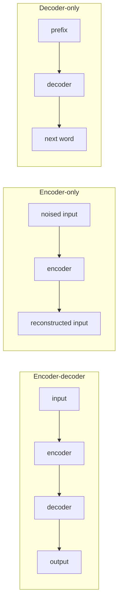

# MNLP-L06: Contextual Embeddings

> [!abstract] Overview
> In the previous lecture every word got one vector. *He took the train to Munich*, *she had to train for her match* and *he interrupted her train of thought* all looked up the same row of the embedding matrix, and whatever the vector meant, it meant all three things at once. This lecture replaces the lookup table with a deep network that reads the whole sentence and produces a different vector for every occurrence of a word. The network that made this standard is BERT, and the first third of the lecture is a reminder of how BERT is trained (masked language modelling plus next sentence prediction) and how it is then fine-tuned for a real task.
>
> The rest of the lecture is about the multilingual version, **mBERT**: the same architecture and the same loss, trained on Wikipedia in 104 languages with one shared subword vocabulary, and with nothing at all that tells it which sentences are translations of each other. It nonetheless transfers: fine-tune it on English NER and it does reasonable NER in German. Most of the slides are a careful dissection of *why*. Is it the shared vocabulary? (Less than you would think: remove all subword overlap and you lose about one point.) Is it word order and structure? (It matters, a lot for some languages.) Is it depth? (Yes.) The answer the lecture lands on is that no single factor explains it. It closes with **XLM-R**, which scales the recipe up, and with a warning from Monz's own work: transfer across languages *between* tasks is not the same as handling a task whose input mixes two languages, and there both models fall off a cliff.

## 1. Why static embeddings are not enough

### 1.1 Two ways to get word embeddings, one shared flaw

So far "word representation" has meant **word embedding**: one vector per vocabulary item (see [[Word Embeddings]] and [[MNLP-L05 - Static Embeddings]]). There are two ways to obtain them:

| Route | Model | Context used | Example |
|---|---|---|---|
| As a **by-product** of an actual task | can be arbitrarily complex and deep | the **whole sentence** | the embedding layer of a text classifier or an MT system |
| **Directly**, as the training objective | a simple model (Word2Vec, trained with [[Negative Sampling]]) | a **limited context window** | skip-gram, CBOW |

> [!warning] In both cases the embeddings are static
> Whatever the training procedure, the result is a table with one row per word type. At use time you look the word up and get the same vector regardless of the sentence.
>
> - *He took the **train**$_1$ to Munich.* (a vehicle)
> - *She had to **train**$_2$ for her next match.* (a verb, to practise)
> - *He interrupted her **train**$_3$ of thoughts.* (a sequence)
>
> $$E(\text{train}_1) = E(\text{train}_2) = E(\text{train}_3) = E(\text{train}_i)$$
>
> where $E(\cdot)$ is the embedding lookup function and $\text{train}_i$ is any occurrence of the type *train*. Three senses, two parts of speech, one vector.

The irony of the first route is that the network that produced the embedding *did* see the whole sentence. The contextual information was computed inside the deeper layers and then thrown away, because we only kept the input embedding layer. Contextual embeddings keep it.

### 1.2 Word representations in deeper networks

Slide 3 is a build animation over a multi-layer recurrent network. Reproduced with each build step:

```
 Build 6 (final frame): all top-layer states feed ONE vector, which feeds onward ("...")

                          [ pooled ] ─────────────────────────────►  ...
                        ↗ ↗ ↗ ↗ ↗ ↑ ↖ ↖ ↖ ↖ ↖
 Build 5 (replaced in final frame): one output box on top of EACH position
          [o]  ...  [o] [o] [o] [o] [o]  ...  [o]

 layer 3  [h]→[h]→[h]→[h]→[h]→[h]→(h)→[h]→[h]→[h]→[h]→[h]   ← circled in build 4
            ↑    ↑    ↑    ↑    ↑    ↑    ↑    ↑    ↑    ↑    ↑    ↑
 layer 2  [h]→[h]→[h]→[h]→[h]→[h]→[h]→[h]→[h]→[h]→[h]→[h]
            ↑    ↑    ↑    ↑    ↑    ↑    ↑    ↑    ↑    ↑    ↑    ↑
 layer 1  [h]→[h]→[h]→[h]→[h]→[h]→(h)→[h]→[h]→[h]→[h]→[h]   ← circled in build 3
            ↑    ↑    ↑    ↑    ↑    ↑    ↑    ↑    ↑    ↑    ↑    ↑
 input    [e]  [e]  [e]  [e]  [e]  [e]  (e)  [e]  [e]  [e]  [e]  [e]   ← circled in build 2
                                        train
```

- **Bottom row:** input word embeddings, one per token, no connections between them. The 7th position is the word *train*.
- **Three hidden layers** with left-to-right horizontal arrows: a stacked unidirectional [[Recurrent Neural Network (RNN)]] (an [[LSTM]] or [[Gated Recurrent Unit (GRU)|GRU]] in practice). Each hidden state receives the state below it and the state to its left.
- **Builds 2 to 4** circle the column for *train*: first its input embedding, then its first hidden layer, then its top hidden layer. The point being made is that the vector in that column changes meaning as you go up. The input embedding is the static $E(\text{train})$. The first-layer state already mixes in the words to its left. The top-layer state has been through three rounds of mixing.
- **Build 5** places an output box above every top-layer position (with "..." gaps), the shape of a per-token task such as tagging or next-word prediction. In this setting the top state at the *train* position is trained to be useful for a prediction about that position.
- **Build 6 (final)** replaces the per-position outputs with **one** vector that receives arrows from all top-layer states, and passes on to the right ("..."). This is the shape of an encoder that summarises the whole sentence for a downstream consumer (a classifier, or a decoder in an encoder-decoder model). In this setting no single position is supervised on its own.

> [!intuition] What the figure is for
> Any hidden state in the circled column is a candidate "contextual embedding of *train*". The two output configurations show that which one is useful depends on how the network was trained. With per-token outputs the top-layer state is pushed to stay about its own word. With a single pooled output, the top layer is pushed to be about the sentence, and the word's own contribution can get diluted.

### 1.3 The balance to strike

> [!definition] The contextual representation trade-off
> The challenge is to strike the right balance between
>
> - **integrating sufficient context** to distinguish between different occurrences of the *same* word (the three *train*s must come out different), and
> - **not capturing too much context**, where the word's own contribution to the representation becomes unclear (if every position's vector is just "the meaning of the sentence", it no longer represents the word).

Three strategies for hitting that balance:

1. **Choosing the "right" layer(s).** Lower layers are closer to the word, higher layers closer to the sentence. Pick, or combine, the layers that suit the task.
2. **Choosing the "right" task(s).** The training objective decides what the hidden states encode (build 5 versus build 6 above).
3. **Tightening connections between layers**, e.g. with **residual layers**. A residual connection adds a layer's input to its output, $h^{(l+1)} = h^{(l)} + f(h^{(l)})$, so the word's own information is carried upward unchanged alongside whatever context the layer adds. (Not on the slides: the formula is the standard definition of a residual connection, given here to make the bullet concrete.)

## 2. The contextual representation workflow

The recipe has two phases. The notation is the slide's own.

> [!definition] Pre-training phase
> - **Model:** use a model $M_{C,\theta}$ that allows for modelling of wider contexts (e.g. [[LSTM]], [[Transformers|Transformer]], CNN).
> - **Task:** use a general task $T_P$ for which (very) large amounts of training data exist, such as word prediction in language modelling.
> - **Train:** train $M_{C,\theta}$ on $T_P$, updating $\theta$.

> [!definition] Fine-tuning phase
> - **Task:** choose a real task $T_R$ of interest, e.g. question answering, POS tagging.
> - **Model:** choose a model $M_{R,\theta'}$ appropriate for $T_R$.
> - **Combine** $M_{C,\theta}$ and $M_{R,\theta'}$ into $M_{F,\theta\cup\theta'}$.
> - **Train (fine-tune)** $M_{F,\theta\cup\theta'}$ on the real task, updating $\theta'$ and maybe also $\theta$.

where:
- $M_{C,\theta}$ is the **contextual** model (the subscript $C$) with parameters $\theta$
- $T_P$ is the **pre-training** task, $T_R$ the **real** task
- $M_{R,\theta'}$ is the task-specific model (a "head") with its own parameters $\theta'$
- $M_{F,\theta\cup\theta'}$ is the **fine-tuned** combined model, whose parameter set is the union of both

> [!warning] Deck error, slide 5
> The last bullet on the slide reads "Train (fine-tune) model $M_{F,\theta\cup\theta'}$ on task $T_P$". It should be $T_R$: fine-tuning trains on the *real* task. Training on $T_P$ again would just be more pre-training.

"Updating $\theta'$ and maybe also $\theta$" is the important choice. Updating only $\theta'$ treats the pre-trained model as a frozen **feature extractor**. Updating both is full **fine-tuning**, which is what BERT does by default and what section 9.5 dissects layer by layer.

```pseudo
Algorithm: Pre-train then fine-tune
──────────────────────────────────────────────────────────────
Input:  large unlabelled corpus D_P, small labelled data D_R for task T_R
Output: fine-tuned model M_F

// Phase 1: pre-training
θ ← random initialisation
for each batch in D_P:
    loss ← L_TP(M_C,θ ; batch)            // e.g. masked word prediction
    θ ← θ − η ∇θ loss

// Phase 2: fine-tuning
θ' ← random initialisation                // the task head starts from scratch
M_F ← M_R,θ' ∘ M_C,θ                      // head on top of the contextual encoder
for a few epochs over D_R:
    for each batch in D_R:
        loss ← L_TR(M_F ; batch)          // the REAL task's loss
        θ' ← θ' − η ∇θ' loss
        if full fine-tuning: θ ← θ − η ∇θ loss
return M_F
```

## 3. Model architectures

> [!note] Most current contextual models are based on the [[Transformers|Transformer]] architecture
> (built from [[Self-Attention]] layers). The three families:

| Family | What it does | Notes from the slide | Prominent example |
|---|---|---|---|
| **Encoder-decoder** | the encoder builds a representation of an input signal, the decoder generates the corresponding output as the task requires | the original Transformer (Vaswani et al. 2017); tasks include summarisation, question answering, machine translation | the original Transformer |
| **Encoder-only** | predicts its own input, scrambled by some noise function | in its purest form an **auto-encoder** | **BERT** |
| **Decoder-only** | classical next-word-prediction language model | encoder-decoder tasks can be framed in a decoder-only model; **all current LLMs are decoder-only models** | [[Large Language Models (LLM)\|LLMs]] |



"Encoder-decoder tasks can be framed in a decoder-only model" means: concatenate the input and the output into one sequence (`translate to German: <source> <target>`) and train a next-word predictor on it. The encoder's job is absorbed into the decoder's processing of the prefix.

## 4. BERT: a reminder

### 4.1 What BERT is

**Bidirectional Encoder Representations from Transformers** (Devlin et al., NAACL 2019).

- It is the **encoder part of the Transformer**. Every position attends to every other position, left and right, which is what "bidirectional" means. Contrast with the left-to-right RNN of section 1.2.
- **Pre-train** on a simple **missing word prediction** task. This is **self-supervised**: the labels are the words themselves, so large amounts of data can be used, and the data does not need to be relevant to any downstream task.
- **Fine-tune** by continuing training on the actual task (**supervised**). This works even with small amounts of task-relevant data, because the encoder already knows the language.

The figure on slides 7 and 44 (credited to Devlin et al.) shows both phases:

```
 ┌──────────── PRE-TRAINING ────────────┐        ┌──────────── FINE-TUNING ─────────────┐
 │  NSP    Mask LM          Mask LM     │        │ (stacked panels: MNLI, NER, SQuAD)   │
 │   ↑        ↑                ↑        │        │                 Start/End Span       │
 │  [C] [T1] ... [TN] [T_SEP] [T'1] ... [T'M]    │  [C] [T1] ... [TN] [T_SEP] [T'1]...[T'M]
 │  ┌──────────────── BERT ───────────┐ │ ····►  │  ┌──────────────── BERT ───────────┐ │
 │  [E_CLS][E1]...[EN][E_SEP][E'1]...[E'M]       │  [E_CLS][E1]...[EN][E_SEP][E'1]...[E'M]
 │  [CLS] Tok1 ... TokN [SEP] Tok1 ... TokM      │  [CLS] Tok1 ... TokN [SEP] Tok1 ... TokM
 │   └ Masked Sentence A ┘ └ Masked Sentence B ┘ │   └─── Question ──┘   └── Paragraph ──┘
 │      Unlabeled Sentence A and B Pair │        │        Question Answer Pair          │
 └──────────────────────────────────────┘        └──────────────────────────────────────┘
```

- The input is `[CLS]`, the tokens of segment A, `[SEP]`, the tokens of segment B (and a final `[SEP]`).
- $E_\cdot$ are input embeddings, $T_\cdot$ the final-layer contextual outputs, $C$ the final-layer output at the `[CLS]` position.
- In pre-training, $C$ feeds the **NSP** classifier and the $T_i$ at masked positions feed the **Mask LM** predictor.
- The dotted arrows mean the same pre-trained parameters initialise every fine-tuning model. For **MNLI** (entailment) the pair is premise and hypothesis, for **NER** a single sentence, for **SQuAD** a question and a paragraph, where the output is a start/end span over the paragraph tokens (section 11.2).

### 4.2 The two pre-training tasks

- **Prediction task 1: predict masked tokens** (masked language model, MLM).
- **Prediction task 2: predict whether sentence B is the next sentence** after A (next sentence prediction, NSP).

### 4.3 Input representation and masking

The input figure (slide 9) shows how the three embeddings add up for the example pair *my dog is cute* / *he likes playing*:

| Input | `[CLS]` | `my` | `dog` | `is` | `cute` | `[SEP]` | `he` | `likes` | `play` | `##ing` | `[SEP]` |
|---|---|---|---|---|---|---|---|---|---|---|---|
| masked? | | | `[MASK]` | | | | | `[MASK]` | | | |
| Token embedding | $E_{[CLS]}$ | $E_{my}$ | $E_{[MASK]}$ | $E_{is}$ | $E_{cute}$ | $E_{[SEP]}$ | $E_{he}$ | $E_{[MASK]}$ | $E_{play}$ | $E_{\#\#ing}$ | $E_{[SEP]}$ |
| + Sentence (segment) embedding | $E_A$ | $E_A$ | $E_A$ | $E_A$ | $E_A$ | $E_A$ | $E_B$ | $E_B$ | $E_B$ | $E_B$ | $E_B$ |
| + Transformer positional embedding | $E_0$ | $E_1$ | $E_2$ | $E_3$ | $E_4$ | $E_5$ | $E_6$ | $E_7$ | $E_8$ | $E_9$ | $E_{10}$ |

The input vector at position $i$ is the sum $x_i = E_{\text{token}(i)} + E_{\text{segment}(i)} + E_i$. The segment embedding ($E_A$ or $E_B$) is how the model knows which sentence a token belongs to; the first `[SEP]` belongs to A. Note `play ##ing`: *playing* is split by WordPiece (section 6), and `##` marks a word-internal piece.

> [!definition] BERT masking rule
> Tokens are selected for masking with probability $p_{\text{mask}} = 0.15$. A selected token is replaced
> - **80%** of the time by the special `[MASK]` token,
> - **10%** of the time by a **random word**,
> - **10%** of the time by **the original word** (left unchanged).
>
> **The loss is computed only for the selected positions**, regardless of whether the input there shows `[MASK]`, a random word or the original word.

Why the 10/10: `[MASK]` never occurs at fine-tuning time, so a model that only ever sees `[MASK]` at prediction positions could learn to produce good representations only where it sees `[MASK]`. Random and unchanged tokens force it to build a good representation of *every* input token, since it cannot tell which positions will be scored. (Not on the slides: this is the rationale given by Devlin et al.)

```pseudo
Algorithm: BERT MLM masking and loss for one sequence
──────────────────────────────────────────────────────
Input:  token sequence x_1..x_n, vocabulary V, p_mask = 0.15
Output: corrupted input x̃, MLM loss

S ← ∅                                       // positions that will be scored
x̃ ← copy of x
for i = 1..n:
    if x_i ∈ {[CLS], [SEP]}: continue       // special tokens are never masked
    with probability p_mask:
        S ← S ∪ {i}
        r ← uniform(0,1)
        if r < 0.8:   x̃_i ← [MASK]
        elif r < 0.9: x̃_i ← random token from V
        else:         x̃_i ← x_i              // unchanged, but still scored
T_1..T_n ← BERT(x̃)                          // final-layer outputs
loss ← − Σ_{i ∈ S} log softmax(W T_i)[x_i]   // predict ORIGINAL token, only at i ∈ S
```

> [!warning] Typo on slide 9
> "regardless of maks token" means *mask* token.

### 4.4 The class embedding `[CLS]` and next sentence prediction

> [!definition] `[CLS]`
> - The class embedding `[CLS]` is **not tied to a specific word and is never masked**.
> - Class embeddings are **not meant to learn context-specific word representations**.
> - They capture a **general representation of the entire input sequence**.
> - **The loss for the class embedding is computed with respect to a classification task.**

In pre-training that classification task is **next sentence prediction**:

- each sequence consists of two sentences A and B;
- **50%**: B directly follows A in a document (label *IsNext*);
- **50%**: B is chosen randomly from the corpus (label *NotNext*).

```pseudo
Algorithm: Build one NSP training pair
──────────────────────────────────────
Input: corpus of documents
  pick a document d and a segment A from d
  with probability 0.5:
      B ← the segment that follows A in d;     label ← IsNext
  else:
      B ← a segment from a random document;    label ← NotNext
  input ← [CLS] A [SEP] B [SEP]
  NSP loss ← − log P(label | C)                // C = final-layer output at [CLS]
```

### 4.5 Pre-training configuration

| Setting | Value |
|---|---|
| Batch | 256 sequences of 512 tokens = "128,000 tokens per batch" |
| Sequence content | sentence A and B, in practice much longer than individual sentences (segments of running text) |
| Corpus | BookCorpus (800M tokens) plus English Wikipedia (2.5B tokens) |
| Tokenisation | WordPiece (section 6) |

| Model | Parameters | Layers | Hidden size | Attention heads (slide) |
|---|---|---|---|---|
| BERT-base | 110M | 12 | 768 | 16 |
| BERT-large | 340M | 24 | 1024 | 16 |

> [!warning] Deck error, slide 11
> **BERT-base has 12 attention heads, not 16** (Devlin et al. give $L{=}12, H{=}768, A{=}12$ for base and $L{=}24, H{=}1024, A{=}16$ for large), so BERT-base heads are $768/12 = 64$-dimensional, the same per-head size as BERT-large's $1024/16 = 64$. If an exam asks, answer 12. Also, $256 \times 512 = 131{,}072$; the "128,000" is the paper's own rounding.

### 4.6 Fine-tuning BERT

1. Choose a (small-ish) **task-specific model**, randomly initialised.
2. **Connect it to the top encoder layer outputs** $T_i$ for tasks that need word representations (tagging, span extraction).
3. **Connect it to the `[CLS]` top-layer output** $C$ for classification tasks (sentiment, entailment).
4. **Train (fine-tune)** on the task-specific data, with or without updating the BERT parameters.

Typical fine-tuning settings: a **smaller batch size (16 or 32 sequences)** and a **limited number of epochs (2 to 4)**. Fine-tuning is short because the encoder starts out already good, and long fine-tuning on small data overfits and erodes what pre-training learned. (In current terminology this is [[Supervised Fine-Tuning (SFT)|supervised fine-tuning]] of an encoder.)

## 5. mBERT: multilingual BERT

### 5.1 What mBERT is, and what it is not

> [!definition] mBERT
> - Introduced **on GitHub in 2018, with no actual paper**.
> - Uses **the exact same architecture as regular BERT**: **no cross-lingual loss**, **nothing language-specific**.
> - **Trained on 104 languages**: the concatenation of Wikipedia text from 104 languages.
> - **Sentence pairs for next sentence prediction are always within the same language.**
> - **No mixing of languages** inside a sequence (a *batch* can contain several languages, though).
> - **One shared vocabulary**: mBERT uses WordPiece, but BPE or Unigram LM work similarly well; high- and low-resource languages share the same subword vocabulary.

The training setup restated as a list of what is deliberately absent (slide 20):

| mBERT training | |
|---|---|
| Data | Wikipedia dumps in 104 languages |
| Language sampling | with a smoothing parameter (section 5.2) |
| Loss | identical to BERT: **MLM** (masked language model) + **NSP** (next sentence prediction) |
| Parallel data | **none** (at least not intentionally) |
| Language-ID embedding | **none** |
| Language-specific parameters (e.g. adapters) | **none** |
| Alignment loss rewarding translation equivalents being close | **none** |
| NSP pairs | **only within the same language** |

> [!intuition] Why this list matters
> Every cross-lingual ability mBERT shows later in the lecture has to come from somewhere, and this table removes the obvious candidates. Nothing in the objective says that *Hund* and *dog* mean the same thing. The only things the languages share are the parameters and the subword vocabulary. Sections 8 to 10 are an investigation into which of those two does the work.

### 5.2 Language resource distribution and weighted sampling

Monolingual BERT was trained on BookCorpus plus English Wikipedia. mBERT was trained on Wikipedia dumps for 104 languages joined into one training stream, and:

- Wikipedia sizes vary enormously across languages;
- the corpus is extremely skewed: **English alone is larger than dozens of smaller languages combined**.

The fix is to sample languages with a smoothed distribution.

> [!formula] Weighted (exponentially smoothed) language sampling
> $$p_l = \frac{n_l^{\alpha}}{\sum_{l'} n_{l'}^{\alpha}}$$
>
> where:
> - $p_l$ is the probability of drawing training data from language $l$
> - $n_l$ is the size of language $l$'s resource, measured in characters, tokens, etc.
> - $\alpha$ "indicates importance": it controls how strongly the raw sizes are respected
> - the sum runs over all languages $l'$ and normalises the $p_l$ to sum to 1

| $\alpha$ | Behaviour |
|---|---|
| $\alpha = 1$ | sampling in proportion to raw size; English and a few other large Wikipedias dominate training |
| $\alpha = 0$ | uniform sampling ($n^0 = 1$ for every language); tiny Wikipedias are oversampled so much that the model would mostly **memorise** them |
| $\alpha = 0.7$ | **up-weights low-resource languages and down-weights high-resource ones**, a compromise |

> [!example] Worked example (not on the slides): two languages
> Let English have $n_{en} = 1000$ units and Swahili $n_{sw} = 10$.
>
> - $\alpha = 1$: $p_{sw} = 10 / 1010 = 0.0099$, $p_{en} = 0.990$.
> - $\alpha = 0.7$: $1000^{0.7} = 125.9$ and $10^{0.7} = 5.01$, so $p_{sw} = 5.01 / 130.9 = 0.038$ and $p_{en} = 0.962$.
> - $\alpha = 0$: $p_{sw} = p_{en} = 0.5$.
>
> At $\alpha = 0.7$ Swahili is sampled about 3.9 times more often than its raw share, while English still gets 96% of the data. At $\alpha = 0$ every Swahili sentence would be seen about 50 times as often as every English one, which is the memorisation problem.

Because $x^\alpha$ with $\alpha < 1$ is concave, it compresses large values more than small ones, so the ratio between any two languages shrinks from $n_{en}/n_{sw}$ to $(n_{en}/n_{sw})^\alpha$. Here 100:1 becomes $100^{0.7} \approx 25$:1.

### 5.3 One shared vocabulary

- mBERT used **one shared vocabulary for all 104 languages**: **120k entries**, compared to **30k for English BERT**.
- mBERT has **about 178M parameters versus BERT-base's 110M**. The architecture is the same; the difference in parameter count is **due to the vocabulary** (the embedding matrix has one 768-dimensional row per entry: $90\text{k} \times 768 \approx 69\text{M}$ extra, which accounts for the gap; that arithmetic is mine, not the slide's).
- **CJK handling:** Chinese characters, Japanese kanji and Korean hanja are **split into individual characters before WordPiece is applied**.
- The **language sampling smoothing parameter also applies to the subword segmentation frequencies**, i.e. the counts used to build the vocabulary are smoothed the same way, so small languages get more vocabulary entries than their raw size would give them. But:
  - even with smoothing, **the shared vocabulary still favours high-resource languages and Latin script**;
  - **low-resource and morphologically rich languages are split into many more pieces per word (higher fertility**, see [[MNLP-L04 - Subword Segmentation]] section 10).
- There is an **uncased variant** of mBERT, which lowercases text and strips accents. This **damages languages that depend on diacritics** (stripping accents merges Spanish *papá* "dad" with *papa* "potato", French *côte* "coast" with *cote* "rating", and erases Vietnamese tone marks entirely; examples mine).

## 6. Interlude: WordPiece and the three subword algorithms

### 6.1 WordPiece

WordPiece (Schuster and Nakajima, 2012) is very similar to BPE, and **predates BPE** as an NLP segmentation method (Sennrich et al.'s BPE for NMT is from 2016; BPE as a compression algorithm is older). Like BPE and unlike Unigram LM it works **bottom-up**: it starts from characters and merges. See [[MNLP-L04 - Subword Segmentation]] for BPE and Unigram LM, and [[Tokenization]].

> [!formula] WordPiece pair score
> $$\text{score}(a,b) = \frac{\text{count}(a,b)}{\text{count}(a)\cdot\text{count}(b)}$$
>
> where $\text{count}(a,b)$ is the frequency of symbol $a$ immediately followed by $b$, and $\text{count}(a)$, $\text{count}(b)$ are the frequencies of the symbols on their own. A pair scores high when it occurs together more often than the frequencies of its parts would suggest.

```pseudo
Algorithm: WordPiece training
────────────────────────────────────────────────────────────
Input:  corpus (word boundaries assumed), target vocabulary size K
1. Assume word boundaries; collect word types with frequencies
2. Split each word into characters; every NON-INITIAL character
   is prefixed with ##            // "hug" → h ##u ##g
   V ← set of all such symbols
3. while |V| < K:
       for every adjacent pair (a,b) in every word:
           score(a,b) ← count(a,b) / (count(a) · count(b))
4.     (a*,b*) ← argmax score
       merge every occurrence of a* b* into one symbol a*b*   // ## of b* dropped
       V ← V ∪ {a*b*}
return V
```

```pseudo
Algorithm: WordPiece inference (greedy longest match, per word)
────────────────────────────────────────────────────────────
Input:  word w, vocabulary V
1. Assume word boundaries; treat w as a character string (as in training)
   pieces ← [];  start ← 1
2. while start ≤ |w|:
       end ← |w|
       found ← none
       while end ≥ start:                       // try the LONGEST candidate first
           cand ← w[start..end]
           if start > 1: cand ← "##" + cand     // non-initial pieces carry ##
           if cand ∈ V: found ← cand; break
           end ← end − 1
3.     if found = none: return [UNK]            // the WHOLE word becomes [UNK]
       append found to pieces;  start ← end + 1
return pieces
```

> [!example] Worked example (not on the slides): one WordPiece training step
> Word types and counts: *hug* 10, *pug* 5, *pun* 12, *bun* 4, *hugs* 5. After step 2:
> `h ##u ##g` (10), `p ##u ##g` (5), `p ##u ##n` (12), `b ##u ##n` (4), `h ##u ##g ##s` (5).
>
> Symbol counts: `h` 15, `##u` 36, `##g` 20, `p` 17, `##n` 16, `b` 4, `##s` 5.
>
> | pair | count | score |
> |---|---|---|
> | `##u ##g` | 20 | $20/(36 \cdot 20) = 0.028$ |
> | `p ##u` | 17 | $17/(17 \cdot 36) = 0.028$ |
> | `##u ##n` | 16 | $16/(36 \cdot 16) = 0.028$ |
> | `h ##u` | 15 | $15/(15 \cdot 36) = 0.028$ |
> | `##g ##s` | 5 | $5/(20 \cdot 5) = \mathbf{0.050}$ |
> | `b ##u` | 4 | $4/(4 \cdot 36) = 0.028$ |
>
> WordPiece merges `##g ##s` → `##gs`, the *rarest* pair, because `##s` only ever occurs after `##g`. BPE would merge `##u ##g`, the most frequent pair. Every pair involving `##u` scores the same $1/36$, because `##u` is so common that co-occurring with it is unsurprising.
>
> **Inference** with $V \supseteq$ {`play`, `##ing`, `##s`, `tall`, `##est`}: *playing* → longest match from the left is `play`, then `##ing` → `play ##ing`. *tallest* → `tall ##est`. A word containing a character absent from $V$ (no single-character fallback for it) → `[UNK]` for the whole word.

### 6.2 BPE, WordPiece and Unigram LM compared

Reproduced from slide 16:

| | BPE | WordPiece | Unigram LM |
|---|---|---|---|
| **Direction** | bottom-up merges | bottom-up merges | top-down pruning |
| **Merge/keep criterion** | raw pair frequency | association score (likelihood gain) | loss in corpus likelihood under EM |
| **Inference** | replay merges in order | greedy longest-match | Viterbi or sampling |
| **Output** | deterministic | deterministic | deterministic or sampled |
| **Unknown handling** | character/byte fallback | whole word becomes `[UNK]` | character fallback |
| **Typical models** | GPT family, RoBERTa, original XLM | BERT, mBERT, DistilBERT | T5, XLM-R, ALBERT (via SentencePiece) |

Two rows are easy to get wrong. WordPiece *training* is merge-based like BPE, but WordPiece *inference* does not replay merges: it does greedy longest-match against the final vocabulary, which can give a different segmentation from replaying the merges. And WordPiece's unknown handling is the harshest of the three: one unknown character turns the whole word into `[UNK]`, where BPE and Unigram LM fall back to characters (or bytes).

## 7. Masking meets subwords

### 7.1 Not all tokens are equally hard to predict

- Some words (nouns, adjectives, verbs) are **harder to predict** than others (determiners, prepositions):
  `The developpers [MASK] the property .`
  Guessing the verb is hard; guessing *the* would be easy.
- **The same holds for BPE segments:**
  `The deve@@ lopp@@ ers [MASK] ed the proper@@ ty .`
  Here the stem of *viewed* is masked and the suffix `ed` is visible. Still hard: which verb?
- **Some BPE segments are easier to predict:**
  `The deve@@ lopp@@ ers view@@ [MASK] the proper@@ ty .`
  Now the stem `view@@` is visible and only the suffix is masked. Given `view@@` and a past-tense context, `ed` is nearly certain.
- **BPE segments mostly capturing morphological information (tense, number, case) are easier to predict than segments mostly capturing root/stem information.**

(`@@` is the BPE continuation marker from [[MNLP-L04 - Subword Segmentation]]: the piece continues into the next token. "developpers" is misspelt on the slide, and the BPE example keeps the misspelling.)

The consequence: with per-token random masking, a large fraction of masked positions are trivially recoverable suffixes and word-internal continuation pieces. The model gets loss signal for them without learning much, and the effective difficulty of MLM drops.

### 7.2 Whole-word masking

> [!definition] Whole-word masking
> Instead of masking tokens randomly with a given probability, **always mask all subword tokens that belong to the same word**. The **masking rate remains unchanged** (still about 15% of tokens).
>
> `The deve@@ lopp@@ ers view@@ ed the proper@@ ty .`
> `The deve@@ lopp@@ ers [MASK] [MASK] the proper@@ ty .`

```pseudo
Algorithm: Whole-word masking
──────────────────────────────────────────────────
Input: subword tokens x_1..x_n with word-boundary information, p_mask = 0.15
  group tokens into words W_1..W_m        // a word = maximal run joined by @@ / ##
  shuffle the word order
  S ← ∅
  for each word W in shuffled order:
      if |S| + |W| > round(p_mask · n): continue   // keep the token-level rate
      S ← S ∪ positions(W)                          // ALL pieces of the word
  apply the 80/10/10 replacement of section 4.3 to every position in S
  score the MLM loss only at positions in S
```

The results table on the slide (source not given on the slide; these are the whole-word-masking BERT-Large releases):

| Model | SQuAD 1.1 F1/EM | Multi NLI Accuracy |
|---|---|---|
| BERT-Large, Uncased (Original) | 91.0/84.3 | 86.05 |
| BERT-Large, Uncased (Whole Word Masking) | **92.8/86.7** | **87.07** |
| BERT-Large, Cased (Original) | 91.5/84.8 | 86.09 |
| BERT-Large, Cased (Whole Word Masking) | **92.9/86.7** | **86.46** |

Whole-word masking helps on every column: +1.8 / +2.4 (uncased) and +1.4 / +1.9 (cased) on SQuAD F1/EM, and +1.02 (uncased) and +0.37 (cased) on MultiNLI accuracy. Same model, same data, same masking rate: the only change is that the model can no longer cheat by completing a word from its own visible pieces.

## 8. How multilingual is mBERT? (Pires et al., 2019)

Pires et al. (2019) investigate the multilinguality of mBERT in a number of scenarios, covering 16 languages. The basic experiment is **fine-tune on language A, evaluate on language B**.

> [!definition] Zero-shot cross-lingual transfer
> Fine-tune on task data in language A only, then evaluate on the same task in language B, with **no task data in B at all**. In a fine-tune × evaluate table, the **diagonal** is ordinary in-language performance and every **off-diagonal** cell is a zero-shot result.

### 8.1 Zero-shot performance on sequence labelling

Tasks: **named entity recognition (NER)** and **part-of-speech (POS) tagging**. Rows are the fine-tuning language, columns the evaluation language.

**NER F1 on the CoNLL data:**

| Fine-tuning \ Eval | EN | DE | NL | ES |
|---|---|---|---|---|
| EN | **90.70** | 69.74 | 77.36 | 73.59 |
| DE | 73.83 | **82.00** | 76.25 | 70.03 |
| NL | 65.46 | 65.68 | **89.86** | 72.10 |
| ES | 65.38 | 59.40 | 64.39 | **87.18** |

**POS accuracy on a subset of UD languages:**

| Fine-tuning \ Eval | EN | DE | ES | IT |
|---|---|---|---|---|
| EN | **96.82** | 89.40 | 85.91 | 91.60 |
| DE | 83.99 | **93.99** | 86.32 | 88.39 |
| ES | 81.64 | 88.87 | **96.71** | 93.71 |
| IT | 86.79 | 87.82 | 91.28 | **98.11** |

- **The off-diagonal is a zero-shot scenario.**
- **Performance is decent**, indicating **generalisation beyond the fine-tuning languages**, i.e. knowledge transfer.

Reading the numbers: English-trained NER reaches 77.36 F1 on Dutch with zero Dutch training examples, against 89.86 for in-language Dutch, so roughly 86% of in-language performance. POS transfers better than NER in absolute terms (English → German 89.40 against 93.99 in-language), and closely related pairs transfer best (Spanish → Italian 93.71, Italian → Spanish 91.28). Transfer is also asymmetric: EN → NL is 77.36 but NL → EN is 65.46.

### 8.2 Writing systems

> [!question] To what extent is generalisation achieved by vocabulary overlap?
> If languages used different scripts, they would share almost no wordpieces. Does transfer survive?

**POS accuracy on the UD test set for languages with different scripts** (row = fine-tuning, column = evaluation):

| | HI | UR |
|---|---|---|
| **HI** | **97.1** | 85.9 |
| **UR** | 91.1 | **93.8** |

| | EN | BG | JA |
|---|---|---|---|
| **EN** | **96.8** | 87.1 | 49.4 |
| **BG** | 82.2 | **98.9** | 51.6 |
| **JA** | 57.4 | 67.2 | **96.5** |

- **mBERT generalises well across scripts.** Hindi (Devanagari) → Urdu (Perso-Arabic script) gets 85.9 and Urdu → Hindi 91.1, with almost no shared wordpieces. English (Latin) → Bulgarian (Cyrillic) gets 87.1.
- **Performance drops for scenarios involving Japanese**, which may be due to **larger typological differences**: EN → JA 49.4, BG → JA 51.6, JA → EN 57.4.

Not on the slides, but it explains why Hindi/Urdu is the chosen test: they are essentially one spoken language (Hindustani) written in two unrelated scripts, so they are the cleanest available case of "same grammar, zero script overlap". Bulgarian has Slavic word order close enough to English (SVO); Japanese is SOV with postpositions, which is the typological difference the slide alludes to and which section 8.5 measures.

### 8.3 Vocabulary overlap

To what extent is performance due to vocabulary overlap between the fine-tuning set ($t$) and the evaluation set ($e$)?

- Look **only at wordpieces that occur in labelled named entities**, $E$.
- For each language pair $(l, l')$ and datasets $\{t, e\}$ compute the **Jaccard similarity**:

> [!formula] Entity wordpiece overlap
> $$\text{overlap} = \frac{|E_{l,t} \cap E_{l',e}|}{|E_{l,t} \cup E_{l',e}|}$$
>
> where:
> - $E_{l,t}$ is the set of wordpieces in named entities of the **fine-tuning** ($t$) data in language $l$
> - $E_{l',e}$ is the set of wordpieces in named entities of the **evaluation** ($e$) data in language $l'$
> - the ratio is 0 for disjoint sets and 1 for identical sets

**Figure (slide 23):** scatter plot, x-axis "Average overlap [%]" (0 to 40), y-axis "Zero-shot F1 Score" (0 to 90), one point per language pair (NER).

```
 F1
 90 ┤
 80 ┤ ●●  ●● ●●●   ●●●  ●●● ●●●
 70 ┤●●●●●●●●●●●●●●●●●●●●●●●●  ●                    ×
 60 ┤●●●●●●●  ●              ×   × × ××× × ×  ×
 50 ┤●●●●                  ×    ×× × × ×× ×    ×
 40 ┤●●                      ×  ×  ×× ×
 30 ┤      ×  ×        × ×× ×××
 20 ┤      ×         × ×××
 10 ┤ ××××  ×× ×× ××××
  0 ┤×××××××××××××××××
    └────┬────┬────┬────┬────┬────┬────┬────┬
         5   10   15   20   25   30   35   40   average overlap [%]
     ● Multilingual BERT       × English BERT
```

- **mBERT (blue dots):** overlap only from about 0% to 27%, and F1 is between roughly 40 and 82 **across the whole range**, already 40 to 70 at overlap near 0. The cloud is essentially flat.
- **English BERT (red crosses):** near 0 F1 for overlap below about 10%, then rising roughly linearly to 40 to 70 F1 at 25% to 38% overlap.

> [!intuition] What the figure shows
> English BERT can only transfer through shared surface strings: names and loanwords that literally occur in both languages. Its zero-shot F1 is a function of overlap. mBERT's zero-shot F1 barely depends on overlap at all, so whatever mBERT transfers is **not** string matching. It has a representation that is shared across languages below the level of surface wordpieces.

### 8.4 Interlude: WALS, typological features of languages

> [!definition] The World Atlas of Language Structures (WALS)
> A commonly used typological database: **a large catalogue of how languages are structured.**
> - records **structural properties** of languages (phonological, grammatical, lexical);
> - gathered from descriptive materials such as **reference grammars** by a team of **55 authors**;
> - contains **192 typological features** covering phonology, morphology, syntax and lexicon;
> - each feature has **a small set of possible values**; for example, *Tone* can be *No tones*, *Simple tone system* or *Complex tone system*.

**Wide coverage, but most cells are empty:**
- **2,662 languages** appear somewhere in the atlas;
- **no language has data for every feature, and no feature has values for every language**;
- well-studied languages dominate: **English has the most features filled in (159)**, so even English lacks 33 of the 192.

**Use in NLP:** as a **measure of structural similarity between languages**, along several dimensions (e.g. word order, number of cases). Languages and their feature sets can be **represented as vectors**, and similarity becomes vector similarity (or, as on the next slide, a count of shared feature values).

### 8.5 Typological differences

To what extent is performance due to typological differences? Macro-averaged POS accuracy, grouped by word-order type (rows = fine-tuning group, columns = evaluation group, as in the other Pires et al. tables):

**(a) Subject/verb/object order:**

| | SVO | SOV |
|---|---|---|
| **SVO** | **81.55** | 66.52 |
| **SOV** | 63.98 | **64.22** |

**(b) Adjective/noun order:**

| | AN | NA |
|---|---|---|
| **AN** | **73.29** | 70.94 |
| **NA** | 75.10 | **79.64** |

Transfer is best within the same word-order type. SVO → SVO is 81.55, SVO → SOV only 66.52, a 15-point gap for the same fine-tuning data. The adjective/noun effect is smaller (AN → NA loses about 2.4 points against AN → AN).

**Figure: overlap in the number of WALS features (POS accuracy).** x-axis: number of common WALS features (1 to 6), y-axis: zero-shot accuracy [%] (0 to 100), averages with error bars.

| common WALS features | 1 | 2 | 3 | 4 | 5 | 6 |
|---|---|---|---|---|---|---|
| Multilingual BERT (approx.) | 58 | 63 | 67 | 77 | 76 | 77 |
| English BERT (approx.) | 31 | 30 | 31 | 37 | 40 | 50 |

Both curves rise with the number of shared WALS features: the more two languages have in common structurally, the better the zero-shot transfer. mBERT is 27 to 40 points above English BERT throughout, and its error bars are wide (about ±12 to ±17 points), so the trend is clear on average but individual pairs vary a lot.

### 8.6 Translation retrieval: do sentence representations align?

How well do sentence-level representations align across languages, layer by layer?

> [!definition] Translation retrieval with a mean difference vector
> - Sample $M = 5\text{k}$ sentence pairs (translations) from WMT16.
> - For each layer $l$, represent a sentence by the **average of all its hidden activations, excluding `[CLS]` and `[SEP]`** → $v^{(l)}_{\text{LANG}}$. (The slide says "module [CLS] and [SEP]", which means *modulo*, i.e. leaving those two out.)
> - Compute the **average layer-wise difference between the languages**:
> $$\bar v^{(l)}_{\text{EN}\to\text{DE}} = \frac{1}{M}\sum_{i} \left( v^{(l)}_{\text{DE}_i} - v^{(l)}_{\text{EN}_i} \right)$$
> - "Translate" each English sentence $i$ by shifting it: $v^{(l)}_{\text{EN}_i} + \bar v^{(l)}_{\text{EN}\to\text{DE}}$.
> - Find its **nearest neighbour** among the German sentences, using **$\ell_2$ distance, not cosine similarity**. A hit means the nearest neighbour is the true translation.

where $v^{(l)}_{\text{DE}_i}$ is the layer-$l$ mean vector of the German side of pair $i$, and $\bar v^{(l)}_{\text{EN}\to\text{DE}}$ is a single vector for the whole language pair, a constant "language offset".

```pseudo
Algorithm: Layer-wise translation retrieval accuracy
────────────────────────────────────────────────────
Input: M sentence pairs (EN_i, DE_i), mBERT, layer l
for i = 1..M:
    hEN ← layer-l hidden states of mBERT(EN_i), drop [CLS],[SEP]
    hDE ← layer-l hidden states of mBERT(DE_i), drop [CLS],[SEP]
    vEN[i] ← mean(hEN);   vDE[i] ← mean(hDE)
δ ← (1/M) Σ_i (vDE[i] − vEN[i])            // one offset for the language pair
correct ← 0
for i = 1..M:
    q ← vEN[i] + δ                          // "translate" by shifting
    j* ← argmin_j ‖ q − vDE[j] ‖₂            // nearest German sentence
    if j* = i: correct ← correct + 1
return correct / M                          // match accuracy at layer l
```

**Figure: match accuracy [%] (y, 20 to 80) against layer (x, 1 to 12):**

| Layer | 1 | 2 | 3 | 4 | 5 | 6 | 7 | 8 | 9 | 10 | 11 | 12 |
|---|---|---|---|---|---|---|---|---|---|---|---|---|
| EN-DE (approx.) | 31 | 40 | 48 | 58 | 66 | 71 | 74 | **76** | 74 | 72 | 70 | 65 |
| EN-RU (approx.) | 20 | 26 | 37 | 49 | 60 | 66 | 69 | **71** | 69 | 64 | 62 | 58 |
| UR-HI (approx.) | 33 | 40 | 49 | 62 | 70 | **73** | 72 | 71 | 67 | 62 | 59 | 55 |

```
 acc
 75 ┤                    ▲▲▲▲
 70 ┤               ▲▲▲▲      ▲▲▲
 60 ┤          ▲▲▲              ▲▲▲
 50 ┤       ▲▲                     ▲
 40 ┤    ▲▲
 30 ┤ ▲▲
 20 ┤▲
    └┬──┬──┬──┬──┬──┬──┬──┬──┬──┬──┬──┬
     1  2  3  4  5  6  7  8  9 10 11 12   layer      (shape shared by all three pairs)
```

- All three pairs follow the same **inverted-U**: accuracy climbs from 20 to 33% at layer 1 to a peak in the **middle-upper layers (6 to 8)** at 71 to 76%, then falls in the last layers.
- EN-RU (different scripts) starts lowest, at about 20%, but catches up by layer 8.
- UR-HI peaks earliest (layer 6) and falls fastest.

> [!intuition] Why an inverted U
> Lower layers are close to the surface tokens, which differ between languages (and, for EN-RU, do not even share a script). Middle layers hold the most language-neutral representation: a single constant shift is enough to map English onto German. The top layers are shaped by the pre-training objective, which is *predict the word in this language*, so they become language-specific again. This is the "choose the right layer" strategy of section 1.3, measured.

## 9. Zero-shot transfer across tasks (Wu and Dredze, 2019)

### 9.1 The goal and the setup

One of the most desirable properties of a multilingual model is to **transfer knowledge between languages**:

- a **common, aligned embedding space**;
- **training on language A for task X improves performance on language B for task X, without any language-specific data for task X in language B** (the zero-shot scenario).

Wu and Dredze (2019) investigate transfer for five tasks:

| Task | Abbreviation | Granularity |
|---|---|---|
| document classification | MLDoc | document |
| sentence-level entailment | NLI | sentence pair |
| named entity recognition | NER | token |
| part-of-speech tagging | POS | token |
| dependency parsing | Parsing | token pairs |

**Languages covered per task** (slide 27, ✓ = evaluated):

| | ar | bg | ca | cs | da | de | el | en | es | et | fa | fi | fr | he | hi | hr | hu | id | it | ja | ko | la | lv | nl | no | pl | pt | ro | ru | sk | sl | sv | sw | th | tr | uk | ur | vi | zh |
|---|---|---|---|---|---|---|---|---|---|---|---|---|---|---|---|---|---|---|---|---|---|---|---|---|---|---|---|---|---|---|---|---|---|---|---|---|---|---|---|
| MLDoc | | | | | | ✓ | | ✓ | ✓ | | | | ✓ | | | | | | ✓ | ✓ | | | | | | | | | ✓ | | | | | | | | | | ✓ |
| NLI | ✓ | ✓ | | | | ✓ | ✓ | ✓ | ✓ | | | | ✓ | | ✓ | | | | | | | | | | | | | | ✓ | | | | ✓ | ✓ | ✓ | | ✓ | ✓ | ✓ |
| NER | | | | | | ✓ | | ✓ | ✓ | | | | | | | | | | | | | | | ✓ | | | | | | | | | | | | | | | ✓ |
| POS | | ✓ | | | ✓ | ✓ | | ✓ | ✓ | | ✓ | | | | | | ✓ | | ✓ | | | | | ✓ | | ✓ | ✓ | ✓ | | ✓ | ✓ | ✓ | | | | | | | |
| Parsing | ✓ | ✓ | ✓ | ✓ | ✓ | ✓ | | ✓ | ✓ | ✓ | | ✓ | ✓ | ✓ | ✓ | ✓ | | ✓ | ✓ | ✓ | ✓ | ✓ | ✓ | ✓ | ✓ | ✓ | ✓ | ✓ | ✓ | ✓ | ✓ | ✓ | | | | ✓ | | | ✓ |

That is 8 languages for MLDoc, 15 for NLI (the XNLI set), 5 for NER, 15 for POS and 31 for parsing (39 distinct languages overall). In every task English is the fine-tuning language for the zero-shot rows.

### 9.2 MLDoc: document classification

- **MLDoc:** document classification with **four classes**: **CCAT** (Corporate/Industrial), **ECAT** (Economics), **GCAT** (Government/Social), **MCAT** (Markets).
- **Only the first two sentences** of a document are considered, due to memory constraints.

**MLDoc accuracy** (the slide marks bitext-pretrained models with a spade symbol, written (B) here; † = concurrent work; **bold** = best, *italics* = second best in the zero-shot block, underlined on the slide):

| | en | de | zh | es | fr | it | ja | ru | Average |
|---|---|---|---|---|---|---|---|---|---|
| ***In-language supervised learning*** | | | | | | | | | |
| Schwenk and Li (2018) | 92.2 | 93.7 | 87.3 | 94.5 | 92.1 | 85.6 | 85.4 | 85.7 | 89.5 |
| mBERT | 94.2 | 93.3 | 89.3 | 95.7 | 93.4 | 88.0 | 88.4 | 87.5 | 91.2 |
| ***Zero-shot cross-lingual transfer*** | | | | | | | | | |
| Schwenk and Li (2018) | *92.2* | *81.2* | *74.7* | 72.5 | 72.4 | **69.4** | **67.6** | 60.8 | 73.9 |
| Artetxe and Schwenk (2018) (B) † | 89.9 | **84.8** | 71.9 | **77.3** | **78.0** | **69.4** | *60.3* | *67.8* | **74.9** |
| mBERT | **94.2** | 80.2 | **76.9** | *72.6* | *72.6* | *68.9* | 56.5 | **73.7** | *74.5* |

mBERT in-language beats the previous supervised system everywhere except German. Zero-shot, mBERT averages 74.5, slightly below Artetxe and Schwenk's 74.9, which was **trained with parallel text**. mBERT gets within 0.4 points without ever seeing a translation. The cost of zero-shot is large though: 91.2 in-language against 74.5 zero-shot on average, and Japanese drops from 88.4 to 56.5.

### 9.3 Entailment (natural language inference)

> [!definition] Natural language inference (NLI)
> Given a **premise** and a **hypothesis**, the premise can **entail**, **contradict**, or be in **no relationship** (neutral) to the hypothesis. A **3-way classification** task.

Examples from slide 29 (genre labels are those of the MultiNLI corpus, which the slide does not name):

| Genre | Premise | Label | Hypothesis |
|---|---|---|---|
| Fiction | The Old One always comforted Ca'daan, except today. | neutral | Ca'daan knew the Old One very well. |
| Letters | Your gift is appreciated by each and every student who will benefit from your generosity. | neutral | Hundreds of students will benefit from your generosity. |
| Telephone Speech | yes now you know if if everybody like in August when everybody's on vacation or something we can dress a little more casual or | contradiction | August is a black out month for vacations in the company. |
| 9/11 Report | At the other end of Pennsylvania Avenue, people began to line up for a White House tour. | entailment | People formed a line at the end of Pennsylvania Avenue. |

**SNLI.** The Stanford Natural Language Inference dataset (Bowman et al. 2015) is commonly used for training and fine-tuning. **Large scale (500k+ instances), English only.** Examples from slide 30, with the five annotator judgements (C = contradiction, N = neutral, E = entailment) under the gold label:

| Premise | Gold label (annotators) | Hypothesis |
|---|---|---|
| A man inspects the uniform of a figure in some East Asian country. | contradiction (C C C C C) | The man is sleeping |
| An older and younger man smiling. | neutral (N N E N N) | Two men are smiling and laughing at the cats playing on the floor. |
| A black race car starts up in front of a crowd of people. | contradiction (C C C C C) | A man is driving down a lonely road. |
| A soccer game with multiple males playing. | entailment (E E E E E) | Some men are playing a sport. |
| A smiling costumed woman is holding an umbrella. | neutral (N N E C N) | A happy woman in a fairy costume holds an umbrella. |

The gold label is the majority vote; the last example shows that annotators can disagree in all three directions. ("Standford" on the slide is a typo.)

**XNLI**, the cross-lingual NLI corpus:

- a crowd-sourced collection of **5,000 test and 2,500 dev pairs**;
- annotated with textual entailment and **translated into 14 languages**: French, Spanish, German, Greek, Bulgarian, Russian, Turkish, Arabic, Vietnamese, Thai, Chinese, Hindi, Swahili and Urdu (**112.5k annotated pairs in total**: $7{,}500 \times 15 = 112{,}500$);
- each premise can be associated with the corresponding hypothesis in any of the 15 languages (**1.5M combinations**; $7{,}500 \times 15 \times 15 = 1{,}687{,}500$, so "more than 1.5M").

XNLI examples (slide 31):

| Language | Premise / Hypothesis | Genre | Label |
|---|---|---|---|
| English | You don't have to stay there. / You can leave. | Face-To-Face | Entailment |
| French | La figure 4 montre la courbe d'offre des services de partage de travaux. / Les services de partage de travaux ont une offre variable. | Government | Entailment |
| Spanish | Y se estremeció con el recuerdo. / El pensamiento sobre el acontecimiento hizo su estremecimiento. | Fiction | Entailment |
| German | Während der Depression war es die ärmste Gegend, kurz vor dem Hungertod. / Die Weltwirtschaftskrise dauerte mehr als zehn Jahre an. | Travel | Neutral |
| Swahili | Ni silaha ya plastiki ya moja kwa moja inayopiga risasi. / Inadumu zaidi kuliko silaha ya chuma. | Telephone | Neutral |
| Russian | И мы занимаемся этим уже на протяжении 85 лет. / Мы только начали этим заниматься. | Letters | Contradiction |
| Chinese | 让我告诉你，美国人最终如何看待你作为独立顾问的表现。 / 美国人完全不知道您是独立律师。 | Slate | Contradiction |

(Glosses, mine: Russian "And we have been doing this for 85 years." / "We have only just started doing this." Chinese "Let me tell you how Americans ultimately viewed your performance as independent counsel." / "Americans have no idea you are an independent lawyer.")

**XNLI accuracy** (slide 32; (B) = the slide's spade symbol, pretrained with cross-lingual signal including bitext or bilingual dictionary, † = concurrent work, ◇ = model selection with the target-language dev set):

| | en | fr | es | de | el | bg | ru | tr | ar | vi | th | zh | hi | sw | ur | Avg |
|---|---|---|---|---|---|---|---|---|---|---|---|---|---|---|---|---|
| ***Pseudo supervision: MT'd training data from English to target*** | | | | | | | | | | | | | | | | |
| Lample and Conneau (2019) (MLM+TLM) (B) † | 85.0 | 80.2 | 80.8 | 80.3 | 78.1 | 79.3 | 78.1 | 74.7 | 76.5 | 76.6 | 75.5 | 78.6 | 72.3 | 70.9 | 63.2 | 76.7 |
| mBERT | 82.1 | 76.9 | 78.5 | 74.8 | 72.1 | 75.4 | 74.3 | 70.6 | 70.8 | 67.8 | 63.2 | 76.2 | 65.3 | 65.3 | 60.6 | 71.6 |
| ***Zero-shot cross-lingual transfer*** | | | | | | | | | | | | | | | | |
| Conneau et al. (2018) (X-LSTM) (B) ◇ | 73.7 | 67.7 | 68.7 | 67.7 | 68.9 | 67.9 | 65.4 | 64.2 | 64.8 | 66.4 | 64.1 | 65.8 | 64.1 | 55.7 | 58.4 | 65.6 |
| Artetxe and Schwenk (2018) (B) † | 73.9 | 71.9 | 72.9 | 72.6 | 73.1 | 74.2 | 71.5 | 69.7 | 71.4 | 72.0 | 69.2 | 71.4 | 65.5 | 62.2 | 61.0 | 70.2 |
| Lample and Conneau (2019) (MLM+TLM) (B) ◇ † | 85.0 | 78.7 | 78.9 | 77.8 | 76.6 | 77.4 | 75.3 | 72.5 | 73.1 | 76.1 | 73.2 | 76.5 | 69.6 | 68.4 | 67.3 | 75.1 |
| Lample and Conneau (2019) (MLM) ◇ † | 83.2 | 76.5 | 76.3 | 74.2 | 73.1 | 74.0 | 73.1 | 67.8 | 68.5 | 71.2 | 69.2 | 71.9 | 65.7 | 64.6 | 63.4 | 71.5 |
| mBERT | 82.1 | 73.8 | 74.3 | 71.1 | 66.4 | 68.9 | 69.0 | 61.6 | 64.9 | 69.5 | 55.8 | 69.3 | 60.0 | 50.4 | 58.0 | 66.3 |

- "Pseudo supervision" = machine-translate the English training set into each target language and fine-tune on that. It beats zero-shot for mBERT (71.6 against 66.3 average).
- Zero-shot mBERT (66.3) beats the older X-LSTM (65.6), but loses to systems that used parallel data (Artetxe and Schwenk 70.2, Lample and Conneau MLM+TLM 75.1).
- The fair comparison is mBERT against **Lample and Conneau (2019) MLM**, the same kind of monolingual-only training: 66.3 against 71.5. (Not on the slides: that model is XLM.)
- mBERT's worst languages are the low-resource and distant ones: Swahili 50.4, Thai 55.8, Urdu 58.0, Hindi 60.0, Turkish 61.6.

### 9.4 NER and POS tagging

**NER F1** (Table 4 of the paper):

| | en | nl | es | de | zh | Average (−en, −zh) |
|---|---|---|---|---|---|---|
| ***In-language supervised learning*** | | | | | | |
| Xie et al. (2018) | - | 86.40 | 86.26 | 78.16 | - | 83.61 |
| mBERT | 91.97 | 90.94 | 87.38 | 82.82 | 93.17 | 87.05 |
| ***Zero-shot cross-lingual transfer*** | | | | | | |
| Xie et al. (2018) | - | 71.25 | 72.37 | 57.76 | - | 67.13 |
| mBERT | 91.97 | **77.57** | **74.96** | **69.56** | 51.90 | **74.03** |

mBERT zero-shot beats the dedicated cross-lingual NER system of Xie et al. by about 7 points on average. Chinese zero-shot collapses to 51.90 (93.17 in-language): no shared script with English, and very different typology.

**POS accuracy** (Table 5; Kim et al. (2017) use small amounts of target-language training data, 1280 or 320 sentences):

| lang | bg | da | de | en | es | fa | hu | it | nl | pl | pt | ro | sk | sl | sv | Avg (−en) |
|---|---|---|---|---|---|---|---|---|---|---|---|---|---|---|---|---|
| ***In-language supervised*** mBERT | 99.0 | 97.9 | 95.2 | 97.1 | 97.1 | 97.8 | 96.9 | 98.7 | 92.1 | 98.5 | 98.3 | 97.8 | 97.0 | 98.9 | 98.4 | 97.4 |
| ***Low-resource cross-lingual*** Kim et al. (2017) (1280) | 95.7 | 94.3 | 90.7 | - | 93.4 | 94.8 | 94.5 | 95.9 | 85.8 | 92.1 | 95.5 | 94.2 | 90.0 | 94.1 | 94.6 | 93.3 |
| Kim et al. (2017) (320) | 92.4 | 90.8 | 89.7 | - | 90.9 | 91.8 | 90.7 | 94.0 | 82.2 | 85.5 | 94.2 | 91.4 | 83.2 | 90.6 | 90.7 | 89.9 |
| ***Zero-shot cross-lingual*** mBERT | 87.4 | 88.3 | 89.8 | 97.1 | 85.2 | 72.8 | 83.2 | 84.7 | 75.9 | 86.9 | 82.1 | 84.7 | 83.6 | 84.2 | 91.3 | 84.3 |

Zero-shot mBERT (84.3) does not match a system that has even 320 labelled target sentences (89.9). For POS, a small amount of target-language data is worth more than all of mBERT's cross-lingual knowledge. Persian (72.8) and Dutch (75.9) are the weakest zero-shot languages.

### 9.5 Parameter freezing: which layers matter for transfer?

**Setup:** fine-tune on English, but keep the $k$ lowest layers **frozen**, for $k \in \{0, 3, 6, 9\}$, where 0 refers to the embedding layer. The slide writes $k \le \{0,3,6,9\}$, which is a notation slip for $k \in$. "Lay $k$" means layers up to $k$ are frozen. "Feat" is not defined on the slide; in Wu and Dredze it is the feature-based setting, where mBERT is not fine-tuned at all and only the task head is trained.

The figure has four heatmaps. Cell values are the zero-shot scores; the colour and the triangles show how far each cell is from a reference that the slide does not print (in the paper, fine-tuning all layers without freezing): purple/△ = better, orange-brown/▽ = worse, more triangles = larger difference. Transcribed:

**(a) Document classification, MLDoc (accuracy):**

| | en | de | zh | ru | es | fr | it | ja | AVER |
|---|---|---|---|---|---|---|---|---|---|
| Feat | 86.1 | 64.6 | 50.5 | 51.2 | 68.1 | 64.0 | 56.5 | 59.7 | 62.6 |
| Lay 0 | 93.5 | 84.9 | 69.3 | 73.8 | 79.8 | 80.4 | 71.8 | 49.2 | 75.3 |
| Lay 3 | 93.4 | 83.8 | 73.6 | 59.9 | 76.6 | 76.9 | 65.6 | 70.6 | 75.1 |
| Lay 6 | 94.4 | 85.4 | 74.4 | 64.6 | 78.8 | 81.0 | 70.9 | 70.0 | **77.4** |
| Lay 9 | 93.6 | 85.3 | 67.5 | 68.2 | 80.4 | 84.6 | 72.6 | 65.0 | 77.2 |

**(b) Natural language inference, XNLI (accuracy):**

| | en | es | fr | de | vi | zh | ru | bg | el | ar | tr | hi | ur | th | sw | AVER |
|---|---|---|---|---|---|---|---|---|---|---|---|---|---|---|---|---|
| Feat | 78.2 | 71.0 | 70.6 | 66.4 | 67.6 | 66.2 | 65.5 | 65.4 | 63.7 | 61.7 | 58.3 | 57.1 | 55.1 | 52.2 | 47.7 | 63.1 |
| Lay 0 | 81.8 | 74.2 | 73.6 | 71.1 | 70.1 | 70.0 | 69.2 | 68.0 | 66.9 | 65.4 | 60.9 | 60.5 | 58.1 | 55.6 | 48.9 | 66.3 |
| Lay 3 | 81.9 | 74.6 | 74.0 | 71.2 | 70.6 | 69.3 | 68.3 | 68.2 | 66.5 | 66.0 | 60.6 | 60.1 | 57.3 | 53.5 | 49.4 | 66.1 |
| Lay 6 | 82.0 | 74.9 | 74.6 | 72.0 | 71.9 | 70.4 | 69.8 | 69.8 | 67.9 | 66.1 | 62.0 | 61.2 | 58.6 | 55.7 | 49.9 | **67.1** |
| Lay 9 | 79.4 | 72.9 | 71.6 | 69.0 | 69.7 | 68.0 | 66.9 | 67.8 | 65.8 | 64.0 | 62.7 | 59.7 | 58.8 | 54.2 | 49.2 | 65.3 |

**(c) NER (F1):**

| | en | nl | es | de | zh | AVER |
|---|---|---|---|---|---|---|
| Feat | 91.6 | 75.8 | 73.9 | 66.7 | 46.1 | 70.8 |
| Lay 0 | 91.7 | 80.0 | 73.4 | 72.2 | 54.4 | **74.3** |
| Lay 3 | 91.9 | 79.5 | 74.5 | 71.1 | 54.8 | **74.3** |
| Lay 6 | 91.7 | 78.1 | 75.9 | 70.4 | 50.8 | 73.4 |
| Lay 9 | 90.7 | 74.1 | 71.6 | 59.7 | 40.3 | 67.3 |

**(d) POS tagging (accuracy):**

| | en | sv | de | da | bg | pl | es | it | ro | sl | sk | hu | pt | nl | fa | AVER |
|---|---|---|---|---|---|---|---|---|---|---|---|---|---|---|---|---|
| Feat | 96.7 | 90.4 | 86.4 | 87.8 | 85.8 | 82.2 | 83.9 | 82.1 | 81.7 | 82.2 | 82.4 | 82.4 | 81.4 | 75.2 | 68.7 | 83.3 |
| Lay 0 | 97.0 | 91.3 | 89.2 | 88.4 | 86.9 | 85.1 | 84.4 | 84.4 | 83.7 | 83.7 | 83.6 | 83.0 | 81.6 | 75.2 | 71.3 | 84.6 |
| Lay 3 | 96.9 | 91.5 | 89.9 | 88.4 | 87.2 | 87.1 | 85.5 | 85.2 | 84.9 | 84.1 | 83.1 | 82.8 | 82.7 | 75.8 | 72.8 | **85.2** |
| Lay 6 | 96.6 | 91.3 | 89.4 | 88.1 | 87.6 | 86.9 | 85.2 | 85.1 | 84.7 | 84.7 | 84.4 | 82.9 | 82.3 | 76.0 | 71.4 | 85.1 |
| Lay 9 | 96.1 | 89.7 | 86.1 | 86.7 | 86.2 | 83.4 | 83.0 | 82.4 | 83.1 | 82.2 | 81.5 | 81.9 | 80.9 | 75.5 | 67.8 | 83.1 |

Colour-bar ranges: ±14.1 (MLDoc), ±2.4 (NLI), ±2.9 (NER), ±0.8 (POS).

> [!intuition] What freezing tells you
> - **"Feat" is always worst**: using mBERT without fine-tuning loses 2 to 15 average points against the best setting (POS 1.9, NER 3.5, NLI 4.0, MLDoc 14.8). Fine-tuning is necessary.
> - **Freezing the lower layers (embeddings up to layer 3 or 6) helps or is neutral** on every task: the best average is at Lay 0/3 (NER), Lay 3 (POS) or Lay 6 (MLDoc, NLI). Fine-tuning on English data only would otherwise pull the lower layers toward English; frozen, they keep the multilingual representation they learned in pre-training.
> - **Freezing up to layer 9 hurts**, especially for NER (67.3 against 74.3): the upper layers need to adapt to the task.
> - The effect is largest for MLDoc (colour range ±14.1) and small for POS (±0.8).

### 9.6 Vocabulary sharing

To what extent does subword vocabulary overlap between the English training data and the test data in language $\ell$ explain zero-shot transfer?

> [!formula] Observed-wordpiece percentages
> $$V^{\ell}_{\text{obs}} = V^{\text{en}}_{\text{train}} \cap V^{\ell}_{\text{test}}$$
> $$p^{\ell}_{\text{type}} = \frac{|V^{\ell}_{\text{obs}}|}{|V^{\ell}_{\text{test}}|}\cdot 100 \qquad\qquad p^{\ell}_{\text{token}} = \frac{\sum_{w \in V^{\ell}_{\text{obs}}} c^{\ell}_w}{\sum_{w \in V^{\ell}_{\text{test}}} c^{\ell}_w}\cdot 100$$
>
> where:
> - $V^{\text{en}}_{\text{train}}$ is the set of wordpiece types in the English training data
> - $V^{\ell}_{\text{test}}$ is the set of wordpiece types in the test data of language $\ell$
> - $V^{\ell}_{\text{obs}}$ is the set of test wordpieces that were **observed** in English training
> - $c^{\ell}_w$ is the frequency of wordpiece $w$ in the test set of language $\ell$
> - $p^{\ell}_{\text{type}}$ is the percentage of test **types** seen in English training; $p^{\ell}_{\text{token}}$ weights each type by its frequency, so it is the percentage of test **tokens** whose wordpiece was seen

**Figure (slide 35):** a 2×5 grid of scatter plots. Columns: MLDoc, XNLI, NER, POS, Dependency Parsing. Top row: $p_{\text{type}}$; bottom row: $p_{\text{token}}$. x-axis: percentage of observed WordPiece of test in English train (0 to 100); y-axis: evaluation score (0 to 100). Each point is a language, with a fitted regression line and confidence band. The Pearson correlations printed on each panel:

| | MLDoc | XNLI | NER | POS | Dependency Parsing |
|---|---|---|---|---|---|
| **Type** | $R = 0.8,\ p = 0.017$ | $R = -0.036,\ p = 0.9$ | $R = 0.99,\ p = 0.0014$ | $R = 0.58,\ p = 0.025$ | $R = 0.5,\ p = 0.004$ |
| **Token** | $R = 0.7,\ p = 0.053$ | $R = 0.36,\ p = 0.18$ | $R = 0.98,\ p = 0.0045$ | $R = 0.55,\ p = 0.035$ | $R = 0.6,\ p = 0.00034$ |

- English always sits top right (100% overlap with itself, best score).
- **NER** has an almost perfect correlation ($R = 0.99$): it is the most lexical task, and named entities are often copied verbatim across languages. With only 5 languages, though.
- **XNLI** shows **no** type-level correlation ($R = -0.036$): sentence-level inference does not depend on shared wordpieces.
- **MLDoc, POS, Parsing** sit in between ($R$ 0.5 to 0.8). Low-overlap languages (ja, zh, ar, hi, ko in Parsing) score lowest, but at a given overlap there is a wide spread.

Overlap correlates with transfer for some tasks, but correlation is not cause: languages with high wordpiece overlap with English are also typologically closer to English. The next experiment separates the two.

## 10. Isolating the causes (K et al., 2020)

K et al. (2020) train their own **bilingual BERT (B-BERT)** models so they can switch individual factors off one at a time.

### 10.1 Removing subword overlap entirely: fake English

What happens if subword overlap is eliminated completely?

- Pretrain a **bilingual** version of BERT on **(fake) English** and **another language**.
- **Fake English** shifts each English Unicode codepoint by a large constant, so that it **does not overlap with any character seen** in the other language. (The slide says "UTF-8 codepoint"; the shift is on Unicode codepoints, which UTF-8 then encodes.)

Fake English is English in every respect except its characters: same words, same grammar, same word order, same frequencies. Only the surface strings are moved into an alphabet no other language uses, so the shared vocabulary with the other language becomes exactly zero.

```pseudo
Algorithm: Make fake English
─────────────────────────────
Input: English text, a large constant K (beyond every codepoint used by the other language)
for each character ch in the text:
    output chr( ord(ch) + K )          // bijective: each English char ↦ a unique unseen char
// Word boundaries, word order and token frequencies are untouched.
// Train WordPiece + B-BERT on (fake English ∪ target language):
// no wordpiece can be shared between the two languages.
```

**XNLI accuracy, fine-tune on English or fake English, test on the target language:**

| B-BERT | Train | Test | Accuracy | Word-piece contribution |
|---|---|---|---|---|
| en-es | en | es | 72.3 | |
| enfake-es | enfake | es | 70.9 | **1.4** |
| en-hi | en | hi | 60.1 | |
| enfake-hi | enfake | hi | 59.6 | **0.5** |
| en-ru | en | ru | 66.4 | |
| enfake-ru | enfake | ru | 65.7 | **0.7** |
| en-enfake | enfake | enfake | 78.0 | |
| en-enfake | enfake | en | 77.5 | **0.5** |

The word-piece contribution is the difference between the two rows of each block: $72.3 - 70.9 = 1.4$, $60.1 - 59.6 = 0.5$, $66.4 - 65.7 = 0.7$, $78.0 - 77.5 = 0.5$.

> [!tip] The headline result
> **Removing all subword overlap costs between 0.5 and 1.4 XNLI points.** Shared wordpieces are not what makes multilingual BERT multilingual. The last block is the cleanest case: a B-BERT trained on English and fake English (two copies of the same language with disjoint alphabets) fine-tuned on fake English reaches 77.5 on real English, almost as high as the 78.0 in-language.

### 10.2 Word order

Since subword overlap does not affect transfer much, maybe **structural, grammatical, word-order similarity** does.

- **Randomly permute words during pre-training** (a fraction of the words, given by the permutation amount);
- **no permutation during fine-tuning.**

| B-BERT | Permutation amount | XNLI (acc) | drop from 0.0 |
|---|---|---|---|
| Pre-train: enfake-es, Fine-tune: en, Evaluate: es | 0.0 | 70.9 | |
| | 0.25 | 68.9 | −2.0 |
| | 0.5 | 65.5 | −5.4 |
| | 1.0 | 62.5 | −8.4 |
| Pre-train: enfake-hi, Fine-tune: en, Evaluate: hi | 0.0 | 59.6 | |
| | 0.25 | 51.4 | −8.2 |
| | 0.5 | 48.3 | −11.3 |
| | 1.0 | 43.1 | −16.5 |
| Pre-train: enfake-ru, Fine-tune: en, Evaluate: ru | 0.0 | 65.7 | |
| | 0.25 | 63.6 | −2.1 |
| | 0.5 | 59.7 | −6.0 |
| | 1.0 | 53.6 | −12.1 |

**Significant drop, but still reasonable transfer.** Even with every word permuted, accuracy stays well above the 33.3% chance level of a balanced 3-way task (chance level is mine, not the slide's). Hindi suffers most, which fits: Hindi is SOV, so its word order is the furthest from English of the three, and some of the transfer to Hindi was riding on whatever structure survived.

### 10.3 Cross-lingual inference within one task

So far, transfer was cross-lingual in a specific sense:

- a general-purpose multilingual model (mBERT or B-BERT);
- from **English task-specific fine-tuning** to **Spanish/Russian/... task-specific testing**, where each test pair is monolingual.

What if the **task itself is multilingual**, e.g. an English premise with a Spanish hypothesis?

**XNLI accuracy by premise language, hypothesis language:**

| B-BERT | Target | enfake-target | target-enfake | enfake-enfake | target-target |
|---|---|---|---|---|---|
| enfake-es | es | **57.9** | **61.1** | 78.5 | 70.9 |
| enfake-hi | hi | **45.7** | **55.6** | 79.3 | 59.6 |
| enfake-ru | ru | **51.1** | **57.9** | 79.0 | 65.7 |

**Significant drop in performance!** Both monolingual conditions are fine (fake English 78.5 to 79.3, target language 59.6 to 70.9, and the target-target column equals the zero-shot results of section 10.1). As soon as premise and hypothesis are in **different** languages, accuracy falls below *both* monolingual conditions: Hindi drops to 45.7, 13.9 points below its own zero-shot score. Putting the hypothesis in fake English (target-enfake) is consistently better than putting the premise in fake English (enfake-target). The slide does not state which language these models were fine-tuned on.

> [!warning] Why this is the surprising result
> If mBERT/B-BERT really mapped languages into one shared, language-neutral space, a Spanish hypothesis and an English premise would be as easy to compare as two English sentences. They are not. The model is good at doing the same task in another language, and bad at relating two languages to each other inside one input.

### 10.4 Model architecture

K et al. (2020) also vary the model itself. **Model depth has the largest impact.**

| Parameters (M) | Depth | Multi-head attention | XNLI Fake-English | XNLI Russian | $\Delta$ |
|---|---|---|---|---|---|
| 138.69 | 1 | 12 | 66.6 | 45.0 | 21.6 |
| 136.32 | 2 | 12 | 73.7 | 55.7 | 18.0 |
| 136.20 | 4 | 12 | 76.9 | 59.0 | 17.9 |
| 138.86 | 6 | 12 | 78.3 | 63.1 | 15.2 |
| 136.10 | 18 | 12 | 79.1 | 66.0 | 13.1 |
| 139.33 | 24 | 12 | 78.9 | 67.6 | 11.3 |
| 132.78 | 12 | 12 | 79.0 | 65.7 | 13.3 |

$\Delta$ = Fake-English accuracy − Russian accuracy (e.g. $66.6 - 45.0 = 21.6$): the gap between the in-language (fake English) result and the zero-shot (Russian) result. The last row, separated by a rule on the slide, is the standard 12-layer B-BERT.

- The parameter count is held roughly constant (132.78M to 139.33M) while depth goes from 1 to 24 layers, so the table varies depth at approximately fixed model size. How the size was kept constant is not on the slide.
- In-language accuracy saturates quickly: 76.9 at depth 4, about 79 from depth 6 on.
- Zero-shot Russian keeps improving with depth: 45.0 at depth 1, 63.1 at depth 6, 67.6 at depth 24.
- So $\Delta$ shrinks from 21.6 to 11.3. **Depth buys cross-lingual transfer more than it buys in-language performance**: deeper networks can learn more language-independent representations.

## 11. Cross-lingual inference at scale (Rajaee and Monz)

### 11.1 Within versus across

Rajaee and Monz (2024) look at more languages for XNLI with mBERT, evaluating every premise-language/hypothesis-language combination.

| mBERT | en | de | fr | ru | es | zh | vi | ar | tr | bg | el | ur | hi | th | sw | avg |
|---|---|---|---|---|---|---|---|---|---|---|---|---|---|---|---|---|
| *within* | 81.5 | 70.6 | 73.5 | 68.6 | 68.2 | 68.6 | 69.9 | 64.2 | 62.0 | 68.7 | 67.5 | 58.7 | 60.5 | 52.3 | 50.3 | 65.7 |
| *across* | 61.3 | 57.7 | 59.5 | 57.2 | 59.2 | 55.2 | 56.0 | 54.3 | 51.1 | 55.9 | 54.3 | 50.7 | 52.3 | 47.2 | 45.6 | 54.5 |

> [!definition] Within and across (reconstructed from the slide 40 matrix)
> - **within** for language $L$: premise and hypothesis both in $L$ (the diagonal cell $A_{LL}$ of the premise × hypothesis matrix).
> - **across** for language $L$: the mean over every cell where exactly one side is in $L$ and the other side is a different language, i.e. row $L$ and column $L$ without the diagonal:
> $$\text{across}(L) = \frac{1}{2(N-1)}\left(\sum_{L' \ne L} A_{L L'} + \sum_{L' \ne L} A_{L' L}\right)$$
> where $A_{PH}$ is the accuracy with premise language $P$ and hypothesis language $H$, and $N = 15$ is the number of languages.
>
> The slides do not define the two rows. I recomputed *across* from the matrix on slide 40 and it reproduces the table for all 15 languages to within 0.3 (e.g. English: row mean 57.7, column mean 64.9, average 61.3). The same definition also reproduces the XLM-R and XSQuAD tables in section 12.

> [!warning] Small inconsistency between slides 39 and 40
> The *within* row should equal the diagonal of the slide 40 heatmap, and does for 12 languages, but not for three: Spanish **68.2** in the table against **74** in the heatmap, Chinese 68.6 against 68.2, Vietnamese 69.9 against 69.6 (so the average is 65.7 against 66.0). The *across* row agrees with the heatmap. Probably one of the two comes from a different run; I cannot tell which is right from the slides.

Across is 11.2 points lower than within on average (54.5 against 65.7). For Swahili the across score is 45.6, about 12 points above chance.

### 11.2 The heuristics hypothesis

> [!definition] Hypothesis (slide 39)
> **Transfer of heuristics can contribute to cross-lingual generalisation.**

Rajaee et al. (2022) looked at **word overlap between premise and hypothesis in SNLI**. The bar chart (y-axis: number of instances, 0 to 120,000; x-axis: overlap bins from Full to None):

| Premise-hypothesis word overlap | Entailment | Non-entailment | Entailment share |
|---|---|---|---|
| Full | 17,364 | 963 | 94.7% |
| [0.8, 1.0) | 25,708 | 18,469 | 58.2% |
| [0.6, 0.8) | 51,982 | 55,748 | 48.3% |
| [0.4, 0.6) | 50,481 | 118,577 | 29.9% |
| [0.2, 0.4) | 31,385 | 124,918 | 20.1% |
| (0.0, 0.2) | 6,175 | 38,118 | 13.9% |
| None | 7,018 | 22,127 | 24.1% |

(The shares are my arithmetic; the bars total 569,033 pairs, which is the size of SNLI. The exact overlap measure is not defined on the slide.)

> [!intuition] How this connects to the cross-lingual inference drop
> In SNLI, word overlap alone is a strong cue: if every word of the hypothesis appears in the premise, the label is entailment 94.7% of the time, and with low overlap it is mostly non-entailment. A model fine-tuned on this data learns the shortcut "high overlap → entailment".
>
> When premise and hypothesis are in the same language, any language, that shortcut still works, and mBERT can apply it in Spanish as well as in English: that is a heuristic that transfers. When premise and hypothesis are in **different** languages, lexical overlap is near zero by construction, so the shortcut fires "non-entailment" for pairs that are in fact entailments. Part of what looked like cross-lingual understanding is the transfer of a surface heuristic, and the cross-lingual-inference setting removes it. (This chain of reasoning is my reading of how slides 38 to 40 fit together; the slides state the hypothesis and show the data.)

### 11.3 The full premise × hypothesis matrix (mBERT, XNLI accuracy)

Rows: premise language. Columns: hypothesis language. The diagonal is in bold.

| P \ H | en | es | de | ar | ur | ru | bg | el | fr | hi | sw | th | tr | vi | zh |
|---|---|---|---|---|---|---|---|---|---|---|---|---|---|---|---|
| **en** | **81.5** | 68.9 | 64.1 | 56.5 | 50.2 | 63.5 | 60.4 | 56.7 | 68.2 | 52.5 | 42.3 | 46 | 52 | 62.8 | 64.4 |
| **es** | 72.9 | **74** | 61.8 | 57.3 | 49.4 | 64 | 60.4 | 58.3 | 68.3 | 52.1 | 41.3 | 45.9 | 51.4 | 61.5 | 60.8 |
| **de** | 71.3 | 65.3 | **70.6** | 57.1 | 51.3 | 63.8 | 60.3 | 57.3 | 65.7 | 53.9 | 42.3 | 46.6 | 52.3 | 61.4 | 60.6 |
| **ar** | 64.1 | 61 | 57.5 | **64.2** | 49.4 | 57.2 | 54.5 | 54.5 | 60.8 | 51.1 | 42.4 | 45.7 | 50.5 | 56.7 | 54.9 |
| **ur** | 61.3 | 57.1 | 55.8 | 51.7 | **58.7** | 53.9 | 49.8 | 52.1 | 57.1 | 55.6 | 41.3 | 44.4 | 50 | 51.8 | 52.9 |
| **ru** | 68.6 | 65.3 | 61.7 | 55 | 47.9 | **68.6** | 62 | 55.9 | 65.2 | 50.9 | 42.1 | 45.4 | 51.1 | 58.9 | 58 |
| **bg** | 67.8 | 64.6 | 61.6 | 55.6 | 47.7 | 64.9 | **68.7** | 56.9 | 64.1 | 51.9 | 42 | 46.1 | 51.1 | 56.8 | 57.6 |
| **el** | 62.3 | 60.9 | 57.2 | 54.6 | 48.2 | 56.9 | 56.6 | **67.5** | 60.5 | 50.3 | 42.5 | 46.2 | 50.8 | 55.7 | 54.4 |
| **fr** | 73.4 | 69.3 | 62.8 | 58.1 | 50.5 | 64 | 60.6 | 57.6 | **73.5** | 53.2 | 42 | 46.7 | 52.4 | 63.6 | 62.8 |
| **hi** | 62.4 | 57.8 | 55.6 | 53.1 | 53.5 | 55.5 | 52.5 | 53.1 | 57.3 | **60.5** | 41.6 | 45 | 50.6 | 54 | 54.1 |
| **sw** | 55 | 51.7 | 49.6 | 51.1 | 46.7 | 50 | 49 | 50.7 | 51.7 | 47.5 | **50.3** | 44.1 | 46.7 | 49.5 | 50 |
| **th** | 54.2 | 51.9 | 49.7 | 49.6 | 46.1 | 49.6 | 49 | 50 | 51.6 | 47.3 | 40.9 | **52.3** | 46.3 | 50.7 | 49.4 |
| **tr** | 60.3 | 55.1 | 53.7 | 52.5 | 49 | 54.2 | 52.5 | 52.9 | 55.8 | 51.3 | 40.2 | 44.2 | **62** | 52.7 | 53.6 |
| **vi** | 67.1 | 61.6 | 57.7 | 54.2 | 47.3 | 58.3 | 53.8 | 54.6 | 62 | 50.2 | 40.7 | 45.7 | 48.3 | **69.6** | 62.4 |
| **zh** | 67.7 | 60.3 | 57.6 | 51.8 | 46.3 | 56.8 | 53.3 | 51.4 | 61.4 | 48.6 | 41.3 | 43.8 | 48.3 | 59.8 | **68.2** |

Patterns worth knowing:

- **The diagonal is the maximum of every column**: for any hypothesis language, a premise in the same language is best. Along the rows it is not: for German, Urdu, Hindi, Swahili and Thai premises an **English hypothesis** beats the in-language hypothesis (e.g. sw-en 55.0 against sw-sw 50.3, ur-en 61.3 against ur-ur 58.7), and Russian ties (68.6 both).
- **An English hypothesis helps**: the English column averages 64.9 over the other premise languages, while the English row (English premise, foreign hypothesis) averages 57.7. The fine-tuning language is easier to handle on the hypothesis side. Spanish and French are the next-strongest hypothesis columns (60.8 and 60.7).
- **A Swahili or Thai hypothesis is near-hopeless**: the sw column is 40 to 42.5 for every foreign premise, barely above the 33.3% chance level; the th column is 43.8 to 46.7.
- **Related languages pair well**: ru-bg 62.0 and bg-ru 64.9, es-fr 68.3 and fr-es 69.3, hi-ur 55.6 and ur-hi 53.5 (Hindi/Urdu is the only pair where the low-resource side does not collapse).

## 12. XLM-R: scaling mBERT up

### 12.1 What changes

The most prominent extension of mBERT is **XLM-R** (Conneau et al. 2020), a **RoBERTa-style** extension of mBERT. The deck writes "XML-R" throughout slides 42 to 48; the model is XLM-R (XLM-RoBERTa), as on slides 1 and 50.

| Change | mBERT | XLM-R | Why |
|---|---|---|---|
| Objectives | MLM + NSP | **MLM only** (drop NSP) | NSP contributes little and sometimes hurts performance |
| Masking | static | **dynamic** | see below |
| Data | Wikipedia, 104 languages | **CC-100: 2.5TB of filtered CommonCrawl, 100 languages** | two orders of magnitude more monolingual data than mBERT's Wikipedia-only corpus |
| Vocabulary | 120k, WordPiece | **250k** (words or subwords), Unigram LM via SentencePiece | double mBERT's size, **better fertility** |

> [!definition] Static versus dynamic masking
> - **Static masking** is applied **at the data level, as part of pre-processing** (the slide says "data leave", a typo). Each sequence is masked once and the same masked version is reused in every epoch.
> - **Dynamic masking** masks **multiple iterations over the same input differently**: a fresh mask is drawn every time a sequence is fed to the model.

```pseudo
Algorithm: Static vs dynamic masking
─────────────────────────────────────
// static (BERT/mBERT)
preprocess: for each sequence x in D: store mask(x)       // once
train:      for epoch = 1..E: for each stored x̃: update on x̃
// dynamic (RoBERTa/XLM-R)
train:      for epoch = 1..E: for each x in D:
                x̃ ← mask(x)                               // new random mask every time
                update on x̃
```

With static masking, a token that was not selected for masking in pre-processing is never a prediction target, however many epochs you run. Dynamic masking turns every pass into new training signal at no extra data cost.

A larger vocabulary means fewer pieces per word, especially for scripts and languages that were starved in mBERT's 120k (see fertility in [[MNLP-L04 - Subword Segmentation]]). The cost is a bigger embedding matrix.

### 12.2 Evaluation tasks: GLUE and SQuAD

The slide (titled "GLUE Benchmark: Tasks (Selection)") builds up three example tasks:

| Task | Input | Output |
|---|---|---|
| **Sentiment classification** | *Skip the film and buy the Philip Glass soundtrack CD.* | [ ] positive sentiment / [x] **negative sentiment** |
| **Winograd pronoun resolution schema** | *The trophy doesn't fit into the brown suitcase because **it** is too large.* | [x] **it = the trophy** / [ ] it = the suitcase |
| **Question answering / reading comprehension** | paragraph below + question *At what pressure is water heated in the Rankine cycle?* | **from = 46, to = 47** = *high pressure* |

The paragraph: *Non-combustion heat sources such as solar power, nuclear power or geothermal energy may be used. The ideal thermodynamic cycle used to analyze this process is called the Rankine cycle. In the cycle, water is heated and transforms into steam within a boiler operating at a **high pressure**. When expanded through pistons or turbines, mechanical work is done. The reduced-pressure steam is then condensed and pumped back into the boiler.*

> [!example] Checking "from = 46, to = 47"
> Counting whitespace-separated words of the paragraph from 1: *Non-combustion*(1) *heat*(2) ... *used.*(15) *The*(16) ... *cycle.*(29) *In*(30) *the*(31) *cycle,*(32) *water*(33) *is*(34) *heated*(35) *and*(36) *transforms*(37) *into*(38) *steam*(39) *within*(40) *a*(41) *boiler*(42) *operating*(43) *at*(44) *a*(45) ***high***(46) ***pressure.***(47). The answer is a **span** of the paragraph, given by its start and end position. Nothing is generated.

Why the examples are hard: the sentiment example contains no negative word (it praises the soundtrack, which is what makes it a pan of the film); the Winograd example flips if *large* is changed to *small* (then *it* = the suitcase), so resolving it takes world knowledge about what fits into what; the syntax is identical in both versions. (Not on the slides: GLUE's versions of these are SST-2 and WNLI; span-extraction QA is SQuAD itself, which GLUE only includes recast as sentence-pair classification, QNLI.)

### 12.3 BERT fine-tuning for SQuAD

SQuAD is a reading comprehension / question answering task: input = question + paragraph, **output = a start/end span in the paragraph**. The figure is the BERT pre-training/fine-tuning diagram of section 4.1 again, with the SQuAD panel in front.

> [!formula] Span prediction
> During fine-tuning, learn **one start vector $S \in \mathbb{R}^H$ and one end vector $E \in \mathbb{R}^H$**. These are the only new parameters.
>
> Score every paragraph position $i$ with an inner product and normalise with a softmax:
> $$P_{\text{start}}(i) = \frac{\exp(T_i \cdot S)}{\sum_{k} \exp(T_k \cdot S)} \qquad P_{\text{end}}(j) = \frac{\exp(T_j \cdot E)}{\sum_{k} \exp(T_k \cdot E)}$$
>
> Predict the span maximising
> $$\hat{(i,j)} = \arg\max_{i \le j} \; T_i \cdot S + T_j \cdot E$$
>
> where:
> - $T_i \in \mathbb{R}^H$ is BERT's final-layer output at paragraph token $i$, $H$ the hidden size (768 for base)
> - $T_i \cdot S$ is the score of $i$ as the answer's start, $T_j \cdot E$ of $j$ as its end
> - the constraint $i \le j$ forbids spans that end before they start
>
> (Not on the slides: training minimises $-\log P_{\text{start}}(i^\ast) - \log P_{\text{end}}(j^\ast)$ for the gold span $(i^\ast, j^\ast)$, as in Devlin et al.)

```pseudo
Algorithm: SQuAD span decoding
───────────────────────────────
Input: question q, paragraph p, fine-tuned BERT, vectors S, E, max answer length Lmax
T ← BERT([CLS] q [SEP] p [SEP])            // final-layer outputs
for each paragraph position i: s[i] ← T_i · S;  e[i] ← T_i · E
best ← −∞
for i over paragraph positions:
    for j = i .. min(i + Lmax − 1, last paragraph position):   // i ≤ j
        if s[i] + e[j] > best: best ← s[i] + e[j]; answer ← (i, j)
return tokens p[i..j] of answer
```

(The cap $L_{\max}$ is a standard implementation detail, not on the slide; without it the search is over all $i \le j$.)

### 12.4 mBERT against XLM-R: within and across

Same evaluation as section 11, now for both models. **XNLI accuracy (Rajaee and Monz, 2024):**

| | en | de | fr | ru | es | zh | vi | ar | tr | bg | el | ur | hi | th | sw | avg |
|---|---|---|---|---|---|---|---|---|---|---|---|---|---|---|---|---|
| mBERT *within* | 81.5 | 70.6 | 73.5 | 68.6 | 68.2 | 68.6 | 69.9 | 64.2 | 62.0 | 68.7 | 67.5 | 58.7 | 60.5 | 52.3 | 50.3 | 65.7 |
| mBERT *across* | 61.3 | 57.7 | 59.5 | 57.2 | 59.2 | 55.2 | 56.0 | 54.3 | 51.1 | 55.9 | 54.3 | 50.7 | 52.3 | 47.2 | 45.6 | 54.5 |
| XLM-R *within* | 84.9 | 76.3 | 78.3 | 75.7 | 79.2 | 73.5 | 74.8 | 71.5 | 73.0 | 78.6 | 75.4 | 65.5 | 69.3 | 71.8 | 65.2 | 74.2 |
| XLM-R *across* | 71.9 | 67.1 | 68.8 | 68.0 | 69.2 | 64.6 | 65.1 | 62.8 | 62.8 | 68.3 | 66.2 | 60.0 | 63.6 | 64.2 | 53.7 | 64.8 |

**XSQuAD (QA), F1:**

| | en | de | ru | es | zh | vi | ar | tr | el | hi | th | avg |
|---|---|---|---|---|---|---|---|---|---|---|---|---|
| mBERT *within* | 84.5 | 72.7 | 71.4 | 75.5 | 58.2 | 69.2 | 61.2 | 55.1 | 62.4 | 58.0 | 40.0 | 64.4 |
| mBERT *across* | 57.0 | 50.6 | 50.2 | 52.7 | 42.6 | 46.3 | 42.2 | 36.9 | 42.4 | 38.7 | 26.1 | 44.2 |
| XLM-R *within* | 84.2 | 75.2 | 74.5 | 77.1 | 63.7 | 74.3 | 66.3 | 68.1 | 73.8 | 68.3 | 66.5 | 72.0 |
| XLM-R *across* | 58.1 | 44.1 | 42.9 | 43.4 | 28.1 | 33.9 | 25.8 | 31.3 | 34.7 | 32.3 | 29.6 | 36.8 |

(Slide 46 repeats the XSQuAD table on its own. "XSQuAD" is the deck's name; the dataset with exactly these 11 languages is usually called XQuAD, which is not on the slides.)

| Summary (avg) | within | across | gap |
|---|---|---|---|
| mBERT, XNLI | 65.7 | 54.5 | 11.2 |
| XLM-R, XNLI | 74.2 | 64.8 | 9.4 |
| mBERT, XSQuAD | 64.4 | 44.2 | 20.2 |
| XLM-R, XSQuAD | 72.0 | **36.8** | **35.2** |

> [!warning] The result to remember
> XLM-R is better than mBERT **within** a language on both tasks (+8.5 XNLI, +7.6 XSQuAD), and better **across** languages on XNLI (+10.3). But on cross-lingual QA it is **worse across languages than mBERT: 36.8 against 44.2**, even though it is 7.6 points better within. Thai shows the split most clearly: XLM-R lifts Thai within-language QA from 40.0 to 66.5, and its across score barely moves (26.1 to 29.6). More data and a bigger vocabulary made each language better on its own, and did not make the model better at relating two languages inside one input.

### 12.5 The full matrices

**XNLI, XLM-R** (slide 47 right; rows premise language, columns hypothesis language; slide 47 left is the mBERT matrix of section 11.3):

| P \ H | en | es | de | ar | ur | ru | bg | el | fr | hi | sw | th | tr | vi | zh |
|---|---|---|---|---|---|---|---|---|---|---|---|---|---|---|---|
| **en** | **84.9** | 76 | 73.4 | 66.1 | 62.4 | 74.1 | 76.1 | 72.3 | 75.5 | 68.5 | 51.7 | 70.2 | 66.6 | 71.5 | 72.6 |
| **es** | 78.4 | **79.2** | 69.5 | 65.4 | 60.7 | 72.7 | 73.2 | 71.5 | 75.2 | 65.1 | 48.8 | 67 | 62.9 | 68.3 | 69.7 |
| **de** | 77.7 | 72.2 | **76.3** | 64.3 | 59.4 | 71.6 | 72.8 | 69.5 | 73.1 | 64.9 | 46.9 | 65.5 | 62.3 | 67.7 | 67.8 |
| **ar** | 71.3 | 69.4 | 65.1 | **71.5** | 58.3 | 66.2 | 66.2 | 64.8 | 68.9 | 60.3 | 47.7 | 62.2 | 59.1 | 64 | 64 |
| **ur** | 69.9 | 65.4 | 64.3 | 59.4 | **65.5** | 62.4 | 60.5 | 60.6 | 65.1 | 63 | 45.9 | 56.2 | 60.1 | 60.3 | 60.9 |
| **ru** | 77.6 | 74.2 | 71.6 | 63.9 | 59.2 | **75.7** | 74.3 | 69.1 | 73.3 | 65.2 | 49.1 | 65.5 | 64.3 | 67.8 | 68.4 |
| **bg** | 77.7 | 74.9 | 72.3 | 65 | 59.5 | 74.9 | **78.6** | 71.4 | 74.1 | 65.1 | 49.9 | 65 | 66.4 | 68.8 | 69 |
| **el** | 74.9 | 73.3 | 70 | 62.9 | 58.5 | 70.3 | 70.4 | **75.4** | 72.9 | 63.5 | 47.7 | 62.3 | 63.8 | 66.3 | 66.2 |
| **fr** | 78.8 | 75.8 | 70.5 | 64.6 | 59.7 | 72.4 | 72.2 | 70.5 | **78.3** | 65.3 | 47.6 | 66.6 | 63.1 | 68.6 | 68.5 |
| **hi** | 73.1 | 69.2 | 65.7 | 58.6 | 62.2 | 66 | 64.6 | 62.9 | 68.1 | **69.3** | 49.2 | 61.5 | 61.2 | 64.1 | 63.7 |
| **sw** | 64.9 | 62.3 | 57.6 | 58 | 54.8 | 60.1 | 60.6 | 59.5 | 61.3 | 58.2 | **65.2** | 58.3 | 57.6 | 59.3 | 59.5 |
| **th** | 73.3 | 70.4 | 66.2 | 62 | 58.5 | 67.3 | 66.8 | 64.9 | 69.4 | 62.7 | 48.1 | **71.8** | 60.6 | 67.9 | 67.7 |
| **tr** | 72.5 | 68 | 65.1 | 59.6 | 59.5 | 67.5 | 67.6 | 66.1 | 68.1 | 63 | 46.9 | 62.3 | **73** | 63 | 64.6 |
| **vi** | 74.1 | 68.8 | 66.2 | 61.3 | 57.4 | 67.8 | 66.5 | 65.2 | 70.1 | 62.6 | 46.4 | 65.9 | 59.1 | **74.8** | 68 |
| **zh** | 73.3 | 68.4 | 64.6 | 59.8 | 56.3 | 66.3 | 65.2 | 63.3 | 67.9 | 62.2 | 44.5 | 64.4 | 56.9 | 65.7 | **73.5** |

The whole matrix is lifted relative to mBERT (off-diagonal mean 65.1 against 54.5) and the colours on the slide are more uniform. The Swahili hypothesis column is still the weak spot (44.5 to 51.7), though no longer near chance.

**XSQuAD F1, mBERT** (slide 48 left; rows **context** language, columns **question** language):

| C \ Q | en | ar | de | el | es | hi | ru | th | tr | vi | zh |
|---|---|---|---|---|---|---|---|---|---|---|---|
| **en** | **84.5** | 50.6 | 68.7 | 48.8 | 70 | 42.4 | 65.9 | 22.4 | 42.3 | 57.9 | 57.6 |
| **ar** | 58.7 | **61.2** | 49 | 39.1 | 52.4 | 35.4 | 50.6 | 21.2 | 32.7 | 43.1 | 43.7 |
| **de** | 72.9 | 43.9 | **72.7** | 45.3 | 62.6 | 38.8 | 62.6 | 20.2 | 37.4 | 51.8 | 49.3 |
| **el** | 62.8 | 42.3 | 52.9 | **62.4** | 54.7 | 34.6 | 53.4 | 19.9 | 33.1 | 45.3 | 43.6 |
| **es** | 75.9 | 50.5 | 64.2 | 48.4 | **75.5** | 40.2 | 64.4 | 23.3 | 37.7 | 53.5 | 53.7 |
| **hi** | 57.6 | 39.8 | 49.5 | 39.1 | 50.2 | **58** | 48.5 | 20.2 | 31.4 | 40.9 | 41.5 |
| **ru** | 67.8 | 46 | 58.8 | 44.8 | 62 | 38.5 | **71.4** | 21.1 | 36.8 | 49.6 | 49.3 |
| **th** | 38.1 | 30.5 | 33.2 | 29.6 | 35.3 | 26 | 34.4 | **40** | 24.1 | 31 | 30.9 |
| **tr** | 55.8 | 35.7 | 47.7 | 35.7 | 49.1 | 32.7 | 47.2 | 18.8 | **55.1** | 39.5 | 40.2 |
| **vi** | 68.2 | 42.1 | 56.8 | 41.6 | 58 | 36.6 | 55.8 | 23.4 | 32.4 | **69.2** | 54.2 |
| **zh** | 54.8 | 37 | 46.8 | 33.7 | 47.2 | 30.6 | 47.1 | 18.9 | 28.7 | 43.6 | **58.2** |

**XSQuAD F1, XLM-R** (slide 48 right):

| C \ Q | en | ar | de | el | es | hi | ru | th | tr | vi | zh |
|---|---|---|---|---|---|---|---|---|---|---|---|
| **en** | **84.2** | 38.1 | 64.1 | 53.1 | 62.6 | 45.7 | 67.2 | 34.4 | 40.9 | 49.1 | 43.8 |
| **ar** | 59.2 | **66.3** | 36.7 | 18.8 | 35.1 | 15.6 | 35 | 14.6 | 15.9 | 17.4 | 17.8 |
| **de** | 73.4 | 25.2 | **75.2** | 40.3 | 53.6 | 29.9 | 58 | 24.2 | 29.9 | 37.2 | 30.2 |
| **el** | 68.7 | 23.4 | 51.1 | **73.8** | 54.3 | 25.2 | 48.2 | 17.5 | 24.9 | 29.4 | 21.4 |
| **es** | 75 | 27.4 | 55.1 | 43.3 | **77.1** | 29.1 | 58.6 | 23.4 | 28.4 | 32 | 31.2 |
| **hi** | 66.1 | 25.1 | 46.7 | 24.7 | 46.2 | **68.3** | 43.6 | 18.4 | 28 | 30.7 | 32.1 |
| **ru** | 70.3 | 23.2 | 57.8 | 36.6 | 55.4 | 28.1 | **74.5** | 20.2 | 29.3 | 30.3 | 25.5 |
| **th** | 61.8 | 28.6 | 42.8 | 29.1 | 43.1 | 31.1 | 44.7 | **66.5** | 24.2 | 35.3 | 36.5 |
| **tr** | 63.3 | 20.8 | 46.7 | 37.5 | 42.3 | 29.4 | 48.8 | 21.2 | **68.1** | 28.7 | 26.5 |
| **vi** | 68.8 | 23 | 46.6 | 29.8 | 39.7 | 28.5 | 49.5 | 24.2 | 22.3 | **74.3** | 31 |
| **zh** | 58.2 | 16 | 32 | 17.5 | 31.6 | 22.2 | 28.2 | 17.6 | 17.6 | 24.1 | **63.7** |

Reading the QA matrices:

- **mBERT** degrades smoothly. An English question works with every context (the en column is the strongest), a Thai question works with none (the th column is 18.8 to 23.4 off-diagonal), and Thai context is weak for every question language.
- **XLM-R** has a strong diagonal and a strong **English-question column** (58.2 to 75.0 for every context), but almost everything else collapses. Arabic context with any non-English, non-Arabic question scores 14.6 to 36.7; Chinese context with a Thai or Turkish question scores 17.6. The structure is "own language, or English question", and little in between.
- In XLM-R the English *context* row (an English paragraph with a foreign question) is much weaker than the English *question* column: e.g. en-ar 38.1 against ar-en 59.2.

## 13. What drives mBERT's cross-lingual transfer?

> [!summary] The lecture's conclusions (slide 49)
> - **Shared (sub)word vocabulary does play a role, but it is not the main cause for transfer.** It is intuitive, and vocabulary does play a role, but removing all overlap costs only 0.5 to 1.4 XNLI points (section 10.1), and mBERT transfers across scripts (section 8.2).
> - **Structure (grammatical, word order).** Randomly permuting words **hurts performance significantly**, but **does not entirely eliminate transfer** (section 10.2). Typologically closer languages transfer better (section 8.5).
> - **Model architecture.** **Deeper networks can learn more language-independent representations** (section 10.4).
> - **Bottom line: no single factor explains transfer (or the lack of it).**
> - **What is missing to improve transfer?** (left open as a question)

One concrete answer the lecture has already pointed at, by listing what mBERT does not have (section 5.1): parallel data and an **alignment loss that rewards placing translation equivalents close together**. Such a loss is typically a [[Contrastive Learning|contrastive]] objective over translation pairs (this pointer is mine, not the slide's). Sections 10.3 and 12.4 show why it would be needed: neither mBERT nor XLM-R handles inputs that mix two languages well.

## 14. Recap

The lecture covered, in order:

1. **BERT reminder**: encoder-only Transformer, MLM with the 80/10/10 rule, NSP via `[CLS]`, fine-tuning with a small task head.
2. **mBERT**: the same model and loss on 104 Wikipedias, smoothed language sampling ($\alpha = 0.7$), one 120k WordPiece vocabulary, nothing cross-lingual in the objective.
3. **Analysis of cross-lingual transfer**:
   - vocabulary sharing/overlap (Pires et al.; Wu and Dredze; fake English);
   - typological distance and structural similarity (WALS, word-order tables, word permutation);
   - performance across tasks (entailment, QA, tagging, document classification, parsing);
   - within-task cross-linguality (premise and hypothesis, or context and question, in different languages).
4. **XLM-R**: MLM only, dynamic masking, CC-100 (2.5TB), 250k SentencePiece Unigram vocabulary; better within each language, not uniformly better across languages.

## Key Takeaways

> [!tip] Exam Focus
> Things to be able to state cold.
>
> 1. **Static vs contextual.** $E(\text{train}_1) = E(\text{train}_2) = E(\text{train}_3)$ for any static embedding, however it was trained. A contextual model gives each occurrence its own vector. The design tension: enough context to separate senses, not so much that the word's own contribution disappears; managed by choice of layer, choice of task, residual connections.
> 2. **Pre-train / fine-tune.** $M_{C,\theta}$ trained on a general task $T_P$, combined with a head $M_{R,\theta'}$ into $M_{F,\theta\cup\theta'}$, fine-tuned on the real task $T_R$ (the slide's "$T_P$" there is a typo), updating $\theta'$ and optionally $\theta$.
> 3. **BERT masking.** Select 15% of tokens; of those, 80% `[MASK]`, 10% random, 10% unchanged; loss only on the selected positions. NSP: 50% true next segment, 50% random, classified from `[CLS]`. Input = token + segment + position embedding.
> 4. **mBERT.** Same architecture and loss as BERT, 104 Wikipedias, no parallel data, no language ID, no alignment loss, NSP within one language, one shared 120k WordPiece vocabulary (178M parameters versus 110M, all from the vocabulary).
> 5. **Sampling.** $p_l = n_l^\alpha / \sum_{l'} n_{l'}^\alpha$; $\alpha = 1$ proportional, $\alpha = 0$ uniform (memorises tiny languages), $\alpha = 0.7$ the compromise. Be able to compute it for two languages.
> 6. **WordPiece.** Bottom-up like BPE, merges by $\text{count}(a,b)/(\text{count}(a)\,\text{count}(b))$, `##` marks non-initial pieces, inference is greedy longest match, an unmatchable word becomes `[UNK]` as a whole.
> 7. **Whole-word masking** masks all pieces of a word together at the same overall rate, because suffix pieces are too easy to predict from their stem. It improves SQuAD and MNLI.
> 8. **What drives transfer.** Not mainly vocabulary overlap (fake English costs 0.5 to 1.4 points; mBERT transfers across scripts; mBERT's zero-shot F1 is flat in overlap where English BERT's is not). Word order matters (permutation drops XNLI by 8 to 17 points, never to chance). Depth matters ($\Delta$ shrinks from 21.6 at 1 layer to 11.3 at 24). No single factor.
> 9. **Layers.** Translation retrieval peaks in the middle layers (6 to 8); freezing the lower layers during English fine-tuning helps zero-shot transfer, freezing up to layer 9 hurts.
> 10. **Within-task cross-linguality is the weak point.** Mixed-language premise/hypothesis pairs score below both monolingual settings. XLM-R beats mBERT within languages and on XNLI across, but is worse across languages on QA (36.8 against 44.2 F1).
>
> A likely essay question is "why does mBERT transfer across languages without any cross-lingual signal?" Answer in three layers: what was ruled out (vocabulary overlap, with the fake-English numbers), what matters (structure and depth, with the permutation and depth tables), and the limit (cross-lingual inference within one input fails, possibly because the transferred skill partly consists of monolingual heuristics such as lexical overlap).

> [!warning] Deck errors and typos collected
> - Slide 5: fine-tuning should be on $T_R$, not $T_P$.
> - Slide 11: BERT-base has 12 attention heads, not 16; $256 \times 512$ is 131,072 (the "128,000" is rounded).
> - Slide 15: "predates BPE" holds for BPE as an NLP segmentation method (Sennrich et al., 2016); BPE as a compression algorithm is older than WordPiece.
> - Slide 34: "$k \le \{0,3,6,9\}$" should be $k \in \{0,3,6,9\}$.
> - Slides 39 and 40: three *within* values (es, zh, vi) disagree with the heatmap diagonal.
> - Slides 42 to 48: "XML-R" is XLM-R; slide 42: "data leave" is "data level".
> - Typos without consequence: "maks" (slide 9), "developpers" (18), "vocabluary" (13), "named labeled named entities" and "Foreach each" (23), "numer" (25), "module" for *modulo* (26), "Standford" (30), "BooksCorpus" for BookCorpus (14).

## Links

- **Course:** [[MNLP - Overview|Course overview]]
- **Previous:** [[MNLP-L05 - Static Embeddings]] (the static word embeddings that this lecture replaces)
- **Next:** [[MNLP-L07 - Crosslingual NLP]]
- **Subword background:** [[MNLP-L04 - Subword Segmentation]] (BPE, Unigram LM, SentencePiece, fertility)
- **Concepts:** [[Word Embeddings]] · [[Negative Sampling]] · [[Tokenization]] · [[Transformers]] · [[Self-Attention]] · [[Recurrent Neural Network (RNN)]] · [[LSTM]] · [[Gated Recurrent Unit (GRU)]] · [[Large Language Models (LLM)]] · [[Supervised Fine-Tuning (SFT)]] · [[Contrastive Learning]]
- **Source:** `embeddings_context.pdf`, Christof Monz, MNLP: Contextual Embeddings, slides 1 to 50 (305 build pages checked for overlay content)
- **Primary references named in the deck:** Devlin et al. (2019), *BERT* · Vaswani et al. (2017), *Attention Is All You Need* · Schuster and Nakajima (2012), WordPiece · Pires et al. (2019), *How multilingual is Multilingual BERT?* · Wu and Dredze (2019), *Beto, Bentz, Becas: The Surprising Cross-Lingual Effectiveness of BERT* · K et al. (2020), *Cross-Lingual Ability of Multilingual BERT* · Bowman et al. (2015), SNLI · Rajaee et al. (2022) · Rajaee and Monz (2024) · Conneau et al. (2020), XLM-R
