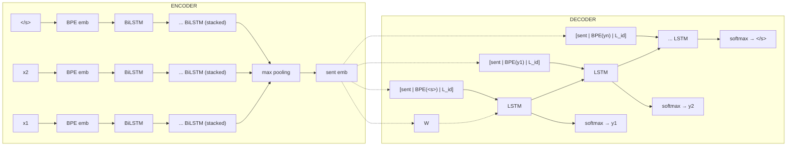
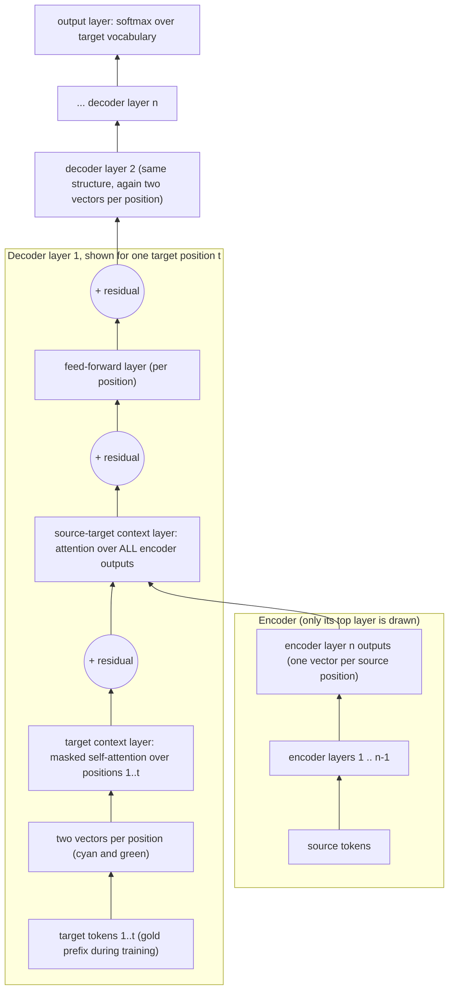
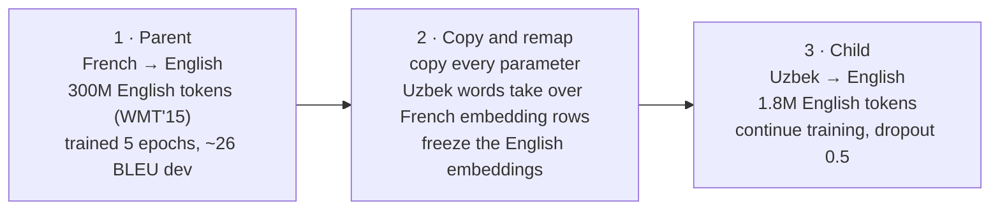
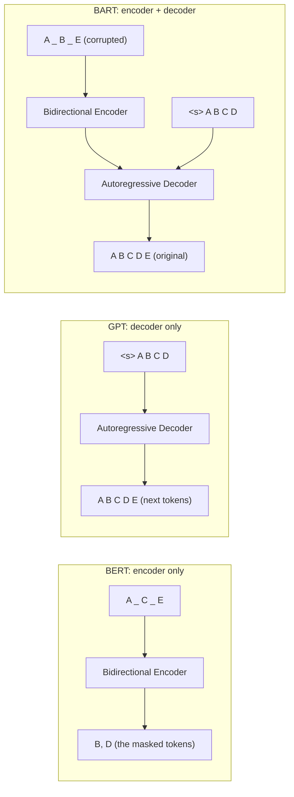
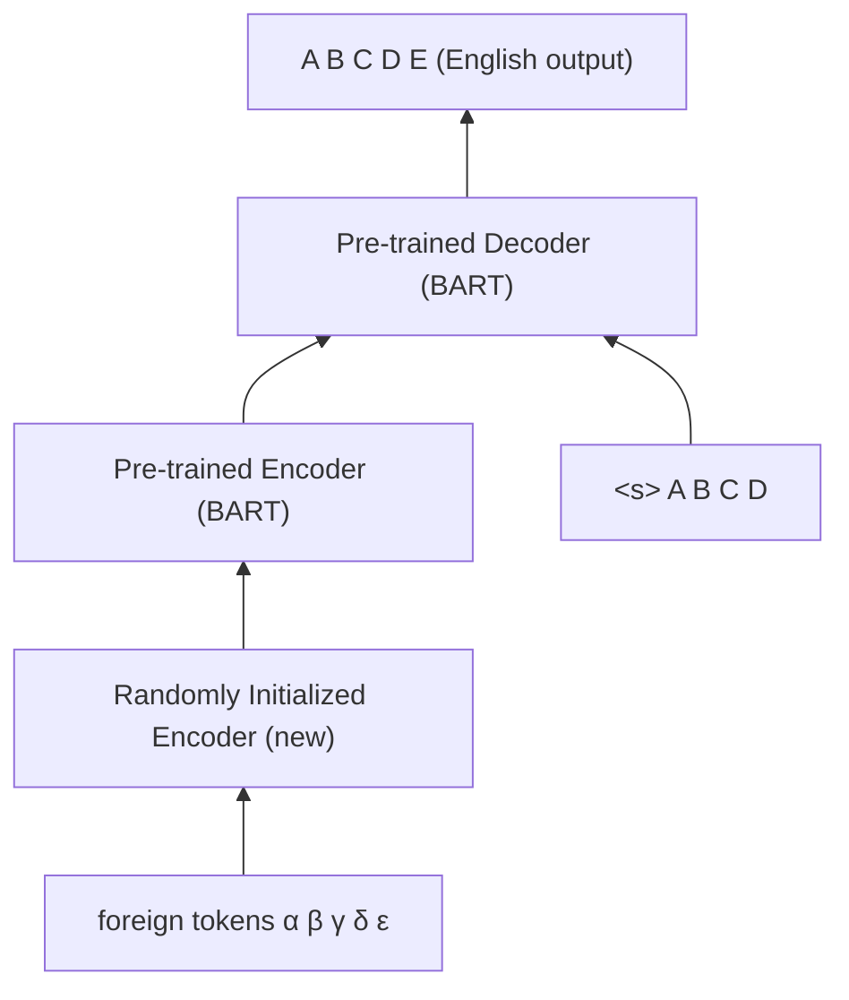

# MNLP-L07: Crosslingual NLP

> [!abstract] Overview
> You have a sentiment classifier, an NLI model or a QA system, and annotated training data for it in English only. Someone asks for the same system in Swahili. You can fine-tune a multilingual model such as mBERT on the English data and hope it works on Swahili, and for a while that hope was surprisingly well rewarded. This lecture asks how far that hope actually goes, and what you can do to stop relying on it.
>
> The previous lecture's multilingual models were trained on many languages at once, but nothing in their training objective ever told them that a German sentence and an English sentence mean the same thing. Any alignment between languages had to emerge on its own. The first half of this deck is about putting an explicit crosslingual signal back in: where parallel data comes from (OPUS, web crawls, sentence alignment with LASER embeddings), and two pretraining recipes that use it, **XLM** with its translation language modeling objective and **InfoXLM** with an added sentence-level contrastive objective. The results show the payoff, and a harsher test (premise and hypothesis, or context and question, in *different* languages) shows how much purely multilingual models were hiding.
>
> The second half moves to the oldest crosslingual task there is, **machine translation**: the sequence-to-sequence formulation, the encoder-decoder architecture, how much data neural MT needs, and how to get around not having it through **parent-child transfer learning**. Then **multilingual NMT**: one model for all translation directions, and the transfer against interference trade-off it creates. It ends with **BART**, a pretrained encoder-decoder trained as a denoising autoencoder, which can be fine-tuned for classification, QA, summarisation and translation, and its multilingual version **mBART**.
>
> The deck was taught across week 5 (Mon 28 Sep, Wed 30 Sep) and week 6 (Mon 5 Oct, Wed 7 Oct). It had 45 slides on 2026-10-05; the version re-uploaded on the morning of 2026-10-07 has **56**, adding **multilingual NMT** (slides 38 to 45, section 10), **mBART** (slides 54 and 55, section 12) and a recap (slide 56). The BART slides moved from 38 to 45 to 46 to 53, and every slide reference in this note uses the new numbering.

The lecture outline (slide 1) lists only the first half: **Cross-Lingual Training** (parallel data, Laser sentence embeddings), **XLM**, **InfoXLM**. The machine translation, transfer learning, multilingual NMT, BART and mBART slides (21 to 55) follow without a separate outline slide; the recap on slide 56 lists them.

## 1. From multilingual to crosslingual

### 1.1 What "multilingual" has meant so far

The models from [[MNLP-L06 - Contextual Embeddings|the previous lecture]] are multilingual in four specific senses:

- they **train jointly on multiple languages**
- they **use one model for all languages**
- they **use one (subword) vocabulary for all languages** (see [[MNLP-L04 - Subword Segmentation]])
- their **predictions are based on context within the same language** (MLM, masked language modeling)

The last bullet is the one this lecture attacks. When mBERT predicts a masked German word, every token it can see is German. Nothing in the objective rewards it for knowing what the English translation of that word is.

### 1.2 Knowledge transfer is a crosslingual capability

> [!definition] Crosslingual knowledge transfer
> Given **fine-tuning data in language A for task X**, how well does the model generalise to **test data for task X in language B**?

This is the **common scenario** in practice, because fine-tuning requires annotated data, and annotated data is scarce in anything that is not a high-resource language. When the fine-tuning language and the test language differ and no task data in B was seen at all, this is called **zero-shot crosslingual transfer**. The slide classifies transfer of this kind as a **crosslingual** capability: the model has to map what it learned in A onto B.

### 1.3 The open question

> [!question] Can crosslingual capabilities emerge without any cross-lingual training signal?
> - **Earlier zero-shot results seem to support this.** mBERT fine-tuned on English does work, to a degree, on other languages.
> - **However, crosslingual tasks cast some doubts on this capability.** When the input itself mixes languages (premise in one, hypothesis in another), purely multilingual models degrade sharply. Section 6 has the numbers.

## 2. Crosslingual signals: parallel and comparable data

### 2.1 Why multilingual training alone does not link languages

- Training on multiple languages makes a model multilingual, but **there is nothing that explicitly links information across languages**.
- **When predicting word $W$ in language $L$, there is no benefit in having access to unrelated context in language $L'$.** A random French sentence in the same batch tells the model nothing about a masked German token. The languages share parameters, but they never share *context*.

The fix is **context alignment across languages**: give the model text in two languages that is known to correspond, so that context in $L'$ actually *is* useful for predicting $W$ in $L$. Two kinds of data provide this:

| | Parallel data | Comparable data |
|---|---|---|
| **What it is** | sentence pairs in different languages that are **meaning equivalent** (translations of each other) | sentence or document pairs that are **on the same topic** |
| **Degree of parallelism** | full, by construction | not fully parallel; the degree of parallelism is a **sliding scale** |
| **History / examples** | used by data-driven MT approaches for decades | news articles on the same event, Wikipedia articles on the same entity in different languages |

### 2.2 What a parallel corpus looks like

Slide 4 shows an excerpt of a Chinese-English parallel corpus as a two-column table, one sentence pair per row (the vertical dots above and below indicate that the corpus continues):

| Chinese | English |
|---|---|
| 李鹏会见新加坡前总统王鼎昌 | Li Peng Meets With Former Singapore President Ong Teng Cheong |
| 马来亚、新加坡、沙捞越、沙巴和文莱曾组成联邦,但最後分裂了。 | Malaysia, Singapore, Sarawak, Sabah and Brunei once formed a federation, but it also fell apart in the end. |
| 新加坡排行榜首,缅甸则排行榜尾 。 | Singapore is at the head of the list, while Burma ranks last. |
| 新加坡则在致力建造一个光纤网环绕的"智能岛"。 | Singapore is also devoting itself to building a "intelligence island" embraced by a fiber-optical net. |

On the slide, 新加坡 and *Singapore* are highlighted in blue in every row. That highlighting is the point: once you have aligned sentence pairs, recurring co-occurrences like this are what lets a model (statistical MT historically, TLM in section 4) learn that 新加坡 and *Singapore* correspond, without anyone writing a dictionary.

### 2.3 Where parallel data comes from

Parallel data is **sometimes a natural by-product** of how organisations work:

- **multilingual news** (the slide's example is Xinhua, the Chinese state news agency, which publishes in several languages)
- **international organisations**: UN, EU (every official document is translated into all official languages)
- **websites and documents from countries with two or more (official or unofficial) languages**: Canada, Belgium, US

**OPUS** is a website with a very large collection of parallel corpora for research purposes, covering many languages. It is the default place to look first.

**Alternatively, crawl your own corpus**, which is a two-step pipeline:

1. **find parallel documents** (document aligning)
2. **find parallel sentences** within them (sentence aligning)

Or skip the document step entirely and **directly align sentences from vast raw web crawls such as Common Crawl**.

### 2.4 Parallel documents and sentences (slide 6)

Slide 6 shows the two-step pipeline on a real example: an NHK World news page in English, *"Japan to tighten checks for African swine fever"* (Tuesday, Nov. 26), next to its Chinese counterpart, *"日本拟加强口岸检查严防非洲猪瘟病毒"* (11月27日). Both pages carry the same electron-microscope photograph of virus particles. Red boxes with double-headed red arrows link five segment pairs:

```
   English page                                     Chinese page
  ┌─────────────────────────────────┐             ┌──────────────────────────────────┐
  │[Japan to tighten checks for     │ ◀─────────▶ │[日本拟加强口岸检查严防非洲猪瘟病毒]│ 1 title ↔ title
  │ African swine fever]            │             │                                  │
  │  (same photo)                   │             │  (same photo)                    │
  │[The Japanese government plans to│ ◀─────────▶ │[鉴于非洲猪瘟疫情在亚洲多国不断扩大,│ 2 para 1 ↔ para 1
  │ give more powers to quarantine  │             │ ...防疫官的权限。]                 │
  │ officers at airports...]        │             │                                  │
  │[Outbreaks of the fatal and      │ ◀─────────▶ │[非洲猪瘟疫情在中国、韩国等国蔓延。 │ 3 para 2 ↔ first part
  │ highly contagious disease...    │             │ ...带来沉重打击。]                 │   of Chinese para 2
  │ no cases confirmed in Japan]    │             │                                  │
  │[The agriculture ministry is     │ ◀─────────▶ │[鉴于此,农林水产省决定修订相关法律,│ 4 para 3 ↔ last sentence
  │ working on legal amendments...] │             │ 加强口岸检查工作。]                │   of Chinese para 2
  │[It plans to allow quarantine    │ ◀─────────▶ │[具体措施是,加大在机场等处开展检查 │ 5 para 4 ↔ para 3
  │ officers ... to ask travelers   │             │ 工作的家畜防疫官的权限...]         │
  │ if they have any meat products] │             │                                  │
  └─────────────────────────────────┘             └──────────────────────────────────┘
```

The figure illustrates both levels at once. The two pages are a **parallel document pair** (same story, same photo, published a day apart because of the time zone). Inside them, segments line up as **parallel sentences**, and the alignment does not follow paragraph boundaries: English paragraphs 2 and 3 both map into Chinese paragraph 2, which the aligner has to split at a sentence boundary. This is why sentence alignment is a separate step after document alignment, and why it has to allow alignments other than one paragraph to one paragraph.

## 3. LASER sentence embeddings

### 3.1 Measuring meaning equivalence

To find parallel sentences directly (without first finding parallel documents), we have to **measure degrees of meaning equivalence** between a sentence in one language and candidate sentences in another.

- **Old-fashioned:** **dictionary overlap** (how many words in sentence 1 have a dictionary translation in sentence 2) and **relative length distribution** (translations have predictable length ratios).
- **More recent:** **compute and compare sentence embeddings**, specifically **LASER** (Artetxe and Schwenk, 2019). Embed every sentence in every language into one shared vector space, then translations are nearest neighbours.

### 3.2 The LASER architecture

Slide 7 shows the LASER model, an encoder-decoder trained on translation, of which only the encoder is used afterwards.



Reading the figure:

- **Encoder.** Input tokens $x_1, x_2, \dots, \texttt{</s>}$ are looked up in a **BPE embedding** table (one shared BPE vocabulary for all languages). They pass through a **stack of BiLSTM layers** (bidirectional LSTMs, arrows in both directions between time steps). The top layer's hidden states are **max-pooled** over time (element-wise maximum across all positions) into a single fixed-size vector, the **sentence embedding** (`sent emb`).
- **Decoder.** An LSTM decoder generates the output sentence $y_1, y_2, \dots, \texttt{</s>}$. The sentence embedding reaches the decoder in two ways (dashed lines): through a linear map $W$ that initialises the decoder LSTM, and by being **concatenated to the input at every decoder step**, together with the BPE embedding of the previous output token ($\texttt{<s>}, y_1, \dots, y_n$) and a **language ID embedding** $L_{id}$ that tells the decoder which language to produce.
- Every output step goes through a **softmax** over the vocabulary.

> [!intuition] Why this produces language-independent sentence vectors
> The decoder sees nothing of the source sentence except the single vector `sent emb`, and it is told which output language to generate by $L_{id}$, not by the encoder. So the encoder has no reason to encode which language the input was in, and every reason to encode only what the sentence *means*, since that is all the decoder needs to translate it into any target language. After training, the decoder is thrown away, and the encoder maps sentences from any training language into one shared space where translations land close together.

Not on the slides: the max pooling step is what makes the embedding fixed-size regardless of sentence length, and comparison between two sentence embeddings is normally by cosine similarity.

### 3.3 vecalign

The **sentence alignment approach** on the slide is **vecalign**:

- **use LASER to match sentences**: the similarity between a source sentence and a target sentence is the similarity of their LASER embeddings
- **efficient search that scales to massive data sets**

Not on the slides: vecalign aligns two documents that are already known to be parallel, and allows one sentence to align to several consecutive sentences on the other side (when a translator merges or splits sentences), using a dynamic-programming search whose cost grows roughly linearly with document length. For mining parallel sentences out of an entire crawl, without known parallel documents, the same LASER embeddings are used with nearest-neighbour search instead.

## 4. XLM: an explicit crosslingual objective

### 4.1 Motivation

> [!note] Slide 8: crosslingual contextual embeddings
> - **mBERT never sees an explicit translation pair during pre-training.** Any crosslingual alignment it achieves is an **emergent side-effect**; it is not a designed-in objective.
> - **For many language pairs, at least some parallel (translated) text does exist**: existing parallel corpora (OPUS) and self-crawled corpora (section 2).
> - **XLM** (Conneau and Lample, 2019) **uses parallel data for an explicit cross-lingual loss.**

### 4.2 The three pretraining objectives

XLM has **three pre-training objectives**:

| Objective | Input | What is predicted | Crosslingual? |
|---|---|---|---|
| **CLM**, causal language modeling | a prefix string | the next word | no |
| **MLM**, masked language modeling | monolingual context with a word masked somewhere in it | the masked word (as in BERT) | no |
| **TLM**, translation language modeling | a context in **two languages** (a sentence and its translation) | masked words, in either language | **yes** |

- **Next sentence prediction (NSP) has been dropped**, unlike BERT.
- **TLM is the crosslingual objective**, and it is always used in combination with one of the monolingual ones. Two settings: **MLM + TLM** and **CLM + TLM**.
- **The parallel corpora come from OPUS** (for example MultiUN, OpenSubtitles, EUbookshop, ...).

Formalised (not on the slides, but this is what the bullets mean). Let $\mathbf{x} = (x_1,\dots,x_n)$ be a token sequence and $M \subseteq \{1,\dots,n\}$ the set of masked positions, and let $\mathbf{x}_{\setminus M}$ be the sequence with those positions replaced by `[MASK]`.

> [!formula] CLM, MLM and TLM losses #key-formula
> $$\mathcal{L}_{\text{CLM}} = -\sum_{t=1}^{n} \log p_\theta(x_t \mid x_1, \dots, x_{t-1})$$
> $$\mathcal{L}_{\text{MLM}} = -\sum_{i \in M} \log p_\theta(x_i \mid \mathbf{x}_{\setminus M})$$
> For a parallel pair $(\mathbf{x}, \mathbf{y})$ with masks $M_x$ in $\mathbf{x}$ and $M_y$ in $\mathbf{y}$, concatenated into one input:
> $$\mathcal{L}_{\text{TLM}} = -\sum_{i \in M_x} \log p_\theta\big(x_i \mid \mathbf{x}_{\setminus M_x}, \mathbf{y}_{\setminus M_y}\big) \;-\; \sum_{j \in M_y} \log p_\theta\big(y_j \mid \mathbf{x}_{\setminus M_x}, \mathbf{y}_{\setminus M_y}\big)$$
>
> where:
> - $p_\theta$ is the Transformer's softmax output over the shared vocabulary, with parameters $\theta$
> - $\mathbf{x}$ is a sentence in language 1 and $\mathbf{y}$ its translation in language 2
> - TLM is literally MLM applied to the concatenation $[\mathbf{x}; \mathbf{y}]$. The only thing that changes is the input, and that is the whole idea.

### 4.3 How TLM training looks (slide 10)

Slide 10 is the XLM paper's figure, showing one MLM example and one TLM example as they enter the Transformer. Each input position is the **sum of three embeddings**: token, position and language.

**MLM** (monolingual English stream):

| position | 0 | 1 | 2 | 3 | 4 | 5 | 6 | 7 | 8 | 9 | 10 | 11 |
|---|---|---|---|---|---|---|---|---|---|---|---|---|
| token | `[/s]` | `[MASK]` | a | seat | `[MASK]` | have | a | `[MASK]` | `[/s]` | `[MASK]` | relax | and |
| language | en | en | en | en | en | en | en | en | en | en | en | en |
| **target** | | **take** | | | **`[/s]`** | | | **drink** | | **now** | | |

The original text is *"[/s] take a seat [/s] have a drink [/s] now relax and"*: a continuous stream of sentences separated by `[/s]`, cut into a fixed-length window. Note that a sentence separator itself can be masked (position 4).

**TLM** (an English-French parallel pair, concatenated):

| position | 0 | 1 | 2 | 3 | 4 | 5 | 0 | 1 | 2 | 3 | 4 | 5 |
|---|---|---|---|---|---|---|---|---|---|---|---|---|
| token | `[/s]` | the | `[MASK]` | `[MASK]` | blue | `[/s]` | `[/s]` | `[MASK]` | rideaux | étaient | `[MASK]` | `[/s]` |
| language | en | en | en | en | en | en | fr | fr | fr | fr | fr | fr |
| **target** | | | **curtains** | **were** | | | | **les** | | | **bleus** | |

The pair is *"the curtains were blue"* / *"les rideaux étaient bleus"*.

> [!intuition] Why TLM forces alignment
> Look at what the model can use to predict the masked English word *curtains*. The English context *"the ___ ___ blue"* is nearly useless: lots of things can be blue. But the French side is right there, unmasked, and it says *rideaux*. The cheapest way to minimise the loss is to attend across to the French sentence and learn that *rideaux* ↔ *curtains*. Symmetrically, to predict French *les* and *bleus* the model can read English *the* and *blue*. TLM is exactly the "context in $L'$ is useful for predicting $W$ in $L$" condition that section 2.1 said plain multilingual training lacks.
>
> Two details of the figure make this work:
> - **Position embeddings restart at 0** for the second sentence. Both sentences have positions 0 to 5, so position cannot be used to tell the sentences apart, and roughly corresponding words in the two languages get similar position signals.
> - **Language embeddings** (en, fr) tell the model which half is which language, since positions no longer do.

### 4.4 XLM results on XNLI (slide 11)

**XNLI** is crosslingual natural language inference (not on the slides: given a premise and a hypothesis, classify the relation as entailment, contradiction or neutral; the English training set is MultiNLI and the dev and test sets are human-translated into 14 further languages, giving the 15 columns below). The metric is **accuracy**, and $\Delta$ is the average over the 15 languages.

The table has three evaluation settings:

- **Machine translation baselines (TRANSLATE-TRAIN)**: machine-translate the English training set into each language and fine-tune on the translation.
- **Machine translation baselines (TRANSLATE-TEST)**: machine-translate each test set into English and use a model fine-tuned on English.
- **Evaluation of cross-lingual sentence encoders**: fine-tune on English only and test directly on every language, which is **zero-shot crosslingual transfer** (section 1.2).

| Setting | Model | en | fr | es | de | el | bg | ru | tr | ar | vi | th | zh | hi | sw | ur | $\Delta$ |
|---|---|---|---|---|---|---|---|---|---|---|---|---|---|---|---|---|---|
| Translate-train | Devlin et al. (2018) | 81.9 | - | 77.8 | 75.9 | - | - | - | - | 70.7 | - | - | 76.6 | - | - | 61.6 | - |
| Translate-train | XLM (MLM+TLM) | <u>85.0</u> | <u>80.2</u> | <u>80.8</u> | <u>80.3</u> | <u>78.1</u> | <u>79.3</u> | <u>78.1</u> | <u>74.7</u> | <u>76.5</u> | <u>76.6</u> | <u>75.5</u> | <u>78.6</u> | <u>72.3</u> | <u>70.9</u> | 63.2 | <u>76.7</u> |
| Translate-test | Devlin et al. (2018) | 81.4 | - | 74.9 | 74.4 | - | - | - | - | 70.4 | - | - | 70.1 | - | - | 62.1 | - |
| Translate-test | XLM (MLM+TLM) | <u>85.0</u> | 79.0 | 79.5 | 78.1 | 77.8 | 77.6 | 75.5 | 73.7 | 73.7 | 70.8 | 70.4 | 73.6 | 69.0 | 64.7 | 65.1 | 74.2 |
| Zero-shot | Conneau et al. (2018b) | 73.7 | 67.7 | 68.7 | 67.7 | 68.9 | 67.9 | 65.4 | 64.2 | 64.8 | 66.4 | 64.1 | 65.8 | 64.1 | 55.7 | 58.4 | 65.6 |
| Zero-shot | Devlin et al. (2018) | 81.4 | - | 74.3 | 70.5 | - | - | - | - | 62.1 | - | - | 63.8 | - | - | 58.3 | - |
| Zero-shot | Artetxe and Schwenk (2018) | 73.9 | 71.9 | 72.9 | 72.6 | 73.1 | 74.2 | 71.5 | 69.7 | 71.4 | 72.0 | 69.2 | 71.4 | 65.5 | 62.2 | 61.0 | 70.2 |
| Zero-shot | XLM (MLM) | 83.2 | 76.5 | 76.3 | 74.2 | 73.1 | 74.0 | 73.1 | 67.8 | 68.5 | 71.2 | 69.2 | 71.9 | 65.7 | 64.6 | 63.4 | 71.5 |
| Zero-shot | **XLM (MLM+TLM)** | **<u>85.0</u>** | **78.7** | **78.9** | **77.8** | **76.6** | **77.4** | **75.3** | **72.5** | **73.1** | **76.1** | **73.2** | **76.5** | **69.6** | **68.4** | **<u>67.3</u>** | **75.1** |

Underlined is the best per column over the whole table; bold is the best among the zero-shot encoders. "Devlin et al. (2018)" is mBERT, which was only reported for six languages. "Artetxe and Schwenk (2018)" is LASER (section 3).

How to read it:

- **TLM is worth 3.6 points on average.** XLM (MLM), which is a purely multilingual model, averages 71.5; adding TLM gives 75.1. Every language gains. The gains are largest for languages that are distant from English in script or structure, vi 71.2 → 76.1 (+4.9), tr 67.8 → 72.5 (+4.7), ar 68.5 → 73.1 and zh 71.9 → 76.5 (+4.6 each), and smallest for English itself (+1.8) and for fr and ru (+2.2 each).
- **Zero-shot XLM beats translate-test.** 75.1 against 74.2: a single model that never saw non-English NLI data beats a pipeline that translates every test example into English.
- **Translate-train is still best** (76.7), but it needs an MT system and a translated training set for every language.
- XLM (MLM+TLM) zero-shot beats both mBERT and LASER in every column where they are reported.

> [!example] Checking the average
> The $\Delta$ column is the plain mean over the 15 languages. For zero-shot XLM (MLM+TLM):
> $(85.0 + 78.7 + 78.9 + 77.8 + 76.6 + 77.4 + 75.3 + 72.5 + 73.1 + 76.1 + 73.2 + 76.5 + 69.6 + 68.4 + 67.3)/15 = 1126.4/15 = 75.09 \approx 75.1$.

### 4.5 XLM results on language modeling and word alignment (slide 12)

**Left: low-resource language modeling for Nepali.** Perplexity on Nepali text (lower is better) of an XLM language model trained with different languages added:

| Training languages | Nepali perplexity |
|---|---|
| Nepali | 157.2 |
| Nepali + English | 140.1 |
| Nepali + Hindi | 115.6 |
| Nepali + English + Hindi | **109.3** |

Adding *any* second language helps, and a **related** language helps far more: Hindi (same Devanagari script, closely related Indo-Aryan language) cuts perplexity by 41.6 points, English by 17.1. Both together are best. This is the first appearance of a theme that comes back in section 9.5: **transfer works best between related languages**.

**Right: crosslingual word embeddings.** The slide notes that **the word embeddings for the baselines are obtained from fastText**, and that **"Concat" is the joint training of embeddings over all languages** (one fastText model on the concatenated multilingual corpus). MUSE is the mapping-based method from [[MNLP-L05 - Static Embeddings]]. XLM's word embeddings are its input embedding table.

| | Cosine sim. ↑ | L2 dist. ↓ | SemEval'17 ↑ |
|---|---|---|---|
| MUSE | 0.38 | 5.13 | 0.65 |
| Concat | 0.36 | 4.89 | 0.52 |
| XLM | **0.55** | **2.64** | **0.69** |

Not on the slides: the first two columns are the average cosine similarity and average L2 distance between the embeddings of word translation pairs from a bilingual dictionary (translations should be close), and SemEval'17 is a crosslingual word-similarity benchmark scored by correlation with human judgments. On all three, XLM's embeddings are better aligned across languages than either static baseline, even though XLM was never trained to align word embeddings directly.

## 5. InfoXLM: adding a sentence-level crosslingual signal

### 5.1 The three objectives

**InfoXLM** (Chi et al., 2021) **builds on XLM-R but also includes the parallel data ideas from XLM.** XLM-R is a purely multilingual masked LM; InfoXLM adds crosslingual objectives on top of it. It has three objectives:

1. **MMLM, Multilingual Masked Language Model.** The slide describes it as **similar to MLM, but instead of directly optimising the loss of the ground truth, it uses negative sampling.**
2. **TLM**, the translation language modeling objective **as in XLM** (section 4).
3. **XLCo**, crosslingual contrastive learning:
   - use the **representations of the `[CLS]` tokens** of the two sentences in a **parallel sentence pair**
   - **classify whether a sentence pair is parallel**
   - **negative sampling, with random sentences as negatives**

> [!warning] What MMLM actually is
> The slide's wording suggests MMLM replaces the MLM loss with a sampled one. Not on the slides, from the InfoXLM paper: MMLM is ordinary masked language modeling on monolingual text in many languages, the same loss as XLM-R. The paper's contribution is to *interpret* the standard softmax cross-entropy over the vocabulary as a contrastive (InfoNCE) loss in which the correct token is the positive and every other vocabulary entry acts as a negative. Read "negative sampling" on the slide in that sense: the other vocabulary items play the role of negatives, and nothing extra is sampled.

The XLCo idea is [[Contrastive Learning]] at sentence level. Formalised (not on the slides, the standard InfoNCE form that "classify whether a pair is parallel, with random sentences as negatives" describes):

> [!formula] XLCo, sentence-level contrastive loss
> $$\mathcal{L}_{\text{XLCo}} = -\log \frac{\exp\big(f(\mathbf{x})^\top f(\mathbf{y})\big)}{\exp\big(f(\mathbf{x})^\top f(\mathbf{y})\big) + \sum_{\mathbf{y}' \in \mathcal{N}} \exp\big(f(\mathbf{x})^\top f(\mathbf{y}')\big)}$$
>
> where:
> - $(\mathbf{x}, \mathbf{y})$ is a parallel sentence pair (the positive)
> - $f(\cdot)$ is the encoder's `[CLS]` representation of a sentence
> - $\mathcal{N}$ is a set of negatives: random sentences that are not translations of $\mathbf{x}$
> - the fraction is a softmax over "which of these candidates is the translation of $\mathbf{x}$?", so minimising the loss pulls translations together and pushes non-translations apart in `[CLS]` space

Not on the slides: in the paper, the negatives come from a queue of recently encoded sentences maintained with a momentum encoder (the MoCo technique), which is how it gets many negatives cheaply.

> [!intuition] Token level and sentence level
> TLM aligns languages at the **token level**: a masked word is predicted from its translation's words. XLCo aligns them at the **sentence level**: the whole-sentence representation of a sentence and of its translation must be closer to each other than to anything else. LASER (section 3) got sentence-level alignment from a translation decoder; InfoXLM gets it from a contrastive loss inside a masked-LM pretraining run.

### 5.2 InfoXLM against XLM (slide 14)

| | XLM (Conneau and Lample, 2019) | InfoXLM (Chi et al., 2021) |
|---|---|---|
| **Starting point** | trained from scratch | initialised from XLM-R, then further pretrained (150K steps base, 200K large) |
| **Monolingual data** | Wikipedia | CC-100, rebuilt by the authors (94 languages) |
| **Parallel data** | 15 XNLI languages | 14 English-centric pairs, ~42 GB (MultiUN, IIT Bombay, OPUS, WikiMatrix) |
| **Vocabulary** | shared BPE | XLM-R's 250k SentencePiece |
| **Language embeddings** | yes | no (inherits XLM-R's architecture) |
| **Objectives** | MLM (or CLM) + TLM | MMLM + TLM + XLCo, equally weighted |
| **Cross-lingual signal** | token-level only | token-level and sentence-level |

"Equally weighted" means the total loss is the plain sum:

$$\mathcal{L}_{\text{InfoXLM}} = \mathcal{L}_{\text{MMLM}} + \mathcal{L}_{\text{TLM}} + \mathcal{L}_{\text{XLCo}}$$

Notes on the comparison:

- "English-centric" means every parallel pair has English on one side (en-fr, en-de, ...). There is no direct fr-de parallel data.
- WikiMatrix is the corpus of parallel sentences mined from Wikipedia with LASER (Schwenk et al., 2019), the same paper behind slide 29 (section 8.2). The section 3 pipeline is therefore one of InfoXLM's data sources.
- The 250k SentencePiece vocabulary and the absence of language embeddings are inherited because InfoXLM starts from XLM-R's weights and cannot change the architecture without losing them. Without language embeddings, TLM has to work from the tokens alone to tell which half of the input is which language.

> [!warning] Deck typo
> Slide 13 says InfoXLM "builds on XML-R" and slide 17's title says "XML-R". Both mean **XLM-R** (XLM-RoBERTa). There is no model called XML-R.

## 6. Within-language and across-language transfer

Slides 15 to 20 evaluate mBERT, XLM-R and InfoXLM on two tasks under a deliberately harder protocol than XNLI's standard zero-shot setting. The models are fine-tuned once (slide titles: **zero-shot transfer**) and then evaluated on inputs where **the two parts of the input can be in different languages**:

- **XNLI**: the **premise** in one language and the **hypothesis** in another (15 languages, so 15 × 15 = 225 combinations)
- **XSQuAD** (QA): the **context** paragraph in one language and the **question** in another (11 languages, 121 combinations). Not on the slides: these 11 languages are exactly those of the XQuAD dataset, a professional translation of SQuAD v1.1 dev into 10 languages; the slide calls it XSQuAD.

Each is summarised by two numbers per language $\ell$:

> [!definition] Within and across scores
> - **within**$(\ell)$: the score when both parts of the input are in $\ell$ (the diagonal cell $(\ell,\ell)$ of the heatmaps)
> - **across**$(\ell)$: the mean score over all mixed-language combinations involving $\ell$, that is, the $\ell$ row and the $\ell$ column of the heatmap without the diagonal
>
> $$\text{across}(\ell) = \frac{1}{2(K-1)} \left( \sum_{\ell' \neq \ell} S(\ell, \ell') + \sum_{\ell' \neq \ell} S(\ell', \ell) \right)$$
>
> where $K$ is the number of languages (15 for XNLI, 11 for QA) and $S(a, b)$ is the score with the first input part (premise or context) in $a$ and the second (question or hypothesis) in $b$.

The slides do not state this definition. It is recovered from the numbers: computing it from the heatmaps on slides 17 to 20 reproduces every "across" value in the tables on slides 15 and 16, all QA values and all XLM-R values to within 0.1, and the rest to within 0.3. Every "within" value is a diagonal cell, up to small differences discussed in the warning below. Taking the row only or the column only does not reproduce the tables, so the definition really is "the language appears in either position".

> [!example] Worked example: mBERT, English, XNLI
> The en row of the mBERT heatmap (premise English, hypothesis in each of the other 14 languages) sums to 808.5; the en column (hypothesis English, premise in each other language) sums to 908.4.
> $$\text{across}(\text{en}) = \frac{808.5 + 908.4}{28} = \frac{1716.9}{28} = 61.3$$
> which is the 61.3 in slide 15's table. $\text{within}(\text{en}) = S(\text{en}, \text{en}) = 81.5$. So mBERT loses about 20 accuracy points as soon as one of the two sentences is not English. Note also the asymmetry: the column mean (64.9) is higher than the row mean (57.7), so mBERT copes better with an English *hypothesis* and foreign premise than the other way round.

### 6.1 Summary tables (slides 15 and 16)

**XNLI, accuracy:**

| Model | | en | de | fr | ru | es | zh | vi | ar | tr | bg | el | ur | hi | th | sw | avg |
|---|---|---|---|---|---|---|---|---|---|---|---|---|---|---|---|---|---|
| mBERT | within | 81.5 | 70.6 | 73.5 | 68.6 | 68.2 | 68.6 | 69.9 | 64.2 | 62.0 | 68.7 | 67.5 | 58.7 | 60.5 | 52.3 | 50.3 | 65.7 |
| mBERT | across | 61.3 | 57.7 | 59.5 | 57.2 | 59.2 | 55.2 | 56.0 | 54.3 | 51.1 | 55.9 | 54.3 | 50.7 | 52.3 | 47.2 | 45.6 | 54.5 |
| XLM-R | within | 84.9 | 76.3 | 78.3 | 75.7 | 79.2 | 73.5 | 74.8 | 71.5 | 73.0 | 78.6 | 75.4 | 65.5 | 69.3 | 71.8 | 65.2 | 74.2 |
| XLM-R | across | 71.9 | 67.1 | 68.8 | 68.0 | 69.2 | 64.6 | 65.1 | 62.8 | 62.8 | 68.3 | 66.2 | 60.0 | 63.6 | 64.2 | 53.7 | 64.8 |
| InfoXLM | within | 85.8 | 78.2 | 79.2 | 76.9 | 80.0 | 75.5 | 75.9 | 73.2 | 74.4 | 78.4 | 77.0 | 66.0 | 71.0 | 73.0 | 65.9 | 75.4 |
| InfoXLM | across | 77.1 | 72.0 | 72.9 | 71.9 | 73.2 | 70.0 | 69.9 | 69.0 | 69.0 | 72.5 | 71.1 | 64.8 | 68.8 | 69.8 | 61.8 | 70.3 |

**QA (XSQuAD), F1:**

| Model | | en | de | ru | es | zh | vi | ar | tr | el | hi | th | avg |
|---|---|---|---|---|---|---|---|---|---|---|---|---|---|
| mBERT | within | 84.5 | 72.7 | 71.4 | 75.5 | 58.2 | 69.2 | 61.2 | 55.1 | 62.4 | 58.0 | 40.0 | 64.4 |
| mBERT | across | 57.0 | 50.6 | 50.2 | 52.7 | 42.6 | 46.3 | 42.2 | 36.9 | 42.4 | 38.7 | 26.1 | 44.2 |
| XLM-R | within | 84.2 | 75.2 | 74.5 | 77.1 | 63.7 | 74.3 | 66.3 | 68.1 | 73.8 | 68.3 | 66.5 | 72.0 |
| XLM-R | across | 58.1 | 44.1 | 42.9 | 43.4 | 28.1 | 33.9 | 25.8 | 31.3 | 34.7 | 32.3 | 29.6 | 36.8 |
| InfoXLM | within | 85.1 | 76.0 | 75.0 | 77.8 | 66.4 | 75.6 | 70.3 | 69.9 | 74.8 | 71.6 | 69.9 | 73.8 |
| InfoXLM | across | 73.8 | 66.6 | 66.7 | 68.1 | 61.4 | 64.3 | 61.0 | 61.4 | 64.2 | 61.9 | 60.1 | 64.5 |

The gap between within and across, averaged over languages, is the clearest single summary:

| | XNLI within | XNLI across | XNLI gap | QA within | QA across | QA gap |
|---|---|---|---|---|---|---|
| mBERT | 65.7 | 54.5 | 11.2 | 64.4 | 44.2 | 20.2 |
| XLM-R | 74.2 | 64.8 | 9.4 | 72.0 | 36.8 | **35.2** |
| InfoXLM | 75.4 | 70.3 | **5.1** | 73.8 | 64.5 | **9.3** |

> [!tip] The headline result of the first half of the lecture #exam-topic
> - **XLM-R is a much better multilingual model than mBERT** (within: +8.5 on XNLI, +7.6 on QA) **but on mixed-language QA it is worse than mBERT**: across 36.8 against 44.2. Being better at each language separately did not make it better at relating two languages to each other.
> - **InfoXLM, which adds explicit crosslingual objectives on parallel data, is only slightly better within a language (+1.2 XNLI, +1.8 QA over XLM-R) but dramatically better across languages: +5.5 on XNLI and +27.7 on QA.** The gap between within and across shrinks from 35.2 to 9.3 F1 on QA.
> - This is the answer to section 1.3's question. Standard zero-shot benchmarks, where all parts of the input share a language, make purely multilingual models look crosslingual. Tasks that require relating two languages within one input show that much of that capability **does not emerge** without a crosslingual training signal, and that adding one (parallel data via TLM and XLCo) fixes most of it.

> [!warning] An inconsistency between slide 15 and slide 17
> For mBERT on XNLI, slide 15 gives **within(es) = 68.2**, but the diagonal cell (es, es) of slide 17's mBERT heatmap is **74.0**. Two smaller mismatches in the same row: within(zh) is 68.6 on slide 15 against 68.2 on the heatmap, within(vi) 69.9 against 69.6. All other mBERT within values, and all XLM-R within values, match the heatmap exactly. Slide 15's average 65.7 is consistent with its own es value (with 74.0 the mean of the diagonal is 66.0). The slides do not say which figure is right. InfoXLM's within values on slide 15 also differ from slide 18's diagonal by up to 0.2 (for example de 78.2 against 78.1, zh 75.5 against 75.7), which looks like rounding or a separate run. Separately, the XLM-R XNLI "across" average on slide 15 is 64.8, but the mean of the 15 per-language across values in the same row is 65.1. For the exam, quote the table values and know that the conclusions do not depend on any of these differences.

### 6.2 The XNLI heatmaps (slides 17 and 18)

Each heatmap has the **premise language on the rows** and the **hypothesis language on the columns**, cell values are accuracy, and darker red means higher. The diagonal (bold below) is "within". Slide 17 shows mBERT (left) and XLM-R (right); slide 18 shows XLM-R (left, the same image as slide 17's right) and InfoXLM (right). Full transcriptions follow, so that every number on the slides is in this note.

**mBERT, XNLI** (slide 17 left):

| premise ↓ hypothesis → | en | es | de | ar | ur | ru | bg | el | fr | hi | sw | th | tr | vi | zh |
|---|---|---|---|---|---|---|---|---|---|---|---|---|---|---|---|
| **en** | **81.5** | 68.9 | 64.1 | 56.5 | 50.2 | 63.5 | 60.4 | 56.7 | 68.2 | 52.5 | 42.3 | 46.0 | 52.0 | 62.8 | 64.4 |
| **es** | 72.9 | **74.0** | 61.8 | 57.3 | 49.4 | 64.0 | 60.4 | 58.3 | 68.3 | 52.1 | 41.3 | 45.9 | 51.4 | 61.5 | 60.8 |
| **de** | 71.3 | 65.3 | **70.6** | 57.1 | 51.3 | 63.8 | 60.3 | 57.3 | 65.7 | 53.9 | 42.3 | 46.6 | 52.3 | 61.4 | 60.6 |
| **ar** | 64.1 | 61.0 | 57.5 | **64.2** | 49.4 | 57.2 | 54.5 | 54.5 | 60.8 | 51.1 | 42.4 | 45.7 | 50.5 | 56.7 | 54.9 |
| **ur** | 61.3 | 57.1 | 55.8 | 51.7 | **58.7** | 53.9 | 49.8 | 52.1 | 57.1 | 55.6 | 41.3 | 44.4 | 50.0 | 51.8 | 52.9 |
| **ru** | 68.6 | 65.3 | 61.7 | 55.0 | 47.9 | **68.6** | 62.0 | 55.9 | 65.2 | 50.9 | 42.1 | 45.4 | 51.1 | 58.9 | 58.0 |
| **bg** | 67.8 | 64.6 | 61.6 | 55.6 | 47.7 | 64.9 | **68.7** | 56.9 | 64.1 | 51.9 | 42.0 | 46.1 | 51.1 | 56.8 | 57.6 |
| **el** | 62.3 | 60.9 | 57.2 | 54.6 | 48.2 | 56.9 | 56.6 | **67.5** | 60.5 | 50.3 | 42.5 | 46.2 | 50.8 | 55.7 | 54.4 |
| **fr** | 73.4 | 69.3 | 62.8 | 58.1 | 50.5 | 64.0 | 60.6 | 57.6 | **73.5** | 53.2 | 42.0 | 46.7 | 52.4 | 63.6 | 62.8 |
| **hi** | 62.4 | 57.8 | 55.6 | 53.1 | 53.5 | 55.5 | 52.5 | 53.1 | 57.3 | **60.5** | 41.6 | 45.0 | 50.6 | 54.0 | 54.1 |
| **sw** | 55.0 | 51.7 | 49.6 | 51.1 | 46.7 | 50.0 | 49.0 | 50.7 | 51.7 | 47.5 | **50.3** | 44.1 | 46.7 | 49.5 | 50.0 |
| **th** | 54.2 | 51.9 | 49.7 | 49.6 | 46.1 | 49.6 | 49.0 | 50.0 | 51.6 | 47.3 | 40.9 | **52.3** | 46.3 | 50.7 | 49.4 |
| **tr** | 60.3 | 55.1 | 53.7 | 52.5 | 49.0 | 54.2 | 52.5 | 52.9 | 55.8 | 51.3 | 40.2 | 44.2 | **62.0** | 52.7 | 53.6 |
| **vi** | 67.1 | 61.6 | 57.7 | 54.2 | 47.3 | 58.3 | 53.8 | 54.6 | 62.0 | 50.2 | 40.7 | 45.7 | 48.3 | **69.6** | 62.4 |
| **zh** | 67.7 | 60.3 | 57.6 | 51.8 | 46.3 | 56.8 | 53.3 | 51.4 | 61.4 | 48.6 | 41.3 | 43.8 | 48.3 | 59.8 | **68.2** |

**XLM-R, XNLI** (slide 17 right, repeated as slide 18 left):

| premise ↓ hypothesis → | en | es | de | ar | ur | ru | bg | el | fr | hi | sw | th | tr | vi | zh |
|---|---|---|---|---|---|---|---|---|---|---|---|---|---|---|---|
| **en** | **84.9** | 76.0 | 73.4 | 66.1 | 62.4 | 74.1 | 76.1 | 72.3 | 75.5 | 68.5 | 51.7 | 70.2 | 66.6 | 71.5 | 72.6 |
| **es** | 78.4 | **79.2** | 69.5 | 65.4 | 60.7 | 72.7 | 73.2 | 71.5 | 75.2 | 65.1 | 48.8 | 67.0 | 62.9 | 68.3 | 69.7 |
| **de** | 77.7 | 72.2 | **76.3** | 64.3 | 59.4 | 71.6 | 72.8 | 69.5 | 73.1 | 64.9 | 46.9 | 65.5 | 62.3 | 67.7 | 67.8 |
| **ar** | 71.3 | 69.4 | 65.1 | **71.5** | 58.3 | 66.2 | 66.2 | 64.8 | 68.9 | 60.3 | 47.7 | 62.2 | 59.1 | 64.0 | 64.0 |
| **ur** | 69.9 | 65.4 | 64.3 | 59.4 | **65.5** | 62.4 | 60.5 | 60.6 | 65.1 | 63.0 | 45.9 | 56.2 | 60.1 | 60.3 | 60.9 |
| **ru** | 77.6 | 74.2 | 71.6 | 63.9 | 59.2 | **75.7** | 74.3 | 69.1 | 73.3 | 65.2 | 49.1 | 65.5 | 64.3 | 67.8 | 68.4 |
| **bg** | 77.7 | 74.9 | 72.3 | 65.0 | 59.5 | 74.9 | **78.6** | 71.4 | 74.1 | 65.1 | 49.9 | 65.0 | 66.4 | 68.8 | 69.0 |
| **el** | 74.9 | 73.3 | 70.0 | 62.9 | 58.5 | 70.3 | 70.4 | **75.4** | 72.9 | 63.5 | 47.7 | 62.3 | 63.8 | 66.3 | 66.2 |
| **fr** | 78.8 | 75.8 | 70.5 | 64.6 | 59.7 | 72.4 | 72.2 | 70.5 | **78.3** | 65.3 | 47.6 | 66.6 | 63.1 | 68.6 | 68.5 |
| **hi** | 73.1 | 69.2 | 65.7 | 58.6 | 62.2 | 66.0 | 64.6 | 62.9 | 68.1 | **69.3** | 49.2 | 61.5 | 61.2 | 64.1 | 63.7 |
| **sw** | 64.9 | 62.3 | 57.6 | 58.0 | 54.8 | 60.1 | 60.6 | 59.5 | 61.3 | 58.2 | **65.2** | 58.3 | 57.6 | 59.3 | 59.5 |
| **th** | 73.3 | 70.4 | 66.2 | 62.0 | 58.5 | 67.3 | 66.8 | 64.9 | 69.4 | 62.7 | 48.1 | **71.8** | 60.6 | 67.9 | 67.7 |
| **tr** | 72.5 | 68.0 | 65.1 | 59.6 | 59.5 | 67.5 | 67.6 | 66.1 | 68.1 | 63.0 | 46.9 | 62.3 | **73.0** | 63.0 | 64.6 |
| **vi** | 74.1 | 68.8 | 66.2 | 61.3 | 57.4 | 67.8 | 66.5 | 65.2 | 70.1 | 62.6 | 46.4 | 65.9 | 59.1 | **74.8** | 68.0 |
| **zh** | 73.3 | 68.4 | 64.6 | 59.8 | 56.3 | 66.3 | 65.2 | 63.3 | 67.9 | 62.2 | 44.5 | 64.4 | 56.9 | 65.7 | **73.5** |

**InfoXLM, XNLI** (slide 18 right):

| premise ↓ hypothesis → | en | es | de | ar | ur | ru | bg | el | fr | hi | sw | th | tr | vi | zh |
|---|---|---|---|---|---|---|---|---|---|---|---|---|---|---|---|
| **en** | **85.9** | 81.2 | 79.5 | 75.1 | 69.1 | 78.7 | 79.8 | 77.2 | 79.9 | 75.8 | 64.9 | 76.7 | 75.2 | 77.4 | 78.2 |
| **es** | 81.6 | **80.0** | 74.8 | 71.6 | 64.8 | 75.1 | 76.3 | 74.6 | 77.3 | 71.2 | 58.9 | 72.3 | 70.8 | 72.4 | 74.1 |
| **de** | 80.8 | 75.7 | **78.1** | 70.9 | 64.6 | 74.5 | 75.5 | 73.8 | 76.0 | 70.4 | 59.5 | 71.6 | 70.1 | 72.2 | 72.6 |
| **ar** | 76.4 | 73.1 | 70.5 | **73.3** | 61.8 | 70.5 | 71.1 | 69.8 | 72.1 | 66.6 | 60.1 | 67.2 | 68.7 | 68.8 | 68.4 |
| **ur** | 72.5 | 68.3 | 66.8 | 64.7 | **66.0** | 66.7 | 66.6 | 65.7 | 67.7 | 66.9 | 57.8 | 63.6 | 66.3 | 64.0 | 64.3 |
| **ru** | 79.8 | 75.9 | 74.5 | 69.5 | 63.5 | **76.9** | 75.0 | 71.9 | 75.5 | 70.0 | 60.5 | 70.5 | 71.1 | 71.2 | 72.4 |
| **bg** | 80.4 | 77.1 | 75.0 | 70.9 | 64.3 | 75.7 | **78.4** | 73.4 | 76.2 | 70.0 | 61.2 | 71.1 | 71.6 | 72.3 | 72.4 |
| **el** | 78.7 | 75.5 | 73.5 | 69.6 | 63.1 | 73.0 | 74.5 | **76.8** | 74.9 | 68.9 | 60.6 | 68.4 | 70.1 | 69.7 | 70.3 |
| **fr** | 81.4 | 78.4 | 74.7 | 70.8 | 64.7 | 75.5 | 75.8 | 73.9 | **79.3** | 71.5 | 58.9 | 72.5 | 70.5 | 73.2 | 73.9 |
| **hi** | 76.8 | 71.9 | 70.0 | 66.1 | 65.2 | 69.8 | 70.5 | 68.3 | 71.2 | **71.0** | 59.7 | 67.0 | 68.4 | 67.5 | 67.4 |
| **sw** | 69.5 | 64.9 | 63.3 | 62.9 | 59.1 | 64.9 | 65.6 | 64.3 | 64.8 | 63.2 | **66.0** | 62.9 | 61.1 | 62.4 | 62.8 |
| **th** | 77.5 | 73.1 | 71.4 | 67.8 | 63.1 | 71.6 | 72.0 | 70.2 | 72.4 | 68.2 | 59.5 | **73.0** | 69.1 | 71.8 | 70.5 |
| **tr** | 76.5 | 72.5 | 70.2 | 67.5 | 62.1 | 71.3 | 72.1 | 70.3 | 71.1 | 67.6 | 56.0 | 68.6 | **74.5** | 67.7 | 69.5 |
| **vi** | 78.2 | 73.3 | 71.1 | 68.3 | 62.5 | 71.7 | 71.9 | 69.7 | 72.7 | 67.8 | 57.3 | 70.6 | 67.9 | **76.0** | 72.0 |
| **zh** | 78.7 | 73.9 | 71.6 | 67.4 | 61.3 | 71.2 | 71.3 | 68.9 | 72.6 | 66.7 | 58.9 | 69.0 | 68.4 | 71.1 | **75.7** |

What the XNLI heatmaps show (XNLI is a three-way classification, so chance is 33.3%):

- **The English column is the brightest column in every model.** Premise in any language with an English hypothesis works best: mean 64.9 (mBERT), 74.1 (XLM-R), 77.8 (InfoXLM). English dominates the pretraining data and the fine-tuning data, so English is the language every other language is best aligned to.
- **The Swahili column is the darkest.** With a Swahili hypothesis, mBERT scores between 40.2 and 42.5 whatever the premise language, barely above chance, and XLM-R between 44.5 and 51.7. InfoXLM lifts it to 56.0 to 64.9. The weakest off-diagonal cell is (tr, sw) for mBERT (40.2) and InfoXLM (56.0), and (zh, sw) for XLM-R (44.5).
- **The matrices are not symmetric.** Swapping which language holds the premise and which the hypothesis changes the score. For mBERT, a Swahili *premise* (row mean 49.5) is easier than a Swahili *hypothesis* (column mean 41.6).
- **Mixing two related high-resource languages costs little.** mBERT (fr premise, en hypothesis) scores 73.4, essentially the 73.5 of fr-fr; XLM-R (fr, en) scores 78.8, above fr-fr's 78.3.
- **InfoXLM is uniformly brighter off the diagonal.** Its worst off-diagonal cell (56.0) is above every cell of XLM-R's Swahili column (at most 51.7), and its best off-diagonal cell is (es, en) at 81.6.

### 6.3 The QA heatmaps (slides 19 and 20)

Rows are the **context language** (the paragraph containing the answer), columns the **question language**, values are F1. Slide 19 shows mBERT (left) and XLM-R (right); slide 20 shows XLM-R (left, the same image as slide 19's right) and InfoXLM (right). Note that the language order differs from the summary table on slide 16.

**mBERT, XSQuAD** (slide 19 left):

| context ↓ question → | en | ar | de | el | es | hi | ru | th | tr | vi | zh |
|---|---|---|---|---|---|---|---|---|---|---|---|
| **en** | **84.5** | 50.6 | 68.7 | 48.8 | 70.0 | 42.4 | 65.9 | 22.4 | 42.3 | 57.9 | 57.6 |
| **ar** | 58.7 | **61.2** | 49.0 | 39.1 | 52.4 | 35.4 | 50.6 | 21.2 | 32.7 | 43.1 | 43.7 |
| **de** | 72.9 | 43.9 | **72.7** | 45.3 | 62.6 | 38.8 | 62.6 | 20.2 | 37.4 | 51.8 | 49.3 |
| **el** | 62.8 | 42.3 | 52.9 | **62.4** | 54.7 | 34.6 | 53.4 | 19.9 | 33.1 | 45.3 | 43.6 |
| **es** | 75.9 | 50.5 | 64.2 | 48.4 | **75.5** | 40.2 | 64.4 | 23.3 | 37.7 | 53.5 | 53.7 |
| **hi** | 57.6 | 39.8 | 49.5 | 39.1 | 50.2 | **58.0** | 48.5 | 20.2 | 31.4 | 40.9 | 41.5 |
| **ru** | 67.8 | 46.0 | 58.8 | 44.8 | 62.0 | 38.5 | **71.4** | 21.1 | 36.8 | 49.6 | 49.3 |
| **th** | 38.1 | 30.5 | 33.2 | 29.6 | 35.3 | 26.0 | 34.4 | **40.0** | 24.1 | 31.0 | 30.9 |
| **tr** | 55.8 | 35.7 | 47.7 | 35.7 | 49.1 | 32.7 | 47.2 | 18.8 | **55.1** | 39.5 | 40.2 |
| **vi** | 68.2 | 42.1 | 56.8 | 41.6 | 58.0 | 36.6 | 55.8 | 23.4 | 32.4 | **69.2** | 54.2 |
| **zh** | 54.8 | 37.0 | 46.8 | 33.7 | 47.2 | 30.6 | 47.1 | 18.9 | 28.7 | 43.6 | **58.2** |

**XLM-R, XSQuAD** (slide 19 right, repeated as slide 20 left):

| context ↓ question → | en | ar | de | el | es | hi | ru | th | tr | vi | zh |
|---|---|---|---|---|---|---|---|---|---|---|---|
| **en** | **84.2** | 38.1 | 64.1 | 53.1 | 62.6 | 45.7 | 67.2 | 34.4 | 40.9 | 49.1 | 43.8 |
| **ar** | 59.2 | **66.3** | 36.7 | 18.8 | 35.1 | 15.6 | 35.0 | 14.6 | 15.9 | 17.4 | 17.8 |
| **de** | 73.4 | 25.2 | **75.2** | 40.3 | 53.6 | 29.9 | 58.0 | 24.2 | 29.9 | 37.2 | 30.2 |
| **el** | 68.7 | 23.4 | 51.1 | **73.8** | 54.3 | 25.2 | 48.2 | 17.5 | 24.9 | 29.4 | 21.4 |
| **es** | 75.0 | 27.4 | 55.1 | 43.3 | **77.1** | 29.1 | 58.6 | 23.4 | 28.4 | 32.0 | 31.2 |
| **hi** | 66.1 | 25.1 | 46.7 | 24.7 | 46.2 | **68.3** | 43.6 | 18.4 | 28.0 | 30.7 | 32.1 |
| **ru** | 70.3 | 23.2 | 57.8 | 36.6 | 55.4 | 28.1 | **74.5** | 20.2 | 29.3 | 30.3 | 25.5 |
| **th** | 61.8 | 28.6 | 42.8 | 29.1 | 43.1 | 31.1 | 44.7 | **66.5** | 24.2 | 35.3 | 36.5 |
| **tr** | 63.3 | 20.8 | 46.7 | 37.5 | 42.3 | 29.4 | 48.8 | 21.2 | **68.1** | 28.7 | 26.5 |
| **vi** | 68.8 | 23.0 | 46.6 | 29.8 | 39.7 | 28.5 | 49.5 | 24.2 | 22.3 | **74.3** | 31.0 |
| **zh** | 58.2 | 16.0 | 32.0 | 17.5 | 31.6 | 22.2 | 28.2 | 17.6 | 17.6 | 24.1 | **63.7** |

**InfoXLM, XSQuAD** (slide 20 right):

| context ↓ question → | en | ar | de | el | es | hi | ru | th | tr | vi | zh |
|---|---|---|---|---|---|---|---|---|---|---|---|
| **en** | **85.1** | 72.5 | 79.2 | 75.0 | 79.3 | 74.1 | 78.3 | 70.6 | 75.6 | 75.2 | 76.2 |
| **ar** | 67.7 | **70.3** | 63.8 | 59.3 | 63.2 | 53.6 | 62.0 | 55.5 | 56.7 | 59.0 | 59.6 |
| **de** | 76.8 | 63.6 | **76.0** | 64.8 | 70.7 | 63.0 | 70.7 | 60.5 | 61.8 | 65.4 | 65.8 |
| **el** | 74.0 | 62.6 | 69.3 | **74.8** | 69.0 | 60.6 | 67.7 | 58.4 | 62.8 | 64.2 | 64.1 |
| **es** | 78.9 | 67.1 | 72.9 | 68.8 | **77.8** | 64.9 | 73.9 | 62.6 | 64.9 | 68.4 | 69.8 |
| **hi** | 72.2 | 59.1 | 64.3 | 60.1 | 66.2 | **71.6** | 64.6 | 58.8 | 61.7 | 62.1 | 61.8 |
| **ru** | 74.4 | 63.2 | 69.9 | 65.3 | 70.6 | 62.6 | **75.0** | 60.4 | 65.6 | 65.6 | 65.5 |
| **th** | 67.2 | 56.9 | 60.9 | 58.6 | 61.7 | 57.5 | 61.2 | **69.9** | 57.0 | 60.8 | 60.1 |
| **tr** | 69.4 | 57.3 | 61.7 | 59.3 | 63.1 | 58.4 | 64.2 | 55.2 | **69.9** | 58.3 | 59.9 |
| **vi** | 73.5 | 62.0 | 66.4 | 62.8 | 65.1 | 60.8 | 68.5 | 63.9 | 58.3 | **75.6** | 67.0 |
| **zh** | 65.4 | 54.9 | 59.9 | 56.9 | 60.5 | 51.7 | 59.3 | 54.7 | 55.9 | 59.0 | **66.4** |

What the QA heatmaps show:

- **mBERT cannot handle Thai questions.** The th column is 18.8 to 23.4 for every non-Thai context, and even th-th is only 40.0. Not on the slides: mBERT's WordPiece vocabulary covers Thai script poorly, which is consistent with Thai being the outlier for mBERT and not for XLM-R (th-th 66.5).
- **XLM-R only works across languages when the question is in English.** The en column is 58.2 to 75.0. Almost everything else off the diagonal collapses: with an Arabic context, every non-English question scores between 14.6 and 36.7; with a Chinese context, between 16.0 and 32.0. Its diagonal is strong (63.7 to 84.2), so XLM-R understands each language well. What it cannot do is connect a question in one non-English language to a context in another. This is where its across average of 36.8, below mBERT's 44.2, comes from.
- **InfoXLM fills the matrix in.** Every cell is at least 51.7 (zh context, hi question). With an English context it scores 70.6 to 79.3 for any question language. The cells that XLM-R left between 15 and 37 (Arabic and Chinese contexts with non-English questions) are now between 51.7 and 63.8.

> [!intuition] Why QA exposes this more than XNLI
> In XNLI the model has to compare two sentences, and a coarse sentence-level gist in a shared space is often enough. In extractive QA, the model has to find the exact span of the context that answers the question, which requires matching the question's words to specific words in the context. If the question is in Hindi and the context in Arabic, that is word-level crosslingual matching between two non-English languages, exactly the thing that monolingual MLM training on separate languages never asks for, and exactly what TLM's "predict a word from its translation" trains directly. That is why InfoXLM's improvement over XLM-R is 5.5 points on XNLI and 27.7 on QA.

## 7. Machine translation

### 7.1 A short history (slide 21)

Slide 21 opens with a Google Translate screenshot: a German news sentence, *"Kanzlerin Angela Merkel (CDU) hat die erste Entscheidung der Koalition zur Zukunft von Verfassungsschutzpräsident Hans-Georg Maaßen bedauert. Sie kündigte an, dass sich das Regierungsbündnis der 'Notwendigkeit der vollen Konzentration auf die Sacharbeit' bewusst sei."*, translated (German detected automatically) into fluent English: *"Chancellor Angela Merkel (CDU) has regretted the first coalition decision on the future of the President of the German Constitutional Protection, Hans-Georg Maaßen. She announced that the government coalition was aware of the 'need for full focus on the material work'."* The output is good but not perfect ("material work" is a literal rendering of *Sacharbeit*, which means roughly "substantive policy work").

- MT has been **active research in AI since its beginnings**.
- MT is **a nice example of the different paradigm shifts in AI**:

| Period | Paradigm |
|---|---|
| 1950s to 1990s | **rule-based, symbolic** approaches |
| 1990s to 2016 | **statistical, data-driven** approaches |
| 2014 to now | **neural, deep learning, data-driven** approaches |

The overlap between 2014 and 2016 is deliberate: neural MT appeared in research in 2014, and statistical systems stayed in production until around 2016.

### 7.2 Sequence-to-sequence models (slide 22)

Sequence-to-sequence modeling **differs from sequence labeling** (such as POS tagging or NER) in two ways:

- it does **not assume an isomorphic relationship** between $x_t$ and $y_t$: the $t$-th output is not necessarily about the $t$-th input
- it does **not assume $|X| = |Y|$**: input and output can differ in length

It **aims to model the complex mapping between $X$ and $Y$**. Since sequences are typically modeled with a language model, sequence-to-sequence modeling can be cast as a **conditional language modeling** task:

> [!formula] Seq2seq as conditional language modeling #key-formula
> $$p(y_t \mid \mathbf{Y}_{<t}, \mathbf{X})$$
>
> where:
> - $\mathbf{X}$ is the output of the **encoder**, a representation of the input
> - $\mathbf{Y}_{<t}$ is a representation of the output of the **decoder** before time $t$ (the prefix $y_1,\dots,y_{t-1}$)
> - $y_t$ is the next output token
>
> Not on the slides, but implied: by the chain rule the probability of a whole output sequence is the product of these terms,
> $$p(\mathbf{Y} \mid \mathbf{X}) = \prod_{t=1}^{|\mathbf{Y}|} p(y_t \mid \mathbf{Y}_{<t}, \mathbf{X})$$
> and training minimises $-\log p(\mathbf{Y} \mid \mathbf{X})$ over parallel sentence pairs. It is an ordinary language model over $\mathbf{Y}$ whose every prediction is additionally conditioned on $\mathbf{X}$.

### 7.3 Neural MT with LSTMs (slide 23)

**Sutskever et al. (2014)** cast MT as a sequence-to-sequence problem in which **the encoder is an LSTM** and **the decoder is an LSTM**. The figure (image credit: Zoph et al., 2016):

```
                                  W     X     Y     Z    <eos>
                                  ▲     ▲     ▲     ▲     ▲
   ┌──┐→┌──┐→┌──┐ ──────────────▶ ┌──┐→┌──┐→┌──┐→┌──┐→┌──┐      layer 2
   └▲─┘ └▲─┘ └▲─┘                 └▲─┘ └▲─┘ └▲─┘ └▲─┘ └▲─┘
   ┌──┐→┌──┐→┌──┐ ──────────────▶ ┌──┐→┌──┐→┌──┐→┌──┐→┌──┐      layer 1
   └▲─┘ └▲─┘ └▲─┘                 └▲─┘ └▲─┘ └▲─┘ └▲─┘ └▲─┘
    A    B    C                   <eos>  W    X    Y    Z
   └── encoder (blue) ──┘          └──────── decoder (red) ──────┘
```

The encoder reads the source sentence $A\,B\,C$. The decoder starts from a start symbol (here `<eos>`), produces $W$, feeds $W$ back in as the next input, produces $X$, and so on until it emits `<eos>`. Both are two-layer stacks in the figure.

**How are the encoder and decoder connected?** The slide flags this as an **important question**. Sutskever et al. (2014) **simply initialise the decoder LSTM with the last state of the encoder LSTM**.

### 7.4 What makes MT hard (slide 24)

Input is a **parallel sentence pair**, for example:

- **foreign** (German): `Hiermit hörte sie nicht auf.`
  - English gloss: *with-this stop*$_{\textit{hörte}}$ *she did-not stop*$_{\textit{auf}}$ *.*
- **target** (English): `She did not stop with this.`

The **complex mappings involved**:

- foreign and target sequences have **different lengths** (6 tokens against 7)
- **word order differences** (the verb *hörte...auf* brackets the clause in German)
- **one-to-many**: `Hiermit` → *with this*, `nicht` → *did not*
- **many-to-one**: `hörte ... auf` → *stop* (a German separable verb, *aufhören*, split around the clause)

The slide contrasts **sequence labeling** with **machine translation**:

```
 Sequence labeling: one output per input, straight up

   y1   y2   y3   y4   y5
   ▲    ▲    ▲    ▲    ▲
   x1   x2   x3   x4   x5
```

Machine translation, the alignment links drawn on the slide (target on top, source below in German word order):

| German (source) | English (target) | Link type |
|---|---|---|
| Hiermit | with, it | one-to-many |
| hörte | stop | many-to-one (with *auf*) |
| sie | She | one-to-one, moved from position 3 to position 1 |
| nicht | did, not | one-to-many |
| auf | stop | many-to-one (with *hörte*) |
| . | . | one-to-one |

In sequence labeling every input position has exactly one output directly above it. In MT, the alignment links cross each other, one source word links to two target words (*Hiermit*, *nicht*), and two source words link to one target word (*hörte*, *auf* → *stop*). This is why seq2seq does not assume $x_t$ corresponds to $y_t$.

> [!warning] Deck inconsistency
> The alignment figure on slide 24 writes the target as *"She did not stop with **it**."*, while the bullets above it and slide 25 use *"She did not stop with **this**."* Both are acceptable translations of *Hiermit*; the slides just do not agree.

### 7.5 The formal setup (slide 25)

Given a parallel sentence pair $(f, e)$ (foreign, English):

- $f$ and $e$ are already **split (tokenized)** into $n$ and $m$ tokens respectively
- each foreign token is represented by a positive integer, its index in the foreign vocabulary $V_f$, and each English token by its index in the English vocabulary $V_e$

Then:

- the **foreign sentence** is a vector $\mathbf{z} \in \mathbb{N}^n$
- the **target sentence** is represented as **two** vectors $\mathbf{x}, \mathbf{y} \in \mathbb{N}^m$ where
$$\mathbf{x}_1 = \text{id}_e(\texttt{<s>}), \qquad \mathbf{y}_i = \mathbf{x}_{i+1} \;\; (1 \le i < m), \qquad \mathbf{y}_m = \text{id}_e(\texttt{</s>})$$

With words instead of ids for readability:

| | 1 | 2 | 3 | 4 | 5 | 6 | 7 | 8 |
|---|---|---|---|---|---|---|---|---|
| $\mathbf{z}^\top$ | Hiermit | hörte | sie | nicht | auf | . | | |
| $\mathbf{y}^\top$ | She | did | not | stop | with | this | . | `</s>` |
| $\mathbf{x}^\top$ | `<s>` | She | did | not | stop | with | this | . |

$\mathbf{x}$ is what the decoder **reads**, $\mathbf{y}$ is what it must **predict**. They are the same sentence shifted by one position: at step $i$ the decoder has read $\mathbf{x}_1..\mathbf{x}_i$ (the start symbol plus the first $i-1$ words) and must predict $\mathbf{y}_i$, the $i$-th word. This is the $p(y_t \mid \mathbf{Y}_{<t}, \mathbf{X})$ of section 7.2 written as data. Feeding the *gold* previous words during training, rather than the model's own predictions, is called **teacher forcing** (not on the slides).

> [!warning] Two small notation slips on slide 25
> - The slide writes each token as "a positive integer $\in \mathbb{N}^{|V_f|}$". A single id is an integer in $\{1, \dots, |V_f|\}$; $\mathbb{N}^{|V_f|}$ would be a vector of length $|V_f|$ (which is what a one-hot encoding is, so the slide may be thinking of that).
> - If $e$ has $m$ tokens, then $\mathbf{x}$ and $\mathbf{y}$ each have $m+1$ entries, because of the added `<s>` and `</s>`. In the example, *She did not stop with this .* is 7 tokens and the vectors have 8 entries. The slide says $\mathbf{x}, \mathbf{y} \in \mathbb{N}^m$.

### 7.6 The RNN encoder-decoder (slide 26)

```
                       decoder outputs:  y1   y2   y3   y4   y5   y6   y7
                                         ▲    ▲    ▲    ▲    ▲    ▲    ▲
 h1 → h2 → h3 → h4 → h5 → h6 → h7  ═══▶ s1 → s2 → s3 → s4 → s5 → s6 → s7
 ▲    ▲    ▲    ▲    ▲    ▲    ▲         ▲    ▲    ▲    ▲    ▲    ▲    ▲
 z1   z2   z3   z4   z5   z6   z7        x1   x2   x3   x4   x5   x6   x7
 └──────── encoder ─────────┘            └──────────── decoder ───────────┘
                         h_n^enc  becomes  h_0^dec
```

- **Encoder** (left): **represents $\mathbf{z}$ as a whole**. It reads the source tokens one by one; its final hidden state $\mathbf{h}^{enc}_n$ summarises the sentence.
- **Decoder** (right): **reads in $\mathbf{x}$ token by token and learns to predict $\mathbf{y}$**.
- The **encoder connects to the decoder** by setting
$$\mathbf{h}^{dec}_0 = \mathbf{h}^{enc}_n$$
  where $\mathbf{h}^{enc}_n$ is the encoder's hidden state after the last ($n$-th) source token and $\mathbf{h}^{dec}_0$ is the decoder's initial hidden state.
- This creates an **encoder-decoder information bottleneck**: everything the decoder knows about the source sentence must fit through one fixed-size vector, however long the sentence is.

Not on the slides: the bottleneck is what attention removes. With attention, every decoder step can look back at *all* encoder states, not just the last one, which is what the "source-target context layer" in the next figure does.

The training procedure the slides describe, written out (constructed from slides 25 and 26; this exact pseudocode is not on the slides):

```pseudo
Algorithm: Training an RNN encoder-decoder on one sentence pair (teacher forcing)
──────────────────────────────────────────────────────────────────────────────────
Input:  source ids z[1..n], decoder input ids x[1..m], target ids y[1..m]
        (x = <s> followed by the sentence, y = the sentence followed by </s>)

h ← 0
for t = 1 to n:                          // encoder: read the whole source
    h ← EncoderRNN(h, Emb_f[z[t]])
s ← h                                    // h_0^dec = h_n^enc  (the bottleneck)
loss ← 0
for i = 1 to m:                          // decoder: read x, predict y
    s ← DecoderRNN(s, Emb_e[x[i]])       // x[i] is the GOLD previous word
    p ← softmax(W_out · s)               // distribution over V_e
    loss ← loss − log p[y[i]]
update parameters by gradient descent on loss
```

At test time there is no gold $\mathbf{x}$. Not on the slides: the decoder starts from `<s>`, and each predicted word is fed back in as the next input, until `</s>` is produced (greedy decoding takes the argmax at every step; beam search keeps the $k$ best partial translations).

### 7.7 The Transformer encoder-decoder (slide 27)

Slide 27 builds up the Transformer encoder-decoder over eight animation steps. The final frame (see [[Transformers]] and [[Self-Attention]] for the mechanics):



Reading it, in the order the animation builds it:

1. **Encoder.** Source tokens (white boxes, bottom left) go through $n$ encoder layers; only the top layer's outputs are drawn (three blue vectors labelled *layer n*).
2. **Decoder input.** Each target token (white boxes, bottom right) is turned into **two vectors**, drawn in cyan and green.
3. **Target context layer** (green, with a "+"). For one target position (the third), lines connect it to the cyan/green pairs of positions 1, 2 and 3, and not 4 or 5. This is masked (causal) self-attention over the target prefix: a decoder position may only look at itself and earlier positions. The "+" is a residual connection: the layer's input is added to its output.
4. **Source-target context layer** (grey, with a "+"). It takes the target context vector and attends over **all encoder layer-$n$ outputs** (the horizontal line from the three encoder vectors). This is encoder-decoder (cross) attention, and it replaces the RNN's single-vector bottleneck: every decoder position, in every layer, can read every source position. Again a residual "+".
5. **Feed-forward layer** (blue, with a residual "+"). Applied to each position independently.
6. The result is again split into cyan/green pairs, which are the input to **layer 2**; this repeats up to **layer n**, whose outputs feed the grey **output layer** at the top (the softmax over the target vocabulary).

> [!note] The cyan and green vectors
> The slide does not label them. Not on the slides: their role (each position contributes two vectors that the attention of the next layer reads) matches the keys and values of attention, where a position's key decides *whether* it is attended to and its value is *what* is read from it.

## 8. Data and low-resource NMT

### 8.1 What NMT quality depends on (slide 28)

The quality of an NMT system depends to a large degree on:

- **the amount of data**
- **the amount of variation within the data**
- **the relevance of the data for the actual task** (domain match)

In **low-resource NMT**, some or several of these conditions are not met. Typical low-resource problems include:

- **domain adaptation** in NMT (plenty of data, but in the wrong domain)
- **NMT for low-resource language pairs** (little data at all)

### 8.2 Universal translation (slide 29, Schwenk et al., 2019)

> [!question] How far are we from universal machine translation?
> - **86% of all language directions are of poor quality.**
>
> **What is the core problem?**
> - **Limited parallel training data for the majority of directions.**
> - **Current MT models do not generalise** ... very well beyond the training data, and ... **at all** beyond specific language directions.

Behind this text box the slide shows, faded out, a large grid of BLEU scores from Schwenk et al. (2019) (the WikiMatrix paper, whose parallel data mined from Wikipedia with LASER also reappears in InfoXLM, section 5.2). It covers 26 languages (ar, bg, cs, da, de, el, en, es, fa, fi, fr, he, hi, id, it, ja, ko, ms, nl, no, pl, pt, ru, tr, uk, vi), one cell per language direction, darker cells for higher BLEU, "-" where no system was built. The slide does not say which axis is the source. What the grid shows:

- **Cells involving English are the darkest.** The en row reads: ar 15.7, bg 33.9, cs 23.1, da 41.2, de 30.5, el 32.8, es 39.7, fa 15.2, fi 16.0, fr 41.2, he 23.1, hi 24.9, id 32.5, it 33.4, ja 11.3, ko 4.1, ms 23.4, nl 31.9, no 41.2, pl 17.0, pt 38.8, ru 20.1, tr 15.8, uk 17.9, vi 28.9. The en column similarly: ar 27.7, bg 32.3, cs 25.0, da 42.3, de 31.6, el 31.6, es 38.6, fa 25.1, fi 15.7, fr 39.0, he 32.5, hi 24.2, id 32.5, it 34.0, ja 11.5, ko 13.7, ms 27.1, nl 33.0, no 42.9, pl 17.8, pt 40.6, ru 20.1, tr 18.9, uk 18.6, vi 27.5.
- **Directions between two non-English languages are mostly light**, typically 5 to 25 BLEU, with the exceptions being closely related or high-resource pairs (da and no 27.5 and 30.4 in the two directions, pt and es or it around 29 to 34).
- **Korean and Japanese are the weakest**: the ko column is 1.2 to 4.1 for every language, and the ja row and column are mostly under 12.
- Many cells are empty, because there was not enough mined parallel data to train a system at all.

This is the visual version of the 86% claim: almost all of the grid is pale.

### 8.3 NMT is data hungry (slide 30, Zoph et al., 2016)

Bar chart, **BLEU into English** (Zoph et al. 2016, Table 1), with training-set size in English tokens:

| Source language (training size) | Syntax-based SMT | NMT, trained on child data only |
|---|---|---|
| Hausa (1.0M) | 23.7 | 16.8 |
| Turkish (1.4M) | 20.4 | 11.4 |
| Uzbek (1.8M) | 17.9 | 10.7 |
| Urdu (0.2M) | 17.9 | 5.2 |

With 0.2M to 1.8M tokens of parallel data, plain NMT loses to the older syntax-based statistical system by 6.9 to 12.7 BLEU. The smallest corpus (Urdu, 0.2M) shows the worst gap: 5.2 against 17.9. "Child" anticipates section 9: these are the low-resource pairs that transfer learning will try to rescue.

### 8.4 How much data is needed (slide 31, Koehn and Knowles, 2017)

Learning curves: BLEU (y-axis, 0 to about 32) against corpus size in English words (x-axis, logarithmic, roughly $4 \times 10^5$ to $4 \times 10^8$; each point doubles the data).

| Corpus size step | 1 | 2 | 3 | 4 | 5 | 6 | 7 | 8 | 9 | 10 | 11 |
|---|---|---|---|---|---|---|---|---|---|---|---|
| Phrase-based with big LM | 21.8 | 23.4 | 24.9 | 26.2 | 26.9 | 27.9 | 28.6 | 29.2 | 29.6 | 30.1 | 30.4 |
| Phrase-based | 16.4 | 18.1 | 19.6 | 21.2 | 22.2 | 23.5 | 24.7 | 26.1 | 26.9 | 27.8 | 28.6 |
| Neural | 1.6 | 7.2 | 11.9 | 14.7 | 18.2 | 22.4 | 25.7 | 27.4 | 29.2 | 30.3 | 31.1 |

Step 1 is just under $10^6$ words (about $4 \times 10^5$), step 6 about $1.2 \times 10^7$, step 11 about $4 \times 10^8$.

```
 BLEU   B = phrase-based with big LM, P = phrase-based, N = neural (each value rounded to the nearest even number)
 32 ┤                                         N
 30 ┤                             B   BN  BN  B
 28 ┤                     B   B   N       P   P
 26 ┤             B   B       N   P   P
 24 ┤     B   B           P   P
 22 ┤ B           P   P   N
 20 ┤         P
 18 ┤     P           N
 16 ┤ P
 14 ┤             N
 12 ┤         N
 10 ┤
  8 ┤     N
  6 ┤
  4 ┤
  2 ┤ N
  0 ┤
    └────────────────────────────────────────────
       1   2   3   4   5   6   7   8   9   10  11   step (data doubles each step, ~4e5 to ~4e8 words)
```

- **Neural starts catastrophically low**: 1.6 BLEU with ~0.4M words, against 16.4 for phrase-based.
- **Neural improves much faster**: it overtakes plain phrase-based between steps 6 and 7 (22.4 < 23.5, then 25.7 > 24.7, i.e. somewhere between about $1.2 \times 10^7$ and $2.4 \times 10^7$ words), and phrase-based with a big LM between steps 9 and 10 (29.2 < 29.6, then 30.3 > 30.1, around $10^8$ to $2 \times 10^8$ words).
- **Below tens of millions of words, statistical MT wins.** This is the regime of most of the world's language pairs, which is why transfer learning matters.

## 9. Transfer learning for low-resource NMT

### 9.1 The idea (slide 32)

- **Learning tens of millions of parameters from small data is challenging.**
- Instead of learning from scratch, **initialise the model with "reasonable" parameters**.
- **Transfer learning** is **basically the same as fine-tuning**:
  - **train an NMT model on a language pair with large amounts of data** (the **parent**)
  - **continue training this model on the low-resource language pair** (the **child**)

**Transfer learning for NMT works best if:**

- the **target language of parent and child are identical** (for example, both translate into English)
- the **source language of parent and child are related**
- **decoder parameters are frozen** (but see the warning in 9.4)
- **child and parent languages are made to share the same vocabulary**

### 9.2 The parent-child flow (slide 33)

The slide's three-box diagram (the Zoph et al., 2016 setup):



- **Not shared:** the **source vocabulary** and the **source embeddings**. French words and Uzbek words are different words, so the child has its own source vocabulary. Its embedding rows are still *initialised* from the parent's (an Uzbek word "takes over" a French word's row), but nothing about that French word is meaningful for the Uzbek word. Not on the slides: in Zoph et al. this assignment of child words to parent rows is arbitrary.
- **Shared:** the **target language** and **all other parameters** (target embeddings, attention, ...).
- **Freeze target-specific parameters.** The English side is the same language in parent and child, and the parent saw 300M English tokens against the child's 1.8M, so the parent's English embeddings are much better than anything the child data could produce.

The procedure as pseudocode (constructed from slides 32 and 33):

```pseudo
Algorithm: Parent-child transfer learning for low-resource NMT
────────────────────────────────────────────────────────────────
Input:  large parallel corpus D_P for parent pair (S_P → T)    e.g. French → English
        small parallel corpus D_C for child  pair (S_C → T)    e.g. Uzbek  → English
        (same target language T)

1. θ_P ← train NMT model on D_P from random initialisation
2. θ_C ← copy of θ_P                                  // every parameter
3. map each child source word to a row of the parent's source
   embedding matrix; that row becomes its initial embedding
4. mark the target-language embeddings in θ_C as frozen
5. θ_C ← continue training on D_C, updating only non-frozen
         parameters (with strong regularisation, e.g. dropout 0.5)
6. return θ_C
```

### 9.3 Results (slide 34)

**BLEU by child language** (Zoph et al., 2016):

| Child language | NMT (child data only) | Xfer | Final | SBMT |
|---|---|---|---|---|
| Hausa | 16.8 | 21.3 | **24.0** | 23.7 |
| Turkish | 11.4 | 17.0 | 18.7 | **20.4** |
| Uzbek | 10.7 | 14.4 | 16.8 | **17.9** |
| Urdu | 5.2 | 13.8 | 14.5 | **17.9** |

- **NMT** is a model trained only on the child data (the dark bars of slide 30), **Xfer** is with transfer learning from the French-English parent, **SBMT** is the syntax-based statistical system. **Final** is not defined on the slide. Not on the slides: in Zoph et al. it is the transfer model further improved with ensembling and unknown-word replacement.
- Transfer alone gains **+4.5 (Hausa), +5.6 (Turkish), +3.7 (Uzbek), +8.6 (Urdu)** BLEU. The smallest corpus, Urdu, gains the most: from 5.2 to 13.8, nearly tripling.
- With the extra improvements (Final), NMT overtakes SBMT for Hausa (24.0 against 23.7) and closes most of the gap for the other three (1.1 to 3.4 BLEU short).

### 9.4 Which parameters to freeze (slide 35)

Uzbek→English dev BLEU as **more and more parameters are allowed to train** (each bar adds one group to those of the bar before; everything not yet added stays frozen at the parent's values):

| Trainable parameters | Dev BLEU |
|---|---|
| nothing (all frozen) | 0.0 |
| + source embeddings | 7.7 |
| + source RNN | 11.8 |
| + target RNN | 14.2 |
| + attention | **15.0** |
| + target input embeddings | 14.7 |
| + target output embeddings | 13.7 |

```
 15 ┤                         ███
 14 ┤                   ███   ███   ███
 13 ┤                   ███   ███   ███   ███
 11 ┤             ███   ███   ███   ███   ███
  8 ┤       ███   ███   ███   ███   ███   ███
  0 ┤ ▁▁▁   ███   ███   ███   ███   ███   ███
    └──────────────────────────────────────────
     none  +src  +src  +tgt  +att  +tgt  +tgt
           emb   RNN   RNN         in    out
                                   emb   emb
```

- With nothing trained, the parent model gets **0.0**: a French→English model fed Uzbek words in French embedding rows produces garbage. The source embeddings *must* be retrained, and they give the biggest single jump (+7.7).
- Training more of the network keeps helping **up to and including the attention** (15.0).
- **Unfreezing the target embeddings hurts** (14.7, then 13.7). These are the parameters the parent learned from 300M English tokens; retraining them on 1.8M tokens overfits.

> [!warning] Slide 32 overstates the freezing rule
> Slide 32 lists "**decoder parameters are frozen**" as a condition for transfer to work best. Slide 35 shows the opposite for most of the decoder: allowing the **target RNN** (the decoder's recurrent layers) to train raises BLEU from 11.8 to 14.2, and the attention from 14.2 to 15.0. Only the **target embeddings** should stay frozen, which is exactly what slide 33 says ("freeze the English embeddings", "freeze target-specific parameters"). For the exam, the defensible statement is: freeze the target-language embeddings, train everything else.

### 9.5 Transfer and language relatedness (slide 36)

**Left: Zoph et al. (2016).** BLEU of the child with different parents:

| Child | Parent | BLEU |
|---|---|---|
| Spanish→English | none | 16.4 |
| Spanish→English | German→English | 29.8 |
| Spanish→English | **French→English** | **31.0** |
| French'→English | none | 13.3 |
| French'→English | **French→English** | **20.0** |
| Uzbek→English | French→English | 15.0 |

**French'** is **French with random vocabulary reshuffling**: every French word is replaced by a consistent but arbitrary other word form, so it is "French" in grammar and word order but shares no surface word forms with the real French of the parent.

- **A related parent helps more.** For Spanish, a French parent (31.0) beats a German parent (29.8), and both are far above no parent (16.4). French is closer to Spanish than German is.
- **Transfer is not only about shared words.** French' shares no vocabulary with French, yet the French parent lifts it from 13.3 to 20.0. What transfers is structure: word order, syntax, the shape of the attention.
- **An unrelated child gains least**: Uzbek with a French parent reaches 15.0, consistent with the 14.4 to 16.8 of slide 34.

**Right: Kocmi and Bojar (2018)**, which **uses a shared parent-child vocabulary**. Notation: "enFI - enET" means **parent** English→Finnish, **child** English→Estonian. BLEU on the child's test set:

| Parent - Child | Transfer | Baseline: only child | Baseline: only parent |
|---|---|---|---|
| enFI - enET | 19.74‡ | 17.03 | 2.32 |
| FIen - ETen | 24.18‡ | 21.74 | 2.44 |
| **enCS - enET** | 20.41‡ | 17.03 | 1.42 |
| **enRU - enET** | 20.09‡ | 17.03 | 0.57 |
| **RUen - ETen** | 23.54‡ | 21.74 | 0.80 |
| enCS - enSK | 17.75‡ | 16.13 | 6.51 |
| CSen - SKen | 22.42‡ | 19.19 | 11.62 |
| enET - enFI | 20.07‡ | 19.50 | 1.81 |
| ETen - FIen | 23.95 | 24.40 | 1.78 |
| enSK - enCS | 22.99 | 23.48‡ | 6.10 |
| SKen - CSen | 28.20 | 29.61‡ | 4.16 |

- **Bold rows are pairs where child and parent are not related** (Czech or Russian parent, Estonian child).
- "Only child" is a model trained on the child data alone; "only parent" is the parent model applied directly to the child's test set without any child training. The "only parent" column is near zero except for Czech/Slovak (6.51, 11.62, 6.10, 4.16), which are mutually intelligible languages, so a Czech model partly translates Slovak as is.
- The ‡ mark is not explained on the slide. Not on the slides: in Kocmi and Bojar (2018) it marks the better system of the two when the difference is statistically significant.

What the table shows:

- **Every transfer in the upper block helps**, by 1.6 to 3.4 BLEU.
- **Unrelated parents help as much as related ones.** For English→Estonian, a Finnish parent (related, Finnic) gives 19.74, a Czech parent 20.41 and a Russian parent 20.09. With a shared vocabulary and enough parent data, relatedness matters less than slide 32 suggests; what matters most is having a large parent at all.
- **The lower block reverses each pair**, so the parent is now the smaller of the two corpora and the child the larger one. Transfer then helps little (enET - enFI: +0.57) or **hurts** (ETen - FIen: 23.95 against 24.40; enSK - enCS: 22.99 against 23.48; SKen - CSen: 28.20 against 29.61). Transfer only pays off when it flows from the larger corpus to the smaller one.

### 9.6 What does transfer actually transfer? (slide 37, Aji et al., 2020)

Child parameters are either **transferred** (Y: initialised from the parent, then updated) or **not** (N: randomly initialised, then updated), separately for the **embeddings** and for the **inner** (all non-embedding) layers. Children: Burmese (My), Indonesian (Id) and Turkish (Tr) into English. Two parents: German→English and English→German. BLEU:

| Emb. | Inner | My→En (De→En parent) | Id→En | Tr→En | My→En (En→De parent) | Id→En | Tr→En | avg. |
|---|---|---|---|---|---|---|---|---|
| Y | Y | 17.8 | 27.4 | 20.3 | 17.5 | 27.5 | 20.2 | **21.7** |
| N | Y | 13.6 | 25.3 | 19.4 | 10.8 | 24.9 | 19.3 | 18.3 |
| Y | N | 3.0 | 18.2 | 19.1 | 3.4 | 18.8 | 18.9 | 13.7 |
| N | N | 4.0 | 20.6 | 19.0 | 4.0 | 20.6 | 19.0 | 14.5 |

> [!note] The avg. column is as printed on the slide
> Two averages do not match their rows: the inner-layers-only row (N, Y) averages 18.9, not 18.3, and the embeddings-only row (Y, N) averages 13.6, not 13.7. The ranking of the rows is the same either way. The text below quotes the printed values.

(The N/N row is the same in both halves because nothing comes from the parent: it is the child trained from scratch.)

- **Transferring everything is best** (21.7 average, +7.2 over training from scratch).
- **The inner layers carry most of the benefit**: inner only gives 18.3 (+3.8 over scratch).
- **Embeddings alone are worse than nothing**: 13.7 against 14.5. Parent embeddings without the parent's inner layers to interpret them are a bad initialisation.
- But embeddings **on top of** inner layers add another +3.4 (18.3 → 21.7), so the two parts work together.
- The lowest-resource child, Burmese, shows it most strongly: 4.0 from scratch, 17.8 with full transfer.
- From the numbers (the slide does not comment): the En→De parent, whose *source* side is English, transfers about as well into X→English children as the De→En parent, whose *target* side is English (with full transfer, the mean over the three children is 21.8 with the De→En parent and 21.7 with the En→De parent). This sits awkwardly with slide 32's "target language of parent and child should be identical".

## 10. Multilingual NMT

Section 9 transferred knowledge **in stages**: train a parent, then continue on the child. This section transfers it **in parallel**: one model is trained on many translation directions at once, and every direction is supposed to benefit from the others. These slides (38 to 45) were added to the deck for the Wed 7 Oct lecture.

### 10.1 Two ways to transfer knowledge (slide 38)

- **Transfer knowledge in stages:** the parent-child transfer learning approach (section 9).
- **Transfer knowledge in parallel:** **multilingual joint training**.
  - **Johnson et al. (2017)** introduce an approach that uses **one single system for all translation directions**.
  - It has a **simple architecture and training set up** (section 10.2).

> [!definition] Multilingual NMT language combinations
> - **Many-to-one:** many different source languages are translated into **one single target** language. Used in **training**.
> - **One-to-many:** one single source language is translated into **many different target** languages. Used in **training**.
> - **Many-to-many:** many different source languages are translated into many different target languages. **Testing only.**

> [!definition] Zero-shot translation
> Translating in a **language direction not encountered during training**. With English-centric training (section 10.2) the model sees German→English and English→French, so German→French at test time is zero-shot.

Why many-to-many is "testing only": training data runs to and from English (section 10.2), so the model is never trained on a non-English pair. Asking it for one at test time is exactly the zero-shot scenario.

**Indicators that knowledge transfer happens within multilingual NMT:**

1. **Performance on zero-shot directions.** Anything above zero there can only come from transfer, because the model has no data for that pair.
2. **Whether the multilingual model outperforms a baseline trained only on the direction-relevant training data** (a bilingual system for that one pair). If sharing a model with other languages makes a direction better than its own dedicated system, something transferred.

Both indicators are measured in slides 41 to 45.

### 10.2 Training a multilingual NMT system (slide 39)

> [!definition] Multilingual NMT training (Johnson et al., 2017)
> Given a collection of parallel corpora covering many languages:
> - **Single-language-centric training**, typically **English**, because that is where the resources are.
> - Only directions **to and from English** are used: $xx \rightarrow en$ and $en \rightarrow xx$.
> - **Every training example is annotated with a target language tag.**

The slide's figure shows the tag in action. The first row is an ordinary bilingual system; the other three are one multilingual system, where a tag prepended to the source tells the model which language to produce:

| tag | source | target |
|---|---|---|
| (none) | How are you? | ¿Cómo estás? |
| `<2es>` | How are you? | ¿Cómo estás? |
| `<2ja>` | How are you? | お元気ですか？ |
| `<2en>` | ¿Cómo estás? | How are you? |

The same English sentence goes to Spanish or Japanese depending only on the tag. `<2xx>` reads as "to xx": the tag names the **target** language. Nothing names the source language; the model has to recognise it from the input.

**The NMT architecture:**

- **One system for all languages.** **All parameters are shared** for all language combinations.
- **One WordPiece vocabulary for all languages** (32k, 64k, ...). Same idea as the shared subword vocabularies of [[MNLP-L04 - Subword Segmentation]] and of mBERT and XLM-R in [[MNLP-L06 - Contextual Embeddings]].
- **Source, target and output embeddings are shared.**

> [!intuition] Why this is "simple"
> Nothing in the model changes. It is a standard encoder-decoder (section 7) with a bigger shared vocabulary; the only change is to the data, one extra token at the start of each source sentence. Every multilingual capability, zero-shot translation included, has to come out of the shared parameters.

### 10.3 Mixing and balancing languages (slide 40)

**Language directions are mixed during training, even within a batch.** The slide's example batch:

| Source, as fed to the encoder | Target | Direction |
|---|---|---|
| `<2es>` How are you? | ¿Cómo estás? | En → Es |
| `<2pt>` The train is late. | O trem está atrasado. | En → Pt |
| `<2en>` Wo ist der Bahnhof? | Where is the station? | De → En |
| `<2ja>` Thank you very much. | どうもありがとうございます。 | En → Ja |
| `<2en>` 감사합니다. | Thank you. | Ko → En |

The column header confirms where the tag goes: it is part of the **source, as fed to the encoder**. Every direction has English on one side.

**Language balancing is important**, and is achieved through **(weighted) sampling**:

| sampling | high-resource languages | low-resource languages |
|---|---|---|
| **Proportional** (by data size) | **dominate** | **perform poorly** |
| **Uniform** (every language equally often) | **suffer** | **can see strong performance** |

**As before, the best compromise is somewhere in between:** **over-sample low-resource** languages and **under-sample high-resource** ones.

"As before" refers to the same trade-off in multilingual pretraining: [[MNLP-L06 - Contextual Embeddings]] (section 5.2) samples languages with $p_l \propto n_l^{\alpha}$, where $\alpha = 1$ is proportional, $\alpha = 0$ is uniform, and an $\alpha$ in between up-weights low-resource languages. Slide 44 expresses the same knob as a temperature.

### 10.4 Many-to-one training (slide 41)

Translation **into English** from several source languages. BLEU:

| Model | Single | Multi | Diff |
|---|---|---|---|
| WMT De→En | 30.43 | 30.59 | +0.16 |
| WMT Fr→En | 35.50 | 35.73 | +0.23 |
| WMT De→En* | 30.43 | 30.54 | +0.11 |
| WMT Fr→En* | 35.50 | 36.77 | +1.27 |
| Prod Ja→En | 23.41 | 23.87 | +0.46 |
| Prod Ko→En | 25.42 | 25.47 | +0.05 |
| Prod Es→En | 38.00 | 38.73 | +0.73 |
| Prod Pt→En | 44.40 | 45.19 | +0.79 |

- **Single:** baseline only trained on bilingual data (one language pair).
- **Multi:** trained on multiple source languages.
- **WMT:** trained on WMT data.
- **\*:** no oversampling.
- **Prod:** trained on in-house production data, **10 to 100 times** the size of the WMT data.

**Many-to-one helps in every row**, from +0.05 to +1.27 BLEU. Multi beats the direction's own bilingual system, which is the second indicator of transfer from slide 38. The gains hold even with production-scale data, where the bilingual baselines are already strong. Sharing an English decoder costs nothing here: every direction trains the same target side. It is the multilingual version of section 9's condition that parent and child should share the target language.

### 10.5 One-to-many training (slide 42)

Translation **from English** into several target languages. Same definitions (Single, Multi trained on multiple **target** languages, WMT, \*, Prod). BLEU:

| Model | Single | Multi | Diff |
|---|---|---|---|
| WMT En→De | 24.67 | 24.97 | +0.30 |
| WMT En→Fr | 38.95 | 36.84 | **−2.11** |
| WMT En→De* | 24.67 | 22.61 | **−2.06** |
| WMT En→Fr* | 38.95 | 38.16 | −0.79 |
| Prod En→Ja | 23.66 | 23.73 | +0.07 |
| Prod En→Ko | 19.75 | 19.58 | −0.17 |
| Prod En→Es | 34.50 | 35.40 | +0.90 |
| Prod En→Pt | 38.40 | 38.63 | +0.23 |

- **One-to-many is mixed:** four of eight rows get worse, by up to 2.11 BLEU. Now the **decoder** has to produce several languages, and they compete for the same parameters.
- **Balancing moves the loss around rather than removing it.** With oversampling, En→De gains (+0.30) and En→Fr loses 2.11. Without oversampling, En→De loses 2.06 and En→Fr loses only 0.79. Whichever direction gets less of the training signal pays.
- The Spanish and Portuguese production systems still gain (+0.90, +0.23).

> [!tip] Many-to-one against one-to-many
> Sharing the **target** side (many-to-one, into English) helps consistently. Sharing the **source** side while the decoder produces several languages (one-to-many) helps some directions and hurts others. Slide 43 shows the same asymmetry across 103 languages.

### 10.6 Transfer against interference (slide 43)

**Arivazhagan et al. (2019): 103 languages grouped by resource level**: the 25 highest-resource languages, 52 medium and the 25 lowest. Average BLEU per group:

| En→Any | High 25 | Med. 52 | Low 25 |
|---|---|---|---|
| Bilingual | **29.34** | **17.50** | 11.72 |
| All→All | 28.03 | 16.91 | 12.75 |
| En→Any | 28.75 | 17.32 | **12.98** |

| Any→En | High 25 | Med. 52 | Low 25 |
|---|---|---|---|
| Bilingual | **37.61** | 31.41 | 21.63 |
| All→All | 33.85 | 30.25 | 26.96 |
| Any→En | 36.61 | **33.66** | **30.56** |

- **Bilingual:** the baselines, one system per direction.
- **Any→En** = many-to-one; **En→Any** = one-to-many.
- **All→All** = one model for all directions (both into and out of English).

> [!definition] Transfer and interference
> **Transfer:** a direction gets better because it shares a model with other languages. **Interference:** a direction gets worse because the other languages compete with it for the same model capacity.

What the numbers show:

- **Low-resource languages gain from transfer.** Any→En low: 21.63 → **30.56** (+8.93). En→Any low: 11.72 → 12.98 (+1.26).
- **High-resource languages lose to interference.** Any→En high: 37.61 → 36.61 (−1.00); En→Any high: 29.34 → 28.75 (−0.59). **No multilingual model beats the bilingual baselines on the high-resource group.**
- **Into English transfers far more than out of English.** The low-resource gain is +8.93 for Any→En but only +1.26 for En→Any; medium languages gain +2.25 into English and lose 0.18 out of it. Same asymmetry as slides 41 and 42.
- **All→All is the worst multilingual option in every column.** One model doing both directions spreads its capacity thinnest: the high-resource Any→En drop grows from −1.00 to −3.76.

### 10.7 Temperature-based sampling (slide 44)

The balancing of slide 40 as one parameter, the **sampling temperature** $T$:

- **$T = 1$: proportional** sampling.
- **$T = 100$: uniform** sampling (in effect).
- $T = 5$: in between.

| En→Any | High 25 | Med. 52 | Low 25 |
|---|---|---|---|
| Bilingual | 29.34 | 17.50 | 11.72 |
| T=1 | **28.63** | 15.11 | 6.24 |
| T=100 | 27.20 | 16.84 | **12.87** |
| T=5 | 28.03 | **16.91** | 12.75 |

| Any→En | High 25 | Med. 52 | Low 25 |
|---|---|---|---|
| Bilingual | 37.61 | 31.41 | 21.63 |
| T=1 | **34.60** | 27.46 | 18.14 |
| T=100 | 33.25 | 30.13 | **27.32** |
| T=5 | 33.85 | **30.25** | 26.96 |

> [!formula] Temperature sampling
> Not on the slides, which only label the two extremes. The standard form samples language $l$ with probability
> $$p_l \propto \left(\frac{n_l}{\sum_{l'} n_{l'}}\right)^{1/T}$$
> where:
> - $n_l$: amount of training data for language (pair) $l$
> - $T$: temperature. $T = 1$ gives sampling proportional to data size; as $T \to \infty$ the exponent goes to 0 and every language is equally likely.
>
> This is the $\alpha$ of [[MNLP-L06 - Contextual Embeddings]] (section 5.2) with $\alpha = 1/T$: $T = 5$ is $\alpha = 0.2$.

What the numbers show:

- **$T = 1$ (proportional) is best for high-resource languages** among the multilingual models (28.63, 34.60) and **wrecks the low-resource ones**: En→Any low drops to **6.24**, about half of the bilingual 11.72. Any→En low falls to 18.14, below bilingual too. This is slide 40's "high-resource languages dominate".
- **$T = 100$ (uniform) is best for low-resource languages** (12.87, 27.32) and **worst for high-resource ones** (27.20, 33.25). Slide 40's "high-resource languages suffer".
- **$T = 5$ is the compromise:** within 0.12 and 0.36 BLEU of uniform on the low-resource group, 0.83 and 0.60 better than uniform on the high-resource group, and best on the medium group in both directions.
- The **T=5 rows are identical to the All→All rows of slide 43**, so the All→All model there was trained with $T = 5$.

### 10.8 Zero-shot translation (slide 45)

**Zero-shot, i.e. no data for the given pair, has to rely entirely on transfer.** BLEU for six directions that never appear in training, from a model trained on 10 languages and one trained on 102:

| | De→Fr | Be→Ru | Yi→De | Fr→Zh | Hi→Fi | Ru→Fi |
|---|---|---|---|---|---|---|
| 10 langs | 11.15 | 36.28 | 8.97 | **15.07** | 2.98 | 6.02 |
| 102 langs | **14.24** | **50.26** | **20.00** | 11.83 | **8.76** | **9.06** |

- **Decent improvement in most cases:** five of six directions gain from more languages (Yi→De more than doubles, 8.97 → 20.00). Fr→Zh is the exception (15.07 → 11.83).
- **Probably also depends on the actual languages included.** Be→Ru is high even with 10 languages (36.28): Belarusian and Russian are closely related. Hi→Fi, two unrelated languages, stays below 9.
- **Zero-shot translation is still lagging behind.** The slide gives no supervised numbers for these pairs, but single-digit BLEU on Hi→Fi and Ru→Fi is far from usable.

The slide does not name the source of the table. It follows the Arivazhagan et al. slides, and "102 langs" matches their 103 languages counted without English.

## 11. BART: pretraining an encoder-decoder

### 11.1 Encoder only, decoder only, or both (slide 46)

The slide opens with the motivation: **can we also mitigate our dependence on parallel data by utilizing monolingual data?** Everything up to here needed parallel data, which is exactly what low-resource pairs lack (section 8). Pretraining an encoder-decoder on monolingual text is the answer the rest of the deck develops.



- **BERT only uses an encoder.** Bidirectional: every position sees the whole input. Masked tokens (B, D) are predicted independently from the encoder outputs.
- **GPT only uses a decoder.** Autoregressive: position $t$ sees only positions before it, and predicts the next token.
- **What about tasks that require an encoder and a decoder?** Translation, summarisation: the input is read in full, the output is generated left to right.
- **BART** combines them: a **bidirectional encoder** reads a **corrupted** document, and an **autoregressive decoder** reconstructs the **original** document, attending to the encoder through cross-attention (section 7.7). Not on the slides: this makes BART a **denoising autoencoder**, and its pretraining loss is the negative log-likelihood of the original document under the decoder.

### 11.2 BART noise functions (slides 47 and 48)

The figure shows the original two-sentence document `A B C . D E .` (sentence 1 = A B C, sentence 2 = D E) and five ways of corrupting it, all with arrows pointing to the clean original that the decoder must produce:

| Noise function | Corrupted input | What happened |
|---|---|---|
| **Token Masking** | `A _ C . _ E .` | B and D replaced by `[MASK]` |
| **Token Deletion** | `A . C . E .` | B and D removed entirely |
| **Text Infilling** | `A _ . D _ E .` | span `B C` replaced by a **single** `[MASK]`; a `[MASK]` inserted between D and E where nothing was removed |
| **Sentence Permutation** | `D E . A B C .` | the two sentences swapped |
| **Document Rotation** | `C . D E . A B` | document rotated to start at C |

The slides' descriptions:

- **Token Masking:** mask source tokens; the task of the decoder is to predict the masked tokens.
- **Token Deletion:** source tokens are deleted; the task of the decoder is to predict the deleted tokens. Unlike masking, the model also has to work out **where** tokens are missing, since nothing marks the gap.
- **Text Infilling:** a sequence of source tokens is replaced by a **single** `[MASK]` token; the task of the decoder is to predict the sequence of masked tokens. The model must also work out **how many** tokens the mask stands for. Not on the slides: span lengths are drawn from a Poisson distribution with $\lambda = 3$, and a length-0 span inserts a `[MASK]` without removing anything, which is the `D _ E` in the figure.
- **Sentence Permutation:** the sentences of the source document are randomly shuffled; the task of the decoder is to generate the sentences in the original order.
- **Document Permutation** (labelled **Document Rotation** in the figure and in the results table): a random position of the source document is used as the first token, followed by the rest from that position on, followed by the actual beginning up to the random position. The task is to predict the actual first position, that is, to identify where the document really starts.

> [!warning] Two small deck slips
> Slide 48's text calls the last function "Document Permutation" while the figure (and slide 51's table) call it "Document Rotation"; they are the same function, and "rotation" is the accurate name, since the order is preserved cyclically. Slide 48 also spells "random" as "rondom".

### 11.3 BART fine-tuning (slides 49 and 50)

**Classification and span prediction** (slide 49):

```
              Pre-trained Encoder  ═════▶  Pre-trained Decoder ──▶ label
              ▲  ▲  ▲  ▲  ▲                ▲   ▲  ▲  ▲  ▲  ▲   (from the last
              A  B  C  D  E               <s>  A  B  C  D  E    decoder state)
```

- For **label classification tasks**, the **label is predicted from the last hidden time step** of the decoder. The same uncorrupted input goes into both encoder and decoder, and the final decoder state, which has attended to the whole input, feeds a classifier.
- For **span prediction**, e.g. **SQuAD**, **each token is labeled**, and we **learn to predict the beginning and end labels** of the answer span.

**Machine translation** (slide 50):



- For MT, **a randomly initialised source-language encoder replaces the embeddings layer of the BART encoder**. The new encoder maps the foreign sentence into vectors that the pretrained BART encoder can treat as if they were (noisy) English embeddings, and BART then "denoises" them into English.
- **During fine-tuning, the BART encoder parameters can remain fixed (frozen) or can be updated.**
- **The input vocabulary of the source language can be different from the BART vocabulary**, since only the new encoder sees the foreign tokens.

This is the same parent-child idea as section 9 in a different form: a large model trained on lots of English data is kept, and a small new component is trained to connect a new source language to it. Not on the slides: in the BART paper this is done in two stages, first training mainly the new encoder with most of BART frozen, then training all parameters for a small number of iterations.

### 11.4 BART results

**Comparison of pretraining objectives** (slide 51). SQuAD 1.1 F1 and MNLI accuracy: higher is better. ELI5, XSum, ConvAI2 and CNN/DM are generation tasks scored by perplexity (PPL): lower is better.

| Model | SQuAD 1.1 F1 | MNLI Acc | ELI5 PPL | XSum PPL | ConvAI2 PPL | CNN/DM PPL |
|---|---|---|---|---|---|---|
| BERT Base (Devlin et al., 2019) | 88.5 | **84.3** | - | - | - | - |
| Masked Language Model | 90.0 | 83.5 | 24.77 | 7.87 | 12.59 | 7.06 |
| Masked Seq2seq | 87.0 | 82.1 | 23.40 | 6.80 | 11.43 | 6.19 |
| Language Model | 76.7 | 80.1 | **21.40** | 7.00 | 11.51 | 6.56 |
| Permuted Language Model | 89.1 | 83.7 | 24.03 | 7.69 | 12.23 | 6.96 |
| Multitask Masked Language Model | 89.2 | 82.4 | 23.73 | 7.50 | 12.39 | 6.74 |
| BART Base w/ Token Masking | 90.4 | 84.1 | 25.05 | 7.08 | 11.73 | 6.10 |
| BART Base w/ Token Deletion | 90.4 | 84.1 | 24.61 | 6.90 | 11.46 | 5.87 |
| BART Base w/ Text Infilling | **90.8** | 84.0 | 24.26 | **6.61** | **11.05** | 5.83 |
| BART Base w/ Document Rotation | 77.2 | 75.3 | 53.69 | 17.14 | 19.87 | 10.59 |
| BART Base w/ Sentence Shuffling | 85.4 | 81.5 | 41.87 | 10.93 | 16.67 | 7.89 |
| BART Base w/ Text Infilling + Sentence Shuffling | **90.8** | 83.8 | 24.17 | 6.62 | 11.12 | **5.41** |

Not on the slides: all rows except BERT Base are base-size models trained under the same conditions, and the five comparison rows are the BART authors' reimplementations of other objectives (BERT-style masked LM, MASS-style masked seq2seq, GPT-style left-to-right LM, XLNet-style permuted LM, UniLM-style multitask masked LM).

- **Text infilling is the best single noise function**: best or tied-best on SQuAD (90.8), XSum (6.61) and ConvAI2 (11.05), and second on CNN/DM.
- **Token deletion beats token masking** on every generation task (lower PPL on all four), consistent with deletion being the harder task (the model must locate the gaps).
- **Document rotation and sentence shuffling alone are poor** (SQuAD 77.2 and 85.4, ELI5 PPL 53.69 and 41.87). Rearranging whole sentences gives too weak a learning signal at the token level. Combined with text infilling, sentence shuffling gives the best CNN/DM perplexity (5.41).
- **The plain left-to-right Language Model is best on ELI5** (21.40) but worst on SQuAD (76.7), because it has no bidirectional context, which extractive QA needs.

**Discriminative tasks with large models** (slide 52), SQuAD exact match / F1:

| Model | SQuAD 1.1 EM/F1 | SQuAD 2.0 EM/F1 |
|---|---|---|
| BERT | 84.1/90.9 | 79.0/81.8 |
| UniLM | -/- | 80.5/83.4 |
| XLNet | **89.0**/94.5 | 86.1/88.8 |
| RoBERTa | 88.9/**94.6** | **86.5/89.4** |
| BART | 88.8/**94.6** | 86.1/89.2 |

BART matches RoBERTa on understanding tasks to within 0.4 points: adding a decoder and a generative objective costs nothing on SQuAD.

**Summarisation** (slide 53), ROUGE-1, ROUGE-2, ROUGE-L (higher is better):

| Model | CNN/DM R1 | R2 | RL | XSum R1 | R2 | RL |
|---|---|---|---|---|---|---|
| Lead-3 | 40.42 | 17.62 | 36.67 | 16.30 | 1.60 | 11.95 |
| PTGEN (See et al., 2017) | 36.44 | 15.66 | 33.42 | 29.70 | 9.21 | 23.24 |
| PTGEN+COV (See et al., 2017) | 39.53 | 17.28 | 36.38 | 28.10 | 8.02 | 21.72 |
| UniLM | 43.33 | 20.21 | 40.51 | - | - | - |
| BertSumAbs (Liu and Lapata, 2019) | 41.72 | 19.39 | 38.76 | 38.76 | 16.33 | 31.15 |
| BertSumExtAbs (Liu and Lapata, 2019) | 42.13 | 19.60 | 39.18 | 38.81 | 16.50 | 31.27 |
| RoBERTaShare (Rothe et al., 2019) | 40.31 | 18.91 | 37.62 | 41.45 | 18.79 | 33.90 |
| **BART** | **44.16** | **21.28** | **40.90** | **45.14** | **22.27** | **37.25** |

Not on the slides: Lead-3 simply copies the first three sentences of the article. It is strong on CNN/DailyMail (40.42 R1), whose summaries are largely extractive, and useless on XSum (16.30 R1, 1.60 R2), whose one-sentence summaries are highly abstractive. BART is best on every column, and its lead is largest on the abstractive XSum (+3.69 R1 and +3.48 R2 over RoBERTaShare).

**Machine translation** (slide 53), Romanian→English BLEU:

| | RO-EN |
|---|---|
| Baseline | 36.80 |
| Fixed BART | 36.29 |
| Tuned BART | **37.96** |

- **Fixed BART** (pretrained BART parameters frozen, only the new source encoder trained) is **worse than the baseline** (36.29 against 36.80).
- **Tuned BART** (BART parameters updated too) **beats it by 1.16 BLEU**.
- The slide does not describe the baseline; it is a standard MT system without BART.

So pretraining helps translation into English by about one BLEU point here, and only when the pretrained parameters are allowed to adapt. Not on the slides: BART itself was pretrained on English text only, so the new encoder has to do all of the Romanian-specific work.

## 12. mBART: multilingual denoising pretraining

### 12.1 The model (slide 54)

> [!question] "BART is to mBART as BERT is to ?"
> The slide leaves the answer open. It is **mBERT** ([[MNLP-L06 - Contextual Embeddings]]): the same pretraining recipe, run on many languages at once with one shared model.

**Liu et al. (2020):**

- **One model trained on a concatenation of monolingual data in multiple languages.**
- The **BART objective** (section 11), **always applied within the same language**, i.e. **no cross-lingual signal**. Every training example is one language in, the same language out.

That second point puts mBART on the multilingual side of section 1: like mBERT and XLM-R, and unlike XLM's TLM or InfoXLM's XLCo, nothing in its pretraining links one language to another. Any crosslingual ability it has must emerge from sharing one model and one vocabulary.

The slide's figure has two halves.

**Multilingual denoising pre-training (mBART).** Two examples, one English and one Japanese, each going through the same Transformer encoder and decoder:

| | encoder input (noised) | decoder input | decoder output |
|---|---|---|---|
| English | `Where did __ from ? </s> Who __ I __ </s> <En>` | `<En> Who am I ? </s> Where did I come from ? </s>` | `Who am I ? </s> Where did I come from ? </s> <En>` |
| Japanese | `__ 明日 。 </s> それ __ </s> <Ja>` | `<Ja> それ じゃ あ 、 </s> また 明日 。 </s>` | `それ じゃ あ 、 </s> また 明日 。 </s> <Ja>` |

Reading the figure:

- The noise is **text infilling plus sentence permutation** (the two noise functions of section 11.2). In the English example *I come* becomes a single `__`, *am* and the question mark each become a `__`, and the two sentences are swapped: the original order is *Who am I? Where did I come from?*, the encoder sees *Where did __ from?* first.
- `</s>` separates sentences, so a training instance can be several sentences long, up to a document.
- A **language ID token** (`<En>`, `<Ja>`) ends the encoder input and **starts the decoder input**. The decoder's first token therefore tells it which language to generate.
- The output is the original, un-noised text in the **same** language as the input.

**Fine-tuning on machine translation.** The same pretrained encoder-decoder is fine-tuned directly on parallel data, at two granularities:

| | encoder input | decoder input | decoder output |
|---|---|---|---|
| **Sent-MT** (sentence level), En→Ja | `Who am I ? </s> <En>` | `<Ja> 私 は 誰 ？ </s>` | `私 は 誰 ？ </s> <Ja>` |
| **Doc-MT** (document level), Ja→En | `それ じゃ あ 、 </s> また 明日 。 </s> <Ja>` | `<En> Well then . </s> See you tomorrow . </s>` | `Well then . </s> See you tomorrow . </s> <En>` |

Now the input and output languages differ: the source language tag ends the encoder input, the **target** language tag starts the decoder. Since pretraining always started the decoder with a language token, the model already knows that token as "generate in this language". Doc-MT translates the same two-sentence Japanese text that the pretraining figure reconstructs (*Well then, see you tomorrow*), so one pretrained model serves both sentence and document translation.

> [!tip] BART against mBART for translation
> BART was pretrained on English, so translating with it needed a **new randomly initialised source encoder** in front of it (sections 11.3 and 11.4), and gained about one BLEU point. mBART has seen every language it translates during pretraining, so the **whole model is fine-tuned as is** on bitext, with no extra component.

### 12.2 Translation quality (slide 55)

BLEU after fine-tuning on each language pair's parallel data. **Random**: the same model trained from random initialisation, no pretraining. **mBART25**: initialised from mBART. Each pair has two directions, printed as ← and →; the slide does not say which arrow is into English. Sorted by size of the parallel training data:

| Pair | Data source | Size | Random ← | Random → | mBART25 ← | mBART25 → |
|---|---|---|---|---|---|---|
| En-Gu | WMT19 | 10K | 0.0 | 0.0 | 0.3 | 0.1 |
| En-Kk | WMT19 | 91K | 0.8 | 0.2 | 7.4 | 2.5 |
| En-Vi | IWSLT15 | 133K | 23.6 | 24.8 | 36.1 | 35.4 |
| En-Tr | WMT17 | 207K | 12.2 | 9.5 | 22.5 | 17.8 |
| En-Ja | IWSLT17 | 223K | 10.4 | 12.3 | 19.1 | 19.4 |
| En-Ko | IWSLT17 | 230K | 15.3 | 16.3 | 24.6 | 22.6 |
| En-Nl | IWSLT17 | 237K | 34.6 | 29.3 | 43.3 | 34.8 |
| En-Ar | IWSLT17 | 250K | 27.5 | 16.9 | 37.6 | 21.6 |
| En-It | IWSLT17 | 250K | 31.7 | 28.0 | 39.8 | 34.0 |
| En-My | WAT19 | 259K | 23.3 | 34.9 | 28.3 | 36.9 |
| En-Ne | FLoRes | 564K | 7.6 | 4.3 | 14.5 | 7.4 |
| En-Ro | WMT16 | 608K | 34.0 | 34.3 | 37.8 | 37.7 |
| En-Si | FLoRes | 647K | 7.2 | 1.2 | 13.7 | 3.3 |
| En-Hi | ITTB | 1.56M | 10.9 | 14.2 | 23.5 | 20.8 |
| En-Et | WMT18 | 1.94M | 22.6 | 17.9 | 27.8 | 21.4 |
| En-Lt | WMT19 | 2.11M | 18.1 | 12.1 | 22.4 | 15.3 |
| En-Fi | WMT17 | 2.66M | 21.8 | 20.2 | 28.5 | 22.4 |
| En-Lv | WMT17 | 4.50M | 15.6 | 12.9 | 19.3 | 15.9 |

What the numbers show:

- **mBART25 beats random initialisation for every pair in both directions.** Average gain +7.2 BLEU in the ← column and +4.4 in the → column.
- **Largest gains in the low-to-medium range of a few hundred thousand pairs:** En-Vi +12.5/+10.6, En-Tr +10.3/+8.3, En-Ar +10.1/+4.7. En-Hi (1.56M) also gains +12.6/+6.6.
- **Pretraining cannot rescue almost no data.** En-Gu with 10K pairs goes from 0.0 to 0.3/0.1. En-Kk (91K) is the smallest pair where it starts to work: 0.8 → 7.4.
- **The gains shrink with more data:** En-Ro (608K) +3.8/+3.4, En-Lv (4.5M, the largest) +3.7/+3.0. Pretraining matters most when the parallel data is scarce, the same pattern as parent-child transfer in section 9.
- The name suggests **25 pretraining languages**; the slide does not say.

## 13. Recap (slide 56)

- **Cross-lingual training**
  - parallel data (section 2)
  - LASER sentence embeddings (section 3)
- **XLM** (section 4)
- **InfoXLM** (section 5)
- **Machine translation**
  - neural machine translation (sections 7 and 8)
  - knowledge transfer, parent-child (section 9)
  - multilingual NMT (section 10)
  - mBART pre-training (section 12)

The recap does not list the within/across comparison (section 6) or BART on its own (section 11), but both are taught in this deck and are prerequisites for the listed items: section 6 is the evidence for why XLM and InfoXLM matter, and mBART is BART applied to many languages.

## Key Takeaways

> [!tip] Exam Focus
> Things to be able to state cold.
>
> 1. **Multilingual is not crosslingual.** Multilingual models (mBERT, XLM-R) share one model and one vocabulary across languages, but MLM only ever predicts a word from same-language context, so nothing in training links languages. Crosslingual alignment in such models is an emergent side effect.
> 2. **Parallel against comparable data.** Parallel: meaning-equivalent sentence pairs (UN, EU, Canada, OPUS). Comparable: same topic, partially parallel on a sliding scale (news on the same event, Wikipedia). Crawling parallel data = document alignment, then sentence alignment, or direct sentence mining from Common Crawl.
> 3. **LASER**: BPE embeddings → stacked BiLSTM encoder → max pooling → one sentence vector, trained by decoding into other languages with a language-ID embedding, so the vector has to be language-independent. **vecalign** uses LASER similarities for efficient sentence alignment at scale.
> 4. **XLM's objectives**: CLM (next word from prefix), MLM (masked word, as BERT), **TLM** (MLM over a concatenated sentence and its translation; positions restart at 0 in the second sentence; language embeddings mark the halves). TLM lets the model predict a masked word from its translation, which forces alignment. NSP dropped. Zero-shot XNLI: XLM (MLM) 71.5 → XLM (MLM+TLM) 75.1, above translate-test (74.2).
> 5. **InfoXLM** = XLM-R initialisation + **MMLM + TLM + XLCo**, equally weighted. XLCo is a contrastive loss on `[CLS]` representations of parallel pairs, with random sentences as negatives: a sentence-level crosslingual signal on top of TLM's token-level one.
> 6. **Within against across.** When premise/hypothesis or context/question are in different languages, multilingual models collapse: XLM-R QA within 72.0 but across 36.8 (worse than mBERT's 44.2). InfoXLM: 73.8 within, 64.5 across. Crosslingual capability does not fully emerge without a crosslingual training signal.
> 7. **Seq2seq** drops sequence labeling's assumptions ($x_t \leftrightarrow y_t$, $|X| = |Y|$) and is conditional language modeling, $p(y_t \mid \mathbf{Y}_{<t}, \mathbf{X})$. Decoder input $\mathbf{x}$ = `<s>` + sentence, target $\mathbf{y}$ = sentence + `</s>`. The RNN version connects encoder and decoder with $\mathbf{h}^{dec}_0 = \mathbf{h}^{enc}_n$: an information bottleneck. The Transformer replaces it with a source-target context (cross-attention) layer in every decoder layer.
> 8. **NMT is data hungry.** Koehn and Knowles: neural 1.6 BLEU at ~0.4M words against 16.4 for phrase-based; it overtakes phrase-based only around $10^7$ words. 86% of language directions are of poor quality (Schwenk et al., 2019).
> 9. **Parent-child transfer**: train on a high-resource pair, continue on the low-resource pair with the same target language. Copy everything; re-map source embeddings; **freeze the target embeddings**, train the rest (Uz→En: 15.0 with attention and below trainable, 13.7 if target embeddings are also trained). Related parents help more (Spanish child: French parent 31.0, German 29.8, none 16.4), but transfer also works with scrambled vocabulary (French' 13.3 → 20.0) and, with a shared vocabulary, with unrelated parents (Kocmi and Bojar). Transfer must go from the larger to the smaller corpus. The inner layers carry most of what transfers; embeddings alone do not help (Aji et al.).
> 10. **BART** = bidirectional encoder + autoregressive decoder, pretrained to reconstruct documents from five noise functions. **Text infilling** (span → one `[MASK]`) is the best single one; rotation and permutation alone are poor. For MT, a new randomly initialised source encoder replaces BART's embedding layer; only tuning BART's own parameters as well beats the baseline (37.96 against 36.80 RO-EN).
> 11. **Multilingual NMT** (Johnson et al., 2017): one system, all parameters, one WordPiece vocabulary and all embeddings shared; English-centric training ($xx \rightarrow en$, $en \rightarrow xx$); a **target language tag** (`<2es>`) prepended to the source. Many-to-one helps every direction (+0.05 to +1.27), one-to-many is mixed (down to −2.11). Across 103 languages (Arivazhagan et al.): low-resource gains up to +8.93 into English, high-resource languages lose to interference. Sampling temperature: T = 1 proportional (low-resource collapse to 6.24), T = 100 uniform (high-resource suffer), T = 5 the compromise. Zero-shot pairs improve with more languages (Be→Ru 36.28 → 50.26) but lag behind.
> 12. **mBART** (Liu et al., 2020): BART on concatenated monolingual data in many languages, no crosslingual signal, language ID tokens end the encoder input and start the decoder. Fine-tuned as is for sentence- or document-level MT; beats random initialisation on every pair, most at a few hundred thousand pairs (En-Vi +12.5), not at all at 10K (En-Gu).

> [!warning] The distinctions most likely to be tested
> - **TLM against MLM**: the loss is the same; the input differs (a translation pair instead of monolingual text). Know the slide 10 example (*the curtains were blue* / *les rideaux étaient bleus*) and why positions restart.
> - **Token-level against sentence-level crosslingual signal**: TLM aligns words, XLCo (and LASER) align whole-sentence representations.
> - **The freezing rule**: slide 32 says "decoder parameters are frozen", slides 33 and 35 show only the target *embeddings* should be. Quote slide 35's numbers if asked.
> - **Token masking, token deletion, text infilling**: masking marks the gap, deletion hides where the gap is, infilling hides how long the gap is.
> - **Many-to-one against one-to-many**: sharing the target (into English) helps consistently; sharing the source while the decoder makes several languages helps some directions and hurts others.
> - **Proportional against uniform sampling**: proportional favours high-resource languages, uniform favours low-resource ones. T = 1 is proportional, T = 100 uniform.
> - **mBART against BART for MT**: BART (English only) needs a new source encoder; mBART is fine-tuned as is. Neither has a crosslingual pretraining signal.

> [!note] For the mini project
> If [[MNLP - Mini Project|the mini project]] involves transfer to a language without training data:
> - Report **within and across** style results if the input has two parts that could be in different languages; standard zero-shot numbers overstate crosslingual ability.
> - Prefer a model with an explicit crosslingual objective (InfoXLM over XLM-R) when the task requires matching words across languages, as QA does.
> - OPUS is the first place to look for parallel data; LASER and vecalign are the tools if you need to build some.

## Exam questions

> [!exam]- Why does multilingual pretraining (mBERT, XLM-R) not by itself make a model crosslingual, and what evidence shows that explicit crosslingual objectives fix it?
> **Key points:** MLM uses only same-language context, so alignment is an emergent side effect; standard zero-shot keeps the input in one language; within against across on mixed-language XNLI and QA; XLM-R beats mBERT within but loses across on QA; InfoXLM's TLM and XLCo close most of the gap.
>
> Must hit:
> 1. **The mechanism.** Multilingual models train jointly on many languages with one model and one subword vocabulary, but MLM predicts a word only from **same-language context**. When predicting word $W$ in language $L$, unrelated context in $L'$ is of no use, so nothing in the objective links languages. Any alignment is an **emergent side effect**.
> 2. **Why it looked fine.** Standard zero-shot benchmarks (fine-tune on English, test on another language) keep all parts of the input in one language, and mBERT does reasonably there.
> 3. **The harder test.** Put premise and hypothesis (XNLI) or context and question (XSQuAD) in **different languages** and compare **within** (both parts in one language) with **across** (mixed).
> 4. **The numbers.** QA F1 within/across: mBERT 64.4/44.2, XLM-R 72.0/**36.8**, InfoXLM 73.8/64.5. XLM-R is much better than mBERT within languages (on average, though not in every language: English QA within is 84.5 for mBERT against 84.2) but **worse across languages**.
> 5. **The fix.** InfoXLM adds TLM and XLCo on parallel data: within improves only +1.2 (XNLI) and +1.8 (QA) over XLM-R, across improves **+5.5 and +27.7**. The QA gap shrinks from 35.2 to 9.3.
>
> Losing marks: treating "multilingual" and "crosslingual" as the same thing, or citing only standard zero-shot scores as proof of crosslingual ability.

> [!exam]- You have English-only training data for NLI and need a system for 14 other languages. Compare translate-train, translate-test and zero-shot transfer, using the XLM results on XNLI.
> **Key points:** translate-train translates the training set into each language (best, but costly); translate-test translates the test set into English; zero-shot fine-tunes on English only; zero-shot XLM (MLM+TLM) beats translate-test; TLM gives the gain over MLM alone.
>
> - **Translate-train:** machine-translate the English training set into each language and fine-tune on the translation. XLM (MLM+TLM) average **76.7**, the best of the three, but needs an MT system and a translated training set for every language.
> - **Translate-test:** machine-translate each test example into English and apply an English model. XLM (MLM+TLM) average **74.2**.
> - **Zero-shot crosslingual transfer:** fine-tune on English only, test directly on each language. XLM (MLM) **71.5**, XLM (MLM+TLM) **75.1**.
> - Key point: a single zero-shot model that never saw non-English NLI data **beats the translate-test pipeline** (75.1 against 74.2), and TLM is what gets it there (+3.6 over MLM alone).
> - Zero-shot XLM (MLM+TLM) also beats mBERT and LASER in every language where they are reported.
>
> Losing marks: mixing up which side gets translated (train set into the target language, or test set into English).

> [!exam]- Explain translation language modeling (TLM): its input, its loss, why it forces crosslingual alignment, and how it differs from MLM and CLM.
> **Key points:** TLM is MLM over a sentence concatenated with its translation; same loss, different input; a masked word is predictable from its translation, which forces alignment; positions restart at 0 and language embeddings mark the halves; CLM predicts the next word, MLM uses monolingual context.
>
> - **XLM** (Conneau and Lample, 2019) has three objectives: **CLM** (predict the next word from a prefix), **MLM** (predict masked words from monolingual context, as in BERT), **TLM** (predict masked words in a **sentence concatenated with its translation**). TLM is always paired with MLM or CLM; NSP is dropped.
> - **Loss:** TLM is MLM applied to $[\mathbf{x}; \mathbf{y}]$:
> $$\mathcal{L}_{\text{TLM}} = -\sum_{i \in M_x} \log p_\theta(x_i \mid \mathbf{x}_{\setminus M_x}, \mathbf{y}_{\setminus M_y}) - \sum_{j \in M_y} \log p_\theta(y_j \mid \mathbf{x}_{\setminus M_x}, \mathbf{y}_{\setminus M_y})$$
> The loss is the same as MLM's; only the input changes.
> - **Why it aligns:** in *"the [MASK] [MASK] blue" / "[MASK] rideaux étaient [MASK]"*, the English context barely constrains *curtains*, but the unmasked French *rideaux* gives it away. The cheapest way to lower the loss is to attend across languages and learn *rideaux* ↔ *curtains*. Context in $L'$ becomes useful for predicting $W$ in $L$.
> - **Two input details:** position embeddings **restart at 0** in the second sentence (so position cannot separate the halves, and corresponding words get similar position signals); **language embeddings** (en, fr) mark which half is which.
> - **Evidence:** zero-shot XNLI average 71.5 (MLM) to 75.1 (MLM+TLM).

> [!exam]- How would you build a parallel corpus from the web, and how do LASER embeddings make sentence alignment possible?
> **Key points:** OPUS and natural sources (UN, EU, multilingual news and countries); document alignment then sentence alignment, or direct mining from Common Crawl; LASER: BiLSTM encoder max-pooled into one sentence vector; language-ID decoder makes the vector language-independent; vecalign aligns by LASER similarity at scale.
>
> - **Sources first:** natural by-products (multilingual news such as Xinhua, the UN and EU, websites of multilingual countries such as Canada and Belgium) and **OPUS**, a large research collection of parallel corpora.
> - **Crawl pipeline:** (1) document alignment (find parallel documents), (2) sentence alignment inside them. Or mine sentences directly from raw crawls such as **Common Crawl**.
> - **Why sentence alignment is separate:** segments do not follow paragraph boundaries (in the NHK swine fever example, two English paragraphs map into one Chinese paragraph, which must be split at a sentence boundary).
> - **Measuring equivalence:** old methods use dictionary overlap and relative length; the modern method compares **LASER** sentence embeddings (Artetxe and Schwenk, 2019).
> - **LASER:** BPE embeddings, stacked BiLSTM encoder, max pooling into one sentence vector; an LSTM decoder translates from that vector alone and is told the output language by a language ID embedding. So the vector must encode meaning and has no reason to encode the input language. Translations end up as near neighbours.
> - **vecalign** uses LASER similarities to match sentences, with an efficient search that scales to massive data sets.

> [!exam]- Explain neural machine translation as conditional language modeling, from the RNN encoder-decoder to the Transformer encoder-decoder.
> **Key points:** seq2seq drops $x_t \leftrightarrow y_t$ and $|X| = |Y|$; conditional LM $p(y_t \mid \mathbf{Y}_{<t}, \mathbf{X})$; decoder input is the target shifted by one; RNN $\mathbf{h}^{dec}_0 = \mathbf{h}^{enc}_n$ is an information bottleneck; Transformer cross-attention over all encoder outputs removes it.
>
> - Seq2seq drops two assumptions of sequence labeling: that $x_t$ corresponds to $y_t$, and that $|X| = |Y|$. MT needs both dropped (*Hiermit hörte sie nicht auf* / *She did not stop with this*: different lengths, reordering, one-to-many, many-to-one).
> - It is **conditional language modeling**: $p(y_t \mid \mathbf{Y}_{<t}, \mathbf{X})$, with $\mathbf{X}$ the encoder output and $\mathbf{Y}_{<t}$ the decoder's prefix. The sequence probability is the product of these terms over $t$.
> - **Data:** source ids $\mathbf{z}$; decoder input $\mathbf{x}$ = `<s>` + sentence; target $\mathbf{y}$ = sentence + `</s>` ($\mathbf{x}$ shifted by one).
> - **RNN encoder-decoder** (Sutskever et al., 2014, LSTMs): $\mathbf{h}^{dec}_0 = \mathbf{h}^{enc}_n$. Everything about the source must pass through one fixed-size vector: an **information bottleneck**.
> - **Transformer:** each decoder layer has a target context layer (masked self-attention over the target prefix), a **source-target context layer** (attention over all top-layer encoder outputs), and a feed-forward layer, each with a residual connection. Every decoder position in every layer can read every source position, which removes the bottleneck.

> [!exam]- Describe parent-child transfer learning for low-resource NMT. What should be frozen, and which factors decide whether transfer pays off?
> **Key points:** train a parent on a high-resource pair, continue on the child with the same target language; freeze only the target embeddings, train the rest; related parents help, but structure transfers too (French'); transfer must flow from the larger corpus to the smaller; inner layers carry most of the benefit.
>
> 1. **Procedure** (Zoph et al., 2016): train a parent on a high-resource pair (French→English, 300M English tokens); copy all parameters into the child (Uzbek→English, 1.8M tokens); child source words take over rows of the parent's source embedding matrix; freeze the English embeddings; continue training with strong regularisation (dropout 0.5).
> 2. **Gains:** Hausa +4.5, Turkish +5.6, Uzbek +3.7, Urdu +8.6 BLEU; the smallest corpus (Urdu) gains most.
> 3. **Freezing:** train everything up to and including attention (Uz→En dev 15.0), but keep the **target embeddings frozen** (unfreezing them drops to 14.7, then 13.7). The general rule "freeze the decoder" overstates it: training the target RNN raises 11.8 to 14.2.
> 4. **Relatedness:** a Spanish child gets 31.0 with a French parent, 29.8 with German, 16.4 with none. But French' (scrambled vocabulary) still gains 13.3 to 20.0, so structure transfers and shared words are not the only factor.
> 5. **Shared vocabulary** (Kocmi and Bojar, 2018): unrelated parents (Czech, Russian) help English→Estonian as much as related Finnish.
> 6. **Direction:** transfer must flow from the larger corpus to the smaller; reversed, it helps little or hurts.
> 7. **What transfers** (Aji et al., 2020): inner layers carry most of the benefit; parent embeddings alone are worse than training from scratch.

> [!exam]- Describe BART: its architecture, its pretraining noise functions, which noise works best, and how it is fine-tuned for classification, span prediction and translation.
> **Key points:** bidirectional encoder plus autoregressive decoder reconstructing corrupted text; five noise functions; text infilling best, rotation and shuffling alone poor; classification from the last decoder state, start and end labels for spans; MT via a new random source encoder, only tuned BART beats the baseline.
>
> - **Architecture:** bidirectional encoder (as BERT) plus autoregressive decoder (as GPT). The encoder reads a **corrupted** document, the decoder reconstructs the **original** through cross-attention. Suited to tasks needing both, such as translation and summarisation.
> - **Noise functions:** token masking, token deletion, text infilling (a span replaced by one `[MASK]`), sentence permutation, document rotation.
> - **Best:** **text infilling** (SQuAD 90.8, best XSum and ConvAI2 perplexity); deletion beats masking on all generation tasks; rotation and sentence shuffling alone are poor (SQuAD 77.2 and 85.4). Infilling plus shuffling gives the best CNN/DM perplexity (5.41).
> - **Classification:** same input to encoder and decoder; label predicted from the last decoder hidden state. **Span prediction (SQuAD):** label each token, predict start and end of the answer.
> - **MT:** a randomly initialised source encoder replaces BART's embedding layer; BART can be frozen or updated; the source vocabulary can differ from BART's. Ro→En: baseline 36.80, Fixed BART 36.29, **Tuned BART 37.96**.
> - Results: matches RoBERTa on SQuAD (94.6 F1 on 1.1), best on all ROUGE columns for CNN/DM and XSum.

> [!exam]- Why does crosslingual QA expose the weakness of purely multilingual models much more than XNLI does? Use the XLM-R and InfoXLM results.
> **Key points:** XNLI can rely on a sentence-level gist; QA needs word-level matching across languages; XLM-R QA collapses unless the question is in English; InfoXLM fills the matrix; InfoXLM's across gain is far larger on QA than on XNLI.
>
> - **XNLI** compares two sentences; a coarse sentence-level gist in a shared space is often enough.
> - **Extractive QA** requires finding the exact answer span, which means matching the question's words to specific context words. With a Hindi question and Arabic context that is **word-level matching between two non-English languages**, never asked for by monolingual MLM, and exactly what TLM trains.
> - **XLM-R QA:** diagonal strong (63.7 to 84.2), English-question column 58.2 to 75.0, but most other off-diagonal cells collapse (Arabic context with non-English question 14.6 to 36.7; Chinese context 16.0 to 32.0). Across average 36.8, under mBERT's 44.2.
> - **InfoXLM QA:** every cell at least 51.7; Arabic and Chinese contexts with non-English questions now 51.7 to 63.8.
> - Gain of InfoXLM over XLM-R in the across score: **+5.5 on XNLI, +27.7 on QA**.

> [!exam]- Which factors predict whether crosslingual transfer will succeed? Support each with evidence.
> **Key points:** language relatedness; closeness to English; representation of the language and its script; an explicit crosslingual training signal; parent data size and direction, and which parameters transfer.
>
> - **Language relatedness:** Nepali perplexity 157.2 alone, 140.1 with English, **115.6 with Hindi**; Spanish NMT child 31.0 with a French parent against 29.8 with German.
> - **Being close to English:** English dominates pretraining and fine-tuning data, so the English column is the brightest in every XNLI heatmap and English cells are the darkest in the WikiMatrix BLEU grid; directions between two non-English languages are mostly 5 to 25 BLEU.
> - **Representation of the language and its script:** Swahili hypotheses leave mBERT barely over chance (40.2 to 42.5); mBERT cannot handle Thai questions in QA (18.8 to 23.4), while XLM-R has no such Thai problem.
> - **An explicit crosslingual training signal:** TLM and XLCo on parallel data close most of the within/across gap (InfoXLM).
> - **Amount and direction of data in NMT transfer:** transfer helps when it flows from a large parent to a small child; reversed it helps little or hurts. With a shared vocabulary and a large parent, relatedness matters less (Kocmi and Bojar).
> - **Which parameters transfer:** inner layers carry most of the benefit (Aji et al.).

> [!exam]- Describe multilingual NMT as in Johnson et al. (2017): training data, how the output language is chosen, what is shared, and how zero-shot translation arises.
> **Key points:** one system with all parameters shared, transfer in parallel; English-centric data ($xx \rightarrow en$, $en \rightarrow xx$) mixed within batches; target language tag prepended to the source; one WordPiece vocabulary and shared embeddings; non-English pairs are zero-shot.
>
> Must hit:
> 1. **One single system for all translation directions**, trained jointly: knowledge is transferred **in parallel**, as opposed to parent-child transfer **in stages**.
> 2. **Data:** a collection of parallel corpora, **English-centric**: only $xx \rightarrow en$ and $en \rightarrow xx$ directions, because that is where the resources are. Directions are **mixed during training, even within a batch**.
> 3. **Target language tag:** every training example gets a tag such as `<2es>` prepended to the **source** as fed to the encoder. It names the target language; the source language is never named.
> 4. **Shared everything:** all parameters shared for all language combinations, one WordPiece vocabulary for all languages (32k, 64k), shared source, target and output embeddings. The architecture is a standard encoder-decoder.
> 5. **Zero-shot:** training covers many-to-one and one-to-many; asking for a non-English pair (many-to-many, testing only) such as De→Fr is a direction never seen in training and relies entirely on transfer.
> 6. **Balancing:** languages are sampled with weights, between proportional (high-resource dominate) and uniform (high-resource suffer).
>
> Losing marks: saying the tag names the source language, or that the model trains on non-English pairs.

## Flashcards

> [!card]- Which of the four senses in which mBERT and XLM-R are "multilingual" leaves languages unlinked?
> Their predictions are based on context **within the same language** (MLM).

> [!card]- What is crosslingual knowledge transfer?
> Fine-tuning on task data in **language A**, then testing on the same task in **language B**.

> [!card]- What is crosslingual transfer called when no task data in the test language was seen at all?
> **Zero-shot** crosslingual transfer.

> [!card]- Why does training on many languages not by itself link them?
> Predicting word $W$ in language $L$ gains nothing from unrelated $L'$ context: languages share **parameters**, never **context**.

> [!card]- What is the difference between parallel and comparable data?
> Parallel: **meaning-equivalent** pairs (translations). Comparable: **same topic**, parallel only to a degree on a sliding scale.

> [!card]- What are the two steps of crawling your own parallel corpus?
> **Document alignment**, then **sentence alignment** inside the aligned documents.

> [!card]- Why is sentence alignment a separate step after document alignment?
> Parallel segments **do not follow paragraph boundaries**, so links other than paragraph-to-paragraph are needed.

> [!card]- How does the LASER encoder turn a sentence into one vector?
> BPE embeddings, a **stack of BiLSTMs**, then **max pooling** over time into a fixed-size sentence embedding.

> [!card]- Why are LASER sentence embeddings language-independent?
> The decoder sees the source only through the sentence vector and gets the output language from a **language ID embedding**, so the encoder need encode only **meaning**.

> [!card]- Which sentence alignment method matches sentences by LASER embedding similarity, with a search that scales to massive data sets?
> **vecalign**.

> [!card]- What does XLM add that mBERT lacks?
> An **explicit crosslingual loss** on parallel data. mBERT never sees a translation pair, so its alignment is an emergent side effect.

> [!card]- What are XLM's three pretraining objectives?
> **CLM**, **MLM**, **TLM**.

> [!card]- Which XLM objective masks words in a sentence concatenated with its translation?
> **TLM**, translation language modeling.

> [!card]- How does TLM differ from MLM?
> The loss is the **same**; only the **input** differs: a translation pair instead of monolingual text.

> [!card]- Why does TLM force crosslingual alignment?
> A masked word can be predicted from its **unmasked translation** in the other language, so the model learns to attend across languages.

> [!card]- What is the difference between translate-train and translate-test on XNLI?
> Translate-train machine-translates the **English training set** into each language; translate-test translates each **test set into English**.

> [!card]- Does zero-shot XLM (MLM+TLM) beat the translate-test pipeline on XNLI?
> **Yes**, slightly, without ever seeing non-English NLI data.

> [!card]- Which languages gain most on XNLI when TLM is added to MLM?
> Those **distant from English** in script or structure (e.g. vi, tr, ar, zh). English itself gains least.

> [!card]- For XLM language modeling of Nepali, does adding Hindi or English data help more?
> **Hindi**, the related language, by far. Adding both is best.

> [!card]- What are InfoXLM's three objectives?
> **MMLM**, **TLM**, **XLCo**.

> [!card]- What does InfoXLM's XLCo objective classify?
> Whether a sentence pair is **parallel**, from the two `[CLS]` representations, with **random sentences** as negatives.

> [!card]- What is the difference between the crosslingual signal of TLM and of XLCo?
> TLM aligns at the **token level**; XLCo aligns **whole-sentence** representations.

> [!card]- What is the difference between the within and across scores in mixed-language XNLI and QA?
> Within: both input parts in language $\ell$. Across: mean over **mixed-language** combinations with $\ell$ in **either** part.

> [!card]- What is paradoxical about XLM-R against mBERT in mixed-language evaluation?
> XLM-R is much better **within** languages but **worse across** languages on QA.

> [!card]- How does InfoXLM compare with XLM-R on within and across scores?
> Only **slightly better within**, **much better across**: the within-across gap shrinks sharply.

> [!card]- Why does crosslingual QA expose purely multilingual models more than XNLI?
> Extractive QA needs **word-level matching** of question to context across languages; XNLI can rely on a coarse sentence gist.

> [!card]- What do mixed-language evaluations show about crosslingual ability without a crosslingual training signal?
> It largely **does not emerge**: standard zero-shot benchmarks make multilingual models look more crosslingual than they are.

> [!card]- What two assumptions of sequence labeling does sequence-to-sequence modeling drop?
> That $x_t$ **corresponds to** $y_t$, and that $|X| = |Y|$.

> [!card]- How is sequence-to-sequence modeling written as conditional language modeling?
> $p(y_t \mid \mathbf{Y}_{<t}, \mathbf{X})$: the next output token given the **decoder prefix** and the **encoder output**.

> [!card]- Which four complex mappings make machine translation hard?
> **Different lengths**, **word order differences**, **one-to-many**, **many-to-one**.

> [!card]- How did Sutskever et al. (2014) connect the LSTM encoder and decoder?
> By **initialising the decoder LSTM with the encoder's last state**.

> [!card]- What problem does $\mathbf{h}^{dec}_0 = \mathbf{h}^{enc}_n$ cause in an RNN encoder-decoder?
> An **information bottleneck**: the whole source sentence must pass through one fixed-size vector.

> [!card]- How do the NMT decoder input $\mathbf{x}$ and the target $\mathbf{y}$ differ?
> $\mathbf{x}$ = `<s>` + sentence, $\mathbf{y}$ = sentence + `</s>`: the same sentence **shifted by one**.

> [!card]- Which Transformer decoder component replaces the RNN encoder-decoder bottleneck?
> The **source-target context layer** (cross-attention) over **all** top-layer encoder outputs, in every decoder layer.

> [!card]- With small parallel corpora, which wins: NMT or statistical MT?
> **Statistical** MT. NMT is data hungry: it starts far lower and only overtakes with much more data.

> [!card]- What is parent-child transfer learning for NMT?
> Train on a **high-resource pair** (parent), then **continue training** the same model on the low-resource pair (child).

> [!card]- Which conditions make parent-child NMT transfer work best?
> Same **target language**, **related** source languages, frozen target side (really only **target embeddings**), **shared vocabulary**. Kocmi and Bojar's unrelated parents and Aji et al.'s En→De parent weaken the first two.

> [!card]- In parent-child NMT transfer, which parameters should stay frozen?
> Only the **target-language embeddings**. Training the target RNN and attention still helps, so "freeze the decoder" overstates it.

> [!card]- Why does unfreezing the target embeddings hurt a low-resource NMT child?
> The parent learned them from far more target-language data; retraining them on the small child data **overfits**.

> [!card]- Which child language gains most from parent-child transfer in Zoph et al. (2016)?
> The one with the **smallest corpus** (Urdu).

> [!card]- Does a related parent help NMT transfer more than an unrelated one in Zoph et al. (2016)?
> **Yes**: a Spanish child gains more from a French parent than from a German one.

> [!card]- What does NMT transfer to French' (French with randomly reshuffled vocabulary) show?
> Transfer is **not only about shared words**: structure such as word order and syntax transfers too.

> [!card]- With a shared parent-child vocabulary, do unrelated parents help NMT transfer (Kocmi and Bojar, 2018)?
> **Yes**, about as much as related ones. Having a large parent matters most.

> [!card]- According to Aji et al. (2020), which part of a parent NMT model carries most of the transfer benefit?
> The **inner** (non-embedding) layers.

> [!card]- According to Aji et al. (2020), how do parent embeddings transferred alone compare with training the child from scratch?
> **Worse** on average: without the parent's inner layers they are a bad initialisation.

> [!card]- What is the difference between parent-child transfer and multilingual NMT?
> Parent-child transfers knowledge **in stages**; multilingual NMT transfers it **in parallel** through joint training.

> [!card]- Which multilingual NMT language combination is used for testing only?
> **Many-to-many**. Many-to-one and one-to-many are used in training.

> [!card]- What is translating in a language direction never seen during training called?
> **Zero-shot translation**.

> [!card]- What are the two indicators that knowledge transfer happens in multilingual NMT?
> Performance on **zero-shot directions**, and beating a **bilingual baseline** trained only on that direction's data.

> [!card]- What does a tag like `<2es>` name in Johnson et al.'s multilingual NMT?
> The **target** language. Nothing names the source language.

> [!card]- Why does many-to-one multilingual NMT help more consistently than one-to-many?
> Many-to-one shares one **target** side; in one-to-many the decoder produces several languages that **compete** for parameters.

> [!card]- What is it called when a direction gets worse because other languages compete for the same model capacity?
> **Interference**.

> [!card]- Do low-resource languages gain more from multilingual NMT when translating into English or out of it?
> **Into English** (many-to-one).

> [!card]- Which sampling temperature gives proportional sampling?
> $T = 1$.

> [!card]- Which sampling temperature is the compromise between proportional and uniform in Arivazhagan et al. (2019)?
> $T = 5$.

> [!card]- What does training on more languages (10 against 102) do to zero-shot translation?
> Improves **most** directions, not all; it depends on the languages, and zero-shot still **lags behind**.

> [!card]- What is BART's architecture?
> A **bidirectional encoder** (as BERT) plus an **autoregressive decoder** (as GPT).

> [!card]- What is BART's pretraining task?
> Reconstruct the **original** document from a **corrupted** one: a denoising autoencoder.

> [!card]- What are BART's five noise functions?
> Token masking, token deletion, text infilling, sentence permutation, document rotation.

> [!card]- What is the difference between BART's token masking and token deletion?
> Masking **marks** the gap with `[MASK]`; deletion leaves no mark, so the model must find **where** tokens are missing.

> [!card]- What extra thing must BART work out under text infilling?
> **How many** tokens the single `[MASK]` stands for.

> [!card]- Which single BART noise function works best?
> **Text infilling**.

> [!card]- How do sentence permutation and document rotation perform as BART's only noise function?
> **Poorly**: rearranging whole sentences gives too weak a token-level learning signal.

> [!card]- How is BART fine-tuned for classification?
> The same input goes to encoder and decoder; the label is predicted from the **last decoder hidden state**.

> [!card]- How is BART adapted for machine translation into English?
> A **randomly initialised source encoder** replaces the embedding layer of BART's encoder.

> [!card]- What is the difference between Fixed BART and Tuned BART for Romanian→English MT?
> Fixed (BART frozen) is **worse than the baseline**; Tuned (BART updated) **beats** it.

> [!card]- Which noise functions does mBART's pretraining use?
> **Text infilling** plus **sentence permutation**.

> [!card]- What is the difference between translating with BART and with mBART?
> BART (English-only) needs a **new source encoder**; mBART is **fine-tuned as is** on parallel data.

> [!card]- At what amount of parallel data does mBART pretraining help translation most?
> **Low to medium** (a few hundred thousand pairs). Almost no data cannot be rescued, and gains shrink with more data.

> [!card]- True or false: TLM uses a different loss function from MLM.
> **False.** The loss is the same; only the input (a sentence plus its translation) differs.

> [!card]- True or false: In TLM, the position embeddings restart at 0 for the second sentence.
> **True.** So position cannot tell the halves apart; language embeddings mark them instead.

> [!card]- True or false: LASER's decoder is told the output language by a language ID embedding, not by the encoder.
> **True.** So the sentence vector has no reason to encode the input language.

> [!card]- True or false: InfoXLM is only slightly better than XLM-R within a language but much better across languages.
> **True.** The explicit crosslingual objectives mainly close the within-across gap.

> [!card]- True or false: In the Transformer encoder-decoder, every decoder layer can attend to all encoder output positions.
> **True.** The source-target context layer does this, removing the RNN's single-vector bottleneck.

> [!card]- True or false: With a shared vocabulary, an unrelated parent can help an English→Estonian NMT child about as much as a related Finnish parent.
> **True.** Kocmi and Bojar: Czech and Russian parents help as much as Finnish.

> [!card]- True or false: Transferring only a parent's embeddings, without its inner layers, beats training the NMT child from scratch.
> **False.** Embeddings alone are worse than scratch on average; the inner layers carry the benefit (Aji et al.).

> [!card]- True or false: In BART's text infilling, every removed token is replaced by its own `[MASK]`.
> **False.** A whole span is replaced by a single `[MASK]`; that is what separates it from token masking.

> [!card]- True or false: mBART pretraining makes translation work even with almost no parallel data (around 10K pairs).
> **False.** With 10K pairs (En-Gu) BLEU stays near zero; pretraining cannot rescue almost no data.

> [!card]- True or false: Adding more languages to a multilingual NMT model always improves zero-shot translation.
> **False.** Most zero-shot directions improve, but not all (Fr→Zh got worse).

> [!card]- Multiple selection: which are true of multilingual NMT as in Johnson et al. (2017)? (A) Each language gets its own encoder. (B) A tag naming the target language is added to the source sentence. (C) Source, target and output embeddings are shared. (D) Training uses every language pair, including pairs without English.
> **B and C.** (A) false: all parameters are shared across languages. (D) false: training is English-centric ($xx \rightarrow en$, $en \rightarrow xx$); non-English pairs are zero-shot.

> [!card]- Multiple selection: which are true of language sampling in multilingual NMT? (A) Proportional sampling lets high-resource languages dominate. (B) Uniform sampling hurts low-resource languages. (C) A temperature of T = 100 approximates uniform sampling. (D) The best compromise over-samples low-resource languages.
> **A, C and D.** (B) false: uniform sampling hurts **high**-resource languages; low-resource ones can do well under it.

> [!card]- Multiple selection: which are true of Arivazhagan et al.'s (2019) 103-language NMT results? (A) Low-resource languages gain most when translating into English. (B) Multilingual models beat bilingual baselines on high-resource languages. (C) All→All is weaker than the dedicated Any→En and En→Any models. (D) One-to-many gains more than many-to-one for low-resource languages.
> **A and C.** (B) false: no multilingual model beats the bilingual baselines on the high-resource group (interference). (D) false: low-resource gains are far larger into English.

> [!card]- Multiple selection: which are true of mBART? (A) It is pretrained on parallel data. (B) Its pretraining objective has no crosslingual signal. (C) A language ID token starts the decoder input. (D) Translation fine-tuning requires a new randomly initialised source encoder.
> **B and C.** (A) false: it is pretrained on concatenated monolingual data. (D) false: that is how English-only BART is used; mBART is fine-tuned as is.

> [!card]- Multiple selection: which are true of parent-child transfer learning for low-resource NMT? (A) The child model is initialised with the parent's parameters. (B) It works best when parent and child share the target language. (C) Unfreezing the target embeddings during child training improves Uzbek→English. (D) Transfer from a smaller parent to a larger child works as well as the reverse.
> **A and B.** (B) is Monz's stated condition; caveat: Aji et al.'s En→De parent transfers about as well to X→English children. (C) false: unfreezing them lowers BLEU, because they overfit the small child data. (D) false: reversed transfer helps little or hurts; it must flow from the larger corpus to the smaller.

> [!card]- Multiple selection: which are true of XLM and InfoXLM pretraining? (A) XLM keeps BERT's next sentence prediction. (B) XLM's TLM is always combined with MLM or CLM. (C) InfoXLM's XLCo classifies whether a sentence pair is parallel from `[CLS]` representations. (D) InfoXLM is trained from scratch.
> **B and C.** (A) false: XLM drops NSP. (D) false: InfoXLM is initialised from XLM-R.

## Links

- **Course:** [[MNLP - Overview|Course overview]]
- **Previous:** [[MNLP-L06 - Contextual Embeddings]] (mBERT and XLM-R, the multilingual models whose crosslingual ability this lecture tests)
- **Earlier lectures used here:** [[MNLP-L05 - Static Embeddings]] (crosslingual static embeddings and MUSE, the baseline on slide 12) · [[MNLP-L04 - Subword Segmentation]] (BPE and SentencePiece vocabularies of LASER, XLM and XLM-R) · [[MNLP-L02 - Multilinguality and Writing Systems]] (why Thai, Arabic and CJK behave differently)
- **Related concepts:** [[Transformers]] · [[Self-Attention]] · [[Contrastive Learning]] · [[Word Embeddings]] · [[Tokenization]] · [[Large Language Models (LLM)]] · [[Supervised Fine-Tuning (SFT)]]
- **Project:** [[MNLP - Mini Project]]
- **Primary references named on the slides:** Artetxe and Schwenk (2019), LASER · Conneau and Lample (2019), XLM · Chi et al. (2021), InfoXLM · Sutskever et al. (2014) · Zoph et al. (2016), transfer learning for low-resource NMT · Koehn and Knowles (2017), six challenges for NMT · Schwenk et al. (2019), WikiMatrix · Kocmi and Bojar (2018) · Aji et al. (2020), on what transfer actually transfers · BART (Lewis et al., 2020; the slides do not name the authors) · Johnson et al. (2017), multilingual NMT with target language tags · Arivazhagan et al. (2019), 103-language NMT, transfer against interference and temperature sampling · Liu et al. (2020), mBART
- **Source:** `cross-lingual-nlp.pdf`, Christof Monz, MNLP: Cross-Lingual NLP, slides 1 to 56 (267 pages with animation builds), deck as re-uploaded 2026-10-07
