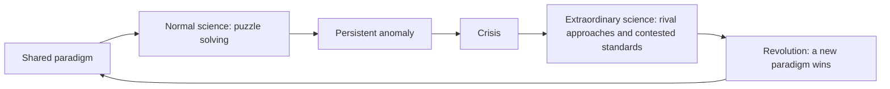

# Lecture 2: Kuhn on Scientific Practice

Thomas Kuhn's *The Structure of Scientific Revolutions* (1962, hereafter SSR) replaces the idealised picture of science with a historical and social one. Instead of asking only how scientific claims ought to be justified, Kuhn asks how scientific communities actually work. His central claim is that mature sciences usually develop through periods of stable, puzzle-solving "normal science", interrupted by crises and scientific revolutions. The lecture then asks whether science can remain rational and objective when theory choice involves values, communities, and historically changing standards.

> [!summary] Core thesis
> A scientific community works within a shared paradigm. Normal science solves the paradigm's puzzles; persistent anomalies can create a crisis, in which competing approaches are explored; a revolution occurs when a new paradigm becomes dominant. Because paradigms partly shape observation, meaning, and standards, changing paradigms cannot always be compared by a neutral algorithm. Rationality nevertheless remains possible through shared, though imprecise and sometimes conflicting, epistemic values.

## 1. Kuhn's historical turn

Kuhn (1922-1996) is a major opponent of logical empiricism and a key figure in the historical turn in philosophy of science. Logical empiricism concentrated on a normative ideal: the logical justification of scientific knowledge and a theory-neutral observational language. Kuhn argues that history is not merely anecdote or chronology. Studied seriously, it can transform our image of science.

The opening slide makes the shift visually: the phrases "Normative ideal of science" and "Justification of scientific knowledge" are struck through, and replaced by two questions: **How does science actually work? What do scientists do?** The aim is real science in its historical context, not an ideal picture of science.

The course timeline shown across the top of the slide places Kuhn in the sequence of positions covered in the course:

| Period | Position |
|---|---|
| 1924-1938 | Vienna Circle; Popper |
| 1950 | Quine (building on Duhem) |
| 1960 | Kuhn |
| 1970 | Science and technology studies; feminism; explanation |
| 1980 | Postcolonialism; constructive empiricism |

Popper's and Lakatos's work is in dialogue with Kuhn (see [[PhilSci-L01b - Popper and Lakatos]]), and the logical empiricism he opposes is the subject of [[PhilSci-L01 - Introduction and Logical Empiricism]].

His position has five connected features (the first four are the slide's own list of his contributions):

- **History matters**: philosophy should examine actual episodes of scientific change, not a sanitised reconstruction of mature science.
- **Science is dynamic**: a dynamical conception of the structure of science, which changes over time rather than accumulating facts under a permanently fixed method.
- **Critique of scientific progress**: the traditional picture of progress as steady accumulation of truths is put in question (see the problem of progress under incommensurability in section 4).
- **Observation is theory-laden**: observation and description are partly shaped by theoretical commitments, so scientists' commitments affect what they notice, describe, and count as significant evidence. This rejects the idea of a fully theory-neutral observational language.
- **Science is social**: paradigms, standards, training, criticism, and acceptance belong to scientific communities, not isolated individuals.

> [!quote] SSR's first sentence (Chapter 1, "A Role for History")
> History, if viewed as a repository for more than anecdote or chronology, could produce a decisive transformation in the image of science by which we are now possessed.

The methodological moral drawn on the slide: philosophers should study **real science** in its actual (historical) detail, not some idealised or simplified picture of it.

### Kuhn's critique of the positivist periodisation (Galison 1997)

The slide reproduces two figures from Peter Galison (1997) contrasting how the positivist and the Kuhnian (anti-positivist) pictures carve up the history of science. Both are horizontal timelines with time running left to right.

```
Figure 9.1  Positivist periodisation
  ... | theory1 | theory2 | theory3 | theory4 | ...     <- theory: broken into blocks
  ...  observation, experiment (one continuous band)  ...  <- observation: continuous
                        time ---->

Figure 9.4  Antipositivist periodisation (Kuhn)
  ... | observation1 || observation2 || observation3 || observation4 | ...
  ... | theory1      || theory2      || theory3      || theory4      | ...
                        time ---->          (breaks line up in both rows)
```

- **Positivist periodisation (Figure 9.1)**: the continuity and strength of the scientific picture come from the accumulation of empirical results. Observation and experiment form one unbroken band; theory can and does change dramatically as needed to accommodate the new data.
- **Antipositivist periodisation (Figure 9.4, Kuhn)**: inverts the positivist picture: theory comes first. It adds a further assumption: theory and observation are **co-periodised**, so every powerful change in theory carries with it a concomitant shift in the standards of observation. The breaks in the observation row line up with the breaks in the theory row.

The point for Kuhn: there is no continuous, theory-neutral observational base underneath theory change. When the paradigm changes, what counts as an observation changes with it.

Kuhn therefore differs both from the positivist story of steady cumulative progress and from a simple Popperian story in which scientists continuously try to falsify their theories. Popper, Lakatos, later science-and-technology studies, feminist philosophy of science, and postcolonial approaches all form part of the wider debate about this historical and social account.

## 2. Paradigms and normal science

> [!definition] Paradigm
> A **paradigm** is the shared framework through which a particular scientific community practises its science. It holds the community together by supplying not one theory alone, but principles, methods, standards, instruments, exemplary solutions, and often metaphysical assumptions.

The slide gives three points: a paradigm is (1) a framework for practising science, shared by the **scientific community** in a particular discipline; (2) it holds the community together, so science is a **social enterprise**; (3) its elements are theoretical principles, methods of investigation, standards, tools, *exemplars* and metaphysical assumptions (the list is open-ended). An **exemplar** is a concrete, standard problem-solution that students learn to imitate, such as the textbook cases below.

The components matter because a paradigm tells researchers what a legitimate problem is, how to investigate it, what a good solution looks like, and which results are worth pursuing. It is therefore both intellectual and practical.

### Newtonian physics as a paradigm

The Newtonian paradigm illustrates the full package:

| Paradigm element | Newtonian example |
|---|---|
| Theoretical principles | Newton's laws of motion, e.g. the second law $\sum \mathbf{F} = m\mathbf{a}$ |
| Methods | Newton's *regulae philosophandi* (rules of reasoning in natural philosophy) |
| Tools (listed on the slide under methods) | Differential equations and mathematical modelling |
| Exemplars | The Earth-Sun system and the harmonic oscillator |
| Metaphysical assumptions | Particular conceptions of absolute space and time, central to the Newton-Clarke/Leibniz debate |

The second law on the slide reads $\sum \mathbf{F} = m\mathbf{a}$: the vector sum of the forces $\mathbf{F}$ acting on a body equals its mass $m$ times its acceleration $\mathbf{a}$. The slide illustrates the harmonic-oscillator exemplar with a drawing of a block hanging from a coiled spring attached to a fixed ceiling: the standard mass-on-a-spring problem, where Hooke's restoring force $F=-kx$ inserted into the second law gives the oscillation equation $m\ddot{x} = -kx$. Learning to solve this kind of problem is how students absorb the paradigm.

> [!definition] Normal science
> **Normal science** is research conducted within an accepted paradigm. Its main activity is not testing whether the paradigm is true, but solving the puzzles that the paradigm defines.

A **puzzle** is a problem whose solution is expected in principle under the accepted framework. Scientists refine measurements, extend applications, articulate theory, and resolve apparent discrepancies. This makes normal science highly productive and allows detailed progress.

The price is conservatism. The paradigm is accepted unconditionally in normal science, and this is what **allows for progress**: because the foundations are not constantly reopened, researchers can go into detail. Critics of the paradigm are marginalised or dispelled by the community, and an anomaly reflects on the scientist, not on the paradigm: "only a poor workman blames his tools." Normal science is therefore **conservative** and seemingly **dogmatic**, which contrasts with Popper's ideal of permanent critical testing.

The slide ends with astrology as a point of comparison between Popper and Kuhn. Both agree that astrology is not a science, but for different reasons. Popper's reason is that it is not falsifiable in practice: its predictions are vague and failures are explained away. Kuhn's reason (developed in his reply to Popper, "Logic of Discovery or Psychology of Research?") is that astrology lacks a puzzle-solving tradition: its failed predictions did not generate puzzles that a community could work on to refine the tradition, so there was no normal science. (The slide only names the comparison; the two reasons are the standard reading of Popper and of Kuhn's reply.)

## 3. From anomaly to revolution

The basic Kuhnian cycle is:



The slide itself ("Kuhn's model of scientific development") draws the model as three stacked boxes joined by downward arrows, each box with two labels:

```
+-------------------------------------------+
|              NORMAL SCIENCE               |
|   paradigm                 puzzles        |
+-------------------------------------------+
                    |
                    v
+-------------------------------------------+
|                  CRISIS                   |
|   discussion on paradigm   anomalies      |
+-------------------------------------------+
                    |
                    v
+-------------------------------------------+
|                REVOLUTION                 |
|   new paradigm             puzzles        |
+-------------------------------------------+
```

Read it as: in normal science a paradigm defines puzzles; when puzzles turn into anomalies, the paradigm itself becomes a topic of discussion (crisis); a revolution installs a new paradigm, which defines a new set of puzzles, and normal science resumes. The mermaid diagram above closes the loop and adds the extraordinary-science stage from the next slide.

> [!definition] Anomaly
> An **anomaly** is a puzzle that persistently resists solution and appears inconsistent with the paradigm's expectations. Not every failed experiment is an anomaly: ordinary failures are normally blamed on error, poor technique, or incomplete work.

> [!definition] Crisis and extraordinary science
> A **crisis** arises when important anomalies undermine confidence in the paradigm. It has social and psychological as well as evidential dimensions. During **extraordinary science**, researchers entertain competing approaches and even the standards for judging theories become contested.

> [!definition] Scientific revolution
> A **scientific revolution** is a non-cumulative change in which a new paradigm replaces an older one. It changes central concepts, problems, methods, standards, and sometimes what counts as an observation or explanation.

### Worked example: chemistry and phlogiston

Kuhn represents the history of chemistry as a sequence (the slide shows three pictures above a three-cell table: a painting of a kneeling alchemist beside a glowing flask, a portrait of Priestley, and an engraved profile of Lavoisier):

1. **Preparadigmatic stage**: alchemy lacked one stable, community-wide framework.
2. **Phlogiston paradigm**: associated here with Joseph Priestley, combustion was understood through the release of phlogiston from burning bodies.
3. **Oxygen paradigm**: Antoine Lavoisier's account treated combustion as combination with oxygen, reorganising chemical concepts, measurements, and classification.

The point is not merely that Lavoisier added a new fact. The framework changed: the relevant substance, explanatory vocabulary, and interpretation of weight changes changed too. This is why Kuhn regards the shift as revolutionary rather than straightforward fact accumulation.

### Worked example: Ptolemy and Copernicus

The slide ("Revolution in astronomy") pairs a relief of Ptolemy at work beside a globe with a portrait of Copernicus, above a two-cell table: "Ptolemy: geocentric world-picture" and "Copernicus: heliocentric world-picture". Ptolemaic astronomy used a **geocentric** world-picture: Earth is stationary at the centre, and planetary motions are modelled accordingly. Copernican astronomy introduced a **heliocentric** world-picture: Earth is one of the planets moving around the Sun. The shift reorganised astronomical problems and the use of terms such as "planet". It was not an instant replacement, nor did the winner erase every rival, but it is Kuhn's paradigm case of revolutionary reorganisation.

## 4. Gestalt switches, theory-ladenness, and incommensurability

The slide exercise used ambiguous visual figures to make a conceptual point. In a Gestalt switch, one image can suddenly be seen as a different organised whole. The drawn lines do not change, but what the observer sees changes. Scientific revolutions are analogous: scientists come to see the world through a new pattern of concepts and practices. Related examples include the playing-cards experiment and the Müller-Lyer illusion.

### The in-class experiment ("An experiment with paradigms")

Slides 13 to 17 run a priming experiment on the audience with the classic ambiguous drawing known as "My Wife and My Mother-in-Law":

1. **Slide 14** shows, on the left of the screen, an unambiguous version: a **young woman** seen from behind in three-quarter profile, turned away, with curly hair, a headscarf, a necklace (choker) and a fur collar.
2. **Slide 15** shows, on the right of the screen, the other unambiguous version: an **old woman** in profile, with a large nose, a hooded headscarf and her chin sunk into her collar.
3. **Slide 16** shows the **ambiguous figure** in the centre. The same lines can be seen as either woman: the young woman's jaw and ear are the old woman's nose and eye, and the young woman's choker is the old woman's mouth.
4. **Slide 17** shows all three side by side: young woman, ambiguous figure, old woman.

The point of the placement is that different parts of the room were primed with different versions. Having seen one version first, people tend to see the ambiguous figure as that version, and may be unable to see the other until it is pointed out. The prior image plays the role of a paradigm: the same stimulus is organised into a different whole depending on what the viewer brings to it.

### Revolution as a Gestalt switch (slide 18)

The slide's own example is the **duck-rabbit**: a line drawing that can be seen as a duck facing right (the two long projections are its bill) or as a rabbit facing left (the same projections are its ears). Kuhn's phrase, used in the exam question on this slide, is that after a revolution "what were ducks in the scientist's world before the revolution are rabbits afterwards" (SSR, Chapter X).

The slide's argument:

- **Gestalt psychology**: humans observe patterns as wholes, and observation and interpretation are intertwined.
- In a Gestalt switch one flips between two ways of seeing the same image. **In a scientific revolution, scientists see the world in a new way.**
- There is no fully theory-neutral description of observation: observation is **theory-laden** (paradigm-dependent).
- What scientists observe, and what they take their observations to show, is partly **shaped by their conceptual and practical commitments**.

Why the comparison fits, in two parts: (1) a paradigm change is **sudden and holistic**, more like a conversion experience than a step-by-step inference, just as the duck turns into a rabbit all at once and not feature by feature; (2) it expresses Kuhn's **Gestalt-inspired view of observation**: what is seen depends on the conceptual framework brought to it, so observation is theory-laden. Kuhn also notes a limit of the analogy: in the psychology experiment the subject can switch back and forth and knows the lines on the page stayed the same, whereas the scientist has no external standpoint from which to check that the world stayed the same.

### Other examples (slide 19)

- **Playing-cards experiment** (Bruner and Postman, 1949, used by Kuhn in SSR). Subjects were shown playing cards in brief exposures, some of them anomalous. The slide shows two such cards: a **red six of spades** and a **black four of hearts**. At short exposures subjects identified the anomalous cards as normal ones (a red six of spades was reported as a six of hearts or a six of spades) without any sense of trouble. With longer exposures they hesitated and became confused, and eventually most came to see the cards correctly; a few never did. Kuhn reads this as a model of discovery: anomaly is at first not perceived at all, because expectation (the paradigm) shapes perception; it is recognised only against the background of that expectation, and only with effort.
- **Müller-Lyer illusion**. Two horizontal lines of **equal** length: one ends in arrowheads pointing outwards (`<---->`), the other in fins pointing outwards (`>----<`). The first looks shorter and the second looks longer. The slide cites Kahneman (2011), *Thinking, Fast and Slow*, where the point is that the illusion persists even after you have measured the lines and know they are equal: perception organises the stimulus automatically. (The persistence cuts both ways: philosophers such as Jerry Fodor later used it to argue that perception is partly insulated from belief, and so against strong theory-ladenness.)

This does **not** mean perception is arbitrary or that scientists literally inhabit different physical worlds. It means observation and interpretation are intertwined: what an observation is taken to show depends partly on a paradigm. Hence there is no completely theory-neutral description available to settle every revolutionary dispute from outside both paradigms.

> [!definition] Incommensurability
> **Incommensurability** is the failure of two paradigms to be fully measured against one another by a common language or fixed set of standards. Kuhn later softened the claim to **local untranslatability**: some terms cannot be translated into the other framework without loss of their inferential relations.

The slide illustrates where the word comes from with a right-angled isosceles triangle: two legs of length $1$ and a hypotenuse of length $\sqrt{2}$. In Greek mathematics two lengths are **commensurable** if some common unit fits a whole number of times into both. The side and the diagonal of a unit square are **incommensurable**: since $\sqrt{2}$ is irrational, there are no whole numbers $p, q$ with $\sqrt{2} = p/q$, so no unit, however small, measures both exactly. Kuhn borrows the term: two paradigms lack a common measure in the same sense, yet (like the side and the diagonal) they can still be related and compared, only not by a single shared unit.

```
              /|
      √2    /  |
          /    |  1
        /      |
      /________|
          1
```

Two forms are important:

- **Semantic incommensurability**: meanings change. "Mass" has different theoretical roles in Newtonian and Einsteinian physics; "planet" changes across the Copernican shift.
- **Methodological incommensurability**: standards change. What counts as a satisfactory explanation before Newton may differ from standards after Newton.

This creates the problem of scientific progress: if standards and meanings change, in what sense is a new paradigm objectively better? Kuhn's critics press exactly this question.

Kuhn's later reformulation, as the slide puts it: incommensurability is **local untranslatability**: some terms cannot be translated without loss, and there may be no translation that preserves all inferential relations. "Local" means the failure is confined to a cluster of interdefined terms (such as "mass", "force" and "energy" in mechanics), while most of the two languages remain intertranslatable, which leaves room for comparison.

## 5. Criticisms and Kuhn's response

Common criticisms are that Kuhn treats paradigm victory as irrational social victory, offers no clear demarcation criterion, uses words metaphorically and unclearly, above all "paradigm" (Margaret Masterman, *The Nature of a Paradigm*, 1970, identified 21 different uses of the word in SSR alone), and slides into relativism: there would be no objective criteria to judge progress. Lakatos accused him of vindicating "mob psychology" by comparing science with political revolutions. Kuhn's own *The Copernican Revolution* (1957) also stresses more continuity than SSR might lead one to expect. Moreover, as the slide puts it, a "winning" paradigm never eradicates all its competitors.

Kuhn rejects relativism and irrationalism, and insists that science is rational. In "Objectivity, Value Judgment, and Theory Choice" (the slide dates it "1974/7": given as a lecture before its 1977 publication in *The Essential Tension*), he identifies five shared values of theory appraisal, which he calls objective criteria:

1. **Accuracy**: agreement with observation within the theory's domain.
2. **Consistency**: internal coherence and coherence with other accepted theories.
3. **Broad scope**: consequences beyond the observations for which the theory was designed.
4. **Simplicity**: bringing order to phenomena.
5. **Fruitfulness**: opening new research and discoveries.

These are objective in the limited but important sense that a scientific community shares them. They are **values or norms, not algorithmic rules**. Each is imprecise, they can conflict, and scientists can reasonably assign different weights in light of experience. Thus rational disagreement is legitimate and can be required for progress: if everyone switched at once, competing possibilities would not be developed or tested.

The argument as the two slides on Kuhn (1977) set it out:

- Together, the five criteria provide "*the* shared basis for theory choice".
- However, the criteria are **individually imprecise**, so scientists apply them differently, and they **may conflict with one another**, so scientists rank them in different hierarchies (a theory can be more accurate but less simple, or broader in scope but less consistent with accepted theories).
- Therefore scientists committed to the same criteria may end up making different choices, caused partly by contextual factors. Theory choice is **not algorithmic**: previous experience as a scientist counts, and every choice is a mixture of shared and individual criteria.
- **Rational disagreement**, which is required for progress, is therefore possible and legitimate.

## 6. Facts and values in science

The second half of the lecture ("Values in science") covers three topics: the externality (triptych) and internality models, Kuhnian values, and Longino's contextual empiricism together with Heather Douglas.

Max Weber (1864-1920) defended the value-freedom of (social) science. His value-free ideal distinguishes:

- **Value relevance**: values may legitimately influence which research questions, priorities, and funding problems are selected.
- **Value freedom**: once a question is selected, researchers must not present their own commitments as empirical conclusions; empirical claims should be assessed by evidential and methodological standards.

This parallels the fact-value distinction between descriptive empirical statements and normative value judgements. Logical positivists similarly held that values express subjective attitudes rather than propositions: they draw a similar distinction between factual and evaluative statements, and for them value statements cannot be true or false.

The **externality** or **triptych** model divides science into three stages (Heather Douglas calls it the **externality model**, because values are kept outside the middle panel):

| Stage | Traditional value-free ideal |
|---|---|
| Research agenda: problems, priorities, funding | Values may enter |
| Scientific research | Value-free |
| Application and policy | Values may enter |

The slide attaches a question to each part: for **panels 1 and 3**, how do we make the right choices? For **panel 2**, can "pure" science be value-free?

The controversial question is the middle panel. **Epistemic values** serve cognitive aims of science: accuracy, consistency, explanatory power, scope, simplicity, fruitfulness, and perhaps beauty. **Non-epistemic values** include justice, social desirability, and political preferences. A weak value-free ideal permits non-epistemic values at agenda-setting and application, while allowing epistemic values in internal theory appraisal.

On panel 2, the logical positivists and Weber answer: no values at all. Many later authors argue that values can guide theory development and help choose between theories, which raises the slide's question: which of these values are acceptable, and why?

Since Kuhn's paper, the current debates turn on two issues: (1) the distinction between **epistemic (cognitive)** and **non-epistemic** values, where "epistemic" means conducive to the cognitive aims of science, for example accuracy or simplicity; and (2) **inductive risk** (section 8).

The **weak value-free ideal** is the revised version of the triptych model:

| Research agenda: problems, priorities, funding | Scientific research | Application of results and policy |
|---|---|---|
| May involve non-epistemic values | Epistemic values | May involve non-epistemic values |

The same two questions (panels 1 and 3: how to make the right choices; panel 2: can pure science be value-free?) still apply.

Kuhn's five values are generally understood as epistemic. They show that even internal theory choice is not mechanical: scientists sharing the same values may reasonably disagree because values are imprecise and may conflict.

## 7. Helen Longino: contextual empiricism

Longino and Douglas are presented together as **internality positions**: against the (weak) value-free ideal, they hold that non-epistemic values can sometimes play a legitimate role *within* scientific reasoning, not only in panels 1 and 3.

> [!definition] Contextual empiricism
> Helen Longino's **contextual empiricism** holds that data support a hypothesis only relative to background assumptions. Since these assumptions can contain non-epistemic commitments, values can affect scientific reasoning internally by affecting what is measured, modelled, compared, interpreted, or accepted as explanatory.

Longino does not conclude that science is merely subjective. Her answer is social objectivity: objectivity is achieved through **transformative criticism**, not by imagining an individual investigator free of all assumptions. Critical interaction can expose and revise background assumptions, including value-laden ones.

For a community's discourse to be objectively transformative, it needs four conditions:

1. **Recognised avenues for criticism**: there must be established ways to raise challenges.
2. **Shared standards**: critics need standards that participants can invoke in evaluating claims.
3. **Responsiveness to criticism**: criticism must receive uptake and be able to alter beliefs or practices.
4. **Equality of intellectual authority**: relevant members must be able to contribute as recognised epistemic agents.

The slide calls these the **normative criteria for objectivity**, equated with the transformative dimension of critical discourse, and closes with the question: **is the objectivity of science saved by social epistemology?**

### The social character of scientific knowledge

What Longino means by saying that objective scientific knowledge has a **social character** (this is mock exam question 5; the content below follows the reading, "Values and Objectivity", and the model answer, since the slide gives only the four criteria):

- Scientific knowledge is not produced by individuals applying a method in isolation. It is produced when the work of one individual is subjected to **critical emendation and modification by others**: at least two individuals must take part, and each round of criticism is transformative.
- Something becomes scientific knowledge by **surviving this process**: a claim that has been criticised from several points of view, and modified in response, is freed from the subjective preferences of any single investigator. Objectivity is a property of the community's practice, not of an individual's state of mind.
- The social mechanisms that secure it:
  - **Replication** of experiments, with variations.
  - **Peer review**, which brings another point of view on the phenomena, so that the authors' interpretation is checked for subjective preferences.
  - **Treatment after publication**: the refinement of new ideas and techniques by others.
  - **Absorption into the body of knowledge**: subsequent citation, use and modification by others.

Example: suppose a medical study treats a symptom as irrelevant, chooses a comparison group, or measures only a narrow outcome. These choices are background assumptions determining the evidential connection between data and hypothesis. A diverse, critical community can challenge them and improve the evidence, rather than simply adding a political preference to a conclusion.

## 8. Douglas and inductive risk

Heather Douglas distinguishes a **direct** from an **indirect** role for values. A direct role occurs when values determine a decision or course of action and is compatible with the externality picture. An indirect role can be legitimate inside science when evidence is uncertain and the consequences of error affect how much evidence is required to accept or reject a claim. This is **inductive risk**.

Values do not thereby become evidence for the hypothesis. Rather, where false positives and false negatives have different costs, epistemic and non-epistemic considerations can set the evidential threshold. This matters in regulatory science, public health, environmental science, and risk assessment.

| Question about values | Position it fits |
|---|---|
| Do values select research agendas or applications? | Externality / value-free ideal can allow this |
| Do values set a decision threshold under uncertainty? | Douglas: indirect internal role through inductive risk |
| Do values enter background assumptions shaping what counts as evidence? | Longino: contextual empiricism |

The third row, spelled out on the comparison slide: values can influence the **evidential connection between observations and hypotheses** because they enter the background assumptions that establish what counts as evidence or how data are interpreted: which variables are measured, which models are tested, which comparison groups are selected, and what counts as an explanation.

## Conclusion (the lecture's closing slide)

- **Kuhn**: paradigms organise normal science. Anomalies lead to crisis, extraordinary science and revolutions.
- This challenges the idea that theory choice is governed by an **algorithm** or by **theory-neutral observation**: scientific judgement depends on values, historical practices, and scientific communities.
- That raises the question: **how can scientific judgement nevertheless be rational and objective?**
- Later debates distinguish three roles for values:
  - **Epistemic values** in theory appraisal (Kuhn's five).
  - **Non-epistemic values** in decisions under uncertainty (Douglas, inductive risk).
  - **Contextual values** in background assumptions that influence evidential reasoning (Longino).

## Exam Focus

> [!tip] Mock exam question 4
> > Thomas Kuhn compares scientific revolutions, which consist in a change of paradigm, to visual "Gestalt switches", in which "what were ducks in the scientists' world before the revolution are rabbits afterwards". Explain why Kuhn makes this comparison.
>
> Model answer (two reasons, both needed):
>
> 1. **A revolution is a radical, sudden shift**: like a conversion experience, it makes one see the world in a different light all at once, not by piecemeal accumulation of new facts. The duck becomes a rabbit as a whole.
> 2. **It expresses his view of observation**, inspired by the Gestalt psychologists: observation is **theory-laden**. What scientists see, and what they take their observations to show, depends on the paradigm they bring to it, so after a revolution the same data are organised into a different whole.
>
> Support with the in-class experiment (young woman / old woman) or the playing-cards experiment, and name the consequence: there is no fully theory-neutral observation language to adjudicate between paradigms (incommensurability).

> [!tip] Mock exam question 5
> > What does Helen Longino mean by the statement that objective scientific knowledge has a "social character"? How does something become "scientific knowledge"? Give some examples of social mechanisms that secure objectivity.
>
> Model answer: knowledge becomes scientific through the participation of two or more individuals, in a process of **critical emendation and modification** of individual contributions; each such step is transformative. Examples of the mechanisms: **replication** of experiments with variations; **peer review**, which brings another point of view on the phenomena so that the interpretation is freed from subjective preferences; **treatment after publication** (refining new ideas and techniques); **absorption into knowledge** (subsequent citation, use and modification by others). (The model answer cites Curd & Cover pp. 175-176 in an older edition.)
>
> To add depth: tie this to contextual empiricism (data support a hypothesis only against background assumptions, which may be value-laden, so an individual cannot guarantee objectivity alone) and list the four conditions for transformative criticism: recognised avenues for criticism, shared standards, responsiveness to criticism, equality of intellectual authority.

## Exam-ready distinctions

- **Paradigm vs theory**: a paradigm is wider than a theory: it includes methods, tools, standards, exemplars, and assumptions.
- **Puzzle vs anomaly**: a puzzle is expected to be solvable within the paradigm; an anomaly is a persistent, paradigm-threatening failure.
- **Normal vs extraordinary science**: normal science accepts the framework and solves its puzzles; extraordinary science explores rivals in crisis.
- **Kuhn's values vs rules**: values guide theory choice but do not calculate one uniquely correct choice.
- **Kuhn vs relativism**: historical and social contingency does not eliminate rational appraisal because communities share epistemic values.
- **Douglas vs Longino**: Douglas concerns values' indirect role in setting thresholds under uncertainty; Longino concerns value-laden background assumptions and social conditions for objectivity.

> [!tip] Exam answer structure
> For a Kuhn question, state the cycle, define each stage, use one historical case, then explain why theory-ladenness and incommensurability challenge algorithmic comparison. Finish with Kuhn's five values as his non-relativist response. For values questions, distinguish agenda/application values, inductive-risk thresholds, and background assumptions before comparing Weber, Kuhn, Douglas, and Longino.

## Further reading

- Thomas Kuhn, *The Structure of Scientific Revolutions*.
- Kuhn, "The Nature and Necessity of Scientific Revolutions", pp. 79-93 in Curd & Cover.
- Helen Longino, "Values and Objectivity", pp. 144-164 in Curd & Cover.
- Stanford Encyclopedia of Philosophy, "Scientific Objectivity", section on epistemic and contextual values: https://plato.stanford.edu/entries/scientific-objectivity/#EpisContValu
- Also cited on the slides: Galison (1997) for the periodisation figures; Masterman, *The Nature of a Paradigm* (1970); Kuhn, *The Copernican Revolution* (1957); Kahneman (2011), *Thinking, Fast and Slow*.
- Next lecture: [[PhilSci-L03 - Under-determination]] (Quine's "On Empirically Equivalent Systems of the World" was assigned at the end of this lecture).

## Related course material

- [[PhilSci - Overview]]
- [[PhilSci - Overview|Course overview]]
