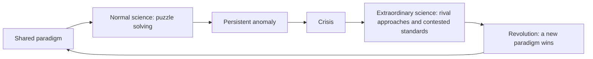

# Lecture 2: Kuhn on Scientific Practice

Thomas Kuhn's *The Structure of Scientific Revolutions* (1962, hereafter SSR) replaces the idealised picture of science with a historical and social one. Instead of asking only how scientific claims ought to be justified, Kuhn asks how scientific communities actually work. His central claim is that mature sciences usually develop through periods of stable, puzzle-solving "normal science", interrupted by crises and scientific revolutions. The lecture then asks whether science can remain rational and objective when theory choice involves values, communities, and historically changing standards.

> [!summary] Core thesis
> A scientific community works within a shared paradigm. Normal science solves the paradigm's puzzles; persistent anomalies can create a crisis, in which competing approaches are explored; a revolution occurs when a new paradigm becomes dominant. Because paradigms partly shape observation, meaning, and standards, changing paradigms cannot always be compared by a neutral algorithm. Rationality nevertheless remains possible through shared, though imprecise and sometimes conflicting, epistemic values.

## 1. Kuhn's historical turn

Kuhn (1922-1996) is a major opponent of logical empiricism and a key figure in the historical turn in philosophy of science. Logical empiricism concentrated on a normative ideal: the logical justification of scientific knowledge and a theory-neutral observational language. Kuhn argues that history is not merely anecdote or chronology. Studied seriously, it can transform our image of science.

His position has four connected features:

- **History matters**: philosophy should examine actual episodes of scientific change, not a sanitised reconstruction of mature science.
- **Science is dynamic**: its structure changes over time rather than accumulating facts under a permanently fixed method.
- **Observation is theory-laden**: scientists' theoretical commitments affect what they notice, describe, and count as significant evidence. This rejects the idea of a fully theory-neutral observational language.
- **Science is social**: paradigms, standards, training, criticism, and acceptance belong to scientific communities, not isolated individuals.

Kuhn therefore differs both from the positivist story of steady cumulative progress and from a simple Popperian story in which scientists continuously try to falsify their theories. Popper, Lakatos, later science-and-technology studies, feminist philosophy of science, and postcolonial approaches all form part of the wider debate about this historical and social account.

## 2. Paradigms and normal science

> [!definition] Paradigm
> A **paradigm** is the shared framework through which a particular scientific community practises its science. It holds the community together by supplying not one theory alone, but principles, methods, standards, instruments, exemplary solutions, and often metaphysical assumptions.

The components matter because a paradigm tells researchers what a legitimate problem is, how to investigate it, what a good solution looks like, and which results are worth pursuing. It is therefore both intellectual and practical.

### Newtonian physics as a paradigm

The Newtonian paradigm illustrates the full package:

| Paradigm element | Newtonian example |
|---|---|
| Theoretical principles | Newton's laws of motion, including $F=ma$ |
| Methods | Newton's *regulae philosophandi* (rules of reasoning in natural philosophy) |
| Tools | Differential equations and mathematical modelling |
| Exemplars | The Earth-Sun system and the harmonic oscillator |
| Metaphysical assumptions | Particular conceptions of absolute space and time, central to the Newton-Clarke/Leibniz debate |

> [!definition] Normal science
> **Normal science** is research conducted within an accepted paradigm. Its main activity is not testing whether the paradigm is true, but solving the puzzles that the paradigm defines.

A **puzzle** is a problem whose solution is expected in principle under the accepted framework. Scientists refine measurements, extend applications, articulate theory, and resolve apparent discrepancies. This makes normal science highly productive and allows detailed progress.

The price is conservatism. The paradigm is accepted largely unconditionally; criticism of it is often marginalised, and failure is initially attributed to the scientist rather than the framework: "only a poor workman blames his tools." Kuhn calls normal science seemingly dogmatic, which contrasts with Popper's ideal of permanent critical testing. This also complicates comparisons such as astrology: Kuhn asks whether it has a puzzle-solving tradition and stable community, whereas Popper focuses on falsifiability.

## 3. From anomaly to revolution

The basic Kuhnian cycle is:

> [!definition] Anomaly
> An **anomaly** is a puzzle that persistently resists solution and appears inconsistent with the paradigm's expectations. Not every failed experiment is an anomaly: ordinary failures are normally blamed on error, poor technique, or incomplete work.

> [!definition] Crisis and extraordinary science
> A **crisis** arises when important anomalies undermine confidence in the paradigm. It has social and psychological as well as evidential dimensions. During **extraordinary science**, researchers entertain competing approaches and even the standards for judging theories become contested.

> [!definition] Scientific revolution
> A **scientific revolution** is a non-cumulative change in which a new paradigm replaces an older one. It changes central concepts, problems, methods, standards, and sometimes what counts as an observation or explanation.

### Worked example: chemistry and phlogiston

Kuhn represents the history of chemistry as a sequence:

1. **Preparadigmatic stage**: alchemy lacked one stable, community-wide framework.
2. **Phlogiston paradigm**: associated here with Joseph Priestley, combustion was understood through the release of phlogiston from burning bodies.
3. **Oxygen paradigm**: Antoine Lavoisier's account treated combustion as combination with oxygen, reorganising chemical concepts, measurements, and classification.

The point is not merely that Lavoisier added a new fact. The framework changed: the relevant substance, explanatory vocabulary, and interpretation of weight changes changed too. This is why Kuhn regards the shift as revolutionary rather than straightforward fact accumulation.

### Worked example: Ptolemy and Copernicus

Ptolemaic astronomy used a **geocentric** world-picture: Earth is stationary at the centre, and planetary motions are modelled accordingly. Copernican astronomy introduced a **heliocentric** world-picture: Earth is one of the planets moving around the Sun. The shift reorganised astronomical problems and the use of terms such as "planet". It was not an instant replacement, nor did the winner erase every rival, but it is Kuhn's paradigm case of revolutionary reorganisation.

## 4. Gestalt switches, theory-ladenness, and incommensurability

The slide exercise used ambiguous visual figures to make a conceptual point. In a Gestalt switch, one image can suddenly be seen as a different organised whole. The drawn lines do not change, but what the observer sees changes. Scientific revolutions are analogous: scientists come to see the world through a new pattern of concepts and practices. Related examples include the playing-cards experiment and the Müller-Lyer illusion.

This does **not** mean perception is arbitrary or that scientists literally inhabit different physical worlds. It means observation and interpretation are intertwined: what an observation is taken to show depends partly on a paradigm. Hence there is no completely theory-neutral description available to settle every revolutionary dispute from outside both paradigms.

> [!definition] Incommensurability
> **Incommensurability** is the failure of two paradigms to be fully measured against one another by a common language or fixed set of standards. Kuhn later softened the claim to **local untranslatability**: some terms cannot be translated into the other framework without loss of their inferential relations.

Two forms are important:

- **Semantic incommensurability**: meanings change. "Mass" has different theoretical roles in Newtonian and Einsteinian physics; "planet" changes across the Copernican shift.
- **Methodological incommensurability**: standards change. What counts as a satisfactory explanation before Newton may differ from standards after Newton.

This creates the problem of scientific progress: if standards and meanings change, in what sense is a new paradigm objectively better? Kuhn's critics press exactly this question.

## 5. Criticisms and Kuhn's response

Common criticisms are that Kuhn treats paradigm victory as irrational social victory, offers no clear demarcation criterion, uses "paradigm" too loosely (Margaret Masterman identified 21 uses in one book), and slides into relativism. Lakatos accused him of vindicating "mob psychology" by comparing science with political revolutions. Kuhn's own *The Copernican Revolution* (1957) also stresses more continuity than SSR might lead one to expect. Moreover, a winning paradigm rarely eradicates every competitor.

Kuhn rejects relativism and irrationalism. In "Objectivity, Value Judgment, and Theory Choice" (1977), he identifies five shared values for theory appraisal:

1. **Accuracy**: agreement with observation within the theory's domain.
2. **Consistency**: internal coherence and coherence with other accepted theories.
3. **Broad scope**: consequences beyond the observations for which the theory was designed.
4. **Simplicity**: bringing order to phenomena.
5. **Fruitfulness**: opening new research and discoveries.

These are objective in the limited but important sense that a scientific community shares them. They are **values or norms, not algorithmic rules**. Each is imprecise, they can conflict, and scientists can reasonably assign different weights in light of experience. Thus rational disagreement is legitimate and can be required for progress: if everyone switched at once, competing possibilities would not be developed or tested.

## 6. Facts and values in science

Max Weber's value-free ideal distinguishes:

- **Value relevance**: values may legitimately influence which research questions, priorities, and funding problems are selected.
- **Value freedom**: once a question is selected, researchers must not present their own commitments as empirical conclusions; empirical claims should be assessed by evidential and methodological standards.

This parallels the fact-value distinction between descriptive empirical statements and normative value judgements. Logical positivists similarly held that values express subjective attitudes rather than propositions.

The **externality** or **triptych** model divides science into three stages:

| Stage | Traditional value-free ideal |
|---|---|
| Research agenda: problems, priorities, funding | Values may enter |
| Scientific research | Value-free |
| Application and policy | Values may enter |

The controversial question is the middle panel. **Epistemic values** serve cognitive aims of science: accuracy, consistency, explanatory power, scope, simplicity, fruitfulness, and perhaps beauty. **Non-epistemic values** include justice, social desirability, and political preferences. A weak value-free ideal permits non-epistemic values at agenda-setting and application, while allowing epistemic values in internal theory appraisal.

Kuhn's five values are generally understood as epistemic. They show that even internal theory choice is not mechanical: scientists sharing the same values may reasonably disagree because values are imprecise and may conflict.

## 7. Helen Longino: contextual empiricism

> [!definition] Contextual empiricism
> Helen Longino's **contextual empiricism** holds that data support a hypothesis only relative to background assumptions. Since these assumptions can contain non-epistemic commitments, values can affect scientific reasoning internally by affecting what is measured, modelled, compared, interpreted, or accepted as explanatory.

Longino does not conclude that science is merely subjective. Her answer is social objectivity: objectivity is achieved through **transformative criticism**, not by imagining an individual investigator free of all assumptions. Critical interaction can expose and revise background assumptions, including value-laden ones.

For a community's discourse to be objectively transformative, it needs four conditions:

1. **Recognised avenues for criticism**: there must be established ways to raise challenges.
2. **Shared standards**: critics need standards that participants can invoke in evaluating claims.
3. **Responsiveness to criticism**: criticism must receive uptake and be able to alter beliefs or practices.
4. **Equality of intellectual authority**: relevant members must be able to contribute as recognised epistemic agents.

Example: suppose a medical study treats a symptom as irrelevant, chooses a comparison group, or measures only a narrow outcome. These choices are background assumptions determining the evidential connection between data and hypothesis. A diverse, critical community can challenge them and improve the evidence, rather than simply adding a political preference to a conclusion.

## 8. Douglas and inductive risk

Heather Douglas distinguishes a **direct** from an **indirect** role for values. A direct role occurs when values determine a decision or course of action and is compatible with the externality picture. An indirect role can be legitimate inside science when evidence is uncertain and the consequences of error affect how much evidence is required to accept or reject a claim. This is **inductive risk**.

Values do not thereby become evidence for the hypothesis. Rather, where false positives and false negatives have different costs, epistemic and non-epistemic considerations can set the evidential threshold. This matters in regulatory science, public health, environmental science, and risk assessment.

| Question about values | Position it fits |
|---|---|
| Do values select research agendas or applications? | Externality / value-free ideal can allow this |
| Do values set a decision threshold under uncertainty? | Douglas: indirect internal role through inductive risk |
| Do values enter background assumptions shaping what counts as evidence? | Longino: contextual empiricism |

## Exam-ready distinctions

- **Paradigm vs theory**: a paradigm is wider than a theory: it includes methods, tools, standards, exemplars, and assumptions.
- **Puzzle vs anomaly**: a puzzle is expected to be solvable within the paradigm; an anomaly is a persistent, paradigm-threatening failure.
- **Normal vs extraordinary science**: normal science accepts the framework and solves its puzzles; extraordinary science explores rivals in crisis.
- **Kuhn's values vs rules**: values guide theory choice but do not calculate one uniquely correct choice.
- **Kuhn vs relativism**: historical and social contingency does not eliminate rational appraisal because communities share epistemic values.
- **Douglas vs Longino**: Douglas concerns values' indirect role in setting thresholds under uncertainty; Longino concerns value-laden background assumptions and social conditions for objectivity.

> [!tip] Exam answer structure
> For a Kuhn question, state the cycle, define each stage, use one historical case, then explain why theory-ladenness and incommensurability challenge algorithmic comparison. Finish with Kuhn's five values as his non-relativist response. For values questions, distinguish agenda/application values, inductive-risk thresholds, and background assumptions before comparing Weber, Kuhn, Douglas, and Longino.

## Further reading

- Thomas Kuhn, *The Structure of Scientific Revolutions*.
- Kuhn, "The Nature and Necessity of Scientific Revolutions", pp. 79-93 in Curd & Cover.
- Helen Longino, "Values and Objectivity", pp. 144-164 in Curd & Cover.
- Stanford Encyclopedia of Philosophy, "Scientific Objectivity", section on epistemic and contextual values.

## Related course material

- [[PhilSci - Overview]]
- [[Kuhn course index note|Course index note]]
