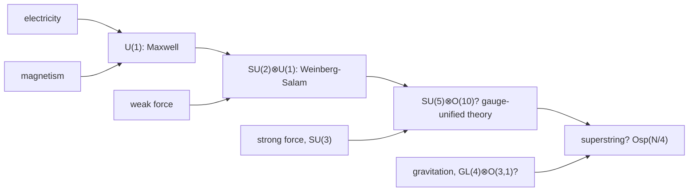

# PhilSci-L04: Scientific Explanation and Scientific Understanding

> [!abstract] Overview
> Why is the shadow of the flagpole 12 metres long? Because the pole is this tall and the sun is at that angle. Fine. Now: why is the flagpole this tall? Because its shadow is 12 metres long and the sun is at that angle. The second answer is absurd, and the most influential theory of explanation of the twentieth century cannot tell you why.
>
> The lecture has two halves. **Part A** is about *explanation*: Hempel's deductive-nomological model, which says to explain is to deduce from laws, the objections that killed it, and the two big replacements (causation and unification), plus van Fraassen's claim that explanation is not part of science at all. **Part B** is about *understanding*: whether "understanding" is anything more than having an explanation, and De Regt and Dieks's answer that it is a *skill*, the ability to use a theory, measured by whether you can see what it implies without calculating.
>
> Part A is examined directly: mock exam question 7 is Hempel's model plus one objection. Part B has no mock question, but it takes up half the deck and the whole second half of tutorial 4, and the week's optional reading (De Jong and De Haro on technological understanding) is by the course coordinator, so do not skip it.

## Part A: Scientific explanation

## 1. How explanation became a philosophical topic

**Before 1948**, the idea that science *explains* phenomena was not a topic the logical empiricists took seriously. The reasons are worth knowing, because the whole D-N model is shaped by them.

- **Aristotle's** theory of the four causes is really a theory about the *structure of explanations* (the reading comes from Moravcsik). So "explanation" arrived in philosophy already tangled up with causes and essences.
- **Duhem** associated explanation with metaphysics. To explain is to claim to know what is really behind the appearances, and that "gives hostages to fortune": it makes science dependent on metaphysics. "Atoms exist" and "there is an aether" are, for him, metaphysical claims that science can neither confirm nor refute. So explanation is not the job of physics. (This is the same Duhem as in [[PhilSci-L03 - Under-determination]].)
- **Carnap** rejects "metaphysical causes" and metaphysical why-questions of the kind he finds in Hegel: these are pseudo-explanations, in the same way metaphysical statements are pseudo-statements (see [[PhilSci-L01 - Introduction and Logical Empiricism]]). But he admits a respectable **"empiricist explanation"**.
- For the **logical empiricists**, that respectable kind of explanation is closely linked with **prediction from laws**.

**1948:** Carl Hempel and Paul Oppenheim publish the **covering law model**. The lecturer calls it a "philosophically light" (epistemic) account of explanation: it says nothing about hidden causes or essences, only about the logical relation between statements.

> [!intuition] Why "light" was the point
> Godfrey-Smith's reading puts it well: the positivists "made peace with the idea that science explains" by construing explanation "in a low-key way that fitted into their empiricist picture". An explanation, on this view, is just an argument. Nothing metaphysical is smuggled in. That is exactly what makes it attractive to an empiricist, and, as section 3 shows, exactly what makes it fail.

## 2. Hempel's deductive-nomological model

### The definition

> [!definition] Deductive-nomological (D-N) explanation
> An **explanation** is a deductive argument in which the **explanandum** (the phenomenon or law to be explained) is deduced from premises containing **general laws** and **particular facts and initial/boundary conditions** (together, the **explanans**).

Terminology, since the exam uses it: if we ask "why $X$?", $X$ is the **explanandum**. If we answer "because $Y$", $Y$ is the **explanans**.

> [!formula] The D-N schema
> $$\begin{array}{lll} \textit{Explanans:} & C_1, C_2, \dots, C_k & \text{particular facts / conditions} \\ & L_1, L_2, \dots, L_r & \text{general laws} \\ \hline \textit{Explanandum:} & E & \text{phenomenon} \end{array}$$

where:
- $C_1, \dots, C_k$: statements of particular facts, initial conditions or boundary conditions
- $L_1, \dots, L_r$: statements of general laws
- the horizontal line: logical deduction
- $E$: the statement describing the phenomenon to be explained

The name: **deductive** because we go from premises to a conclusion that follows logically; **nomological** because it uses laws of nature (Greek *nomos*, law). This is the deductive variant of the more general **covering law model**: the phenomenon is "covered" by a law.

### The four conditions of adequacy

For the argument to count as an explanation:

1. The explanandum must be a **logical consequence** of the explanans.
2. The explanans must contain a **general law**, and must use it in an **essential** way (it is indispensable: remove it and the deduction fails).
3. The explanans must have **empirical content**: it must be capable, at least in principle, of test by experiment or observation.
4. The explanans must be **true**.

Conditions 1 to 3 are logical. Condition 4 is empirical. Godfrey-Smith's gloss: the first task is to say what *sort* of statements would explain if true; truth is then needed for the explanation to be good "in the fullest sense".

### The inductive-statistical variant

The covering law model also has an **inductive-statistical (I-S)** version, for when at least one of the laws is **probabilistic**. The explanandum is then a true singular fact whose **high probability** is shown by the explanans. The argument is not deductively valid, but it makes the explanandum highly expected.

### Worked example: the front door

The lecturer's example. *Lately I have difficulty opening and closing my front door. Why?*

> [!example] A D-N explanation
> $$\begin{array}{ll} C_1: & \text{My front door is made of wood.} \\ L_1: & \text{Wooden objects expand if humidity increases.} \\ C_2: & \text{Humidity has increased this autumn.} \\ \hline E: & \text{My front door has expanded this autumn.} \end{array}$$

Everything the model asks for is there: a law ($L_1$) used essentially, particular conditions ($C_1, C_2$), empirical content, a valid deduction.

The point the slide draws from it: **Hempel holds that explanation and prediction are symmetric. They have the same logical structure.** Had I known in summer that the door is wooden and that humidity would rise, I could have *predicted* the sticking door with exactly the same argument. The only difference between explaining and predicting is whether you already know the conclusion is true.

### Worked example: chemistry from the periodic table

Given the periodic table and the laws governing electrons in atoms, plus additional empirical assumptions about the composition of materials, we can deduce properties of chemical substances:

- the **low chemical reactivity of the noble gases** (a full outer shell),
- the **high electrical conductivity of metals** (loosely bound outer electrons).

The slide shows the standard 18-column periodic table (periods 1 to 7, lanthanides and actinides below) as the "law" doing the work. This is D-N explanation of *regularities*, not just of single events: a law (or a pattern) can itself be an explanandum. Godfrey-Smith's example of the same kind is Newton explaining Kepler's laws from the laws of mechanics plus facts about the solar system.

### Comments on Hempel's model

- **Laws do not need to be causal.** Functional laws are admitted: $PV = nRT$ explains without saying that pressure *causes* volume or the reverse.
- **The model is normative.** It is not meant to *describe* how scientists actually explain, but to state the ideal of a **good scientific explanation**. The analogy is the logician's concept of **proof**: mathematicians rarely write fully formal proofs, and that does not make the formal concept of proof useless.
- **Elliptically formulated explanations.** Scientists often give **incomplete** explanations, leaving laws or conditions implicit. Hempel counts these as abbreviations of a full D-N argument, rather than counterexamples to it.

## 3. Objections to the D-N model

Three objections, all of which appear in the mock exam's model answer.

### Objection 1: asymmetry

> [!warning] Asymmetry of explanations, but (sometimes) symmetry of deductions
> Deductions can often be run in both directions. Explanations cannot. So the D-N model, which is *only* about deduction, lets in explanations that are obviously backwards.

**The flagpole.** The slide's figure shows a flagpole with the sun behind it: a dashed ray from the sun grazes the top of the pole and hits the ground at the tip of the shadow, at an elevation angle of about $30°$, with the shadow along the ground marked in feet. Using trigonometry, the same laws support two deductions:

```
   Laws of optics                  Laws of optics
   Laws of geometry                Laws of geometry
   Position of the sun             Position of the sun
   Length of the flagpole          Length of the shadow
   ----------------------          ----------------------
   Length of the shadow            Length of the flagpole

   explains  (good)                predicts, but does not explain
```

In symbols, with $h$ the pole's height, $s$ the shadow's length and $\theta$ the sun's elevation: $s = h / \tan\theta$ and equally $h = s \tan\theta$. Both are valid D-N arguments. Both satisfy all four conditions of adequacy. Only the left one is an explanation: the pole explains the shadow, the shadow does not explain the pole. We can interchange flagpole and shadow **to predict, but not (always) to explain**.

Godfrey-Smith calls this "something close to a knockdown argument" and "the killer". The objection is due to Sylvain Bromberger (1966), with a slightly different example. Two further points from the reading:

- **Symptoms.** If only disease $D$ produces symptom $S$, you can infer $D$ from $S$ with a law. But a symptom never explains its disease. Prediction runs both ways; explanation only from $D$ to $S$.
- **Hempel's reply** was to bite the bullet: if his theory lets an explanation run both ways, both directions must be fine. That is defensible for some cases in physics where the direction is genuinely unclear, and hopeless for the flagpole. (The one exception Godfrey-Smith allows: a very unusual flagpole designed to regulate its own height to cast a shadow of a particular length. Then the shadow, as a goal, does explain the height.)

### Objection 2: irrelevance

An argument can satisfy the D-N conditions while containing **irrelevant information that robs it of explanatory power**.

> [!example] Hexed salt (Salmon, Achinstein)
> $$\begin{array}{ll} L: & \text{Every sample of sodium chloride hexed by a magician dissolves in water.} \\ C_1: & \text{This sample was hexed by a magician.} \\ C_2: & \text{This sample was placed in water.} \\ \hline E: & \text{This sample dissolved.} \end{array}$$
>
> The law is true (every sample of salt dissolves, hexed or not). The deduction is valid. But the hexing explains nothing. The D-N model has no way to rule out premises that are true and used, but explanatorily irrelevant.

A second standard example from the same literature, not on the slides: "Every man who regularly takes birth-control pills fails to get pregnant. John takes them. So John did not get pregnant." Valid, lawlike, true and irrelevant.

### Objection 3: correlation is not explanation

> [!example] The barometer
> $$\begin{array}{ll} L: & \text{If the barometer drops, a storm will occur.} \\ C: & \text{The barometer drops.} \\ \hline E: & \text{A storm will occur.} \end{array}$$
>
> This is an excellent *prediction*. It is not an explanation: the barometer does not cause the storm. Both are effects of a common cause, the drop in atmospheric pressure. **Correlation $\neq$ explanation.** Showing that something was *to be expected* is not the same as showing *why* it happened.

The mock answer phrases this as "apparently missing causation (correlation or expectation $\neq$ explanation)". It also lists a fourth objection that follows from the same line of thought: **explanations do not always involve laws**. Citing a causally relevant fact can be enough ("the window broke because the ball hit it"), with no law in sight.

The reading adds a problem for the I-S version: good explanations need not confer high probability. Paresis is explained by untreated syphilis, even though only a minority of untreated syphilis cases develop paresis. So "showing the explanandum was highly probable" is neither necessary nor sufficient.

> [!summary] Where all three objections point
> In every case, what is missing is **causation**. The pole causes the shadow, not the reverse. The hex causes nothing. The barometer and the storm share a cause. That is the lead the first alternative theory follows.

## 4. Alternative theories of explanation

The slide lists four directions:

1. Explanation related to **causation**: good explanations show what caused the phenomena.
2. Explanation related to **unification**: good explanations show how the phenomena fit into a broader pattern.
3. Explanation is **pragmatic**: it depends on the *context* whether answers to why-questions are satisfactory explanations.
4. Distinguish **scientific explanation** (which requires a scientific theory) from explanation in daily life.

### 4.1 Causal theories of explanation

> [!definition] Causal theory of explanation
> **Explanation = uncovering the causes of phenomena.** "Causal processes, causal interactions, and causal laws provide the **mechanisms** by which the world works; to understand why certain things happen, we need to see how they are produced by these mechanisms." (Wesley Salmon, 1984)

This solves the flagpole at once: sunlight hitting the pole causes the shadow, so the explanation runs pole to shadow.

The price is that you now need to say **what causality is**, which empiricists since Hume have regarded as suspect. Three families of answer:

| Theory | Causation is... | Names on the slide |
|---|---|---|
| **Regularity** | **Constant conjunction**: $C$ is regularly followed by $E$. This produces an **expectation** in us, not a necessary connection in nature | Hume |
| **Counterfactual** | Based on the intuition that **if the cause $C$ hadn't occurred, the effect $E$ wouldn't have occurred** | Hume (who states the idea in passing), J. Woodward |
| **Process** | One can identify **causal processes and interactions** in nature (think of a chain of falling dominoes, the slide's picture) | W. Salmon |

Note that the regularity theory brings the barometer problem straight back: barometer drops are constantly conjoined with storms.

### 4.2 Causal-mechanical explanation (Salmon)

- An explanation **situates the explanandum in a network or nexus of causal relations**, the causal structure of the world. To explain is to **systematically causally relate** the explanandum to other items.
- Example: "The water evaporated because heat was applied to it, and the van der Waals bonds between the molecules were broken." This **exhibits the causal structure**.
- Giving an explanation is **answering a why-question with "because..."**, hence citing the causes of the explanandum.

Two problems the lecturer raises:

1. **How do we distinguish causation from correlation?** This is **Hume's problem**, and the causal theory inherits it whole.
2. **Too narrow?** Perhaps not all explanations need to invoke causation (a point De Regt and Dieks press, see Part B). Explanations in quantum theory, or explanations of a law by a more general law, are hard to phrase causally.

Godfrey-Smith adds a refinement worth having: the idealised **complete** causal explanation of anything (Railton 1981) would contain its entire causal history in total detail. Nobody wants it or knows it. In practice, context determines which **relevant pieces** of the causal structure a good explanation needs to describe.

### 4.3 Unificationist theories of explanation

> [!definition] Unification
> Phenomena are explained by **fitting them into a broader pattern**. "Science advances our understanding of nature by showing us how to derive descriptions of many phenomena, using the same patterns of derivation again and again, and, in demonstrating this, it teaches us how to **reduce the number of types of facts we have to accept as ultimate** (or brute)." (Philip Kitcher, 1989)

- The idea was developed by **Michael Friedman (1974)** and **Kitcher (1981, 1989)**. Godfrey-Smith notes it was an "unofficial" theory inside logical empiricism all along, and "a good deal better than the official theory".
- Kitcher on understanding: it is "not simply a matter of reducing the 'fundamental incomprehensibilities' but of seeing **connections, common patterns**, in what initially appeared to be different situations".
- An explanation is a certain type of reasoning, an **argumentative pattern**: an argument that proceeds from some simple, unified principles to a multiplicity of (possibly miscellaneous) events.
- **Advantage:** it accounts for **non-causal explanations**, for example explanations in quantum theory.
- The flagpole, on Kitcher's view: our causal talk is a loose summary of deeper asymmetries in unification. Deriving shadows from poles belongs to a pattern that covers vastly more phenomena than deriving poles from shadows.
- Historical support: Darwin's theory of evolution and Newton's later work on matter were compelling to scientists before they made many specific new predictions, because of their **explanatory promise**, the ability to unify a great range of phenomena with a few principles.

The slide's two figures are both about physics unifying forces and theories.

**Figure 1, "How gauge theory unifies the fundamental forces of nature"**, a merging-lines diagram:



The figure also labels the electroweak step "Yang-Mills-Shaw", after the gauge theory it is built on. Each merge is a unification: electricity and magnetism into Maxwell's electromagnetism, U(1); that with the weak force into the electroweak theory of Weinberg and Salam, SU(2)⊗U(1); adding the strong force, SU(3), gives a hypothetical grand unified theory; adding gravity gives a hypothetical superstring theory. The question marks are on the slide: the last two steps are speculative.

**Figure 2, M-theory**, drawn as a six-pointed star with "M-theory" in the middle and the six known limits at its points: 11D supergravity, $E_8 \times E_8$ heterotic, $SO(32)$ heterotic, Type I, Type IIB, Type IIA. Five superstring theories and one supergravity theory, previously thought distinct, are presented as limits of one underlying theory. Unification as explanation in its purest form.

### 4.4 Causation or unification? Godfrey-Smith's contextualism

From the week's reading (Godfrey-Smith 2003, ch. 13), and the subject of tutorial 4:

- The two proposals have been treated as competitors ("does causation win or does unification win?"). That is a mistake. Much of the time explaining means describing causal mechanisms or histories; sometimes there are clear explanatory relations between patterns or principles where causal language is hard to apply, and unification does the work. Salmon eventually accepted unification as part of the story; Kitcher eventually accepted causation.
- That familiar **pluralism** is a step in the right direction, but Godfrey-Smith goes further. The mistake is to think there is **one** special explanatory relation, or a fixed short list of two or three.
- His view is **contextualism**: the standards for good explanation are **partially dependent on the scientific context**. Different fields, and the same field at different times, establish their own criteria. The standards in field A need not suffice in field B.
- This is Kuhn's view (1977), with Kuhn's example: did Newton's gravity explain falling bodies, given that it offered a mathematical law and no mechanism? Some said no; over time it became part of Newtonianism that the right kind of mathematical law **counts** as an explanation. (This is the same history as the gravitation case study in section 8.)
- It is not "anything goes". A conception of explanation can embed a **factual error**: if good explanations must cite God's will and there is no God, that conception is mistaken.
- So the covering law theory is dead **as a general account**, but some explanations really do have roughly its form. The mistake was applying it to every case.

### 4.5 Bas van Fraassen: explanation is pragmatic

Van Fraassen's position, from *The Scientific Image* (1980):

- Explanation and understanding belong to the **pragmatic dimension** of science. They are **contextual**: they depend on our aims and preferences.
- Explanation is part of the **reasons we may have to *accept* a theory** as useful for particular purposes (making predictions, answering questions).
- Explanations **do not add to our *beliefs* about the relation between the theory and the world**.
- So **to explain is not an epistemic aim of science**. It is a pragmatic dimension of **theory acceptance**.

The long quotation on the slide, in three moves:

1. **Duhem** argued that explanation is not an aim of science, and in retrospect **fostered the very explanation-mysticism he attacked**, by arguing that only metaphysical theories explain and that metaphysics is foreign to science. Fifty years later, once **Quine** had argued there is **no demarcation between science and philosophy**, and the ametaphysical stance of the positivists had run into trouble, a return to metaphysics became tempting: one noticed that **scientific activity does involve explanation**, and Duhem's argument was "deftly reversed" (science explains, so science involves metaphysics).
2. "Once you decide that explanation is something irreducible and special, the door is opened to elaboration by means of further concepts pertaining thereto, all equally irreducible and special." **Not everyone has joined this return to essentialism or neo-Aristotelian realism, but some eminent realists have.**
3. "The discussion of explanation went wrong at the very beginning when explanation was conceived of as a relationship like description: a relation between theory and fact. Really it is a **three-term relation, between theory, fact, and context**. An explanation is an answer... So **scientific explanation is not (pure) science but an application of science. It is a use of science to satisfy certain of our desires.**"

> [!warning] Two "pragmatic, contextual" views that are opposites
> Godfrey-Smith and van Fraassen both say explanation varies with context, and that is where the agreement ends. For **van Fraassen**, explanation is **external** to science: something people do *with* a theory to answer questions from outside scientific discussion, adding nothing to what we believe about the world. For **Godfrey-Smith**, explanation is **thoroughly internal** to science, and assessments of explanatory power are an important part of scientific reasoning, but different fields use different standards. Tutorial 4 asks exactly this ("is explanation a crucial notion for the inner workings of science, or rather something external to it?").

Why this matters later: van Fraassen's constructive empiricism (week 5) needs explanation to be non-epistemic, because otherwise **inference to the best explanation** would push him to believe in unobservables. Mock exam question 8 is Musgrave's reply to exactly this argument.

## Part B: Scientific understanding

## 5. Background views: is understanding anything over and above explanation?

### Hempel's eliminativism about understanding

> "Such expressions as 'realm of understanding' and 'comprehensible' do not belong to the vocabulary of logic, for they refer to the psychological and pragmatic aspects of explanation." (Hempel)

- **Explanation** is an **objective** relation between a theory $T$ and a phenomenon $P$.
- **Understanding** by a subject $S$ is **epistemically irrelevant**.
- "Pragmatic" is used **synonymously with "subjective"**.
- An investigation of understanding gives us knowledge of people's preferences and interests, not of the topic. It is **of interest to psychology, not philosophy**.

### Reductivism about understanding

The milder position: **explanation is understanding enough**, so there is no need for a separate theory of understanding.

- **Khalifa (2012):** understanding is a **form of knowledge**, reducible to explanation and cognate notions. Nevertheless **philosophically interesting**, which separates him from Hempel.
- **Lipton (2004):** "understanding is not some sort of super-knowledge, but simply more knowledge: knowledge of causes."
- **Trout (2002):** understanding as a *Eureka!* experience, the feeling of understanding, is the result of **cognitive biases**, for example overconfidence and hindsight. So the feeling is no guide to anything epistemic.

### Carnap (1939, 1947): three senses of "understanding"

"Understanding" is a vague word that requires explication. Three senses:

| Sense | What it is | Carnap's verdict |
|---|---|---|
| **1. Pragmatic** | **Capability of use** of a theory for the description and prediction of facts | Legitimate (1939) |
| **2. Subjective / metaphysical** | **Intuitive understanding**, the feeling of grasping | Rejected (1939) |
| **3. Epistemic** | To understand a language system is to **know its semantic rules / truth conditions**. Epistemic because it says what one must **know** to count as understanding | Legitimate (1947) |

Note that sense 1 is already close to where Part B ends up: understanding as the ability to *use* a theory. Even a logical empiricist allowed it.

### Two meanings of "pragmatic"

**Friedman (1974)** and **Woodward and Ross (2021)** point to an **equivocation** on "pragmatic" in Hempel and van Fraassen. Distinguish:

1. **"Subjective"**: varying with an individual's psychology.
2. **"Use(able) for certain aims"**: this is **compatible with an objective (inter-subjective) notion** of understanding.

On the second notion, **understanding can be an epistemic aim of science, achieved by adequate explanations**. Hempel's move from "pragmatic" to "epistemically irrelevant" only works if you read "pragmatic" in the first sense.

This leaves the question the rest of the lecture answers: **what is the relation between explanation and understanding?**

> [!tip] The quote the tutorial built a question around
> "Contra Hempel, van Fraassen, and Trout, we hold that the pragmatic nature of understanding is not inconsistent with it being epistemically relevant." (De Regt and Dieks, p. 141). This sentence is the whole of section 5 compressed: the three people named are the eliminativist, the pragmatist about explanation, and the bias reductivist, and the move that answers all three is the distinction between the two senses of "pragmatic".

## 6. Pragmatic theories of understanding

Requirements for understanding common to the various theories:

1. **Explanation**: there is a scientific explanation of the phenomenon, often in Hempel's sense. A bridge between phenomena and theory: a deduction, argument or model.
2. **Requirements of adequacy**: theoretical virtues or epistemic values, usually **internal consistency** and **empirical confirmation** (also: approximate truth).
3. **Useability**: it should be **possible to construct** adequate explanations.

The dividing line:

- Authors who **reduce** understanding to explanation accept only (1) and (2): **understanding = adequate explanation = knowledge**.
- Authors for whom understanding is **"more than"** explanation add (3).

So the discussion focusses on (3), and (3) is **not about *knowledge* but about the *ability to act or do***: it involves **skills and judgement**.

### Requirement (3) and objectivity: three levels

The worry about (3) is that skills belong to individuals, which makes understanding subjective again. To emphasise that (3) is objective, **De Regt and Dieks (2005)** distinguish three levels of analysis of the scientific community:

> "The **macro-level** of science as a whole; the **meso-level** of the scientific communities; and the **micro-level** of individual scientists... The three-level distinction reconciles the existence of **universal aims of science** with the existence of **variation** in the precise specification and/or application of these general aims."

```
MACRO   science as a whole          understanding is a universal aim of science
  │
MESO    scientific communities      standards of intelligibility are set HERE,
  │     (a discipline, a period)    and vary between communities
  │
MICRO   individual scientists       who have or lack the skills
```

- **Understanding is a macro-level (universal) aim** of science.
- **Standards of intelligibility** are not universally fixed for all of science: they vary across scientific communities, at the **meso-level** of a discipline.
- They are **objective, but relative to the level of progress** of a given discipline, that is, contextual. Not a matter of individual taste.

## 7. De Regt's contextual theory of understanding

### The grammar of understanding

> [!definition] The basic form
> **Scientist $S$ (in context $C$) understands phenomenon $P$ on the basis of theory $T$.**

Compare Hempel, for whom explanation is a two-place relation between $T$ and $P$. Understanding is at least four-place.

- Understanding is **pragmatic**: it involves a relation to a subject and a context.
- **Contextuality**: variation is possible. The same $T$ can yield understanding for one community and not another.

### Model-based explanation

Explanation in real science rarely goes straight from theory to phenomenon. It goes through a model:

$$T \sim M \sim P$$

- $T$: the theory
- $M$: a model that **represents $P$ such that $T$ can be applied to it**
- $P$: the phenomenon

There are **no algorithms and no strict rules for building models**. Instead: **approximation, idealisation and pragmatic decisions**. So $S$ needs **skills** for constructing $M$ to explain $P$.

> [!definition] Understanding
> **Understanding = the skill to use a theory for building models to explain phenomena.**

### Explaining phenomena requires intelligible theories

If $S$ wants to explain a phenomenon on the basis of $T$, she needs appropriate skills to use $T$. So **$T$ should be *intelligible* to $S$.**

> [!definition] Intelligibility
> **Intelligibility** = the value that scientists attribute to the qualities of a theory $T$ that facilitate the use of the theory.
> - Not an intrinsic property of theories, but a **context-dependent value related to scientists' skills**.
> - Example: **visualizability**.

### The two criteria

> [!formula] CUP: Criterion for Understanding Phenomena
> A phenomenon $P$ is **understood** scientifically **iff** there is an explanation of $P$ that is based on an **intelligible theory** $T$ and conforms to the basic epistemic values of **empirical adequacy** and **internal consistency**.
>
> Scientists often understand phenomena by constructing models of them (including simulations).

> [!formula] CIT: Criterion (test) for the Intelligibility of Theories
> A scientific theory $T$ (in one or more of its representations) is **intelligible** for scientists (in context $C$) if they can **recognise qualitatively characteristic consequences of $T$ without performing exact calculations** (or fully explicit theoretical argumentation).
>
> The idea is that scientists have an "insight" into the workings of the theory, and are accordingly able to use it to construct models of the phenomena that satisfy the basic values of empirical adequacy and internal consistency.

How the pieces fit: **CUP** says understanding a phenomenon needs an intelligible theory. **CIT** gives a test for when a theory is intelligible. The test is a skill test, and it is sensitive to $S$ and $C$.

> [!example] Passing the CIT
> The standard illustration is the kinetic theory of gases. A physicist who has the theory can say without calculating anything that heating a gas in a closed container will raise its pressure: the molecules move faster, hit the walls harder and more often. That qualitative, calculation-free prediction is what "intelligible" means here. Someone who can only get there by solving the equations has the theory but, by the CIT, does not find it intelligible.

> [!question] Does CIT make understanding subjective? (tutorial 4)
> No, and the three-level picture is the reason. The criterion is relative to scientists **in a context**, but the context is the **meso-level community** with its shared standards and trained skills, not one person's feelings. Whether a physicist can recognise qualitative consequences without calculating is a public, testable fact about her competence, which is exactly what Trout's "feeling of understanding" is not. The honest concession: it makes intelligibility **contextual** (relative to a community and its level of progress), and critics can press whether "contextual" collapses into "subjective" when communities disagree, as in the 1926 quantum case below.

Kinds of conceptual toolkit that help with qualitative reasoning, and the level they operate at (tutorial 4 asks for these): visualisation and diagrams (Feynman diagrams, the Bohr picture of the atom), causal-mechanical stories, analogies, thought experiments, toy models, and simulations. They are taught and shared within a discipline, which puts them at the **meso-level**; individuals at the micro-level have mastered them to different degrees.

## 8. Historically differing standards of intelligibility

Two case studies, making two different points:

| Case | Standards of intelligibility differ... |
|---|---|
| **Theories of gravitation**, Newton (1687) to Einstein (1915) | **Diachronically**: over time, historically |
| **Quantum theory** around 1926 | **Synchronically**: at the same time, between different scientists |

### Case 1: gravitation

**Newton's theory of gravitation (1687).** The slide's figure shows two masses $m_1$ and $m_2$ a distance $r$ apart, with forces $F_1$ and $F_2$ pointing towards each other. The force acts across empty space instantly: **action at a distance**.

$$F = G\,\frac{m_1 m_2}{r^2}$$

**Christiaan Huygens** found this unintelligible:

> "I look for an *understandable* cause of gravitation, because it seems to me that to say that bodies fall down because of some gravitational attraction, of earth or of those bodies, is to **say nothing**."

For Huygens, a Cartesian mechanist, the standard of intelligibility was **contact action**: bodies push bodies. A force across empty space was an occult quality.

**Around 1800**, the standard had flipped: **action at a distance becomes the ideal of understanding.** The example is **Coulomb's law**:

$$F = k\,\frac{q_1 q_2}{r^2}$$

The slide makes the point with a meme: Coulomb, in an exam hall, copying Newton's answer sheet. Same form, charges in place of masses. A theory was intelligible if it looked like Newton's.

**After 1850**, it flipped again. **Action by contact** (through a field) becomes acceptable again with **Maxwell**, and then **Einstein's theories of relativity (1905 and 1915)**, in which gravity is curvature of space-time rather than a force at a distance.

Same phenomenon, three standards of intelligibility in two and a half centuries. None of the theories changed their empirical content to cause this; the community's standards changed.

### Case 2: quantum mechanics around 1926

**Around 1926**, two competing theories of the atom:

- **Matrix mechanics** (Heisenberg, Pauli): **abstract**.
- **Wave mechanics** (Schrödinger): **visualizable**.

The **Schrödinger versus Pauli and Heisenberg debate** was about when a theory is visualizable, *anschaulich*.

**Background: 1920 to 1925, the loss of visualizability.**

- **Wave-particle duality**, of light (Einstein, 1905) and of matter (De Broglie, 1923): there is **no unambiguous visualization** and **no particle trajectories**.
- The **reality of electron orbits was disputed**. **Pauli's fourth quantum number** (spin, 1925) had no picture in the Bohr model, so **atoms were now completely non-visualizable**.
- Hence the search for a radically new **"quantum mechanics"** (the term is Born's).

The slide's figure is the **double-slit experiment**. A source of electrons or photons fires at a wall with two slits (1 and 2); behind it a backstop with a detector records where they land. With only one slit open you get single-humped distributions $P_1 = |\phi_1|^2$ and $P_2 = |\phi_2|^2$. With both open you do **not** get $P_1 + P_2$; you get an interference pattern with many fringes:

$$P_{12} = |\phi_1 + \phi_2|^2 \neq P_1 + P_2$$

```
source ──▷   wall with     backstop     pattern on the backstop
             slits 1, 2    + detector
                                        slit 1 only:  one broad hump   P1 = |φ1|²
                                        slit 2 only:  one broad hump   P2 = |φ2|²
                                        both open:    many fringes     P12 = |φ1 + φ2|²
                                                      (not P1 + P2)
```

No picture of a particle on a trajectory through one slit produces fringes. That is the loss of visualizability in one figure.

**Schrödinger on Heisenberg's matrix mechanics:**

> "I naturally knew about his theory, but was discouraged, if not repelled, by what appeared to me as very difficult methods of transcendental algebra, and by the lack of *Anschaulichkeit*."

*Anschaulichkeit*: visualisability, intelligibility. And physicists did find Schrödinger's theory easier to deal with, so it was more widely used.

**Schrödinger (1926) on scientific understanding:**

> "We cannot really alter our manner of thinking in space and time, and what we cannot comprehend within it we cannot understand at all."

**Pauli (1924), on the other side:**

> "... our good friend Kramers and his colorful picture books, 'and the children, they love to listen.' Even though the demand of these children for visualizability (*Anschaulichkeit*) is partly legitimate and healthy, this should never count as an argument for the retention of fixed conceptual systems in physics. Once the new conceptual systems are settled, then also these will be *anschaulich*."

Note what Pauli is saying: visualizability is not a fixed standard. New theories *become* intelligible once people have the skills to use them. That is De Regt's contextual theory in a 1924 letter.

**Visualizing the hydrogen atom.** The slide reproduces "Fig. 24, Modes of hydrogen atom" from C.G. Darwin, *The New Conception of Matter* (1931): greyscale blobs showing simple solutions of the hydrogen wave function, labelled by mode, for example (0,0,0) a small dot, (1,0,0) a dot with a ring, (2,0,0) a dot with two rings, (0,1,0) two lobes one above the other, (1,1,0) stacked lobes, (0,2,0) a lobe above and below with a band around the middle. The caption says the diagrams show the **intensity of vibration** at each place, and so indicate the **probability of finding the electron** there; each is to be rotated about a vertical axis, so (0,2,0) is a ring round the equator plus two lumps at the poles.

- **Schrödinger's realistic interpretation** of these as **charge densities** fails.
- Instead they are to be interpreted as **probability densities** (Born).

**Outcome of the debate:**

- Schrödinger's visualization was **problematic**.
- **Heisenberg went on to use visualizable concepts** (his 1927 uncertainty paper is literally titled after the *anschaulich* content of quantum kinematics: he redefined what visualizable should mean).
- Result: a new **quantum mechanics** that combined both theories, with other ingredients too: **Dirac's mathematical unification** and **Born's interpretation**.
- **Visualizability**, in this historical context, was valued as a property that **increases the intelligibility** of theories.
- **Context-dependence**: visualizability is **not necessary** for understanding. It is one tool, valued by some communities at some times.

## 9. Summary

- Hempel's **deductive-nomological model** of explanation: closely connected with **prediction from laws**. Objections: **asymmetry**, **irrelevance**, **expectation/correlation**.
- Alternative models: **causal-mechanistic** explanation, and **unification**.
- **Understanding** as knowledge or explanation (eliminativism, reductivism), and as **more than** explanation.
- **Pragmatic theories: explanation + use/abilities.** Scientific understanding of phenomena requires **intelligible theories**.
- **Intelligibility** is the value that scientists $S$, in a context $C$, ascribe to the properties of a theory $T$ that facilitate its use. It is **contextual**, as illustrated by the visualizability (*Anschaulichkeit*) of quantum mechanics.

## Key Takeaways

> [!tip] Exam Focus
> **This lecture is examined directly.** Mock exam question 7:
>
> > Carl Hempel's "deductive-nomological model" for a long time was the "received view" of scientific explanation. Briefly summarize Hempel's model, and give at least one argument *against* the model's being a satisfactory account of scientific explanation.
>
> A model answer, at the half-page the rubric asks for:
>
> > On Hempel's D-N model, an explanation is a deductive argument in which the explanandum (the phenomenon to be explained) is deduced from an explanans consisting of general laws together with particular facts and initial or boundary conditions. The explanans must contain at least one law, used essentially, must have empirical content, and must be true. On this model explanation and prediction have the same logical structure: to explain is to show that the phenomenon was to be expected given the laws.
> >
> > Objection (asymmetry): deductions run both ways, explanations do not. From the laws of optics, the sun's position and the height of a flagpole we can deduce the length of its shadow, which explains the shadow. But from the same laws and the shadow's length we can equally deduce the height of the pole, and the shadow does not explain the pole. Both arguments satisfy the D-N conditions, so the model cannot be sufficient. Further objections: irrelevance (salt hexed by a magician dissolves in water: valid, lawlike, and the hex explains nothing); correlation is not explanation (a falling barometer predicts a storm but does not explain it, since both have a common cause); and explanations need not cite laws at all, since citing a causally relevant factor can be enough.
>
> One objection argued well gets the marks; the asymmetry is the strongest one to lead with. Naming the barometer example is in the official answer, so have it ready as the second.
>
> **Also feeds question 8** (van Fraassen and Musgrave on explanation, a week 5 question). The part from this lecture: van Fraassen holds that explanation is pragmatic, a three-term relation between theory, fact and context, and so **not an epistemic aim of science** but an application of it.

> [!tip] What to be able to state cold for Part B
> 1. The **grammar**: $S$ in context $C$ understands $P$ on the basis of $T$.
> 2. **CUP** and **CIT**, near-verbatim. CIT's key phrase: *recognise qualitatively characteristic consequences of $T$ without performing exact calculations*.
> 3. **Understanding = skill** to use a theory to build models of phenomena ($T \sim M \sim P$).
> 4. The **two senses of "pragmatic"** (subjective versus useable for aims), and why the second lets understanding be epistemic.
> 5. One case: Huygens versus Newton, or Schrödinger versus Heisenberg and Pauli, as intelligibility standards varying **diachronically** or **synchronically**.

> [!warning] The distinction people blur
> **Explanation** is a relation between a theory and a phenomenon (two places for Hempel, three for van Fraassen: theory, fact, context). **Understanding**, for De Regt and Dieks, is an **achievement of a subject**, with four places ($S$, $C$, $P$, $T$). "Pragmatic" means "contextual and use-related" for De Regt and Dieks and "subjective, not epistemic" for Hempel. Using the word without saying which sense is the fastest way to lose the point.

## Links

- **Course:** [[PhilSci - Overview|Course overview]] · [[PhilSci - Tutorials|Tutorials]] (tutorial 4 is on this lecture's two readings)
- **Previous:** [[PhilSci-L01 - Introduction and Logical Empiricism]] (Carnap, the logical empiricist background) · [[PhilSci-L02 - Kuhn on Scientific Practice]] (Kuhn's paradigm-relative standards, which Godfrey-Smith's contextualism builds on) · [[PhilSci-L03 - Under-determination]] (Duhem)
- **Source:** `4 Scientific Explanation and Scientific Understanding.pdf` on Canvas (Enrico Cinti, 22 September 2026), uploaded 2026-09-24. Readings: Godfrey-Smith (2003), *Theory and Reality*, ch. 13 "Explanation" (on Canvas); De Regt and Dieks (2005), "A Contextual Approach to Scientific Understanding", *Synthese* 144 (library, not read for this note: its content here comes from the deck and the tutorial slides).
- **Further reading, from the deck:** Woodward and Ross, "Scientific Explanation", *Stanford Encyclopedia of Philosophy* · Reutlinger et al. (2018), "Understanding (with) Toy Models", *BJPS* · De Regt (2017), *Understanding Scientific Understanding*, Oxford University Press
