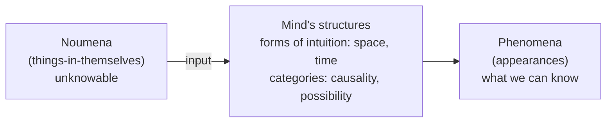
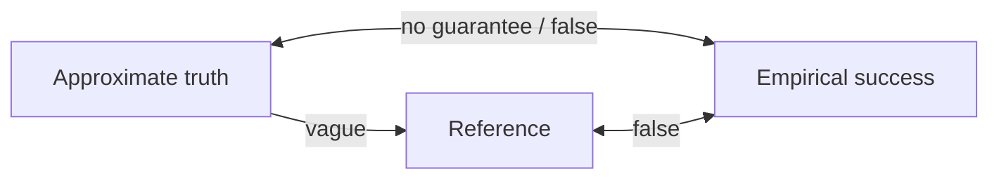

# PhilSci-L05: Scientific Realism and its Critiques

> [!abstract] Overview
> Physics says there is an electron. Nobody has ever seen one. Should you believe there is one anyway, or only that the theory gets every meter reading right?
>
> That is the scientific realism debate, which the lecturer calls "arguably *the* central debate in contemporary philosophy of science": pick any recent issue of any philosophy of science journal and something in it is about realism. The course gives it two weeks. This is the first.
>
> Four parts: **(1)** where the word "realism" comes from, from Berkeley and Kant to the logical positivists; **(2)** what scientific realism claims (three separate theses) and its two main arguments, the **no-miracles argument** and **inference to the best explanation**; **(3)** the best developed anti-realist alternative, **van Fraassen's constructive empiricism**; **(4)** the most influential argument against realism, **Laudan's pessimistic meta-induction**.
>
> The week was a **flipped classroom**: the lecture was pre-recorded (47 minutes, uploaded 24 Sep) and the Tuesday 29 Sep slot was a Zoom discussion. This note follows the deck and the recording together. Mock exam question 8 sits on this week's readings (van Fraassen against Musgrave on explanation), see the Exam Focus at the end.

---

## Part 1: Realism, historical background

### 1.1 The ontological question

Questions of realism are, in their most basic form, **ontological**: questions about what exists.

> [!definition] The ontological question
> Does the external world **exist independently of us**, of our thoughts and perceptions? Is the table in front of me there whether or not anyone perceives it?

| answer | name | who | claim |
|---|---|---|---|
| **Yes** | **Metaphysical realism** | Most philosophers from Plato to the present | Things and objects exist independently of the mind |
| **No** | **Idealism** | Berkeley | The world is mind-dependent. *Esse est percipi*: "to be is to be perceived". There is nothing more to a thing existing than its being perceived; what is not perceived does not exist |

The slide illustrates this with an expressionist painting of chairs in a dim, warm-red interior, the everyday objects whose independent existence is in question.

**Why idealism is not as silly as it sounds.** The lecturer gives it its due: our *only* access to anything beyond ourselves is through perception. So we have no way of checking whether anything exists beyond perception. Idealism is "the maximally empiricist possible answer": if you limit yourself strictly to what you can perceive and check, there is nothing beyond your perceptions. Considerations like this push people to look for a middle ground between metaphysical realism and idealism.

### 1.2 Kant's compromise: noumena and phenomena

Kant's middle ground is the most sophisticated historically. It moves from the ontological question to the **epistemological question**:

> [!definition] The epistemological question
> What **knowledge** of the external world can we have?

Kant's answer:

- There **is** an external reality, but we **cannot have knowledge of it** as it is in itself. These are the **things-in-themselves**, the **noumena**: the chair as it is independently of anyone perceiving it.
- We can only know the **appearances**, the **phenomena**: the chair as it appears to me.
- The phenomena are **structured by our mind**, by cognitive structures that exist prior to any input:
  - **Space and time** are **forms of intuition**: necessary conditions for perceiving anything at all.
  - **Categories** such as **causality** and **possibility** structure the phenomena at a higher, conceptual level.
- These structures are in us, not in the world, but they are **preconditions for the possibility of experience** and of knowledge. Because the input does ultimately come from the external world, learning about the phenomena is still learning about the world, not only about our perceptions. It is just always mediated and shaped by an architecture that is not itself in the world.



### 1.3 Eddington's two tables (1927)

Modern science makes the worry sharper. Sir Arthur Eddington, *The Nature of the Physical World* (1927), the introduction to his Gifford lectures. (The slide shows his *Time* magazine cover.)

> "I have settled down to the task of writing these lectures and have drawn up my two chairs to my two tables. [...] One of them has been familiar to me from earliest years. It is a commonplace object of that environment which I call the world. How shall I describe it? It has extension; it is comparatively permanent; it is coloured; above all it is substantial."

> "Table No. 2 is my scientific table. It is a more recent acquaintance and I do not feel so familiar with it. [...] My scientific table is mostly emptiness. Sparsely scattered in that emptiness are numerous electric charges rushing about with great speed; but their combined bulk amounts to less than a billionth of the bulk of the table itself."

> [!question] Eddington's question
> Which of the tables is **real**? The table we observe in daily life (solid, coloured, you can put a laptop on it, nothing passes through it)? Or the table as described by science, "almost emptiness"? Both? And how are they related?

The slide sets a photo of a wooden table beside a Bohr-style atom diagram (a nucleus of coloured balls with electrons on elliptical orbits).

This is where the shape of the realism debate becomes visible: it is a question about **which things we are committed to the existence of**, and as structured in which way.

### 1.4 Mach's radical empiricism

Ernst Mach (1838-1916) takes the extreme empiricist line:

- Claims about **unobservable reality are metaphysical**, and **cannot have a truth-value**. Unless you can observe directly, with your senses, whether something is true, you cannot decide whether it is true.
- Theories are **merely economical descriptions of our sensory experiences**: good tools for ordering the experiences we have had and predicting the ones we will have.
- This is the **instrumentalist conception of scientific theories**: theories are instruments, tools, not descriptions of a hidden reality.

The slide's image is Mach's famous self-portrait from *The Analysis of Sensations*: the visual field as seen from his left eye, framed by his eyebrow and nose, with his body stretched out on a chaise longue, his hand holding a pencil, and the room and window beyond. The world as it is actually given in sensation.

### 1.5 Logical positivism and logical empiricism

**Early logical positivists**, Carnap and Neurath in particular, were strict anti-realists in Mach's style, and in one respect more extreme: they tied not only truth but **meaning** to observability.

- **Verifiability theory of meaning:** claims about the existence of unobservable entities are not verifiable, **therefore meaningless**. Not false: neither true nor false, they just do not mean anything. (Full treatment in [[PhilSci-L01 - Introduction and Logical Empiricism]].)
- A **sharp theory-observation distinction**.
- **Theoretical sentences are introduced through observational sentences.**

The slide's diagram is the classic picture of a scientific theory from this tradition (Hempel's and Feigl's "net"):

```
   o───o───o───o          ← theoretical network: nodes are theoretical terms,
    \ / \ / \ / \            lines are the laws/postulates connecting them
     o───o───o───o
     ┆   ┆   ┆   ┆        ← dashed vertical lines: correspondence rules /
     ┆   ┆   ┆   ┆          interpretive links, tying some terms to observation
  ▓▓▓▓▓▓▓▓▓▓▓▓▓▓▓▓▓▓▓    ← the plane of observation (the "soil" of experience)
```

The theory floats above observation and is anchored to it only where the dashed lines reach down. A theoretical term gets whatever meaning it has from those anchors.

**Why the distinction has to be sharp.** If meaning stops at observability, you need a precise boundary between the theoretical and the observational, because meaning does not come in degrees: something cannot be "almost meaningful". So the positivist is committed to a line with no vagueness in it.

**Later logical empiricists gradually shifted to a more realist approach:**
- **Acceptance of semantics**: general and theoretical sentences can be true or false.
- **Verification replaced by confirmation**: instead of the stringent demand that a claim be verified to count as meaningful, a claim counts if there can be confirmation for it, which is a much broader notion.

### 1.6 The first realist attack: Maxwell (1962)

> [!definition] Maxwell's objection
> The **theory-observation distinction cannot be sharply drawn.** (Grover Maxwell, 1962)

The slide shows a row of images: an **eye**, a **window** looking onto a field with horses, a pair of **glasses**, a **microscope**. The argument runs along that row, and the lecturer gives it in the first person:

1. I am wearing glasses. Seeing through glasses is plainly observation: it would be ridiculous to say that putting glasses on moves me into the theoretical realm and taking them off moves me back.
2. Seeing through a window is observation too.
3. But a pair of glasses is not different *in principle* from a microscope or a telescope. Those are just more complicated arrangements of lenses refracting an image.
4. Yet we would not want to say that an image from a microscope counts as observation by unaided senses in the way that looking through glasses does. Glasses and microscope seem to belong on opposite sides.
5. There is no principled place on the continuum (and there are all the intermediate instruments one could build) where observation stops.

So the empiricist's own position is unstable: it depends on a distinction it cannot draw. Tie that distinction to a theory of meaning (or of existence) and you cannot say when things are meaningful and when they are not. Historically this was an effective argument. Van Fraassen's reply is in section 3.4.

---

## Part 2: Scientific realism

### 2.1 What scientific realism claims

> [!definition] Scientific realism
> Scientific theories that are **empirically well-confirmed** are **true or approximately true**. Including, crucially, what they say about **unobservable** things (fundamental particles, viruses, the things a theory posits to explain what we do observe).

> [!definition] Empirical adequacy
> A theory is **empirically adequate** when it represents, describes and predicts the **observable phenomena** well. What it says about the observable is true.

Scientific realism goes **beyond** empirical adequacy: the realist is committed to the unobservable parts of a well-confirmed theory being (approximately) true as well.

Van Fraassen's formal definition, on the slide:

> [!formula] Empirical adequacy (van Fraassen 1980)
> A theory is empirically adequate **if and only if it has at least one model such that all appearances are isomorphic to empirical substructures of that model.**

Unpacking, since the slide does not:
- **Model**: van Fraassen holds the *semantic view* of theories, on which a theory is presented as a family of mathematical structures (models), not a set of sentences.
- **Empirical substructures**: the parts of a model that are candidates to represent observable phenomena (for example, the relative positions and motions of observable bodies in a model of Newtonian mechanics, leaving out absolute space and forces).
- **Appearances**: the structures described in measurement and experimental reports.
- **Isomorphic**: the appearances can be mapped one-to-one, structure-preservingly, onto those empirical substructures.

So the theory "saves the phenomena": some model of it fits every possible observation, and it does not matter, for empirical adequacy, what the rest of the model says about the unobservable.

### 2.2 Three kinds (levels) of scientific realism

The contemporary definition above presupposes **three separate theses**. They are not alternative definitions. A scientific realist accepts **the conjunction** of all three; an anti-realist is anyone who rejects **at least one**.

| thesis | concerns | claim |
|---|---|---|
| **Semantic realism** | **language** | Interpret scientific theories **literally**. Theories aim to tell a "literal story" about how the world works. "There are electrons" means there is a thing called an electron with the properties the theory ascribes. Contrast: the **logical empiricist construal of theoretical terms**, which paraphrases them away as shorthand for observational processes and outcomes |
| **Epistemic realism** | **knowledge** | One is **justified** in accepting scientific theories as **true**. The empirical success of science justifies believing what theories say, including about unobservables |
| **Metaphysical realism** | **what there is** | The theory **is true** or approximately true: **the world is like the theory says it is**. The entities it postulates actually exist; the properties it ascribes are actual properties |

> [!warning] Semantic versus metaphysical: a slight difference, and the lecture insists on it
> Semantic realism is about **truth** of sentences: the theory's claims about electrons are true-or-false, literally. Metaphysical realism is about **existence**: there actually **are** electrons out there. "There are true claims the theory makes about electrons" and "there are electrons" are different commitments.

> [!warning] "Metaphysical realism" is used in two senses in this lecture
> In Part 1 it means the general thesis that **an external world exists** independently of the mind (against Berkeley). In Part 2 it is the third component of scientific realism: **the theory is (approximately) true and its entities exist**. In the realism debate proper, everyone is a metaphysical realist in the first sense (section 3.2); the argument is about the second. Say which one you mean.

Where the positions in this lecture fall:

| | semantic | epistemic | metaphysical (Part 2 sense) |
|---|---|---|---|
| Scientific realist | yes | yes | yes |
| Early logical positivists, Mach | **no** (unobservable talk is meaningless or truth-valueless) | no | no |
| Van Fraassen | **yes** | **no** | **no** (agnostic: belief about unobservables is "up to us") |

### 2.3 The no-miracles argument (Putnam)

> [!definition] No-miracles argument (NMA)
> "Realism is the only philosophy that does not make the success of science a **miracle**." (Hilary Putnam)
>
> If scientific theories were not **truth-tracking**, it is hard to see how they could make successful predictions of **experiments never performed before**.

The examples on the slide: the **top quark** and the **Higgs boson** were predicted on **theoretical** grounds. No experiment concerning the Higgs had ever been performed when it was predicted, so it was a completely novel prediction, and the theory got it right. Both are **unobservable** entities: nobody observes the Higgs directly. If the theory were false, these successful predictions would be incredible coincidences, "miracles". And science does this repeatedly, not once.

> [!intuition] Why empirical adequacy alone cannot explain novel success
> A theory built only to fit the observations made so far is empirically adequate with respect to **those** observations. Nothing about that explains why it should also get right things **nobody has observed yet**. If it keeps doing so, the natural explanation is that it is tracking something deep about the world. Being consistently right by guessing would be the miracle.

### 2.4 Inference to the best explanation (IBE)

The NMA is itself a case of IBE:

- **Explanandum:** scientific theories can **predict successfully** the outcomes of experiments never performed before.
- **Best explanation:** the **approximate truth** of the theory.
- **Conclusion:** scientific theories that achieve a certain level of success in prediction and experimental testing are (probably) approximately true.

**IBE as a form of inference.** This is the third argument form of the course, after deduction and induction. IBE is also called **abduction**.

| | deduction | induction | abduction (IBE) |
|---|---|---|---|
| **Ampliative?** (conclusion goes beyond what is logically contained in the premises) | no: the conclusion only takes out what is already in the premises | **yes** | **yes** |
| **Fallible?** | no, truth-preserving | **yes** | **yes** |
| **Appeals to** | logical form | observed frequencies, statistics (a pattern continues) | **explanatory considerations**: this is the best explanation available, so it is true |

> [!formula] The schema of IBE
> Given evidence $E$ and candidate explanations $H_1, \dots, H_n$ of $E$, infer the truth of that $H_i$ which **best explains** $E$.
>
> where:
> - $E$: the evidence (here: the empirical success of science)
> - $H_1, \dots, H_n$: rival hypotheses that would each explain $E$
> - $H_i$: the one that explains $E$ best (here: the theory is approximately true)

(The symbols dropped out of the PDF export of this slide; the schema above is the standard formulation, which is what the slide's surviving text spells out word by word.)

**The realist's IBE:** approximate truth of a theory is the best explanation of its empirical success.

**Where the anti-realist pushes back:** anti-realists often **do not accept explanation as an aim of science**. If explanation is not something science aims at, or not something that bears on truth, then "it is the best explanation" is not a reason to believe it. This connects directly to van Fraassen's pragmatic theory of explanation in [[PhilSci-L04 - Scientific Explanation and Understanding]] (section 4.5): explanation is something we do *with* a theory, external to science, adding nothing to what we believe. That is exactly what makes IBE toothless for him, and mock question 8 is the reply.

---

## Part 3: Van Fraassen's constructive empiricism

Bas van Fraassen's constructive empiricism is the **most developed, sophisticated alternative** to scientific realism, and he is the realist's main opponent in the modern debate. (The slide's photo: van Fraassen rock-climbing.)

### 3.1 The two definitions side by side

> [!definition] Scientific realism, as van Fraassen states it
> "Science aims to give us, in its theories, a **literally true** story of what the world is like; and **acceptance** of a scientific theory involves the **belief** that it is true."

> [!definition] Constructive empiricism
> "Science aims to give us theories which are **empirically adequate**; and **acceptance** of a theory involves as **belief** only that it is empirically adequate."

Both definitions have the same two parts, and the contrast is in each:

| | aim of science | what accepting a theory commits you to believing |
|---|---|---|
| Scientific realism | a literally true story | that the theory is true |
| Constructive empiricism | empirical adequacy | only that the theory is empirically adequate |

Accepting a theory, for the constructive empiricist, carries **no** claim about its ultimate truth, its approximate truth, or the truth of its claims about unobservable entities.

> [!definition] Empirical adequacy (again)
> Theory $T$ is empirically adequate iff **what $T$ says about the observable is true**.

### 3.2 Where exactly the disagreement lies

- The disagreement with the realist is about **unobservable entities**, not about observable ones.
- In this debate everyone is a metaphysical realist in the Part 1 sense: everyone accepts (or brackets) that there is an external world. The argument is whether that world includes the unobservables scientific theories describe, and whether we are justified in believing it does.
- Van Fraassen is a **semantic realist**: science is a story about the world. Scientific claims, including those about unobservables, are **literally true or false**. They have definite truth-values, so they are meaningful. He explicitly refuses the logical positivist route.
- He is an **epistemic and metaphysical anti-realist**: well-confirmed theories do not license believing they are true, only that they are empirically adequate.
- **Whether we believe what science says about unobservable entities is up to us.** Note what this is not: van Fraassen does **not** say electrons do not exist. He says the evidence does not oblige you to believe they do. Agnosticism, not denial.

### 3.3 Van Fraassen's critique of scientific realism

He attacks essentially every existing argument for realism (section numbers are those of his paper, "Arguments Concerning Scientific Realism", the week's first reading):

1. **No theory-observation distinction** (§2). Maxwell's argument.
2. **Inference to the best explanation** (§3).
   - The realist's claim is a **psychological hypothesis**: that we "follow" the IBE rule, believing the best explanation is true.
   - Van Fraassen offers a **rival hypothesis** that fits our practice just as well: we are always willing to believe that the theory which best explains the evidence is **empirically adequate**.
   - So constructive empiricism is a **viable alternative**: our inferential practice does not force realism.
3. **The demand for explanation** (§4 and §6).
4. **The Ultimate Argument** (§7). (This is the no-miracles argument under the name Putnam gave it.)

The lecturer: "I will only discuss the first argument." Arguments 3 and 4 are in the reading, and mock question 8 is about argument 3.

### 3.4 Theory and observation: van Fraassen's reply to Maxwell

Recall the threat. If the anti-realist claims only observable entities exist and theoretical ones do not (or, semantically, that only claims about observables are meaningful), then a vague boundary is fatal: **existence and meaning are not vague notions**. Things exist or do not; claims are meaningful or not. Neither comes in degrees.

Van Fraassen, arguing **against the logical positivists**, gets out of this in three moves:

1. **Take theories literally in all respects.** Drop the verifiability theory of meaning entirely. Electromagnetism literally claims that electrons exist, and that claim is true or false. It is then a separate question whether we are justified in believing it.
2. **The theory-observation distinction is a category mistake.** Two different distinctions have been run together:
   - **Language**: theoretical versus non-theoretical **terms**.
   - **Objects**: observable versus unobservable **entities**.

   Terms are bits of language; observability is a property of things. Mixing the two is "not great if you are trying to put together an argument".
3. **"Observable" is a vague, but usable, predicate.** Once neither meaning nor existence hangs on the observable/unobservable line, the line does not need to be sharp. It only marks where our *justified belief* stops. We all understand that wearing glasses does not change whether something counts as observed, and that using a microscope does. That we cannot locate the boundary precisely does not stop us using the predicate, any more than the vagueness of "bald" stops us using that.

> [!intuition] Why vagueness hurts the positivist and not van Fraassen
> The positivist made **meaning** depend on the line, and meaning is all-or-nothing, so the line had to be sharp. Van Fraassen makes only **epistemic commitment** depend on it. A vague boundary for what we are obliged to believe is harmless: there are clear cases on each side (a table; an electron), and the clear cases are all the argument needs. Maxwell's objection refutes the positivist and misses van Fraassen.

---

## Part 4: Laudan's pessimistic meta-induction

The main anti-realist **view** was van Fraassen's. The main anti-realist **argument** is Larry Laudan's, from "A Confutation of Convergent Realism" (1981), the week's third reading. It is a **historical** argument.

### 4.1 The argument

> [!definition] Pessimistic meta-induction (PMI)
> 1. **History of science:** many theories that we now consider **false** were once **empirically successful** (and by realist lights should have been regarded as true).
> 2. These theories assumed that terms like **"aether"** and **"phlogiston"** referred to entities, just as realists today say "electron" refers to electrons.
> 3. We now take those terms **not to refer**: there is nothing in the world that corresponds to "aether" or "phlogiston". The theories posited entities we consider non-existent, and were strictly speaking false.
> 4. **Induction:** presently successful theories will (may well) turn out to be false too. **We are not justified in believing that theories are true.**
> 5. So there is no reason to suppose that the entities, properties and processes postulated by **our best theories** are real.

It is a **meta**-induction because the induction runs over **theories** (a higher level) rather than over observations: past successful theories were false, so current successful theories probably are too.

> [!intuition] The core of it
> We have no particular reason to think our epistemic predicament is different from that of scientists in the 1800s or 1900s, and they were wrong while being just as sure. Thinking that **we**, for whatever reason, are finally the ones who got it right would be a kind of arrogance.

The aether is familiar from the history of relativity; phlogiston was the substance supposedly released in combustion.

### 4.2 Laudan's examples

Laudan's list, "the historical gambit":

- crystalline spheres of ancient and medieval astronomy
- humoral theory of medicine
- effluvial theory of static electricity
- catastrophist geology, with its commitment to a universal deluge
- phlogiston theory of chemistry
- caloric theory of heat
- vibratory theory of heat
- vital force theories of physiology
- electromagnetic aether
- optical aether
- theory of circular inertia
- theories of spontaneous generation

> "This list, which could be extended *ad nauseam*, involves in every case a theory which was once successful and well confirmed, but which contained central terms which (we now believe) were non-referring."

For the course, the lecturer says, the point is the general inductive observation, not the details of each case.

### 4.3 Laudan's target: convergent realism

> [!definition] Convergent realism
> Theories are approximately true, and as science goes on they get **closer and closer to the truth**: successive theories **converge** on the truth.

Three elements:
1. **Approximate truth:** mature theories are closer to the truth, and the more mature, the closer.
2. **Reference:** mature theories **refer**, and **preserve reference** across theory change. (Otherwise successive theories would be talking about different things, and it would be unclear what they were converging on.)
3. **Empirical success:** new theories explain why the old theories were successful. Science builds on what came before.

The slide's diagram of how Laudan attacks the links between the three:



- **Approximate truth to reference: "vague".** Approximate truth is too ill-defined to deliver reference.
- **Approximate truth and empirical success: "no guarantee / false".** Success does not guarantee approximate truth (the historical cases), and the realist's claimed link is false.
- **Reference and empirical success: "false".** Referring theories can be unsuccessful, and successful theories can fail to refer.

### 4.4 Three related problems (Laudan 1981)

1. **There is no good definition of "approximate truth".**
   - Laudan: "Few of the writers of whom I am aware have defined what it means for a statement or theory to be 'approximately true'." Logicians have tried; there is no universally accepted definition.
   - The lecturer's sharpening: we said earlier that meaning does not come in degrees, and **truth** seems to be the same. Something is true or false, not true to a degree. So approximate truth is hard to make sense of even formally.
   - Slide example: **old tectonic plate theory**: "tectonic plates" referred, but the theory was unsuccessful. So reference does not bring success with it either.
2. **No justification for the connection between empirical success and reference that realism assumes.**
   - Since approximate truth is vague, all we really have is reference.
   - The realist's route is **success → approximate truth → reference**: success is the reason for thinking a theory approximately true, and reference is what truth of its statements requires. (A claim is true roughly when its terms refer and it says true things about their referents: "my table is made of wood" is true if "table" and "wood" refer and the table really is wooden.)
   - If the only contact point between empirical success and reference runs through approximate truth, and approximate truth is undefined (and, by the PMI, doubtful), the link between reference and success is **extremely tenuous**.
3. **Central terms of theories that were once successful do not refer, hence no approximate truth.** Aether, phlogiston. A theory whose central terms do not refer cannot be approximately true, yet these theories were successful. So success does not indicate approximate truth.

> [!summary] What ties the three together
> They all stem from **approximate truth**. The notion is **load-bearing** for the realist and **extremely hard to make sense of**, if not outright falsified by Laudan's historical cases.

### 4.5 Saatsi (2005) on the PMI

Juha Saatsi points out that there are **two ways** to read what the PMI concludes, i.e. what the induction is about:

| reading | what it says | strength |
|---|---|---|
| **1. Induction on the past** | Past successful theories were false, so **current theories are likely to be false too** | The strong, first-order reading |
| **2. Timeless argument that undermines the NMA** | An attack on the realist's argument for **optimism**. The past failures show that **success is not a reliable indicator of truth** | More modest, and harder to resist |

**NMA, restated for contrast:** the best explanation of the success of our current theories is that they are true.

On the second reading the PMI does not need to predict that today's theories are false. It only needs the historical record to break the inference from success to truth. The realist says: an incredible string of successes, so science is tracking truth, and better and better. Laudan replies: you have also had a lot of failures, things you posited and then found were not there. Once you see that, the "miracles" the NMA invokes look a lot less miraculous, because highly successful theories turned out false before. **Empirical success, even great success, may not be enough to infer truth.**

---

## Summary

**For** scientific realism:
1. **No-miracles argument.**
2. **Inference to the best explanation.**

**Against:**
- **Constructive empiricism** as a viable alternative, diverging from realism on **epistemic** realism.
- **Pessimistic meta-induction:**
  1. No (good) notion of "approximate truth".
  2. No connection between empirical success, reference and approximate truth.

"The debate continues! See next week." Week 6 continues with Psillos, *Resisting the Pessimistic Induction*, and Stanford, *'Atoms Exist' Is Probably True*.

---

## Flipped-classroom discussion questions

Posted for the 29 Sep Zoom discussion (`ScientificRealismFlippedClassroom.pdf`). They are open questions, so what follows is what the lecture gives you to answer each with, not a model answer.

> [!question] 1. Explain realism in your own words, and argue for or against it.
> State scientific realism as the conjunction of semantic, epistemic and metaphysical realism (section 2.2), applied to well-confirmed theories and including their claims about unobservables. **For:** NMA and IBE (2.3, 2.4). **Against:** the PMI (Part 4), and constructive empiricism as a rival that explains the same practice (3.3).

> [!question] 2. Is scientific realism a correct representation of how scientists think about science? What about the aim of science?
> The clash is over the **aim** of science: a literally true story (realism) or empirical adequacy (constructive empiricism), section 3.1. Van Fraassen's IBE point (3.3) is directly relevant: our practice of preferring the best explanation is equally well described by "we believe it is empirically adequate", so scientists' behaviour alone does not settle which aim they have.

> [!question] 3. Is van Fraassen right that theories at best entitle us to believe in their empirical adequacy, or can we know more?
> For van Fraassen: Maxwell's objection does not touch him (3.4), and the rival hypothesis neutralises IBE. Against: the NMA's point about **novel** predictions (2.3): empirical adequacy relative to past observations does not explain success on observations not yet made, and the realist will ask why the theory should be empirically adequate at all if it is not true.

> [!question] 4. Is Laudan right that our current epistemic predicament is analogous to the past?
> This is the hinge of the PMI (4.1). Saatsi's distinction (4.5) lets you answer in two parts: even if today's science is better placed than the 1800s (so reading 1 is weakened), reading 2 still stands, since the historical cases show that success alone is not a reliable indicator of truth. Week 6 (Psillos) is the realist's attempt to resist this.

---

## Key Takeaways

> [!tip] Exam Focus
> **Mock exam question 8 is on this week's readings** (10 points):
>
> > One of the arguments discussed by van Fraassen and Musgrave, in their debate on scientific realism, is about scientific explanation. Van Fraassen attacks the realist demand for explanation, and argues that explanation is not one of the aims of science. Musgrave then responds that van Fraassen tacitly conflates 'realism with essentialism, ... the demand for explanation with the demand for ultimate explanation'. What does Musgrave mean by this, and how is it a reply to van Fraassen?
>
> Model answer, verbatim:
>
> > Ultimate scientific explanations serve to remove puzzlement. Non-ultimate scientific explanations do not serve this pragmatic function of removing puzzlement (they relocate it and enhance it), yet they are real explanations. In other words, there can always be better or deeper explanations, and scientific theories certainly do aim to give explanations, but there is no unlimited demand for explanations. (pp. 1102-1103)
>
> Spelled out (a reconstruction from the question and the model answer, see the flag below): van Fraassen argues that the realist's demand for explanation cannot be unlimited, since not every regularity can or need be explained by something deeper, and concludes that explanation is not one of the aims of science. Musgrave says this only follows if "explanation" means **ultimate** explanation, one that leaves nothing further to explain (that is the **essentialist** ideal: explanation bottoming out in essences). A non-ultimate explanation explains, and also opens new puzzles, and it is still a genuine explanation. So science can aim at explanation, better and deeper ones, without being committed to an unlimited demand for ultimate ones. That removes van Fraassen's reason for denying that explanation is an aim of science, and with it his reason for dismissing IBE.
>
> This is the deck's "demand for explanation (§4 and §6)" argument, which the lecture skipped. The model answer and the explanation above are what the vault has on it: Musgrave's paper (Curd & Cover pp. 1083-1107) has not been read for this note. #needs-review

> [!tip] What to be able to state cold
> 1. **Scientific realism** as the conjunction of **semantic, epistemic and metaphysical** realism, and what each is about (language, knowledge, what exists).
> 2. **Empirical adequacy**: what $T$ says about the observable is true.
> 3. The **NMA** in Putnam's words, with the Higgs/top quark example, and why it is an **IBE**.
> 4. **IBE** versus induction versus deduction: ampliative, fallible, appeals to explanatory considerations.
> 5. **Constructive empiricism** and scientific realism in van Fraassen's own two-part formulations (aim, acceptance).
> 6. Van Fraassen's reply to Maxwell: literal reading, **category mistake** (terms versus objects), **"observable" is vague but usable**.
> 7. The **PMI**: premises, aether and phlogiston, conclusion. Laudan's **three problems** with convergent realism.
> 8. **Saatsi**'s two readings, and why the second is the one that hurts the NMA.

> [!warning] The distinctions people blur
> - **Van Fraassen is not a positivist.** He is a **semantic realist**: theoretical claims are meaningful and true or false. His anti-realism is purely **epistemic**. Saying he thinks claims about electrons are meaningless loses the whole point.
> - **Agnosticism is not denial.** Constructive empiricism does not say unobservables do not exist. It says acceptance does not require believing they do.
> - **The PMI is an induction over theories**, not over observations, and it targets the link **success → approximate truth → reference**, not just "science has been wrong before".

## Exam questions

> [!exam]- Mock exam Q8: "One of the arguments discussed by van Fraassen and Musgrave, in their debate on scientific realism, is about scientific explanation. Van Fraassen attacks the realist demand for explanation, and argues that explanation is not one of the aims of science. Musgrave then responds that van Fraassen tacitly conflates 'realism with essentialism, ... the demand for explanation with the demand for ultimate explanation'. What does Musgrave mean by this, and how is it a reply to van Fraassen?" (10 points)
> **Key points:** ultimate explanations remove puzzlement; non-ultimate explanations relocate and enhance puzzlement yet are real explanations; better or deeper explanations always possible; science does aim to explain; no unlimited demand for explanation.
>
> Follow the official key (Musgrave, pp. 1102-1103):
> 1. **Ultimate** scientific explanations serve to **remove puzzlement**.
> 2. **Non-ultimate** scientific explanations do not serve this pragmatic function: they **relocate and enhance** puzzlement. Yet they are **real explanations**.
> 3. There can always be **better or deeper** explanations, and scientific theories certainly **do aim to give explanations**, but there is **no unlimited demand** for explanations.
>
> How it answers van Fraassen (a reconstruction from the question and the key; Musgrave's paper has not been checked, so this part is not settled): van Fraassen argues the realist's demand for explanation cannot be unlimited and concludes explanation is no aim of science. That only follows if "explanation" means **ultimate** explanation, the **essentialist** ideal of explanation bottoming out in essences. Since non-ultimate explanations are genuine, science can aim at better and deeper explanations without an unlimited demand for ultimate ones. That removes van Fraassen's reason for denying explanation is an aim of science, and with it his reason for dismissing IBE.

> [!exam]- What does scientific realism claim, and what are the two main arguments for it? Present them and say where an anti-realist pushes back.
> **Key points:** well-confirmed theories approximately true, including about unobservables; conjunction of semantic, epistemic, metaphysical realism; no-miracles argument with Higgs and top quark; NMA as IBE, approximate truth best explains success; pushback: explanation not an aim, van Fraassen's rival hypothesis, PMI.
>
> - **Claim:** empirically well-confirmed theories are true or approximately true, **including what they say about unobservables**. This goes beyond empirical adequacy.
> - It is the **conjunction** of three theses: **semantic** (read theories literally), **epistemic** (we are justified in accepting them as true), **metaphysical** (the world is as the theory says; its entities exist). Rejecting any one makes you an anti-realist.
> - **No-miracles argument (Putnam):** "Realism is the only philosophy that does not make the success of science a miracle." Novel predictions such as the **Higgs boson** and the **top quark**, made on theoretical grounds before any experiment, would be incredible coincidences if the theories were false.
> - **IBE:** the NMA is an inference to the best explanation. Explanandum: theories successfully predict experiments never performed. Best explanation: their approximate truth. Conclusion: sufficiently successful theories are (probably) approximately true.
> - **Pushback:** anti-realists often deny explanation is an aim of science, so "best explanation" gives no reason to believe. Van Fraassen offers a rival hypothesis (we believe the best explanation is **empirically adequate**). Laudan's PMI shows success has gone with falsity before.

> [!exam]- State van Fraassen's constructive empiricism and explain how it survives Maxwell's objection that the theory-observation distinction cannot be drawn sharply.
> **Key points:** aim is empirical adequacy, acceptance is belief only in adequacy; semantic realist, epistemic anti-realist, agnostic about unobservables; Maxwell's glasses-microscope continuum; category mistake: terms versus entities; "observable" vague but usable, only belief hangs on it.
>
> - **Constructive empiricism:** "Science aims to give us theories which are empirically adequate; and acceptance of a theory involves as belief only that it is empirically adequate." Contrast realism: the aim is "a literally true story", and acceptance involves belief that the theory is true.
> - **Position:** semantic realist (claims about unobservables are literally true or false), epistemic and metaphysical anti-realist. Belief about unobservables is "up to us". He is agnostic about electrons; he does not say they do not exist.
> - **Maxwell's threat:** glasses, window, microscope lie on a continuum with no principled cut-off. Fatal to the positivist, who tied meaning (all-or-nothing) to the line.
> - **Three moves:** (1) take theories **literally** in all respects, dropping verifiability; (2) the distinction is a **category mistake**: theoretical/non-theoretical **terms** (language) versus observable/unobservable **entities** (objects); (3) "observable" is **vague but usable**, like "bald".
> - **Why it works:** only epistemic commitment hangs on the line, so a vague boundary is harmless. Clear cases on each side (a table, an electron) are all the argument needs.
>
> Losing marks: calling van Fraassen a positivist, or saying he denies unobservables exist.

> [!exam]- Present Laudan's pessimistic meta-induction against convergent realism, and explain Saatsi's two readings of it.
> **Key points:** convergent realism: approximate truth, preserved reference, explained success; PMI: successful theories with non-referring terms (aether, phlogiston), induction over theories; three problems rooted in approximate truth; Saatsi reading 1: current theories likely false; Saatsi reading 2: success not a reliable indicator of truth.
>
> - **Target, convergent realism:** mature theories are approximately true, refer and preserve reference across theory change, and new theories explain the success of old ones, so science converges on the truth.
> - **PMI:** many once empirically successful theories are now considered false; they took terms like **"aether"** and **"phlogiston"** to refer, and we now take those terms not to refer. By induction over theories, present successful theories may well turn out false too, so we are not justified in believing theories true or their posits real.
> - **Three problems (Laudan 1981):** (1) no good definition of **approximate truth**; (2) no justification for the realist's link **success → approximate truth → reference**; (3) central terms of once-successful theories do not refer, so those theories were not approximately true, yet were successful. All three stem from approximate truth.
> - **Saatsi (2005):** reading 1, an induction on the past (current theories are likely false); reading 2, a timeless argument that undermines the NMA by showing **success is not a reliable indicator of truth**. Reading 2 is more modest and harder to resist: even if our situation differs from the 1800s, past successful-but-false theories make the NMA's "miracles" less miraculous.
>
> Losing marks: treating the PMI as an induction over observations, or as just "science has been wrong before" without the target link success → approximate truth → reference.

## Flashcards

> [!card]- What does the ontological question of realism ask?
> Whether the external world **exists independently** of us, of our thoughts and perceptions.

> [!card]- How does Berkeley's idealism answer the ontological question of realism?
> **No**: the world is mind-dependent. *Esse est percipi*, to be is to be perceived.

> [!card]- Why is Berkeley's idealism called "the maximally empiricist possible answer"?
> Our only access to anything beyond ourselves is **perception**, so nothing beyond perception can ever be checked.

> [!card]- Which question does Kant move to, away from the ontological question of realism?
> The **epistemological** question: what knowledge of the external world can we have?

> [!card]- What is the difference between Kant's noumena and phenomena?
> Noumena are things-in-themselves, real but **unknowable**. Phenomena are appearances, **structured by our mind**, and knowable.

> [!card]- What question do Eddington's two tables raise for the realism debate?
> Which table is **real**: the solid everyday table or the mostly empty scientific one, or both, and how they relate.

> [!card]- What status does Mach give to claims about unobservable reality?
> They are **metaphysical** and **cannot have a truth-value**, since they cannot be checked by direct observation.

> [!card]- What is the view that theories are economical descriptions of sensory experience, tools for prediction rather than descriptions of hidden reality?
> **Instrumentalism**, held by Mach.

> [!card]- How were the early logical positivists more extreme than Mach?
> Mach tied **truth** to observability. Carnap and Neurath tied **meaning** to it as well: unverifiable claims are meaningless.

> [!card]- What were the three commitments of the early logical positivists on theory and observation?
> Verifiability theory of meaning, a **sharp** theory-observation distinction, theoretical sentences introduced through observational ones.

> [!card]- Why did the logical positivists need the theory-observation distinction to be sharp?
> They tied meaning to observability, and **meaning does not come in degrees**: nothing is "almost meaningful".

> [!card]- Which two changes moved the later logical empiricists towards realism?
> **Acceptance of semantics** (theoretical sentences can be true or false), and verification replaced by **confirmation**.

> [!card]- How does Grover Maxwell's argument use glasses and microscopes against the theory-observation distinction?
> Glasses count as observation, a microscope is the same in principle (more lenses), and there is **no principled cut-off** on the continuum.

> [!card]- What does scientific realism claim?
> Empirically well-confirmed theories are **true or approximately true**, including what they say about **unobservables**.

> [!card]- What is the difference between scientific realism and empirical adequacy?
> Empirical adequacy needs only the **observable** claims true. Realism also needs the **unobservable** parts (approximately) true.

> [!card]- What are the three theses of scientific realism?
> **Semantic** (about language), **epistemic** (about knowledge), **metaphysical** (about what there is).

> [!card]- How do the three theses of scientific realism combine into realism and anti-realism?
> A realist accepts the **conjunction** of all three. An anti-realist rejects **at least one**.

> [!card]- What does semantic realism claim?
> Read theories **literally**: "there are electrons" means there is a thing with the properties the theory ascribes.

> [!card]- What does epistemic realism claim?
> We are **justified** in accepting well-confirmed theories as true, including what they say about unobservables.

> [!card]- What does metaphysical realism claim as a component of scientific realism?
> The theory is (approximately) true: the world is as it says, and its posited entities **exist**.

> [!card]- What is the difference between semantic and metaphysical realism about electrons?
> Semantic: claims about electrons are literally **true or false**. Metaphysical: electrons actually **exist**.

> [!card]- What are the two senses of "metaphysical realism" in the realism debate?
> An external world exists independently of the mind (against Berkeley). A theory is approximately true and its entities exist (the contested one).

> [!card]- Which theses of scientific realism does van Fraassen accept?
> Only **semantic** realism. He does not accept epistemic or metaphysical realism about unobservables: **agnostic** about electrons, not denying them.

> [!card]- How does Putnam state the no-miracles argument?
> "Realism is the only philosophy that does not make the success of science a **miracle**."

> [!card]- Which examples illustrate the no-miracles argument?
> The **Higgs boson** and the **top quark**: unobservables predicted on theoretical grounds before any experiment.

> [!card]- Why can empirical adequacy alone not explain novel predictive success, according to the no-miracles argument?
> Fitting past observations does not explain getting right observations **nobody has made yet**.

> [!card]- In the no-miracles argument read as an IBE, what is the best explanation of what?
> **Approximate truth** of theories best explains their success predicting experiments never performed before.

> [!card]- What is inference to the best explanation also called?
> **Abduction**.

> [!card]- How does IBE differ from deduction?
> IBE is **ampliative** and **fallible**. Deduction is neither: it is truth-preserving and only takes out what is in the premises.

> [!card]- How does IBE differ from induction?
> Both are ampliative and fallible. Induction appeals to **observed frequencies**, IBE to **explanatory considerations**.

> [!card]- What makes an inference ampliative?
> Its conclusion goes **beyond** what is logically contained in the premises.

> [!card]- Why does IBE fail to move many anti-realists, such as van Fraassen?
> They **do not accept explanation as an aim of science**, so "best explanation" gives no reason to believe.

> [!card]- How does van Fraassen state constructive empiricism?
> "Science aims to give us theories which are **empirically adequate**; and acceptance of a theory involves as belief **only** that it is empirically adequate."

> [!card]- In which two respects do van Fraassen's formulations of realism and constructive empiricism differ?
> The **aim of science** (literal truth or empirical adequacy) and **what acceptance commits you to believing** (truth or only empirical adequacy).

> [!card]- What is the disagreement between van Fraassen and the scientific realist about?
> **Unobservable** entities only. They agree about observables.

> [!card]- Does van Fraassen say electrons do not exist?
> No. He is **agnostic**: the evidence does not oblige belief, and believing in unobservables is "up to us".

> [!card]- What rival hypothesis does van Fraassen offer to the realist's account of IBE?
> We believe the theory that best explains the evidence is **empirically adequate**, which fits our practice equally well.

> [!card]- What does van Fraassen call the no-miracles argument, using Putnam's name for it?
> The **Ultimate Argument**.

> [!card]- What are van Fraassen's three moves against Maxwell's objection?
> Take theories **literally**, the distinction is a **category mistake**, "observable" is **vague but usable**.

> [!card]- Which two distinctions does van Fraassen say the theory-observation distinction runs together?
> Theoretical versus non-theoretical **terms** (language) and observable versus unobservable **entities** (objects).

> [!card]- Why does a vague observable/unobservable line refute the logical positivist but not van Fraassen?
> The positivist hung **meaning**, all-or-nothing, on it. Van Fraassen hangs only **epistemic commitment** on it, where clear cases suffice.

> [!card]- What historical premise does Laudan's pessimistic meta-induction start from?
> Many theories now considered **false** were once **empirically successful**.

> [!card]- Which terms are the standard examples of non-referring central terms in Laudan's pessimistic meta-induction?
> **"Aether"** and **"phlogiston"**.

> [!card]- What does Laudan's pessimistic meta-induction conclude?
> We are **not justified** in believing our best theories true, or that their posited entities are real.

> [!card]- Why is Laudan's pessimistic meta-induction a *meta*-induction?
> The induction runs over **theories**, not over observations.

> [!card]- What assumption about our epistemic situation does the pessimistic meta-induction rely on?
> We have **no reason to think it differs** from that of past scientists, who were just as sure and turned out wrong.

> [!card]- What is convergent realism?
> Theories are approximately true, and successive theories get **closer and closer** to the truth.

> [!card]- What are the three elements of convergent realism that Laudan attacks?
> **Approximate truth**, **reference** preserved across theory change, **empirical success** of old theories explained by new ones.

> [!card]- What are Laudan's three problems for convergent realism?
> No good definition of **approximate truth**, no justification for the **success-reference** link, central terms of once-successful theories **do not refer**.

> [!card]- What do Laudan's three problems for convergent realism have in common?
> They all stem from **approximate truth**, load-bearing for the realist and extremely hard to make sense of.

> [!card]- Why is approximate truth hard to make sense of, even formally?
> **Truth**, like meaning, seems not to come in **degrees**: something is true or false.

> [!card]- Through which route does the realist link empirical success to reference?
> Success → **approximate truth** → reference.

> [!card]- Why does Laudan deny that reference and empirical success go together?
> Referring theories can be unsuccessful (old **tectonic plate** theory), and successful theories can fail to refer (**aether**).

> [!card]- How do aether and phlogiston theories show that success does not indicate approximate truth?
> Their central terms **do not refer**, so they cannot be approximately true, yet they were **successful**.

> [!card]- What is the first of Saatsi's two readings of the pessimistic meta-induction?
> An **induction on the past**: past successful theories were false, so current ones are likely false too.

> [!card]- What is the second of Saatsi's two readings of the pessimistic meta-induction?
> A timeless argument against the **no-miracles argument**: success is **not a reliable indicator** of truth.

> [!card]- Why is Saatsi's second reading of the pessimistic meta-induction harder to resist than the first?
> It need not predict today's theories are false. Past successful-but-false theories alone **break the success-to-truth inference**.

> [!card]- What, according to Musgrave, do ultimate explanations do?
> They **remove puzzlement**.

> [!card]- According to Musgrave, are non-ultimate explanations real explanations?
> **Yes**, although they **relocate and enhance** puzzlement instead of removing it.

> [!card]- What does Musgrave say about the demand for explanation in science?
> Theories do **aim to explain**, and better or deeper explanations are always possible, but there is **no unlimited demand** for explanation.

> [!card]- What does Musgrave accuse van Fraassen of conflating?
> Realism with **essentialism**, and the demand for explanation with the demand for **ultimate** explanation.

## Links

- **Course:** [[PhilSci - Overview|Course overview]] · [[PhilSci - Tutorials|Tutorials]]
- **Previous:** [[PhilSci-L01 - Introduction and Logical Empiricism]] (verifiability, the positivists' theory-observation distinction) · [[PhilSci-L03 - Under-determination]] (empirical under-determination, the other classic anti-realist argument, and De Haro's "cautious scientific realism") · [[PhilSci-L04 - Scientific Explanation and Understanding]] (van Fraassen's pragmatic theory of explanation, which is why IBE does not move him)
- **Source:** `5 Scientific Realism.pdf` on Canvas, "Lecture 5: Scientific Realism and its Critiques", Enrico Cinti, 27 slides, uploaded 2026-09-28; `FlippedClassroom - Scientific Realism.mov`, the pre-recorded lecture (47 min, uploaded 2026-09-24), transcribed for this note; `ScientificRealismFlippedClassroom.pdf`, the discussion questions; `Mock Exam_with Answers.pdf`, question 8.
- **Readings (Curd & Cover, ch. 9, library, not read for this note):** van Fraassen, "Arguments Concerning Scientific Realism", pp. 1060-1082 · Musgrave, "Realism versus Constructive Empiricism", pp. 1083-1107 · Laudan, "A Confutation of Convergent Realism", pp. 1108-1128
- **Also cited in the deck:** Putnam (no-miracles argument) · Maxwell (1962), "The Ontological Status of Theoretical Entities" · Saatsi (2005), "On the Pessimistic Induction and Two Fallacies", *Philosophy of Science*
