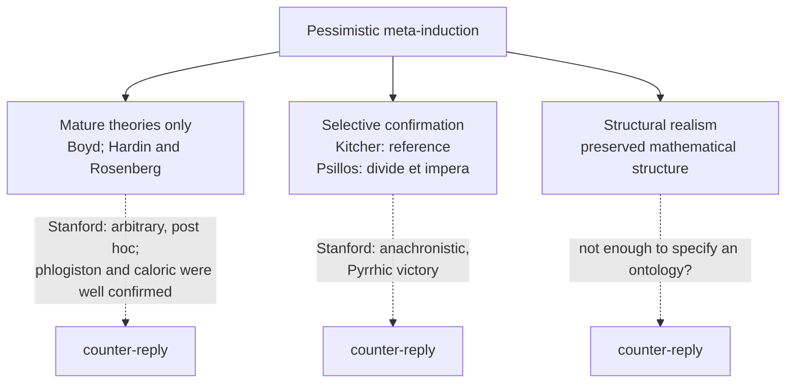
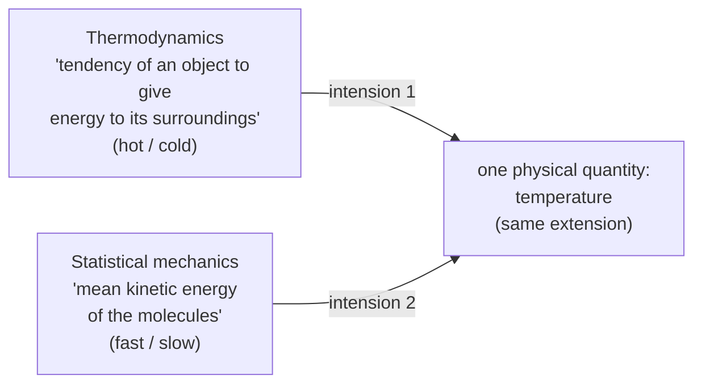
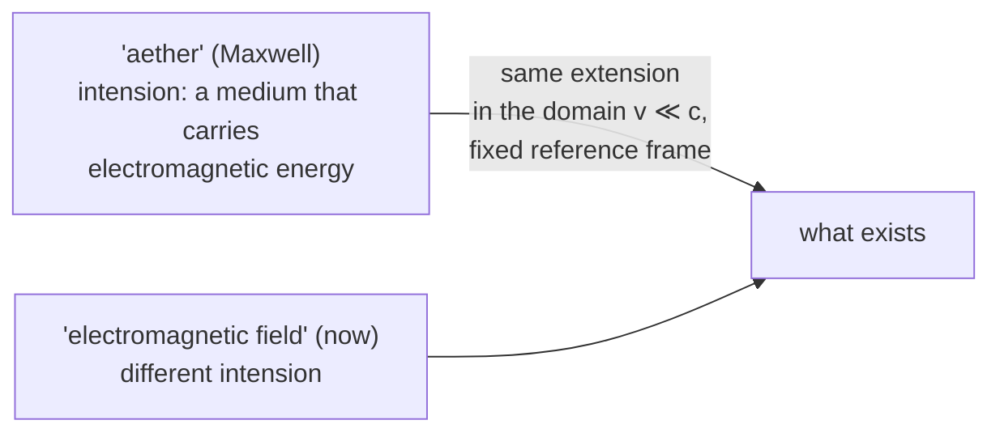

# PhilSci-L06: Scientific Realism and the Pessimistic Meta-Induction

> [!abstract] Overview
> Laudan's list says the aether, phlogiston and caloric do not exist, so the successful theories built on them were false, so ours probably are too. This lecture is the realist's answer, and the answer the lecture ends on is a surprising one: the aether does exist.
>
> Three parts, following the deck's (A), (B), (C): **(1)** a scorecard of every argument for and against realism met so far, with a verdict on how much force each has; **(2)** the realist replies to Laudan's **pessimistic meta-induction** (PMI): restrict realism to mature theories, Kitcher's finer-grained account of reference, Psillos' **selective confirmation** (*divide et impera*), structural realism, and **Stanford's historicist critique** that selective realism wins only a "Pyrrhic victory"; **(3)** a sketch of Sebastian De Haro's **extensional scientific realism**, which answers the PMI with the Fregean distinction between the sense (intension) and reference (extension) of a word, and on that basis argues that "aether" referred all along.
>
> This is the second of the course's two realism weeks and builds on [[PhilSci-L05 - Scientific Realism and its Critiques|L05]], which introduced the PMI, Laudan's list, convergent realism and Saatsi's two readings. Those are not re-explained here. The deck's title slide calls the lecture "Replies to the PMI"; the Canvas file is "6 Scientific Realism - Pessimistic Meta-Induction". No recording was available, so this note is written from the 38-page deck, with passages of the week's readings (Psillos 1999, ch. 5; De Haro's draft) used only where a slide compresses an argument, and flagged when used.

---

## Part 1: Where the debate stands (deck section A)

### 1.1 Why realism is central

- Scientific realism is one of the **central debates** in current philosophy of science. It deals with what is widely taken to be one of the central aims of science: **to provide knowledge**.
- Contemporary debates about realism are **in part reactions to the problems of induction and under-determination**. Not only: there are other lively debates about specific forms of scientific realism.
- It also touches other important topics, such as **explanation** (see [[PhilSci-L04 - Scientific Explanation and Understanding|L04]]).
- **Today:** further development of the debate, especially **Stanford's historicist criticism**, and (a sketch of) **SDH's reply** to Stanford's critique. SDH is Sebastian De Haro: the deck's reference list gives "SDH, *An Extensional Scientific Realism (I)*, on canvas", which is the optional De Haro draft in `Assets/`.

### 1.2 The arguments for realism, with a verdict each

The deck gives every argument a verdict in italics. All four arguments for realism get the same one: *some force*.

| argument for realism | verdict | the points listed under it |
|---|---|---|
| **Inference to the best explanation** | *some force* | Van Fraassen: there is no such rule. Empirical adequacy is a **competing hypothesis** that fits our practice equally well |
| **No-miracles argument** | *some force* | Prediction of **novel** facts and regularities. **Van Fraassen's Darwinism.** **Musgrave: Darwinian/historical versus intensional (conceptual) explanation** |
| **The demand for explanations** | *some force* | **Explanation versus ultimate explanation.** **Adequate explanations requiring truth** |
| **No theory-observation distinction** | *some force* | **Stances? Voluntarism?** |

What L05 already gives you for each row: IBE and van Fraassen's rival hypothesis ([[PhilSci-L05 - Scientific Realism and its Critiques|L05]], sections 2.4 and 3.3); the NMA and novel prediction (2.3); explanation versus ultimate explanation is Musgrave's reply in mock question 8 (L05, Exam Focus); Maxwell's continuum argument and van Fraassen's reply that "observable" is vague but usable (1.6, 3.4).

> [!warning] Keywords the deck does not explain
> "Van Fraassen's Darwinism", "Musgrave: Darwinian/historical vs. intensional (conceptual) explanation", "adequate explanations requiring truth" and "Stances? Voluntarism?" appear on the slide as bare keywords. They come from the week 5 readings (van Fraassen and Musgrave in Curd & Cover), which are not in the vault and were not read for this note, and neither Psillos' chapter nor De Haro's draft discusses them. All the slide establishes is that each belongs under the argument it is listed with. #needs-review

### 1.3 The arguments against realism, with a verdict each

| argument against realism | verdict | the points listed under it |
|---|---|---|
| **Empirical under-determination**: under-determination of theory by the empirical data | *Stalemate/not much force?* | Virtues (simplicity), pragmatics, metaphysics |
| **Constructive empiricism** | *main contender* | Has not all the problems of logical empiricism, and some of the virtues of scientific realism. **"Observable" remains a problem** |
| **Pessimistic meta-induction (Laudan)** | *some force* | 1. No good notion of "approximate truth". 2. No connection between empirical success and approximate truth. 3. Reference is required for truth, but old theories contain obviously non-referring terms: belief in the truth of theories is not justified |

> [!note] How this differs from L05
> L05's summary listed the PMI's problems as two items: no good notion of approximate truth, and no connection between empirical success, reference and approximate truth. This scorecard splits the second into two and states the reference point as its own premise: **reference is required for truth**, and the old theories contain **"obviously" non-referring terms**. Watch the word "obviously": Part 3 of this lecture attacks exactly that premise (section 3.3).

Note also the verdict on constructive empiricism. In L05 van Fraassen's reply to Maxwell made "observable" a vague but usable predicate. Here the deck still lists "'observable' remains a problem" against him, without saying more.

### 1.4 Empirical under-determination, revisited

The full treatment is in [[PhilSci-L03 - Under-determination|L03]] (section 5). The slide's points:

- It **seems possible** that the same evidence might confirm different theories.
- **Transient versus permanent under-determination**: can new evidence break the under-determination? (Transient: the evidence available now does not decide between the theories, but later evidence might. Permanent: no possible evidence decides.)
- There are **difficulties in identifying realistic examples**:
  - It is easy to build **logically inequivalent theories**, but these are **toy models**.
  - **Real physics examples are exceedingly rare and controversial.**
- **Realist reply: theoretical virtues break the under-determination.** Simplicity, beauty, fruitfulness are **non-empirical, but still truth-conducive**.
- Empirically equivalent theories can still **disagree on their theoretical virtues**: under-determination broken.

> [!intuition] Why the verdict is "stalemate"
> The anti-realist needs real cases of empirically equivalent rivals, and they are rare. The realist needs theoretical virtues to be **truth-conducive** and not just convenient, and the anti-realist will deny that a simpler or more beautiful theory is thereby more likely to be true. Neither side can force the other, which is why the slide's verdict is "stalemate/not much force?", with a question mark.

### 1.5 The pessimistic meta-induction, restated

The slide is identical to the PMI slide of L05: history of science shows many once-successful theories now considered false; they assumed terms like "aether" and "phlogiston" referred; we do not now take these terms to refer (the theories assume entities we now consider non-existent); by induction, presently successful theories will (may well) turn out to be false too, so we are not justified in believing that theories are true; so there is no reason to assume that the entities, properties and processes postulated by our **best theories** are real. The full argument, Laudan's three problems for convergent realism and Saatsi's two readings are in [[PhilSci-L05 - Scientific Realism and its Critiques|L05]], Part 4.

Laudan's list is shown again (crystalline spheres, humoral medicine, effluvial static electricity, catastrophist geology, phlogiston, caloric, vibratory heat, vital force, electromagnetic aether, optical aether, circular inertia, spontaneous generation), with his line that the list "could be extended *ad nauseam*" and involves "in every case a theory which was once successful and well confirmed, but which contained central terms which (we now believe) were non-referring". The same table comes back on slide 22 with a different caption (section 3.3).

---

## Part 2: Recent discussions: replies to the PMI and Stanford's critique (deck section B)

The section's subtitle: "Selective confirmation, structural realism and Stanford's critique".

### 2.1 Realists do not believe in literal truth

The debate about realism is ongoing. **Kitcher (1993) and Psillos (1999)** point out that **van Fraassen's notion of realism is incorrect**: realists do not believe in the **literal truth** of theories, but in their **approximate or probable truth**. The target is van Fraassen's formulation, which L05 (section 3.1) used as the statement of realism:

> "Science aims to give us, in its theories, a **literally true** story of what the world is like; and **acceptance** of a scientific theory involves the **belief** that it is true."

Second point: **scientific theories are not monolithic entities**. They have **"parts"**, some of which are more important than others. Kitcher's and Psillos' accounts aim to **make precise the notion of "approximate truth"** in terms of these parts.

> [!intuition] Why "parts" answers Laudan's first problem
> Laudan's first problem was that nobody has defined approximate truth. If a theory is a bundle of parts (laws, mechanisms, posits) of unequal importance, "approximately true" can mean: the important parts are true, even if some others are false. That turns a vague notion of degrees of truth into a question that can be checked part by part. The rest of Part 2 is about whether that check can be done honestly.

### 2.2 The replies and the counter-replies

The slide lists three realist replies. Replies are marked with a tick; counter-replies with a second marker that did not survive the PDF export (it shows as an empty box), presumably a cross.

| reply | who | idea | counter-reply |
|---|---|---|---|
| **Mature theories only** | Boyd (1981), Hardin and Rosenberg (1981) | Be a realist only about **empirically well-confirmed / mature** theories. The early, immature theories on Laudan's list do not count | **Stanford (2006):** the requirement of "maturity" is **arbitrary** and post hoc. And surely some theories on Laudan's list *were* well confirmed: the **phlogiston theory of combustion** and the **caloric theory of heat** |
| **Selective confirmation** | **Kitcher (1993)**: a better analysis of "reference", so that not all terms of theories refer. **Psillos (1999)**: *divide et impera*, different theory parts are confirmed differently | Belief should go only to the parts of a theory that its success actually confirms | Stanford, sections 2.3 and 2.5 |
| **Structural realism** | (no name on the slide) | Continuity across theory change is given by **preserved mathematical structure** | **Not enough to specify a (scientific) ontology?** |

Psillos (1999, ch. 5) spells out the maturity reply: a theory is mature once its discipline has passed Boyd's "take-off point", where a body of well-entrenched background beliefs delimits the domain and constrains new theories (for heat, once the impossibility of perpetual motion, the principle that heat flows from warm to cold, and Newtonian mechanics were entrenched). That removes items like humoral medicine and effluvial electricity from the list. Psillos himself then concedes the point the counter-reply makes: caloric theory and the nineteenth-century optical aether theories were both mature and successful and are still considered false, so maturity alone does not defeat the PMI. That is why selective confirmation is needed.

The structural realism counter-reply, unpacked: if all that survives theory change is the mathematical structure of the equations, the realist can say the equations are approximately right, but not what kind of things the world contains. That is a weak realism about *structure*, without an ontology of entities.



### 2.3 Kitcher versus Stanford on reference

**Kitcher (1993):**
- Terms used by scientists **do not automatically refer**.
- Look at the **specific context** to see what terms refer to.
- "Aether" could refer to the **electromagnetic field** in some cases, to **empty space** in others, and to **nothing at all** in others.
- **Reference is fixed differently in different cases.**
- So **Laudan is wrong** to conclude that these terms are non-referring.

De Haro's draft (section 2.2) spells out the mechanism: Kitcher assigns reference to individual **tokens** (occasions of use) of a term, using the speaker's intentions on that occasion. A scientist may use one word, but some of his uses pick out a real thing and others pick out nothing. In the case De Haro discusses, some tokens of Priestley's "phlogiston" and "dephlogisticated air" refer and others do not.

**Stanford (2006):**
- **Agrees** some such distinction might make sense.
- But the argument **misses the point of the meta-induction**: even if central terms refer, they are embedded in **theories that repeatedly turn out to be radically misguided**. Such theories **cannot be approximately true**.

Stanford's own words, on a slide of their own:

> Kitcher's explanation is "little comfort to the realist if we insist that some tokens of terms like 'dephlogisticated air' in rejected theories referred after all, while admitting that the relevant theoretical accounts and descriptions of those entities were **mistaken about virtually everything except the fact that the entities in question played some causal role** in producing observable phenomena".

> [!intuition] What Stanford's objection does to the realist
> Realism needs **approximate truth**, and reference is only a precondition for it ([[PhilSci-L05 - Scientific Realism and its Critiques|L05]], section 4.4: a claim is true when its terms refer *and* it says true things about the referents). Kitcher rescues the precondition. But if the theory got everything wrong about the thing it referred to, except that the thing caused the observations, the theory is not approximately true of it in any useful sense. Rescuing reference while conceding that the descriptions were almost all false is a win on a technicality.

### 2.4 Psillos' selective confirmation: divide et impera

*Divide et impera* (divide and rule). Distinguish different **parts of theories**:

| part | role | fate in later theories |
|---|---|---|
| **Causal core** | Has a role in **explaining the phenomena**; **responsible for the theory's success** | Typically **retained** by later theories |
| **Idle constituents** | **Not causally involved** in explaining phenomena; not responsible for success | Typically **disappear** in later theories |

The slide says: **compare with Lakatos** (hard core / protective belt)! The comparison is with the methodology of scientific research programmes in [[PhilSci-L01b - Popper and Lakatos|L01b]] (section 3.7), where a programme has a hard core that is protected and a belt of auxiliary hypotheses that is adjusted and given up. Both divide a theory into a part that carries the weight and a part that can go. The slide gives no further comparison. (Note the two are drawn on different grounds: Lakatos' hard core is what the scientists in the programme decide to protect; Psillos' causal core is defined by its role in producing the theory's success.)

> [!example] Maxwell's theory and the aether
> - **Causal core:** the theory's actual **equations and mechanisms of explanation**, which **do not require the aether**.
> - The **aether is an idle constituent**, not retained in modern electromagnetic theory.
>
> So the success of Maxwell's electromagnetism confirms the equations, not the aether, and the abandonment of the aether is no evidence that successful theories are false where it matters. (The slide shows an engraved portrait of a bearded man in profile, credited to Wikimedia, evidently Maxwell.)

Third point on the slide: **mixed theories of reference (Papineau, Lewis)**, which **combine "causal" and "descriptive" accounts of reference**. The slide does not spell these out. De Haro's draft (section 2.2) does: on a **descriptive** theory, a term refers to whatever fits the description the theory gives, so when descriptions change, reference changes, and Laudan's cases all fail to refer. On a **causal** theory (Kripke, Putnam), a term refers to whatever caused the phenomena that led scientists to introduce it, so "aether" refers to the electromagnetic field because the field plays the causal role of carrying electromagnetic energy; this has been charged with making reference too easy. On Psillos' mixed version, a term refers to an entity when the entity **both causes the phenomena and satisfies a causal description** of how it causes them: the causal contact anchors the description, and the description stops reference coming too cheaply.

Psillos (1999, ch. 5) gives the general recipe behind the slide: the realist should study specific successes (Fresnel's prediction of the bright spot at the centre of a disk's shadow; Laplace's law for the propagation of sound), ask which theoretical constituents **"really fuel the derivation"**, and show that those constituents were retained. A constituent $H$ contributes indispensably to a prediction $P$ if the remaining hypotheses and auxiliaries cannot yield $P$ without it, and no independently motivated, non-ad-hoc alternative could replace it.

### 2.5 Stanford on selective confirmation

Stanford's critique runs over two slides.

**1. The core/idle distinction is anachronistic.** It would have been **denied by the scientists who developed those theories**.
- **Maxwell regarded the aether as an essential part** of electromagnetic theory.
- So how can we say that Maxwell's theory "was really not about the aether"?

**2. Convergence is "virtually guaranteed".** Convergence towards the causal core, which appears in current theories, is built in.
- **Almost by definition**, whatever entities are retained by current theories are part of what we now call the causal core.
- The causal core **need not be what scientists of the past thought was important** for their theories.

**3. We need prospectively applicable criteria**, of idleness and/or selective confirmation, to **avoid Whig history** (writing the past as a march towards the present, judging it by what we now believe).
- **Scientists of the future will make the same verdicts about our current theories.**
- Without arguments that treat history in a way that is not anachronistic, we are **not entitled to be realists about our best theories**.

**4. The dilemma.** Selective confirmation requires **either** knowing facts about the **beliefs and intentions of past scientists**, **or** saying that past scientists **repeatedly misidentified the parts**, features or aspects of their theories that contributed to success. Either way, a **"Pyrrhic victory"** for scientific realism.

> [!intuition] Why point 3 bites
> If "causal core" is identified by looking back at what survived, the realist can only apply it to *past* theories. Applied to our own best theories, it would need to know which parts will survive, which is what we do not know. Future scientists will sort our theories into core and idle with hindsight, exactly as we sort Maxwell's. So the method gives no guidance about which parts of current science to believe, and that guidance was the whole point of realism.

> [!intuition] Why the victory is "Pyrrhic"
> A Pyrrhic victory is one that costs the winner so much that it is no better than defeat. The realist saves the claim that successful theories were approximately true, but at the price of saying that the scientists who built them did not know what their own theories were about, or of claiming access to their beliefs that we do not have. Realism was supposed to trust what successful science says. If it has to overrule the scientists every time, it has given up what it was fighting for.

Psillos (1999, ch. 5) anticipates this hindsight objection and answers that eminent scientists draw the core/idle line themselves, at the time: Lavoisier, Laplace and Carnot believed the caloric laws that fuelled their predictions while treating the hypothesis that heat is a material fluid as speculative. Stanford's aether case is aimed at precisely this answer: Maxwell did **not** treat the aether as idle.

---

## Part 3: Extensional scientific realism (deck section C)

The section's subtitle: "A reply to the PMI and PUA". PMI is the pessimistic meta-induction. **PUA is never expanded in the deck.** The only candidate in the deck is the subtitle of Stanford's 2006 book in the reference list, *Science, History, and the Problem of Unconceived Alternatives*, so PUA most likely stands for the problem of unconceived alternatives. Nothing in the deck explains that problem or answers it separately, and De Haro's draft does not mention it. #needs-review

### 3.1 Way forward: agreeing with Stanford

Stanford's (2006) critique of selective confirmation **seems generally on the mark**. Two lessons are kept:

1. **Explain the connection between reference and approximate truth.** A solution needs to **explicate both** notions.
2. **Avoid projecting current insights into the past**: projecting the parts of past theories that now seem true, or what we now believe the theories "are really about", onto past scientists' intentions and beliefs. These are **incorrect readings of history**.
   - **Methodological principle:** read the arguments that past scientists used to explain phenomena **in their historical context**.

### 3.2 Criticising Stanford

**1. Convergence is not "virtually guaranteed".** Stanford's claim that convergence towards a causal core shared by old and new theories is virtually guaranteed **seems incorrect**.
- If the core is obtained by eliminating idle terms while retaining the ones that cause the phenomena, it could well be that **none of the original terms remain**. There is **no guarantee** that a causal core remains.
- So any *causal* core that does remain is **highly remarkable**: its survival tells us something about the history, since the method did not build it in.

**2. Stanford reads into Maxwell's text.** Stanford concludes that Maxwell considered the idea that electromagnetic [energy] could be transmitted in some other way than through an aether "incoherent" and "unintelligible". The deck says this reads more into Maxwell than is there. (The slide's sentence is missing a word after "electromagnetic"; "energy" fits section 3.10, where Maxwell's argument is about electromagnetic energy.)

Conclusion: **Stanford's critique of continuity in selective realism is not strong.**

So the position taken is mixed: Stanford is right about the method (reference and approximate truth need explicating; no anachronism) and wrong about the two specific charges (guaranteed convergence; Maxwell's commitment to the aether).

### 3.3 The perplexity about reference

- A **weakness in the literature, from Putnam (1978) to Stanford (2006)**: the assumption of **a single kind of meaning of words**. (De Haro's draft notes that the PMI was first formulated by Putnam (1978) and given its historical basis by Laudan (1981), which is why the range starts at Putnam.)
- Hence **Laudan's perplexity** about terms of old theories "failing to refer" ("aether", "phlogiston", etc.).
- There are **plausible arguments both that "aether" refers and that it does not refer** (compare Kitcher in section 2.3: field, empty space, nothing).
- That is **indicative of the need for a further linguistic/conceptual distinction**.

Laudan's list then comes back (slide 22) with a new caption in place of his quotation: **"Claim: not at all 'obvious' that the terms in these theories 'fail to refer'."** This is the direct denial of the third item on the scorecard in section 1.3 ("old theories contain obviously non-referring terms").

### 3.4 Extensional scientific realism: the idea

- **Cautious realism**, as against van Fraassen's characterisation:
  - Belief in the **literal truth** of theories is often **naive**.
  - The claim is "approximate truth", in place of "truth of theories, period".
- **First aim:** give a **cogent answer to the PMI**, as **the main argument open against scientific realism**.
- **Idea:** the problem with the PMI is that it **considers a single notion of meaning**. Philosophy of language has **two types of meaning** (Frege, Carnap, Lewis).
- Related work: Hacking (1983), Radder (1985), Galison (1997), Massimi (2016).

("Cautious scientific realism" is the same label De Haro used for his position on dualities in [[PhilSci-L03 - Under-determination|L03]].)

### 3.5 Sense and reference, intensions and extensions

> [!example] The morning star and the evening star
> Venus is one of the brightest objects in the sky. It is seen both in the morning and in the evening, and is called both "morning star" and "evening star".
> - The two names have **different linguistic meanings**: **morning star** = the brightest star in the morning; **evening star** = the brightest star in the evening.
> - Still, in our world both meanings **refer to a single object: the planet Venus**.

The slide's photo: a night sky with a thin crescent Moon at upper left (the dark part of the disk faintly lit), Jupiter with two of its moons labelled (Ganymede, Callisto) at the right, a faint star labelled "53 Sagittarii", and Venus, the brightest point, labelled at the bottom. (Photo credit on the image: Tavi Greiner, 1 Dec 2008.)

> [!definition] Sense and reference (intension and extension)
> - **Sense = intension:** the **linguistic meaning** of the words. *Morning star / evening star.*
> - **Reference = extension:** the **actual object or entity** the words refer to. *Venus.*
>
> "Sense" and "reference" are Frege's terms; "intension" and "extension" are **Carnap's jargon** for the same distinction.

```
 "morning star" --- sense: brightest star in the morning ---\
                                                             >--- reference: Venus
 "evening star" --- sense: brightest star in the evening ---/
```

Two words, two senses, one referent. That two different senses pick out the same thing is a fact about **our world**, which had to be discovered.

De Haro's draft (section 3.1) gives the general semantics: the **intension** of a term is its linguistic meaning as described by the theory, relative to **all possible worlds** the theory describes; its **extension** is its worldly reference relative to **one** world, with all its contingent details. For a sentence, the extension is its truth-value and the intension is the proposition. Two terms are **extensionally equivalent** with respect to a set of worlds if they have the same extension in each of those worlds, even though their intensions may differ.

### 3.6 Three notions of temperature

The distinction between intension and extension matters for scientific theories, **because we are interested in how words refer**. Consider three uses of **"temperature"**:

| speaker | what "temperature" means to them | picture on the slide |
|---|---|---|
| **Lay person** (uses the word without necessarily being able to explain it scientifically) | "temperature is the expansion of mercury that I measure with a thermometer" | A wall thermometer mounted on brick |
| Physicist trained in **thermodynamics** | "temperature is a measure of the tendency of an object to give energy to its surroundings" | Two beakers: a red one with wavy arrows pointing **out** of it (giving off heat) and a blue one with wavy arrows pointing **in** (absorbing heat) |
| Physicist trained in **statistical mechanics** | "temperature is the mean kinetic energy of the molecules in a substance" | Two boxes of molecules labelled "Low Temperature" and "High Temperature": in the hot box the molecules have much longer motion streaks, i.e. move faster |

**Different meanings that scientists give to the same word can be perplexing.** Kuhn said scientists in different paradigms **"live in different worlds"** (see [[PhilSci-L02 - Kuhn on Scientific Practice|L02]], section 4, on incommensurability).

**One way to understand this:** the word "temperature" has **different intensions (senses) but the same extension (reference)**.
- The two physicists give **different intensions** to "temperature", because their **definitions are different**.
- But the different intensions **refer to the same physical quantity**: the two words "temperature" have **the same extension**.

The slide's figure puts the beakers (thermodynamics) and the molecule boxes (statistical mechanics) side by side with an equals sign between them:



> [!intuition] What this does to Kuhn's "different worlds"
> Kuhn's thought was that when the meaning of a term changes between theories, the scientists are no longer talking about the same thing. With two kinds of meaning, the change can be located: the **intension** changed, the **extension** did not. The thermodynamicist and the statistical physicist disagree about what temperature *is*, and still refer to, measure and predict the same quantity. That is the model for how an old theory and a new one can both be about the aether's referent.

### 3.7 Answering the pessimistic meta-induction

What is needed: **continuity of reference and approximate truth between discarded and new theories**. (These are the two notions Stanford was right to demand be explicated, section 3.1.)

- **Step 1: continuity in the extensions of theories that follow one another.** **Extensional equivalence** = reference to the same items in the **domain of application**.
  - Example: **extensional equivalence of quantum and classical mechanics**: one can derive all of the **extensional results of classical mechanics from quantum mechanics**.
  - **Contrast with Psillos:** continuity here is **not secured by "theory parts"**, but by **delimiting the theory's extension to a domain of application**.
- **Step 2: define "approximate truth" in terms of extensions** (section 3.12).

> [!definition] The slogan of extensional scientific realism
> *We are justified in being scientific realists about extensions but not necessarily about intensions.*

> [!intuition] Why restricting to a domain of application does the work
> De Haro's draft (section 2.3.1) gives the reasoning the slide compresses. A theory's **intension** covers every possible situation the theory can be applied to, including many where it has never been tested and where it may well be false. Its **extension**, restricted to its **domain of application** (the situations where it has been well tested), is what its evidence actually supports. No prudent scientist claims a theory is accurate far beyond where it was tested. So a realist should commit only to extensions in the domain of application. Then a new theory that differs radically from the old one *outside* the old theory's domain is no threat: nobody expected the old theory to succeed there. What has to be continuous is only the extension on the overlap, and that is a much more modest requirement than Laudan's cases assume.

### 3.8 What determines an extension

Back to the temperature example: temperature (hot/cold) and temperature (fast/slow) are **extensionally equivalent concepts**.

What is the extension of a term in a scientific theory? Recall Venus: **extensionally, i.e. in our world**, *morning star* $\equiv$ *evening star*. So "extensionality" is relative to **our world and the conditions of observation**.

> [!definition] What fixes an extension
> **The extension is determined by the intension and by the specific circumstances or context in which a given phenomenon is studied.**

(The slide's export has a ghost copy of an earlier version of the same bullets overlaid on the text; the content is the same.)

**Aspects that determine extensions in natural science:**

| aspect | examples on the slide |
|---|---|
| **Specification of a model of some phenomenon** | Choices of initial and boundary conditions, assumptions about the population, environmental conditions, etc. |
| **Values of the theory's and model's free parameters** | Mass, coupling strength, chemical concentration, ... |
| **Extra-theoretical facts not captured by the theory or model** | Experimental errors, other influences, material realisation, weather conditions, ... |
| **Approximations and idealisations** | Taking a limit: $v \ll c$ (special relativity), $\hbar \to 0$ (quantum mechanics), $G \to 0$ (general relativity) |

where:
- $v \ll c$: speeds much smaller than the speed of light $c$, the regime in which special relativity's predictions reduce to Newtonian ones
- $\hbar \to 0$: Planck's constant taken to zero, the regime in which quantum effects become negligible
- $G \to 0$: Newton's gravitational constant taken to zero, the regime in which gravity is switched off

A related view: **effective realism** in high-energy physics, which is **realism about a theory in a specified range of parameters**. De Haro's draft gives the matching practice: effective quantum field theories come with a cut-off beyond which the theory is expected to need modification or replacement.

> [!intuition] Why a vague-sounding notion is not vague
> "Domain of application" could sound like a fudge that lets the realist retreat wherever a theory fails. The table is the answer: the domain is fixed by the concrete specification of models, parameter values, error margins and approximations that scientists already state when they apply a theory. The limits $v \ll c$ or $\hbar \to 0$ are written into the physics.

### 3.9 Extensional equivalence: three kinds of correspondence

How do we establish that the extensions of (the terms of) different theories are equivalent? **Three aspects:**

> [!definition] Three kinds of correspondence
> 1. **Predictive-theoretical (numerical and formal) correspondence:** the two theories **make the same predictions, under the relevant approximations**.
> 2. **Material correspondence** (including experimental and instrumental correspondence, and replicability): **the system studied is the same**, but we study it from **different points of view**.
> 3. **Conceptual correspondence:** the concepts of the two theories are **not identical**, but **"match"** (**play the same roles**) in the given extension.

> [!example] One example of each
> - **Predictive correspondence:** quantum mechanics **reproduces the results of classical mechanics** under specific conditions (large systems, etc.):
> $$\left\langle \frac{dp}{dt} \right\rangle = -\langle \nabla V \rangle \quad\longrightarrow\quad F = -\nabla V \quad \text{(Newton's equation)}$$
> - **Material correspondence:** the **atom** studied by (i) the quantum theorist and (ii) the inorganic chemist is **the same entity**, even if their experiments are different (particle accelerator versus electron microscope versus chemical reaction).
> - **Conceptual correspondence:** quantum and classical mechanics both contain the notion of **"position of a particle"**, and these play **the same roles on a given extension**.

In the formula:
- $p$: momentum; $V$: the potential energy; $\nabla V$: its gradient
- $\langle \cdot \rangle$: the quantum-mechanical **expectation value** (average over the state)
- $F = -\nabla V$: the classical force derived from the potential, so with $F = dp/dt$ the right-hand side is Newton's second law

So the quantum equation for the *averages* has the same form as Newton's law for the classical quantities, and in the classical regime the averages behave like the classical values. (Physics calls the left-hand relation Ehrenfest's theorem; the slide does not name it.)

De Haro's draft (sections 4.1 and 4.3) adds two points. "Predictive correspondence" is the combination of **numerical** correspondence (the theories agree, after approximations, on the values of salient quantities) and **formal** correspondence (the form of one theory's laws can be obtained from the other's). And material correspondence alone is not enough: if the chemist's and the quantum theorist's descriptions ascribed empirically conflicting properties to the same sample, nobody would call their terms equivalent, so predictive correspondence is needed as well.

### 3.10 The aether, revisited

**The main argument of the pessimistic meta-inductivists:**
- **The aether does not refer** (it does not exist at all!), so how can we say that the old electromagnetic theory was true?
- How can it even be "approximately" true, if it relies on the postulation of non-existing entities? (Stanford: its ontology is **"radically misguided"**.)
- The old and new electromagnetic theories are in **predictive** and **material** correspondence, but **no conceptual** correspondence.

**Answer: "aether" does refer. The aether does exist.**

> [!definition] What "aether" refers to
> What Maxwell called the "aether" is **extensionally equivalent** to what we now call **"the electromagnetic field", together with a fixed frame of reference**, $v \ll c$.
>
> "Aether" and "electromagnetic field" are otherwise, of course, **intensionally distinct**!

- **Maxwell's argument for the existence of the aether was very good:** electromagnetic energy does not disappear from the sender to pop up at the receiver at a different point in space (**conservation of energy**). Something in between must carry the energy.
- The **"medium"** Maxwell is talking about is the same as the **electromagnetic field, together with a fixed frame of reference**.



> [!warning] Why the frame of reference and $v \ll c$: not explained
> The deck states the qualification and does not explain it. What the rest of the lecture does establish is the general pattern: an extension is fixed by the intension plus the circumstances of a domain, including approximations such as $v \ll c$ (section 3.8). So the claim is that **within** the domain where Maxwell's theory was applied (one fixed frame of reference, speeds far below that of light), "aether" and "electromagnetic field" pick out the same thing, and that outside it their intensions come apart. Why exactly a fixed frame is needed is not said on the slides. De Haro's draft (section 2.3.2) says the detailed argument that "aether" refers to the electromagnetic field is given in his Part II, which is not on Canvas. #needs-review

Note what this answer does to Stanford's anachronism objection (section 2.5). Psillos had to say the aether was idle, against Maxwell's own view. Extensional realism agrees with Maxwell that the aether was essential and real, and that his argument for it (energy conservation) was good. It says only that the thing his argument established is, extensionally, what we call the field.

### 3.11 A Pyrrhic victory?

Recall Stanford's dilemma (section 2.5): selective confirmation requires knowing facts about the beliefs and intentions of past scientists, or saying that past scientists repeatedly misidentified the parts of their theories that contributed to success.

**Extensional scientific realism does not distinguish theory "parts".**
- It is a **linguistic/philosophical theory about how to interpret scientific statements**.
- For all we know (**assuming empirically adequate theories / sound scientific arguments**), **all the terms that scientists claim refer, do refer**.

**Compare van Fraassen** on interpreting a theory **literally**, but **believing only what it says about the observable** ([[PhilSci-L05 - Scientific Realism and its Critiques|L05]], section 3.4).

**Likewise extensional scientific realism:** **take literally what the scientist says, but only believe it as extensional, not intensional, kind of meaning.**

| | read the theory literally? | what you believe |
|---|---|---|
| Constructive empiricism (van Fraassen) | yes | only what it says about the **observable** |
| Extensional scientific realism (De Haro) | yes | what it says, taken **extensionally** in its domain of application, observable and unobservable alike |
| Selective confirmation (Psillos) | yes | only the **causal core**, not the idle constituents |

> [!intuition] Why this escapes the dilemma
> Both horns of Stanford's dilemma come from sorting a past theory into good and bad parts. Extensional realism does no sorting: every term the scientists had good reason to introduce is taken to refer, homogeneously. So it never needs to second-guess what Maxwell thought was essential, and never needs to say he misidentified the source of his success. What changes is only *how* his statements are believed: extensionally, within the domain he actually tested. De Haro's draft (section 5.2) adds that the line between the extensional and intensional is drawn by the theory's domain of application, which scientists themselves state, so the method does not rely on hindsight in Stanford's bad sense.

> [!warning] Extensional realism is still realism
> The parallel with van Fraassen is about the *shape* of the position (literal reading, restricted belief). The restriction is different. Van Fraassen restricts belief to observables, so electrons are out. De Haro restricts belief to extensions in a domain, and electrons, forces, fields and the aether's referent are extensions, so they are in. De Haro's draft (section 2.3.2) makes this explicit: the observable/unobservable distinction "has nothing to do with" the extension/intension distinction.

### 3.12 Approximate truth (a sketch)

Step 2 of the answer to the PMI:

- Use **Laudan's idea of the progress of scientific theories**, measured by the **relative number and significance of the problems these theories solve**.
- Use this to define "approximate truth":

> [!formula] Closer to the truth (De Haro's sketch)
> $T$ is closer to the truth than $T'$ **iff** $T$ is **extensionally true in a larger, and more significant, domain of application**.
>
> where:
> - $T$, $T'$: two theories about overlapping phenomena
> - extensionally true in a domain: what the theory says, taken extensionally, is true for the situations in that domain

- **Is there a danger that theories will become more vague as they become more general?** (A theory could cover a larger domain by saying less.) The **standard answer from philosophy of science**: $T$ should be **as good as $T'$ as a theory**, e.g. concerning **predictive power and explanation**.

Note the irony the slide does not point out: Laudan's own measure of progress, from the author of the PMI, is used to build the realist's missing notion of approximate truth.

**Comparing two theories.** The slide reproduces "Figure 3" from De Haro's work:

```
                T                                   T'
              /   \                           /     |      \
   light-blue lines (+ LoA)           dark-blue lines (+ LoA')
            /       \                       /       |        \
 +------------------------------- I_T' -----------------------------+
 |   +------------------ I_T -------------------+                    |
 |   |   ( D1 inside D1' )   ( D2 inside D2' )  |       ( D3 )       |        ( D4 )
 |   +------------------------------------------+                    |
 +-------------------------------------------------------------------+

 T's lines land on:   D1, D2
 T''s lines land on:  D1', D2', D3
 no lines land on:    D4
```

- Two theories, $T$ (orange circle) and $T'$ (darker orange circle), sit at the top.
- Lines run down from each theory to the **domains** (blue disks) where it is extensionally true. $T$'s lines are light blue, labelled "+ LoA"; $T'$'s lines are dark blue, labelled "+ LoA′".
- $D_1$ and $D_2$ are light-blue disks; each sits inside a slightly larger dark-blue disk, $D_1'$ and $D_2'$. $D_3$ is a dark-blue disk reached only by $T'$. $D_4$ lies outside everything, reached by neither theory.
- $I_T$ is a light-orange ellipse around $D_1$ and $D_2$; $I_{T'}$ is a large dark-orange ellipse around $D_1'$, $D_2'$ and $D_3$.

The caption, verbatim: "Figure 3: Extensional truths of the theories, $T$ and $T'$, over the various domains (light and dark blue lines). $T$'s intension is $I_T = D_1 \cup D_2$, and $T'$'s intension is $I_{T'} = D_1' \cup D_2' \cup D_3$. The domain in which $T'$ is true is larger than that of $T$, and $D_1 \cup D_2 \subset D_1' \cup D_2'$."

So by the definition just given, in the figure **$T'$ is closer to the truth than $T$**: it is true wherever $T$ is ($D_1 \subset D_1'$, $D_2 \subset D_2'$), on a larger part of each of those domains, and on a further domain $D_3$ as well. $T$ is not refuted by $T'$: it remains extensionally true on $D_1 \cup D_2$, which is the sense in which an old theory "was, and still is, approximately true" in its domain.

> [!warning] Three things to watch in this figure
> - **The letters swap roles.** On the definition slide, $T$ is the theory closer to the truth than $T'$. In the figure, $T'$ is the better theory. Read the figure on its own terms.
> - **"LoA" is not expanded** anywhere in the deck. De Haro's draft (section 3.2) calls the formal counterpart of a domain's circumstantial conditions (its approximations, accuracies, boundary conditions) the theory's **level of abstraction**, so "+ LoA" most likely means "the theory plus the level of abstraction that fixes this domain". The figure itself comes from his Part II, which is not on Canvas.
> - **The caption equates each intension with the union of the domains**, while the drawing shows each intension as an ellipse that also covers the space between the domains. The deck gives no further explanation, and the vault does not have the paper the figure comes from. #needs-review

### 3.13 Conclusion

- The **perplexity about reference** originates in **too simple / naive readings of the history of science**. These gloss over important aspects of semantics: the **distinction between intensions and extensions**.
- Stanford's criticism is **partly on the mark**, but his insistence on **"broad pattern(s) of repeated, profound, and unpredictable changes in fundamental theoretical orthodoxy"** misses the existence of **restricted domains of application where there is extensional equivalence**:
  - **continuity of reference**: the aether example, quantum mechanics;
  - **conceptual, material and predictive correspondence** of theories;
  - a (beginning of a) **notion of approximate truth**.

Read against Laudan's three problems ([[PhilSci-L05 - Scientific Realism and its Critiques|L05]], section 4.4), the proposal answers each: approximate truth gets a definition (extensional truth on a larger, more significant domain); the link between success and reference runs through extensions in the domain where the success was obtained; and the central terms of once-successful theories, the aether first, are argued to refer after all.

**References on the deck:** Laudan, *A Confutation of Convergent Realism* (Curd & Cover); Kitcher (1993), *The Advancement of Science: Science without Legend, Objectivity without Illusions*; Stanford (2006), *Exceeding Our Grasp: Science, History, and the Problem of Unconceived Alternatives*; SDH, *An Extensional Scientific Realism (I)*, on Canvas; SEP entries "Theory and Observation in Science" (plato.stanford.edu/entries/science-theory-observation) and "Theoretical Terms in Science" (plato.stanford.edu/entries/theoretical-terms-science).

---

## Summary

**Scorecard:** IBE, the NMA, the demand for explanation and the failure of the theory-observation distinction all have *some force* for realism. Against it: empirical under-determination is a *stalemate* (theoretical virtues may break it), constructive empiricism is the *main contender* (but "observable" remains a problem), and the PMI has *some force*.

**Replies to the PMI:**
1. **Mature theories only** (Boyd; Hardin and Rosenberg). Stanford: arbitrary and post hoc, and phlogiston and caloric were well confirmed.
2. **Selective confirmation.** Kitcher: reference is fixed case by case, so "aether" sometimes refers. Psillos: divide et impera, the causal core is retained and idle constituents (the aether) drop out. Stanford: the theories were still radically misguided; the core/idle split is anachronistic (Maxwell thought the aether essential), convergence on the core is guaranteed by definition, and with no prospective criterion the victory is Pyrrhic.
3. **Structural realism.** Preserved mathematical structure may not be enough to specify an ontology.

**Extensional scientific realism (De Haro):** Stanford is right that reference and approximate truth must be explicated and history read in context, wrong that convergence is guaranteed. The PMI assumes a single kind of meaning. With two (intension and extension), successive theories can have different intensions and the same extension in a domain of application, established by predictive, material and conceptual correspondence. "Aether" is extensionally equivalent to the electromagnetic field plus a fixed frame, $v \ll c$, so it refers. No theory parts are needed, so no Pyrrhic victory. Approximate truth: $T$ is closer to the truth than $T'$ iff extensionally true in a larger, more significant domain. Slogan: be a realist about extensions, not necessarily about intensions.

---

## Exam Focus

> [!tip] Exam Focus
> **None of the eight mock exam questions is on the pessimistic meta-induction or its replies.** The mock's realism question (question 8, van Fraassen against Musgrave on explanation) is covered in [[PhilSci-L05 - Scientific Realism and its Critiques|L05]]. The question below is **not a real mock question**: it is written in the mock's style (one concept, explain and evaluate, at most half a page, 10 points) and the model answer is built from this note.
>
> > Psillos responds to Laudan's pessimistic meta-induction with a *divide et impera* strategy. Explain this strategy, using Maxwell's theory and the aether as an example. Why does Stanford think that it gives scientific realism only a 'Pyrrhic victory'?
>
> Model answer:
>
> > Laudan argues that many once-successful theories posited entities, such as the aether, that we now think do not exist, so success is no warrant for approximate truth. Psillos replies that a theory is not monolithic: it has a **causal core** (the laws and mechanisms that explain the phenomena and generate the theory's success) and **idle constituents** (not involved in producing the success). Success confirms only the core, and the core is typically **retained** by later theories, while idle constituents disappear. In Maxwell's theory the equations and explanatory mechanisms are the core and do not need the aether; the aether was idle, which is why its loss does not show that the successful part of the theory was false. Stanford objects that the distinction is **anachronistic**: Maxwell himself regarded the aether as essential, so saying his theory was "really not about the aether" overrules the scientist. Worse, since whatever current theories retain is by definition the "core", convergence is virtually guaranteed, and without a **prospectively applicable** criterion we cannot tell which parts of today's theories are core. So selective realism must either claim knowledge of past scientists' beliefs that we lack, or say they repeatedly misidentified what made their theories successful: a Pyrrhic victory.
>
> Marks would plausibly go to: the PMI in one line; causal core versus idle constituents and retention; the aether example; anachronism with Maxwell's own view; guaranteed convergence or the prospective-criterion point; the dilemma behind "Pyrrhic". A strong answer can add, for evaluation, De Haro's reply that convergence on a causal core is not guaranteed, since none of the original terms need survive.

---

## Key Takeaways

> [!tip] What to be able to state cold
> 1. The **scorecard**: which arguments have "some force", why under-determination is a stalemate (theoretical virtues), why constructive empiricism is the main contender.
> 2. **Kitcher and Psillos against van Fraassen's definition**: realists believe in approximate or probable truth, and theories have parts.
> 3. The three **replies** to the PMI (mature theories, selective confirmation, structural realism) with their **counter-replies**.
> 4. **Kitcher on reference** ("aether" as field, empty space, or nothing) and **Stanford's reply** ("mistaken about virtually everything except" the causal role).
> 5. **Psillos' divide et impera**: causal core versus idle constituents, the Maxwell/aether example, mixed theories of reference.
> 6. **Stanford's four objections** to selective confirmation, ending in the **Pyrrhic victory** dilemma.
> 7. **De Haro**: what he accepts and rejects in Stanford; the single-meaning diagnosis; sense and reference with **Venus**; the three notions of **temperature**; the two steps and the **slogan**.
> 8. The four things that **determine an extension**, and the three kinds of **correspondence** with one example each.
> 9. **The aether revisited**: Maxwell's energy-conservation argument, and what "aether" is extensionally equivalent to.
> 10. The **sketch of approximate truth** and how to read the comparison figure.

> [!warning] The distinctions people blur
> - **Extensional realism is not selective realism.** Psillos believes some *parts* of a theory; De Haro believes the whole theory, but only *extensionally* in its domain. The difference is exactly what lets De Haro escape Stanford's dilemma.
> - **Extensional realism is not constructive empiricism.** Both read theories literally and restrict belief, but extensions include unobservables (fields, electrons, the aether's referent). The observable/unobservable line plays no role.
> - **"Aether does refer" is not "Maxwell's medium exists exactly as he described it".** The intensions differ; the claim is only about the extension, in a domain ($v \ll c$, fixed frame).
> - **Kitcher saves reference token by token; De Haro saves it homogeneously** for every term scientists had good reason to introduce.

## Exam questions

> [!exam]- Practice question (not from the mock): Psillos responds to Laudan's pessimistic meta-induction with a divide et impera strategy. Explain it with Maxwell's theory and the aether, and explain why Stanford thinks it gives realism only a "Pyrrhic victory".
> **Key points:** Causal core versus idle constituents, core retained; aether idle in Maxwell's theory; anachronism: Maxwell held the aether essential; convergence guaranteed, no prospective criterion; dilemma: past beliefs or repeated misidentification.
>
> - **PMI:** once-successful theories posited entities (the aether) now thought not to exist, so success does not warrant approximate truth.
> - **Divide et impera:** theories have parts. The **causal core** explains the phenomena and generates success, and is typically **retained**; **idle constituents** play no role in success and typically **disappear**. Success confirms only the core.
> - **Example:** in Maxwell's theory the equations and mechanisms of explanation are the core and do not require the aether; the aether is idle, so its loss leaves the successful part intact.
> - **Stanford:** the split is **anachronistic** (Maxwell regarded the aether as essential); convergence on the core is **virtually guaranteed**, since whatever current theories retain counts as core by definition; and without **prospectively applicable** criteria we cannot apply it to our own theories, which future scientists will judge the same way.
> - **Pyrrhic victory:** the realist must either claim knowledge of past scientists' beliefs and intentions, or say they repeatedly misidentified the parts that made their theories successful.
> - Evaluation point: De Haro replies that convergence is not guaranteed, since none of the original terms need survive.

> [!exam]- Explain De Haro's extensional scientific realism and how it answers the pessimistic meta-induction, using the aether as the example.
> **Key points:** PMI assumes a single kind of meaning; intension versus extension (Venus); extension fixed by intension plus domain circumstances; extensional equivalence via predictive, material, conceptual correspondence; aether is extensionally the field plus fixed frame, so it refers.
>
> - **Diagnosis:** the PMI, and the literature from Putnam to Stanford, assumes **a single kind of meaning**; that is why "aether" seems both to refer and not to refer.
> - **Two kinds of meaning** (Frege, Carnap): **intension/sense** (linguistic meaning) and **extension/reference** (the object). "Morning star" and "evening star" differ in sense and both refer to Venus.
> - **Extensions are determined by the intension plus the circumstances** in which a phenomenon is studied (model, parameter values, extra-theoretical facts, approximations), i.e. relative to a **domain of application**.
> - **Step 1:** successive theories are **extensionally equivalent** on the domain, shown by predictive, material and conceptual correspondence. **Step 2:** approximate truth defined via extensions.
> - **Slogan:** we are justified in being realists about extensions, not necessarily about intensions.
> - **Aether:** Maxwell's aether is extensionally equivalent to the electromagnetic field plus a fixed frame of reference, $v \ll c$; his energy-conservation argument for it was very good. So "aether" refers, while being intensionally distinct from "field".
> - **Versus Stanford:** no theory parts are distinguished, so no Pyrrhic victory; Stanford's "repeated, profound" changes miss restricted domains where extensions are continuous.

> [!exam]- Present Kitcher's reply to Laudan about the reference of terms like "aether", and Stanford's objection to it.
> **Key points:** Terms do not automatically refer, reference fixed by context; aether as field, empty space or nothing; Stanford: the theories were radically misguided; realism needs approximate truth, reference is only a precondition.
>
> - **Kitcher (1993):** terms do **not automatically refer**; look at the specific context. Reference is **fixed differently in different cases**: "aether" could refer to the electromagnetic field in some cases, to empty space in others, and to nothing in others. So Laudan is wrong that such terms are simply non-referring.
> - The mechanism: reference is assigned to individual uses (tokens) of a term, guided by the speaker's intentions, so some of Priestley's uses of "dephlogisticated air" can refer and others not.
> - **Stanford (2006):** grants the distinction may make sense, but it misses the point of the meta-induction. Even if central terms refer, they sit in **theories that repeatedly turn out radically misguided**, which cannot be approximately true.
> - Stanford's words: little comfort if the accounts of those entities "were mistaken about virtually everything except the fact that the entities in question played some causal role in producing observable phenomena".
> - Point: realism needs approximate truth; reference is only a precondition.

> [!exam]- How does extensional scientific realism avoid Stanford's "Pyrrhic victory" objection, and how is it parallel to and different from van Fraassen's constructive empiricism?
> **Key points:** Dilemma comes from sorting theory parts; extensional realism sorts no parts, all claimed terms refer; parallel: literal reading, restricted belief; difference: extensions include unobservables.
>
> - **Stanford's objection** targets selective confirmation: sorting theories into parts requires knowing past scientists' intentions or saying they misidentified what made their theories succeed.
> - **Extensional realism distinguishes no theory parts.** It is a linguistic/philosophical theory of how to interpret scientific statements: assuming empirically adequate theories and sound arguments, **all terms scientists claim refer, do refer**.
> - So it never overrules the scientists: it can agree with Maxwell that the aether was essential and real.
> - **Parallel:** van Fraassen reads theories literally but believes only what they say about the observable; De Haro takes literally what the scientist says but believes it only in its **extensional**, not intensional, meaning.
> - **Difference:** extensions include unobservables (fields, electrons), so extensional realism is a realism; the observable/unobservable line plays no role.

## Flashcards

> [!card]- What verdict does Cinti's realism scorecard give the four arguments for scientific realism (IBE, no-miracles, demand for explanation, no theory-observation distinction)?
> All four: **some force**.

> [!card]- What verdict does Cinti's realism scorecard give empirical under-determination as an argument against realism?
> **Stalemate**, not much force (with a question mark).

> [!card]- Why is the empirical under-determination argument against realism a stalemate?
> Anti-realists lack real, non-toy cases of equivalent rivals; realists cannot show theoretical virtues are **truth-conducive**.

> [!card]- Which anti-realist position does Cinti's realism scorecard call the "main contender"?
> **Constructive empiricism** (van Fraassen).

> [!card]- Which three problems for realism does Cinti's scorecard list under Laudan's pessimistic meta-induction?
> No good notion of **approximate truth**; no link from success to approximate truth; truth needs **reference**, yet old theories have obviously non-referring terms.

> [!card]- How does the realist claim to break empirical under-determination?
> With **theoretical virtues** (simplicity, beauty, fruitfulness): non-empirical but truth-conducive, so empirically equivalent theories can still differ on them.

> [!card]- What do Kitcher and Psillos say realists believe about successful theories, against van Fraassen's definition of realism?
> Their **approximate or probable truth**, not their literal truth.

> [!card]- How does treating theories as having "parts" help Kitcher and Psillos with Laudan's approximate-truth problem?
> "Approximately true" can mean the **important parts are true** even if others are false, checkable part by part.

> [!card]- What is the "mature theories only" reply to the pessimistic meta-induction (Boyd, Hardin and Rosenberg)?
> Be a realist only about **empirically well-confirmed, mature** theories; the immature ones on Laudan's list do not count.

> [!card]- What is Stanford's objection to the "mature theories only" reply to the pessimistic meta-induction?
> The maturity requirement is **arbitrary** and post hoc, and some listed theories were well confirmed: **phlogiston** (combustion) and **caloric** (heat).

> [!card]- Why does Psillos himself think restricting realism to mature theories does not defeat the pessimistic meta-induction?
> **Caloric** theory and nineteenth-century **optical aether** theories were mature and successful yet are considered false.

> [!card]- According to structural realism, what is preserved across theory change?
> **Mathematical structure** (the equations), even when the posited entities are dropped.

> [!card]- What is the main objection to structural realism as a reply to the pessimistic meta-induction?
> Preserved structure may not be enough to specify a (scientific) **ontology**: what kinds of things the world contains.

> [!card]- How does Kitcher reply to Laudan's claim that terms like "aether" were non-referring?
> Terms do not automatically refer: **reference is fixed differently in different contexts**, so Laudan's conclusion is wrong.

> [!card]- On Kitcher's account, what three things could "aether" refer to in different cases?
> The **electromagnetic field**, **empty space**, or **nothing at all**.

> [!card]- What is Stanford's objection to Kitcher's account of the reference of old theoretical terms?
> Even if the terms refer, the theories were **radically misguided**, so cannot be approximately true.

> [!card]- Why does saving reference not save scientific realism, according to Stanford's reply to Kitcher?
> Realism needs **approximate truth**, and reference is only a **precondition** for it.

> [!card]- In Psillos' divide et impera, what is the causal core of a theory?
> The part that **explains the phenomena** and is **responsible for the theory's success**; typically retained by later theories.

> [!card]- What does Psillos call the parts of a theory that are not causally involved in its success and typically disappear later?
> **Idle constituents**.

> [!card]- How does Psillos apply divide et impera to Maxwell's electromagnetic theory?
> The equations and mechanisms of explanation are the **causal core** and do not require the aether; the **aether is idle**.

> [!card]- What is the difference between Psillos' causal core and Lakatos' hard core?
> Lakatos' hard core is what scientists **decide to protect**; Psillos' causal core is defined by its **role in producing success**.

> [!card]- Why does a purely descriptive theory of reference favour Laudan's pessimistic meta-induction?
> A term refers to whatever fits the description, so when **descriptions change, reference changes** and Laudan's cases all fail to refer.

> [!card]- On Psillos' mixed theory of reference, when does a term refer to an entity?
> When the entity both **causes the phenomena** and **satisfies a causal description** of how it causes them.

> [!card]- What is Stanford's anachronism objection to Psillos' selective confirmation?
> The core/idle split would have been **denied by the scientists themselves**: Maxwell regarded the aether as **essential**.

> [!card]- Why does Stanford say convergence on the causal core is "virtually guaranteed" in selective realism?
> **Almost by definition**, whatever current theories retain counts as the causal core, so convergence is **built in**.

> [!card]- Why does Stanford demand "prospectively applicable" criteria of idleness?
> Hindsight sorting works only on past theories; it cannot tell which parts of **our current theories** to believe.

> [!card]- What is Stanford's dilemma for selective confirmation?
> Either know the **beliefs and intentions of past scientists**, or say they **repeatedly misidentified** the parts of their theories that produced success.

> [!card]- Why does Stanford call selective realism's win over the pessimistic meta-induction a "Pyrrhic victory"?
> Either horn costs too much: it must **overrule the scientists** whose success realism set out to trust, or claim access to their **beliefs** we lack.

> [!card]- How does Psillos answer the objection that the core/idle line is drawn only with hindsight?
> Scientists drew it **at the time**: Lavoisier, Laplace and Carnot believed the caloric laws but treated heat-as-fluid as speculative.

> [!card]- Which two lessons does De Haro accept from Stanford's critique of selective confirmation?
> Explicate **reference and approximate truth** together, and **do not project current insights into the past**.

> [!card]- Why does De Haro deny that convergence on a causal core is "virtually guaranteed"?
> Eliminating idle terms could leave **none of the original terms**, so a surviving causal core is highly remarkable.

> [!card]- What is De Haro's second criticism of Stanford's critique of selective realism?
> Stanford **reads into Maxwell's text** that transmission without an aether was "incoherent" and "unintelligible".

> [!card]- What weakness does De Haro find in the realism literature from Putnam to Stanford?
> It assumes **a single kind of meaning** of words, which produces Laudan's perplexity about reference.

> [!card]- Which premise of the pessimistic meta-induction does De Haro's claim about Laudan's list attack?
> That old theories contain **obviously non-referring** terms. De Haro: not at all obvious.

> [!card]- What is the intension (Frege's sense) of a word?
> Its **linguistic meaning**.

> [!card]- What is the extension (Frege's reference) of a word?
> The **actual object or entity** the word refers to.

> [!card]- What does the "morning star" / "evening star" example illustrate?
> **Two different senses, one reference**: both names pick out Venus.

> [!card]- How do the thermodynamic and statistical-mechanical definitions of temperature differ?
> Thermodynamics: tendency of an object to **give energy to its surroundings**. Statistical mechanics: **mean kinetic energy of the molecules**.

> [!card]- On De Haro's account, what do the thermodynamic and statistical-mechanical uses of "temperature" share?
> The same **extension** (one physical quantity), despite different **intensions**.

> [!card]- How does the intension/extension distinction reinterpret Kuhn's claim that scientists in different paradigms "live in different worlds"?
> The **intension** changes between theories, the **extension** need not: both still refer to and measure the same thing.

> [!card]- What are the two steps of De Haro's answer to the pessimistic meta-induction?
> 1. Continuity of **extensions** of successive theories (extensional equivalence). 2. Define **approximate truth** in terms of extensions.

> [!card]- What is extensional equivalence between two theories, for De Haro?
> Reference to the **same items in the domain of application**.

> [!card]- What is De Haro's standard example of two extensionally equivalent theories?
> **Quantum and classical mechanics**: all extensional results of classical mechanics derive from quantum mechanics.

> [!card]- How does De Haro's extensional equivalence secure continuity differently from Psillos' selective confirmation?
> Psillos: via **theory parts** (retained core). De Haro: by **delimiting the extension to a domain of application**.

> [!card]- What is the slogan of De Haro's extensional scientific realism?
> We are justified in being realists about **extensions** but not necessarily about **intensions**.

> [!card]- Why should a realist commit only to a theory's extension in its domain of application, according to De Haro?
> The intension covers **untested situations** where the theory may be false; evidence supports only the extension where it was tested.

> [!card]- What determines the extension of a term in a scientific theory, according to De Haro?
> The **intension** plus the **specific circumstances or context** in which the phenomenon is studied.

> [!card]- What four aspects determine extensions in natural science, according to De Haro?
> Model specification, **free parameter values**, extra-theoretical facts, **approximations and idealisations**.

> [!card]- What three kinds of correspondence establish extensional equivalence, for De Haro?
> **Predictive** (numerical and formal), **material**, **conceptual**.

> [!card]- What is conceptual correspondence between two theories, for De Haro?
> The concepts are **not identical** but **match**: they play the same roles in the given extension.

> [!card]- Quantum mechanics' expectation values obey the form of Newton's $F = -\nabla V$. Which kind of De Haro correspondence is this?
> **Predictive** (numerical and formal) correspondence.

> [!card]- The quantum theorist and the inorganic chemist study the same atom with different experiments. Which kind of De Haro correspondence is this?
> **Material** correspondence.

> [!card]- "Position of a particle" plays the same role in quantum and classical mechanics. Which kind of De Haro correspondence is this?
> **Conceptual** correspondence.

> [!card]- In the pessimistic meta-inductivist's case as De Haro presents it, which kind of correspondence is missing between aether-based and modern electromagnetic theory?
> **Conceptual**; predictive and material correspondence hold.

> [!card]- According to De Haro, what is Maxwell's "aether" extensionally equivalent to?
> The **electromagnetic field together with a fixed frame of reference**, $v \ll c$.

> [!card]- What was Maxwell's argument for the existence of the aether, which De Haro calls very good?
> **Conservation of energy**: energy cannot vanish at the sender and reappear at the receiver, so something carries it.

> [!card]- According to De Haro, are "aether" and "electromagnetic field" the same in intension?
> **No**: intensionally distinct, extensionally equivalent in the domain.

> [!card]- How does De Haro's extensional realism escape Stanford's "Pyrrhic victory" dilemma?
> It **distinguishes no theory parts**: assuming sound arguments, all terms scientists claim refer do refer.

> [!card]- How does De Haro's extensional realism answer Stanford's anachronism objection about Maxwell?
> It **agrees with Maxwell** that the aether was essential and real; what his argument established is, extensionally, the field.

> [!card]- What do De Haro's extensional realism and van Fraassen's constructive empiricism have in common?
> Both **read theories literally** but **restrict belief**: van Fraassen to the observable, De Haro to extensions.

> [!card]- Why is De Haro's extensional realism still a realism, unlike constructive empiricism?
> Extensions include **unobservables** (fields, electrons); the observable/unobservable line plays no role.

> [!card]- What is the difference between Psillos' selective realism and De Haro's extensional realism?
> Psillos believes **some parts** of a theory; De Haro believes the **whole theory, but only extensionally** in its domain.

> [!card]- What is the difference between how Kitcher and De Haro save the reference of old terms like "aether"?
> Kitcher saves it **token by token**; De Haro saves it **homogeneously** for every well-motivated term.

> [!card]- In De Haro's sketch, when is theory $T$ closer to the truth than $T'$?
> Iff $T$ is **extensionally true in a larger, and more significant, domain of application**.

> [!card]- Whose idea of scientific progress does De Haro use to define approximate truth?
> **Laudan's**: progress measured by the relative number and significance of the problems a theory solves.

> [!card]- In De Haro's account, what stops a theory counting as closer to the truth merely by becoming more general and vaguer?
> It must also be **as good as a theory** as its rival, e.g. in **predictive power and explanation**.

> [!card]- On De Haro's account, is an old theory refuted when a successor is extensionally true on a larger domain?
> **No**: it remains extensionally true, so approximately true, on its own domain.

> [!card]- What does De Haro say Stanford's "repeated, profound, and unpredictable changes" in theory miss?
> **Restricted domains of application** where successive theories are **extensionally equivalent**.

## Links

- **Course:** [[PhilSci - Overview|Course overview]] · [[PhilSci - Tutorials|Tutorials]]
- **Previous:** [[PhilSci-L05 - Scientific Realism and its Critiques]] (the PMI, Laudan's list and three problems, convergent realism, Saatsi's two readings, van Fraassen's constructive empiricism) · [[PhilSci-L03 - Under-determination]] (empirical under-determination, transient versus strong, and De Haro's cautious realism) · [[PhilSci-L02 - Kuhn on Scientific Practice]] (incommensurability, "different worlds") · [[PhilSci-L01b - Popper and Lakatos]] (hard core and protective belt) · [[PhilSci-L04 - Scientific Explanation and Understanding]] (explanation)
- **Source:** `6 Scientific Realism - Pessimistic Meta-Induction` on Canvas, title slide "Lecture 6: Replies to the PMI", Enrico Cinti, Tuesday 6 October 2026, 38 slides, uploaded 2026-10-07. Lecture given Tue 6 Oct 2026, 15:00-16:45, SP L1.08. No recording was used.
- **Readings used to unpack the slides:** Psillos (1999), ch. 5, "Resisting the Pessimistic Induction" (`Assets/Psillos 1999 - Chapter 5.pdf`) · De Haro, "An Extensional Scientific Realism (I): The Continuity of Extensions", draft of 17 July 2020, optional (`Assets/De Haro Extensional Scientific Realism I - DRAFT.pdf`)
- **Reading not used:** Stanford, "'Atoms Exist' Is Probably True, And Other Facts That Should Not Comfort Scientific Realists" (read in full for the course, library; not in the vault). The deck itself cites Stanford's 2006 book *Exceeding Our Grasp*.
- **Mock exam:** `Mock Exam_with Answers.pdf` (retake of 7 December 2021): none of its eight questions is on this lecture.
