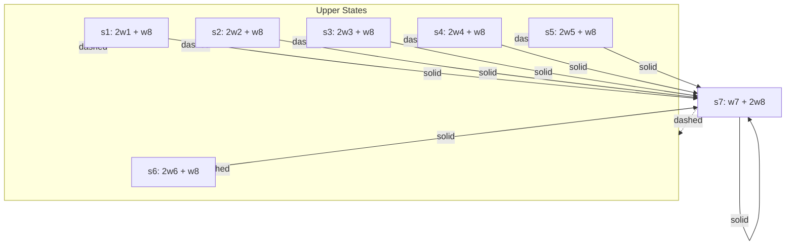

# Chapter 11: Off-policy Methods with Approximation

## Overview
[[Off-Policy Learning]] with [[Function Approximation]] is significantly harder than the on-policy case. While tabular off-policy methods extend to [[Semi-Gradient Methods]], they do not converge as robustly. This chapter explores why these methods diverge, introduces the **Deadly Triad**, analyzes the geometry of linear value-function approximation, and presents algorithms with stronger convergence guarantees like [[Gradient-TD Methods]] and **Emphatic-TD**.

---

## 11.1 Semi-gradient Methods
To convert tabular off-policy algorithms to semi-gradient form, we replace the state-value/action-value array updates with updates to a weight vector $\mathbf{w}$.

### Importance Sampling Ratio
For off-policy learning, we use the per-step importance sampling ratio:
$$\rho_t = \rho_{t:t} = \frac{\pi(A_t|S_t)}{b(A_t|S_t)}$$

### Semi-gradient Off-policy TD(0)
The weight update is:
$$\mathbf{w}_{t+1} = \mathbf{w}_t + \alpha \rho_t \delta_t \nabla \hat{v}(S_t, \mathbf{w}_t)$$
where $\delta_t$ is the TD error:
- **Episodic:** $\delta_t = R_{t+1} + \gamma \hat{v}(S_{t+1}, \mathbf{w}_t) - \hat{v}(S_t, \mathbf{w}_t)$
- **Continuing:** $\delta_t = R_{t+1} - \bar{R}_t + \hat{v}(S_{t+1}, \mathbf{w}_t) - \hat{v}(S_t, \mathbf{w}_t)$

> [!info] Semi-gradient Expected Sarsa
> This algorithm does **not** require importance sampling because it uses the expectation over the target policy $\pi$:
> $$\mathbf{w}_{t+1} = \mathbf{w}_t + \alpha \delta_t \nabla \hat{q}(S_t, A_t, \mathbf{w}_t)$$
> $$\delta_t = R_{t+1} + \gamma \sum_a \pi(a|S_{t+1})\hat{q}(S_{t+1}, a, \mathbf{w}_t) - \hat{q}(S_t, A_t, \mathbf{w}_t)$$

---

## 11.2 Examples of Off-policy Divergence
Simple off-policy semi-gradient methods can be unstable and diverge to infinity.

### The w-to-2w Counterexample
Consider two states with features $x(s_1) = 1$ and $x(s_2) = 2$.
Value estimates: $\hat{v}(s_1, w) = w$, $\hat{v}(s_2, w) = 2w$.
Update: $w_{t+1} = w_t + \alpha(2\gamma - 1)w_t = [1 + \alpha(2\gamma - 1)]w_t$.
> [!warning] Divergence Condition
> If $\gamma > 0.5$, the constant $1 + \alpha(2\gamma - 1)$ is greater than 1, and $w$ diverges to $\pm\infty$.

### Baird's Counterexample
A 7-state MDP where the behavior policy $b$ chooses actions that lead to a uniform distribution over states, while the target policy $\pi$ always chooses the "solid" action leading to the 7th state.

- **Result:** Semi-gradient TD(0) and even DP updates diverge for any $\alpha > 0$.

---

## 11.3 The Deadly Triad
Stability is jeopardized when three elements are combined:
1. **[[Function Approximation]]**: Linear or non-linear (ANNs).
2. **[[Bootstrapping]]**: Targets based on existing estimates (TD, DP).
3. **[[Off-Policy Learning]]**: Training on a distribution different from the target policy.

> [!danger] The Triad
> Any two of these are safe, but the combination of all three often leads to [[Off-Policy Divergence]]. We cannot give up function approximation (scalability) or bootstrapping (efficiency), so we must improve off-policy learning methods.

---

## 11.4 Linear Value-function Geometry
We can view value functions as vectors in an $|S|$-dimensional space. Linear approximation restricts these to a $d$-dimensional subspace ($d \ll |S|$).

### Key Operators
- **Bellman Operator ($B_\pi$):** Takes a value function $v$ and produces the expected one-step return: $(B_\pi v)(s) = \sum_{a, s', r} \pi(a|s) p(s', r|s, a) [r + \gamma v(s')]$.
- **Projection Operator ($\Pi$):** Projects any value function $v$ back into the representable subspace: $\Pi v = \hat{v}_\mathbf{w}$ where $\mathbf{w} = \arg\min_\mathbf{w} \| v - \hat{v}_\mathbf{w} \|_\mu^2$.
- **Projection Matrix:** $\Pi = X(X^\top DX)^{-1}X^\top D$.

### Error Measures
1. **Mean Square Value Error ([[Mean Squared Value Error|VE]]):** Distance to true value function $v_\pi$. 
   $$VE(\mathbf{w}) = \|v_\pi - \hat{v}_\mathbf{w}\|_\mu^2$$
2. **Mean Square [[Bellman Error]] (BE):** Distance between value function and its image under $B_\pi$.
   $$BE(\mathbf{w}) = \|B_\pi \hat{v}_\mathbf{w} - \hat{v}_\mathbf{w}\|_\mu^2$$
3. **Mean Square Projected Bellman Error (PBE):** Distance between the projection of $B_\pi \hat{v}_\mathbf{w}$ and $\hat{v}_\mathbf{w}$.
   $$PBE(\mathbf{w}) = \|\Pi B_\pi \hat{v}_\mathbf{w} - \hat{v}_\mathbf{w}\|_\mu^2$$

> [!intuition] The TD Fixed Point
   The point where $PBE(\mathbf{w}) = 0$ is the **[[TD Fixed Point]]** $\mathbf{w}_{TD}$.

---

## 11.5 Gradient Descent in the Bellman Error
Attempting [[Stochastic Gradient Descent]] (SGD) on the BE:

### Residual-Gradient Algorithm
$$ \mathbf{w}_{t+1} = \mathbf{w}_t + \alpha \rho_t [R_{t+1} + \gamma \hat{v}(S_{t+1}, \mathbf{w}_t) - \hat{v}(S_t, \mathbf{w}_t)] [\nabla \hat{v}(S_t, \mathbf{w}_t) - \gamma \nabla \hat{v}(S_{t+1}, \mathbf{w}_t)] $$

> [!warning] Double Sampling Problem
> To get an unbiased estimate of the gradient, one needs two independent samples of the next state $S_{t+1}$ from the same state $S_t$. This is only possible in simulated environments or deterministic systems.

---

## 11.6 The Bellman Error is Not Learnable
A quantity is **learnable** if it can be estimated from the observed sequence of features, actions, and rewards.

- **VE is not learnable**, but the parameter $\mathbf{w}$ that minimizes it **is** learnable (via Monte Carlo).
- **BE is not learnable**, and its minimizing parameter $\mathbf{w}$ is **also not learnable**. Two different MDPs can produce identical data but have different BE-minimizing solutions (A-presplit example).
- **PBE is learnable** and is the target of [[Gradient-TD Methods]].

---

## 11.7 Gradient-TD Methods
Stable O(d) methods for minimizing PBE. They use a second weight vector $\mathbf{v}$ to estimate a part of the gradient.

### GTD2 Algorithm
$$\mathbf{w}_{t+1} = \mathbf{w}_t + \alpha \rho_t (x_t - \gamma x_{t+1}) (x_t^\top \mathbf{v}_t)$$
$$\mathbf{v}_{t+1} = \mathbf{v}_t + \beta \rho_t [\delta_t - (x_t^\top \mathbf{v}_t)] x_t$$

### TDC (Gradient-TD with Correction)
$$\mathbf{w}_{t+1} = \mathbf{w}_t + \alpha \rho_t [\delta_t x_t - \gamma x_{t+1} (x_t^\top \mathbf{v}_t)]$$
$$\mathbf{v}_{t+1} = \mathbf{v}_t + \beta \rho_t [\delta_t - (x_t^\top \mathbf{v}_t)] x_t$$

> [!formula] TDC Derivation
> The PBE gradient can be written as:
> $$\nabla PBE(\mathbf{w}) = -2 \mathbb{E}[\rho \delta \mathbf{x}] + 2 \gamma \mathbb{E}[\rho \mathbf{x}_{t+1} \mathbf{x}_t^\top] \mathbb{E}[\mathbf{x} \mathbf{x}^\top]^{-1} \mathbb{E}[\rho \delta \mathbf{x}]$$
> The vector $\mathbf{v}$ learns $\mathbb{E}[\mathbf{x} \mathbf{x}^\top]^{-1} \mathbb{E}[\rho \delta \mathbf{x}]$.

---

## 11.8 Emphatic-TD Methods
Reweight updates to mimic an on-policy distribution, ensuring stability.

### One-step Emphatic-TD(0)
$$M_t = \gamma \rho_{t-1} M_{t-1} + I_t$$
$$\mathbf{w}_{t+1} = \mathbf{w}_t + \alpha M_t \rho_t \delta_t x_t$$
- $M_t$: **Emphasis**
- $I_t$: **Interest** (user-defined importance of states)

---

## Summary
| Problem | Solution | Stable? | O(d)? |
| :--- | :--- | :--- | :--- |
| Off-policy Divergence | On-policy training or SGD | Yes | Yes |
| Deadly Triad | Avoid one of the three | Yes | Varies |
| Bellman Error | Residual Gradient | Yes | No (Double Sample) |
| Projected Bellman Error| Gradient-TD (TDC/GTD2) | Yes | Yes |
| Mismatch Dist. | Emphatic-TD | Yes | Yes |
