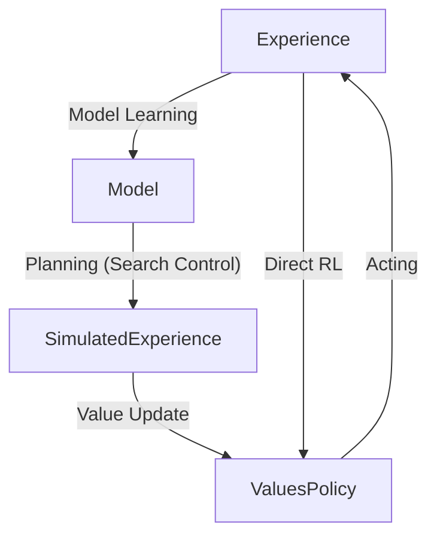

# RL-Book Ch8: Planning and Learning with Tabular Methods

## Overview
This chapter unifies **model-based** RL (planning) and **model-free** RL (learning). 
- **Model-based**: Rely on a [[Model of the Environment]] to plan (e.g., [[Dynamic Programming]]).
- **Model-free**: Rely on direct experience (e.g., [[Q-Learning]], [[Temporal Difference Learning]]).

The core of both is the computation of value functions via **backups** (updates) to future events.

---

## 8.1 Models and Planning

> [!definition] Model of the Environment
> Anything an agent can use to predict how the environment will respond to its actions. 
> - **Distribution Models**: Produce all possible next states and rewards with their probabilities (e.g., $p(s', r | s, a)$).
> - **Sample Models**: Produce just one possible transition, sampled according to the probabilities.

### Planning
**Planning** is any computational process that takes a model as input and produces or improves a policy.

$$ \text{model} \to \text{planning} \to \text{policy} $$

The unified view treats planning as **simulated experience** used to update value functions:
$$ \text{model} \xrightarrow{\text{simulated experience}} \text{backups} \to \text{values} \to \text{policy} $$

---

## 8.2 Dyna: Integrated Planning, Acting, and Learning

Dyna-Q integrates **Direct RL** (learning from real experience) and **Indirect RL** (planning from simulated experience).

### Dyna Architecture

*Figure 8.1: The general Dyna Architecture.*

### Tabular Dyna-Q Algorithm
> [!formula] Tabular Dyna-Q
> 1. Initialize $Q(s, a)$ and $Model(s, a)$
> 2. Loop forever:
>    - (a) $S \leftarrow$ current state
>    - (b) $A \leftarrow \epsilon\text{-greedy}(S, Q)$
>    - (c) Take action $A$; observe $R, S'$
>    - (d) $Q(S, A) \leftarrow Q(S, A) + \alpha [R + \gamma \max_a Q(S', a) - Q(S, A)]$ (**Direct RL**)
>    - (e) $Model(S, A) \leftarrow R, S'$ (**Model Learning**)
>    - (f) Loop repeat $n$ times (**Planning**):
>       - $S \leftarrow$ random previously observed state
>       - $A \leftarrow$ random action previously taken in $S$
>       - $R, S' \leftarrow Model(S, A)$
>       - $Q(S, A) \leftarrow Q(S, A) + \alpha [R + \gamma \max_a Q(S', a) - Q(S, A)]$

> [!intuition]
> Planning allows the agent to propagate value information faster than real-time interaction. In the **Dyna Maze**, an agent with $n=50$ planning steps finds the optimal path in 3 episodes, while a non-planning agent ($n=0$) takes ~25.

---

## 8.3 When the Model Is Wrong
Models can be incorrect due to stochasticity, limited samples, or environment changes.

### Dyna-Q+
When the environment changes to become *better* (e.g., a shortcut opens), standard Dyna-Q might never find it because its model claims that path is bad.
- **Exploration Bonus**: Encourage the agent to test long-untried actions.
- Update planning reward as: $R + \kappa \sqrt{\tau}$, where $\tau$ is the time steps since the state-action pair was last tried.

---

## 8.4 Prioritized Sweeping
Uniform random sampling of states in Dyna is inefficient. **Prioritized Sweeping** focuses on states whose values have recently changed significantly.

> [!tip] Backward Focusing
> Work backward from a state whose value changed significantly to its predecessor states.

---

## 8.5 Expected vs. Sample Updates
- **Expected Updates**: Use the full distribution $p(s', r | s, a)$. Perfect estimate but computationally expensive ($b$ branching factor).
- **Sample Updates**: Use a single sample $S', R$. Noisy, but $b$ times cheaper.

> [!intuition]
> On problems with large branching factors $b$, sample updates often converge to a better value estimate faster than expected updates because they can process $b$ different states in the same time an expected update processes one.

---

## 8.7 Real-time Dynamic Programming (RTDP)
RTDP is an **on-policy trajectory-sampling** version of value iteration.
- It skips **Irrelevant States** (states unreachable from start states under any optimal policy).
- Converges to optimality on relevant states without visiting every state indefinitely.

---

## 8.8 Planning at Decision Time
- **Background Planning**: (e.g., Dyna) Plan continuously to improve a global policy/value function.
- **Decision-time Planning**: Begin planning *after* encountering a state $S_t$ to pick a single action $A_t$ (e.g., Heuristic Search).

---

## 8.11 Monte Carlo Tree Search (MCTS)
MCTS is a rollout algorithm that focuses on the most promising parts of the search tree.

### The 4 Phases of MCTS
1. **Selection**: Use a **Tree Policy** (e.g., UCB1) to traverse the tree from the root to a leaf.
2. **Expansion**: Add one or more child nodes to the tree.
3. **Simulation**: Perform a **Rollout** (using a simple policy) from the new node to the end of the episode.
4. **Backup**: Propagate the return of the simulation back up the tree to update node statistics.

> [!example] MCTS in Go
> MCTS allows evaluating moves in games with massive branching factors where global value approximation is difficult.

---

## Summary: Dimensions of RL
The space of RL methods is defined by:
1. **Depth of Update**: 1-step ([[Tabular RL]]/TD) $\longleftrightarrow$ Full return ([[Monte Carlo]]).
2. **Width of Update**: Sample updates $\longleftrightarrow$ Expected updates ([[Dynamic Programming]]).
3. **On-policy vs. Off-policy**.
4. **Real vs. Simulated Experience**.
