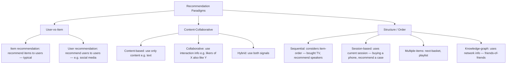
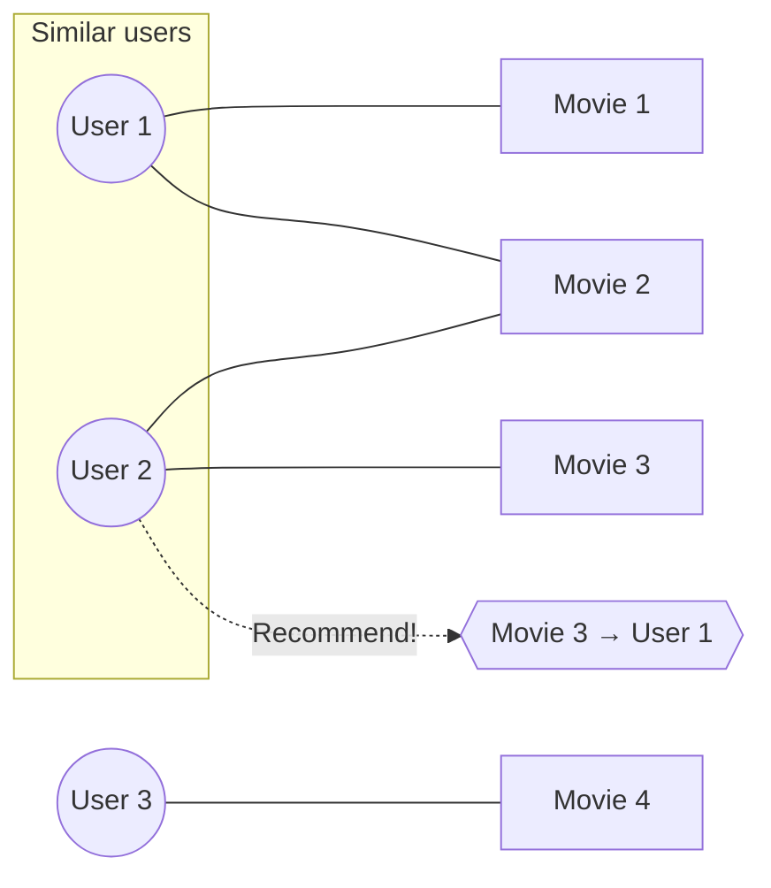

# RS-L01 - Course Overview & Introduction

> [!abstract] Overview
> This is the opening lecture of the UvA MSc AI **Recommender Systems** course (Maarten de Rijke, Yubao Tang). It has three layers: (a) **course logistics** — objectives, schedule, grading, compute, projects; (b) a **conceptual introduction** to [[Recommender Systems]] — formal definition, domains, paradigms, challenges, real-world case studies (Spotify, bol.com), and a first look at evaluation; and (c) a **technical first pass** over the core recommendation methods: [[Collaborative Filtering]] (neighborhood-based and model-based), [[Matrix Factorization]], and [[Neural Collaborative Filtering]] (NCF). The recurring themes — evaluation *beyond accuracy*, *no single winning model*, and *reproducibility* — set up the rest of the course. There is **no textbook**; the slides are the only source (lectures are partly based on the *Recommender Systems Handbook*, Ricci et al., 2011).

---

## 1. Course Overview

### 1.1 Course Objectives
After completing the course you will be able to:
- Have **advanced knowledge** of state-of-the-art recommendation algorithms.
- **Understand and assess evaluation methodologies** for recommendation algorithms — not just **effectiveness and efficiency** but also **broader implications** (fairness, diversity, ethics).
- **Implement and evaluate** recommendation algorithms.
- **Contribute to academic research** on recommender systems.

### 1.2 Course Schedule
The course is compressed into June 2026. Mandatory items marked with `*`.

| Item | When | Topic |
| :--- | :--- | :--- |
| **Lecture 1** `*` | Mon Jun 1, 11:00–13:00 | Intro, Team Formation & Projects |
| Lecture 2 | Tue Jun 2, 13:00–15:00 | [[RS-L02 - Evaluation Beyond Accuracy\|Beyond Accuracy in RecSys]] |
| Lecture 3 | Thu Jun 4, 11:00–13:00 | [[RS-L03a - Sequential Recommendation Models\|SeqRec]] & [[RS-L03b - From LLMs to LRMs\|LLMs for RecSys]] |
| Lecture 4 | Fri Jun 5, 15:00–17:00 | [[RS-L04 - Generative Recommendation\|Generative RecSys]] |
| **Project meetings** `*` | Wed Jun 3, 10, 17, 24 | Periodic check-in & supervision (in-person preferred) |
| **Mid-term presentation** `*` | Mon Jun 15 | |
| **Final poster session** `*` | Fri Jun 26 | |

### 1.3 Grading
The course is **project-heavy** — there is no written exam; the grade is dominated by the team project. Detailed rubrics live on Canvas.

| Component | Weight | Breakdown |
| :--- | :--- | :--- |
| **Project (Report)** | **60%** | Replication 25%; Extension–fairness/diversity eval 15%; Extension–new dataset(s) 10%; Extension–methodology 20%; Analysis quality 15%; Report quality ("publishability") 15% |
| **Repository** | **20%** | Documentation 30%; Code readability/quality 40%; Completeness (all experiments documented) 20%; Minimally-reproducible experiment 10% |
| **Mid-term discussion/presentation** | **10%** | |
| **Final (poster) presentation** | **10%** | |
| Project Meetings (extra credit) | +5% | |

> [!note] Note on the rubric percentages
> The "breakdown" percentages are *within* each component (they sum to 100% inside the Project box and inside the Repository box), not slices of the overall grade.

### 1.4 Compute & Resources
- **2 million SBU compute credits** are available to facilitate experiments — **use them wisely**.
- TAs help avoid costly mistakes, but the **initiative to ask for help is on the student**.
- **Abuse of compute credits → immediate removal from the course and deletion of created materials.**
- Resources (Canvas → Modules → General Information):
  - Canvas: `canvas.uva.nl/courses/56581`
  - Datanose: `datanose.nl/#course[137447]`
  - Available Projects: `bit.ly/recsys26-projects`

---

## 2. Introduction to Recommender Systems

### 2.1 What is a Recommender System?

> [!definition] Recommender System (RecSys)
> A **recommender system** is a subclass of **information filtering** systems that provide **suggestions for items** that are most pertinent to a particular **user**. They are particularly useful when an individual must choose an item from a **potentially overwhelming number of items** that a service offers — i.e., to combat **information overload**.

**A little more formally.** Given a set of users $U = \{u_1, u_2, \ldots, u_n\}$ and a set of items $I = \{i_1, i_2, \ldots, i_m\}$, the goal is to find the item(s) $i$ of interest for a given user $u$.

- In **most cases**, *previous interactions* between (some) users and (some) items are available.
- In **some cases**, *contextual information* about users, items, and/or interactions is available.
- In the simplest case, ranking metrics such as [[Recall]], [[MRR]] and [[NDCG]] are used for evaluation.

### 2.2 Domains
Several **domains** exist, each with its own challenges:

| Domain | Characteristic challenges |
| :--- | :--- |
| **Music** | Inherently **multi-modal**; fine-grained interaction signals (play, skip, add-to-playlist, ...) |
| **News** | Content-based; **recency**; **cold-start** |
| **Movies** | Collaborative; rich data (review text, review score, play-duration) |
| **E-commerce** | Price sensitivity; next-basket; cross-market & cross-domain |
| **Travel / Point-of-Interest** | Sensitive to **context**; geographic constraints; entangled interests |

### 2.3 Paradigms
Recommendation problems decompose along several **paradigm axes**:



- **Sequential** — considers item **order**, e.g. if they bought a TV, recommend a speaker system.
- **Session-based** — considers the **current session's** browsing behavior, e.g. if they are buying a phone, recommend a phone case.
- **Recommend multiple-items** — e.g. next-basket recommendation, playlist generation.
- **Knowledge-graph / base** — considers **network information**, e.g. if B knows A and C, and A & C are friends with D, recommend D to B.

### 2.4 Challenges via Case Studies
The precise set of challenges **depends on the domain**, illustrated below with two real systems.

#### Case study A — Music (Spotify)

> [!example] Figure 1: Music Recommender System (Spotify desktop app)
> A reproduction of the surface layout:
> ```
> ┌──────────────┬───────────────────────────────────────────────┐
> │ LIBRARY      │  "Special voor David"  (personalized for user) │
> │ (sidebar)    │  ┌──────┐┌──────┐┌──────┐┌──────┐┌──────────┐  │
> │ • Playlists  │  │Daily ││Daily ││Daily ││Daily ││ Discover │  │
> │ • Oscar      │  │Mix 3 ││Mix 4 ││Mix 5 ││Mix 6 ││ Weekly   │  │
> │   Peterson   │  └──────┘└──────┘└──────┘└──────┘└──────────┘  │
> │ • Tide Lines │                                                 │
> │ • Dark &     │  "Onlangs afgespeeld"  (recently played)        │
> │   Stormy     │  ┌──────┐┌──────┐┌──────────┐┌──────────────┐  │
> │ • Sons Of    │  │Daily ││Wave- ││Pink      ││Oscar Peterson│  │
> │   The East   │  │Mix 1 ││bound ││Floyd     ││              │  │
> │              │  └──────┘└──────┘└──────────┘└──────────────┘  │
> ├──────────────┴───────────────────────────────────────────────┤
> │  [<<]  [>]  [>>]   ────────●─────────────────   playback bar   │
> └───────────────────────────────────────────────────────────────┘
> ```
> Illustrates **personalized, multi-row recommendation surfaces** and "discovery" playlists (Daily Mix, Discover Weekly).

**Music challenges:**
- **Fairness** — towards artists (are we discriminating against certain ethnicities/genders?) and towards **non-mainstream music** (are we bad at classical music because it is less popular than pop?).
- **Freshness** — people like to re-listen to the same music, but sometimes want something new (balance **repeat vs. novelty**).
- **Context** — music taste is highly influenced by mood, location, etc.

#### Case study B — E-commerce (bol.com)

> [!example] Figure 2: E-Commerce Recommender System (bol.com storefront)
> ```
> "Topdeals voor jou"   (top deals for you)
> ┌─────────┐┌─────────┐┌─────────┐┌─────────┐┌─────────┐
> │ LEGO set││electron.││ knife   ││ product ││ product │  ← personalized
> │ €/-disc ││ €/-disc ││ €/-disc ││ €/-disc ││ €/-disc │    product cards
> └─────────┘└─────────┘└─────────┘└─────────┘└─────────┘
> "Merken voor jou"     (brands for you)
> ( Hailo )  ( AGU )  ( Roselli )  ( Philips )   ← recommended brand logos
> "Kies een categorie"  (choose a category)
> [ cat ] [ cat ] [ cat ] [ cat ]               ← category tiles
> ```
> Illustrates personalized **product**, **brand**, and **category** recommendations on one e-commerce site.

**E-commerce challenges:**
- **Customer Intent** — users often have a specific purchase goal; how do we identify it?
- **Giant item catalogs & user bases** — can lead to **scaling** issues.
- **Re-purchasability** — most people need only one game console, but might like several games (some items are one-off purchases, others repeat).

### 2.5 In Short: Evaluation
We have built a recommender system — *how do we ensure the recommendations are good?*

> [!definition] Evaluation
> **Evaluation** measures the **quality** and **effectiveness** of recommender systems in order to:
> - **Identify** the strengths and weaknesses of different algorithms.
> - **Compare** the performance of different algorithms.
> - **Guide** the design and optimization of recommender systems.

Two settings (detailed in [[RS-L02 - Evaluation Beyond Accuracy]]):
- **[[Offline Evaluation]]** — uses **historical (log) data** to evaluate recommenders.
- **[[Online Evaluation]]** — **deploys** the system and compares it to an existing system, i.e. **[[A/B Testing]]**.

#### Accuracy-based metrics
Accuracy-based metrics evaluate the ability to find relevant items meeting users' preferences. Two broad types:
- **Set-based metrics** — do **not** consider the specific ranks/positions of relevant items.
- **Ranking metrics** — **do** consider the ranks/positions of relevant items.

> [!formula] Set-based: Recall (a.k.a. Hit-rate)
> $$\mathrm{Recall} = \frac{\text{Number of correctly recommended relevant items}}{\text{Number of relevant items}}$$
> Higher is better ($\uparrow$). Measures the proportion of relevant items that were retrieved, regardless of *where* they appear in the list.

> [!formula] Rank-aware: Mean Reciprocal Rank (MRR)
> $$\mathrm{MRR} = \frac{1}{\text{Rank of the first relevant item}}$$
> Higher is better ($\uparrow$). Rewards getting the **first** relevant item as high as possible. (The "mean" is over queries/users; for a single query it is just the reciprocal rank.)

> [!example] Worked example — why rank matters
> Relevant items: $\{B, D\}$. Two candidate rankings:
> - **Ranking 1:** $A, B, C, D, E, F, G, \ldots$
> - **Ranking 2:** $B, D, A, C, E, F, G, \ldots$
>
> **Which is better?**
>
> | Metric | Ranking 1 | Ranking 2 | Distinguishes? |
> | :--- | :--- | :--- | :--- |
> | **Recall** (set-based) | both lists contain $B,D$ at the same cutoff → **same** | **same** | **No** |
> | **MRR** (rank-aware) | first relevant = $B$ at rank 2 → $\tfrac{1}{2}$ | first relevant = $B$ at rank 1 → $\tfrac{1}{1}=1$ | **Yes** |
>
> **Conclusion:** Recall cannot tell the two apart even though Ranking 2 puts relevant items higher; MRR correctly identifies **Ranking 2** as better. This motivates rank-aware metrics like MRR and [[NDCG]].

#### Beyond-Accuracy
Accuracy metrics only capture **correctness**. Other factors matter for a "good" recommendation — collectively **[[Beyond-Accuracy Metrics|beyond-accuracy metrics]]**:
- **[[Diversity]]** — returning items from the same movie category can *decrease* user engagement.
- **[[Fairness in Recommendation|Fairness]]** — may be ethically/morally/legally required. E.g. **job recommendation**: real-world **bias** can creep into the data and must be accounted for.
- *Detailed treatment in [[RS-L02 - Evaluation Beyond Accuracy]].*

### 2.6 Team Formation (logistics break)
- Form a **team of 4**; register in Canvas → People → Group project.
- No team? Submit the **Individual Group Matching Form** (Canvas → Modules → General Information) and you will be assigned a team.
- **Deadline: June 1, 4 PM.**

---

## 3. Methods

The methods covered: [[Collaborative Filtering]] (neighborhood-based, model-based), [[Matrix Factorization]], neural networks / [[Neural Collaborative Filtering]], plus pointers to other paradigms.

### 3.1 Collaborative Filtering

> [!definition] Collaborative Filtering (CF)
> A popular recommendation technique whose predictions leverage the **collective knowledge of a large pool of users** — i.e. **user–item interaction data**. The intuition: *users who agreed in the past will agree in the future.*



**Reading the diagram:** Three users on the left connect (edges) to four movies they interacted with / liked. **User 1 and User 2 are detected as similar** (they share item interactions). Since User 2 liked a movie (Movie 3) that **User 1 has not seen**, that movie is **recommended** to User 1 (dashed green "Recommend!" arrow). Data flow: *shared interactions → user similarity → recommend items liked by similar users but not yet seen by the target user.*

**Two types of CF:**
- **[[Neighborhood-based Collaborative Filtering|Neighborhood-based]] (a.k.a. [[Memory-based Collaborative Filtering|memory-based]]) CF** — leverage the **similarity** between users or items to make recommendations.
- **[[Model-based Collaborative Filtering|Model-based]] CF** — employ **more sophisticated mathematical models** to generate recommendations.

### 3.2 Neighborhood-based CF: User-based Rating Prediction

[[User-based Rating Prediction]] predicts the rating $r_{ui}$ of a user $u$ for a new item $i$ using the ratings given to $i$ by the users **most similar to $u$** (the **nearest neighbors**).

> [!formula] User-based prediction (average over neighbors)
> $$\hat{r}_{ui} = \frac{1}{|\mathcal{N}_i(u)|} \sum_{v \in \mathcal{N}_i(u)} r_{vi}$$
> where:
> - $\hat{r}_{ui}$ = predicted rating of user $u$ for item $i$.
> - $\mathcal{N}_i(u)$ = the set of the $k$ **nearest neighbors** of $u$ who have rated item $i$.
> - $r_{vi}$ = the rating that neighbor $v$ gave to item $i$.
>
> (Estimate = the **average rating** that $u$'s neighbors gave to $i$.)

> [!example] Table 1 — Toy example (ratings of 4 users for 5 movies)
>
> | User | The Matrix | Titanic | Die Hard | Forrest Gump | Wall-E |
> |------|:---------:|:-------:|:--------:|:------------:|:------:|
> | John | 5 | 1 | – | 2 | 2 |
> | Lucy | 1 | 5 | 2 | 5 | 5 |
> | **Eric** | 2 | **?** | 3 | 5 | 4 |
> | Diane | 3 | 3 | 1 | 3 | – |
>
> `–` = missing rating; `?` = the rating we want to predict (**Eric's rating for Titanic**).
>
> **Predict Eric's Titanic rating using Lucy** ($k=1$, Lucy is Eric's single nearest neighbor):
> $$\hat{r}_{ui} = \frac{1}{|\mathcal{N}_i(u)|} \sum_{v \in \mathcal{N}_i(u)} r_{vi} = 5$$
> With $k=1$ and the only neighbor being Lucy, the prediction is simply **Lucy's rating of Titanic = 5**.
>
> **Why Lucy?** Her rating pattern (high on Titanic/Forrest Gump/Wall-E, low on The Matrix) is the most similar to Eric's, who also rates Forrest Gump and Wall-E highly and The Matrix low.

> [!note] Neighborhood-based CF — pros & cons
> A model is **not** explicitly designed in advance; the method relies purely on the **similarity of two entities**.
> - **Advantages:** Simple, efficient, **transparent** (recommendations are easy to explain).
> - **Drawbacks:** **Sparsity**, **noise**, **scalability** (sometimes).

### 3.3 Model-based CF

> [!note] Model-based CF — pros & cons
> **Train a model from the data.**
> - **Advantages:** **Scalability**.
> - **Drawbacks:** **Complexity**, **black box**, and **overfitting** with insufficient data.

### 3.4 Matrix Factorization

> [!definition] Matrix Factorization (MF)
> **MF** decomposes a user–item interaction matrix into **lower-dimensional matrices** representing users and items. Each **user** is represented by a **user factor**, each **item** by an **item factor**, and their interaction is modeled by **comparing these two factors** (dot product).

**General recipe:** (1) define a model → (2) define an objective function → (3) optimize.

**The ratings matrix.** Suppose we have an $m \times n$ ratings matrix $R$ with $m$ users and $n$ items/movies. In the example, $m = 7$, $n = 6$ (image credit: Ricci et al., 2011).

> [!example] Figure: the $7 \times 6$ ratings matrix $R$
> Columns = movies; entries $\in \{+1, 0, -1\}$ (like / neutral / dislike).
> ```
>            NERO  J.CAESAR  CLEOPATRA  SLEEPLESS  PRETTY_WOMAN  CASABLANCA
> User 1      1       1          1          0           0            0      ┐
> User 2      1       1          1          0           0            0      │ HISTORY
> User 3      1       1          1          0           0            0      ┘
> User 4      1       1          1          1           1            1        BOTH
> User 5     -1      -1         -1          1           1            1      ┐
> User 6     -1      -1         -1          1           1            1      │ ROMANCE
> User 7     -1      -1         -1          1           1            1      ┘
> ```
> Two latent **column** groups (history films vs. romance films) and three latent **row** groups (history users / both / romance users) are visually apparent — foreshadowing the rank-2 factorization.

> [!formula] The factorization
> $$R \approx U V^{T}$$
> - $R$ is $m \times n$; $U$ is $m \times k$; $V$ is $n \times k$ ($k$ = number of latent factors/concepts).
> - Each **row of $U$** is a **user factor** — a user's preferences over latent concepts.
> - Each **row of $V$** is an **item factor** — an item's properties over the same latent concepts.
> - A rating is estimated by the **dot product** of the corresponding factors:
> $$r_{ij} \approx \bar{u}_i \cdot \bar{v}_j$$
> where $\bar{u}_i$ = factor vector of user $i$, $\bar{v}_j$ = factor vector of item $j$.

> [!example] Rank-2 factorization with interpretable latent factors ($k=2$: HISTORY, ROMANCE)
> ```
>        R  (7×6)             ≈        U  (7×2)        ×        Vᵀ  (2×6)
>                                   HIST  ROM
> U1 [ 1  1  1  0  0  0]            [ 1    0 ]                NERO JC  CLEO SLEEP PRETTY CASA
> U2 [ 1  1  1  0  0  0]            [ 1    0 ]      HIST row [  1   1    1    0      0     0 ]
> U3 [ 1  1  1  0  0  0]            [ 1    0 ]      ROM  row [  0   0    1    1      1     1 ]
> U4 [ 1  1  1  1  1  1]    ≈       [ 1    1 ]   ×
> U5 [-1 -1 -1  1  1  1]            [-1    1 ]
> U6 [-1 -1 -1  1  1  1]            [-1    1 ]
> U7 [-1 -1 -1  1  1  1]            [-1    1 ]
> ```
> - $U$ rows: history users $\approx(1,0)$; "both" user $\approx(1,1)$; romance users $\approx(-1,1)$ (anti-history, pro-romance).
> - $V^{T}$ rows: HISTORY $\approx(1,1,1,0,0,0)$ (Nero, Julius Caesar, Cleopatra); ROMANCE $\approx(0,0,1,1,1,1)$ (Sleepless in Seattle, Pretty Woman, Casablanca, and partly Cleopatra).
>
> **Rating reconstructed as a sum over latent factors:**
> $$r_{ij} \approx (\text{affinity of user } i \text{ to } history)\times(\text{affinity of item } j \text{ to } history) + (\text{affinity of user } i \text{ to } romance)\times(\text{affinity of item } j \text{ to } romance)$$
>
> **Takeaway:** latent factors can be **interpretable** (here genre dimensions); the user–item dot product reconstructs the rating.

### 3.5 Neural Networks for Recommendation

**Motivation — why go neural?** Traditional MF is limited to **linear** relationships. Neural networks add:
- **Non-linearity** — non-linear activations capture **complex user–item interaction patterns**.
- **Sequential signals** — model **temporal dynamics** of user behavior and item evolution.
- **Heterogeneous content** — reduce hand-crafted feature design; ingest text, images, audio, even video.

#### Neural Collaborative Filtering (NCF)
[[Neural Collaborative Filtering|NCF]] was proposed in **He et al., 2017** for **top-n recommendation**. It uses the flexibility, complexity, and non-linearity of neural networks to build a recommender, **proves that Matrix Factorization is a special case of NCF**, and shows NCF outperforms state-of-the-art models on two public datasets.

> [!example] General NCF framework (architecture, bottom-up; image credit: He et al., 2017)
> ```
>                 Target  yᵤᵢ          ← compared during Training
>                   │
>            ┌──────────────┐
>            │ Output Layer │  →  Score  ŷᵤᵢ
>            └──────────────┘
>                   ▲
>            ┌──────────────┐
>            │  Layer X     │
>            │    ...       │   Neural CF Layers  (non-linear, model complex
>            │  Layer 2     │                      latent-space interactions)
>            │  Layer 1     │
>            └──────────────┘
>            ▲              ▲
>   User Latent Vec    Item Latent Vec
>   Pᵀ vᵤᵁ = pᵤ        Qᵀ vᵢᴵ = qᵢ      ← Embedding Layer (dense)
>            ▲              ▲
>   [0 0 1 0 ...]    [0 1 0 0 ...]      ← Input Layer (Sparse, one-hot)
>      user u            item i
> ```
> Data flow: one-hot $u$, $i$ → embedding layer → dense latent vectors $p_u$, $q_i$ → stacked **Neural CF layers** (non-linear) → output **Score $\hat{y}_{ui}$**, compared to **Target $y_{ui}$**. The non-linear layers let the model estimate **complex interactions** between user and item in latent space.

> [!formula] Learning NCF (binary classification)
> Treat the task as **binary classification**: view $y_{ui}$ as a label — **1** if item $i$ is relevant to $u$, **0** otherwise. Trainable with:
> - **Weighted square loss** — for **[[Explicit Feedback]]**, or
> - **Binary cross-entropy loss** — for **[[Implicit Feedback]]**.
>
> **[[Negative Sampling]]** is used to reduce the huge number of unobserved (negative) training instances.

> [!example] NCF generalizes MF (specialized architecture; element-wise multiply + fixed unit weights)
> ```
>                          Score ŷᵤᵢ ,  L(x) = x  (identity activation)
>                   │
>            ┌──────────────┐
>            │ Output Layer │  ← weight = fixed Unit Matrix J_{K×1}  (all ones)
>            └──────────────┘
>                   ▲
>            ┌──────────────────┐
>            │ Multiplication   │  ← element-wise product of pᵤ and qᵢ
>            └──────────────────┘
>            ▲              ▲
>      pᵤ = Pᵀ vᵤᵁ     qᵢ = Qᵀ vᵢᴵ       (same Embedding Layer)
>            ▲              ▲
>   [0 0 1 0 ...]    [0 1 0 0 ...]        (same one-hot Input Layer)
> ```
> Replace the Neural CF layers with a single **multiplication layer** (element-wise product of $p_u$, $q_i$), set the output weight to the **fixed unit matrix** $J_{K\times1}$ (all ones), and use the **identity** activation $L(x)=x$. Then:
> $$\hat{y}_{ui} = \sum_{f=1}^{K} (p_u)_f \,(q_i)_f = p_u \cdot q_i$$
> which is exactly **Matrix Factorization**. Hence **MF is a special case of NCF**.

### 3.6 Other Paradigms
- **Content-based** — use content (text, audio, etc.); plus **[[Hybrid Recommendation|hybrid]]** approaches that use both content and CF.
- **Sequential recommendation** — consider the **order** of interactions → [[RS-L03a - Sequential Recommendation Models]].
- **LLM-based recommenders** → [[RS-L03b - From LLMs to LRMs]].
- **Generative Recommendation** → [[RS-L04 - Generative Recommendation]].

### 3.7 There Is No Winner
While different models become more popular at different times, there is **no absolute winner**. The best model depends on:
- **Problem formulation** (e.g. sequential or not).
- **Domain** (e.g. news vs. retail).
- **Contextual data available** (e.g. images vs. text).

In many cases a **[[Hybrid Recommendation|hybrid design]]** is the best choice.

### 3.8 Reproducibility Is a Concern
**Dacrema et al., 2019** highlighted a reproducibility crisis in RecSys research:
- Only **7 of 18** considered methods could be reproduced with reasonable effort.
- Only **1 of those 7** beat **tuned, simple baselines**.

> [!warning] Reproducibility guidelines
> - Ensure fair comparison: **always tune your baselines**.
> - Count the **number of parameters** — is the comparison fair?
> - **Never tune / perform hyperparameter selection on the test set.**

---

## 4. Projects (logistics)
- **Overview Projects:** `bit.ly/recsys26-projects` (Canvas → Modules → General Information → Overview Projects).
- **Submit project preferences by 16:00 today**; assignments finalized ASAP (watch email / Canvas).
- **Who to ask for help:**
  - General-interest questions → **Ed Discussion**.
  - Time-sensitive / personal matters → Yubao & Alejandro.
  - Compute (Snellius) help → your supervisor.
- **Use of AI tools:** you must understand your paper, code, experiments, and results. Mid-term and final presentations assess the team's **own** understanding. **Work that cannot be explained or justified may lead to failing the course.**

---

## Key Takeaways

> [!tip] Exam focus
> - **Definition:** a RecSys is an **information filtering** system suggesting items pertinent to a user, fighting **information overload**. Formally: given users $U$ and items $I$, find items of interest for $u$, usually using prior **interactions** and (sometimes) **context**.
> - **Paradigm axes:** user-vs-item; content / collaborative / hybrid; plus sequential, session-based, multi-item/next-basket, knowledge-graph.
> - **Evaluation:** offline (log data) vs. online (**A/B testing**). Accuracy metrics = **set-based** (Recall/Hit-rate) vs **rank-aware** (MRR, NDCG). Memorize the worked example: with relevant $\{B,D\}$, Recall gives both rankings the same score but **MRR** = $\tfrac12$ vs $1$ — rank-aware metrics distinguish them. **Beyond-accuracy** (diversity, fairness, novelty) also matters.
> - **CF families:** neighborhood/memory-based (similarity, k-NN; simple, transparent, but sparsity/noise/scalability) vs model-based (trained; scalable but complex/black-box/overfitting-prone).
> - **User-based prediction formula:** $\hat{r}_{ui} = \frac{1}{|\mathcal{N}_i(u)|}\sum_{v\in\mathcal{N}_i(u)} r_{vi}$. In the toy table, predicting Eric's Titanic rating with $k=1$ (Lucy) gives **5**.
> - **Matrix Factorization:** $R \approx UV^T$, rating $\approx \bar u_i \cdot \bar v_j$; latent factors can be **interpretable** (history vs. romance, rank-2 example).
> - **NCF** (He et al., 2017): neural networks overcome MF's **linearity**; trained as binary classification (weighted square loss for explicit, **BCE** for implicit) with **negative sampling**. **MF is a special case of NCF** — replace neural layers with element-wise multiplication, fixed unit-matrix output weights, identity activation ⇒ recovers the dot product $p_u\cdot q_i$.
> - **No universal winner** — model choice depends on problem formulation, domain, available context; hybrids often win.
> - **Reproducibility (Dacrema et al., 2019):** only 7/18 reproducible, only 1/7 beat tuned baselines ⇒ **tune baselines, count parameters, never tune on the test set**.

---

## Links

**Concepts**
- [[Recommender Systems]] · [[Collaborative Filtering]]
- [[Neighborhood-based Collaborative Filtering]] · [[Memory-based Collaborative Filtering]] · [[Model-based Collaborative Filtering]]
- [[User-based Rating Prediction]]
- [[Matrix Factorization]] · [[Neural Collaborative Filtering]]
- [[Explicit Feedback]] · [[Implicit Feedback]] · [[Negative Sampling]]
- [[Hybrid Recommendation]] · [[Content-Based Recommendation]] · [[Sequential Recommendation]]
- [[Recall]] · [[MRR]] · [[NDCG]] · [[Hit Rate]]
- [[Offline Evaluation]] · [[Online Evaluation]] · [[A/B Testing]]
- [[Beyond-Accuracy Metrics]] · [[Diversity]] · [[Fairness in Recommendation]] · [[Popularity Bias]] · [[Cold Start]]

**Related RecSys lectures**
- [[RS-L02 - Evaluation Beyond Accuracy]] — evaluation beyond accuracy (diversity, fairness)
- [[RS-L03a - Sequential Recommendation Models]] — sequential recommendation
- [[RS-L03b - From LLMs to LRMs]] — LLM-based recommenders
- [[RS-L04 - Generative Recommendation]] — generative recommendation

**Papers referenced**
- Dacrema et al., 2019 — *Are we really making much progress?* (RecSys reproducibility)
- He et al., 2017 — *Neural Collaborative Filtering* (WWW)
- Petrov & Macdonald, 2024 — *Transformers for sequential recommendation* (ECIR)
- Ricci et al., 2011 — *Recommender Systems Handbook* (partial source material; **no course textbook**)
