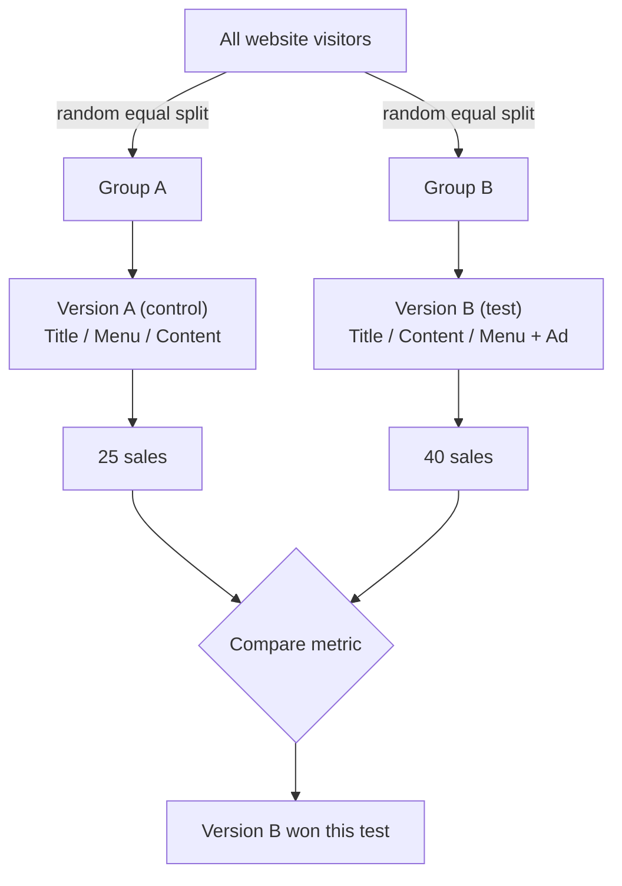
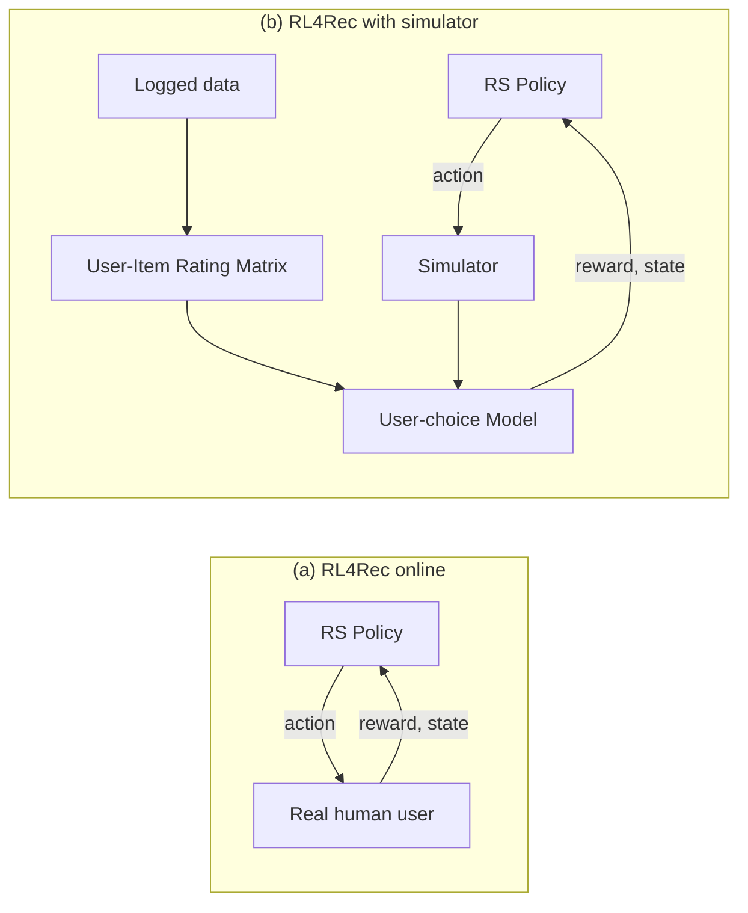
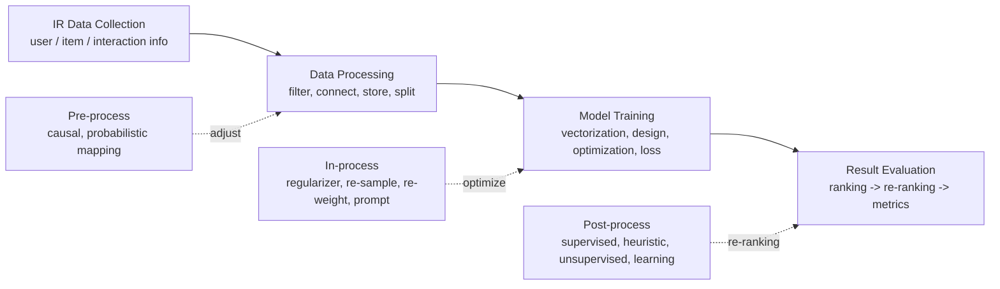

# RS-L02 - Evaluation Beyond Accuracy

> [!abstract] Overview
> This lecture (Clara Rus, UvA IRLab AMS, 2 June 2026) is about **how to measure whether a recommender system is good** — and argues that accuracy alone is not enough. It covers the three **evaluation methods** (offline, online/[[A/B Testing]], simulation), the two families of **accuracy metrics** (non-ranking: [[Recall]]/[[Precision at K|Precision]]/[[F1-Score|F1]]/[[Hit Rate|HR@K]]; ranking-aware: [[NDCG]]/[[MRR]]/[[MAP]]/AUC), and then a deep dive into **beyond-accuracy metrics**: [[Diversity]], [[Serendipity]], [[Novelty]], [[Catalog Coverage|coverage]], and [[Fairness in Recommendation|fairness]] (user-side and item-side). It closes with **multi-objective trade-offs**, the societal implications of fairness/diversity, and the **FairDiverse** toolkit that standardizes all of this. The task setting throughout is **[[Top-K Recommendation]]**: suggest the top-K most relevant items to a user.

---

## 1. Why evaluate? (slides 3–6)

**Evaluation** = measuring the **quality** and **effectiveness** of a recommender system. We need it to:
- **Identify** strengths and weaknesses of different algorithms;
- **Compare** the performance of different algorithms;
- **Guide** the design and optimization of recommender systems.

**Task setting — [[Top-K Recommendation]]:** suggest the **top-K most relevant items** to a user from the pool of candidate items, based on previous interactions or contextual information. Think of a "Recommended deals for you" shopping strip or a YouTube-style ranked video feed — a single **ranked top-K list**.

---

## 2. Evaluation methods (slides 7–16)

Three families: **offline**, **online** (with [[A/B Testing]]), and **simulation**.

### 2.1 [[Offline Evaluation]] (slides 8–10)

Uses **pre-collected historical data** (ratings, purchase history, click logs) to build a dataset. Train models on a train set, evaluate predictions with offline metrics. Most recommendation **research** uses this setting.

> [!example] Data source
> A user's chronological purchase history — coffee machine → milk frother → electric kettle → Nespresso machine — is the logged signal we train and test on.

**Pros:**
- No deployed system or real users required.
- Fast and convenient for testing many algorithms.

**Cons:**
- Relies on historical data that may **not capture real-time behavior** in a live environment (e.g. the last coffee machine in the history may be unpopular/out-of-date in future).
- Cannot evaluate some **business metrics** such as user satisfaction.

### 2.2 [[Online Evaluation]] (slide 11)

Evaluates the RS in **real time with actual user interactions**, by deploying it in a live environment. Enables **continuous monitoring and improvement**.

### 2.3 [[A/B Testing]] (slides 12–13)

The standard online-evaluation method.

**Main steps:**
1. **Define the objective** — pick the specific aspect to evaluate/compare (conversion rate, revenue, user engagement, or another business metric).
2. **Identify test groups** — **randomly** assign users into a **control group** (current/production system) and one or more **test group(s)** (new version(s)).

**Running the test:**
- Run for some time (**can be risky!**) and collect enough data to do **significance testing** — determining whether observed differences are statistically meaningful or just random variation.
- If the new algorithm is promising, optimize and integrate it into production; otherwise explore alternatives.
- Ref: online lecture "Lessons from Running A/B/n Tests for 12 Years".



### 2.4 Simulation (slides 14–16)

**Motivation:** modeling and simulating user–RS interactions to evaluate performance [Stavinova et al., 2022]. Two driving problems:

**(a) High cost and risk of online evaluation** (lost revenue, harmed UX). A simulator replaces the real human user in the loop:



**(b) Insufficiency of historical data** for offline evaluation. Simulation generates **synthetic data** when real data is limited, sparse, or unavailable.
- *Example:* the logged dataset may be **biased**; simulate an **unbiased** dataset to do unbiased evaluation. A classic source of bias is **[[Position Bias]]** — eye-tracking heatmaps on a results page show attention concentrated on the top-left (top-ranked) items, so clicks reflect position, not just relevance.

**Validation + frameworks:** always validate insights from semi-synthetic simulation through **real-world testing** when possible. Open-source frameworks: **RecoGym** and **RecSim**.

---

## 3. Accuracy-based metrics (slides 17–28)

Accuracy metrics evaluate the ability to find **relevant items** that meet user preferences. Two subtypes: **non-ranking** (ignore positions) and **ranking-aware** (use positions).

### 3.1 Non-ranking / position-agnostic metrics (slides 19–23)

These **do not consider the specific rank/position** of relevant items in the list.

> [!formula] [[Recall]] (↑)
> Fraction of correctly recommended relevant items out of **all relevant items**.
> $$\text{Recall} = \frac{\text{number of correctly recommended relevant items}}{\text{number of relevant items}}$$

> [!formula] [[Precision at K|Precision]] (↑)
> Fraction of correctly recommended relevant items out of **all recommended items**.
> $$\text{Precision} = \frac{\text{number of correctly recommended relevant items}}{\text{number of recommended items}}$$

> [!formula] [[F1-Score|F1-score]] (↑)
> Harmonic mean of precision and recall — a single combined metric.
> $$\text{F1} = 2 \cdot \frac{\text{Precision} \times \text{Recall}}{\text{Precision} + \text{Recall}}$$

> [!formula] [[Hit Rate|Hit Ratio HR@K]] (↑)
> Percentage of users that have **at least one** relevant item in their top-K.
> $$\text{HR@K} = \frac{1}{|U|} \sum_{u \in U} \mathbf{1}\!\left( \text{Rel}_u \cap \text{TopK}_u \neq \emptyset \right)$$
> where $U$ = set of users, $\text{Rel}_u$ = user $u$'s relevant items, $\text{TopK}_u$ = items in $u$'s top-K list, and $\mathbf{1}(\cdot)$ = 1 if the condition holds else 0.

> [!example] HR@3 worked example (credit evidentlyai.com)
> Three users, each with a recommended list flagged Relevant vs Not-relevant:
> - **User 1:** a relevant item appears in top-3 → hit ✓
> - **User 2:** no relevant item in top-3 → miss ✗
> - **User 3:** a relevant item appears in top-3 → hit ✓
>
> $\text{HR@3} = \dfrac{2}{3} = 0.67$. A user counts as a "hit" if **≥1** relevant item is in the top-K; then average over users.

### 3.2 Ranking / position-based metrics (slides 24–28)

These reward putting relevant items **higher** in the list.

> [!formula] [[NDCG]] — Normalized Discounted Cumulative Gain (↑)
> Cumulative gain of the ranked list, discounting relevance by position, normalized by the ideal ranking.
> $$\text{NDCG} = \frac{\displaystyle\sum_{k=1}^{N} \frac{\text{Relevance at }k}{\log_2(k+1)}}{\displaystyle\sum_{k=1}^{N} \frac{\text{Ideal Relevance at }k}{\log_2(k+1)}}$$
> Numerator = **DCG** of the achieved ranking; denominator = **IDCG** of the ideal ranking. The discount $1/\log_2(k+1)$ penalizes relevant items that appear **lower** in the list. Normalization bounds NDCG to $[0,1]$.

> [!example] NDCG intuition (credit evidentlyai.com)
> Two stacked colour bars side by side. In the **ideal ranking** the most-relevant (deep-red) items sit at the top and fade to grey going down. In the **real ranking** the relevant items are scattered/lower. NDCG = how close the achieved ordering is to that ideal ordering.

> [!formula] [[MRR]] — Mean Reciprocal Rank (↑)
> Reciprocal of the rank of the **first relevant item** — rewards surfacing a relevant item early.
> $$\text{MRR} = \frac{1}{\text{rank of the first relevant item}}$$
> Across users, MRR = the mean of these reciprocal ranks.

> [!formula] [[MAP]] — Mean Average Precision (↑)
> Average of the precision values at each position where a relevant item appears; rewards recommending relevant items **earlier**.
> $$\text{AP} = \frac{\displaystyle\sum_{k=1}^{N} \text{Precision at }k \times \text{Relevance at }k}{\text{number of relevant items}}$$
> MAP = mean of AP over all users. Here "Relevance at $k$" acts as a 0/1 gate so only relevant positions contribute.

> [!formula] AUC — Area Under the Curve (↑)
> Probability that the recommender ranks a randomly chosen **positive** example higher than a randomly chosen **negative** one.
> $$\text{AUC} = \frac{\displaystyle\sum_{t_0 \in D^0} \sum_{t_1 \in D^1} \mathbf{1}\!\left[ f(t_0) < f(t_1) \right]}{|D^0| \cdot |D^1|}$$
> $D^0$ = negative examples, $D^1$ = positive examples, $f(\cdot)$ = the model's score, $\mathbf{1}[f(t_0) < f(t_1)]$ = 1 if the positive is scored above the negative. AUC = fraction of (negative, positive) pairs ordered correctly.

---

## 4. Beyond-accuracy metrics (slides 29–47)

> [!intuition] Why go beyond accuracy?
> Accuracy metrics only check the **correctness** of recommendations. But a list of correct-yet-near-identical popular items is a poor experience. Beyond-accuracy metrics capture **high quality** along other axes: variety, surprise, freshness, breadth, and fairness.

### 4.1 [[Diversity]] (slides 30–34)

Measures the **dissimilarity / variety** of recommended items. Quantified with custom equations or similarity metrics over the recommended items. *Example:* in grocery shopping, recommend a mix (fruit, bread, drinks, snacks) to satisfy diverse needs.

> [!intuition] Individual-level diversity (slides 31–32)
> Picture three users, each with an item list, placed on a low→high diversity axis. **Low diversity:** each list is dominated by one category (all sports balls, all cats, all vehicles). **High diversity:** each list mixes many categories (ball + rocket + controller + food; panda + paint + plant + globe; car + music + palm + globe).

> [!formula] [[Diversity Score]] (DS, ↑) — [Liang et al., 2021]
> $$\text{DS} = \frac{\text{number of recommended categories}}{\text{number of recommended items}}$$

> [!formula] [[Intra-List Distance]] (ILD, ↑) — [Cen et al., 2020]
> Average distance between every pair of items in the list. Higher pairwise distance = more diverse.
> $$\text{ILD} = \frac{1}{\binom{N}{2}} \sum_{i=1}^{N} \sum_{j=i+1}^{N} \text{distance}(\text{item}_i, \text{item}_j)$$
> $N$ = list length, $\binom{N}{2}$ = number of unordered item pairs.

> [!formula] [[Entropy]] (↑) — [Jost, 2006]
> Entropy of the category distribution in the list.
> $$\text{Entropy} = -\sum_{i=1}^{N} p(i) \log_2 p(i)$$
> $p(i)$ = probability (frequency) of unique category $i$ in the list; $N$ = number of unique categories.

> [!formula] Gini Index (↑, as a diversity measure)
> Measures inequality of the category distribution (here the Gini–Simpson / $1-\text{HHI}$ form).
> $$\text{Gini} = 1 - \sum_{i=1}^{N} p(i)^2$$
> $p(i)$ = probability of category $i$, $N$ = number of unique categories.
> - **Gini = 0:** no diversity (all items in one category).
> - **Gini = 1:** maximum diversity (items spread evenly across categories).

### 4.2 [[Serendipity]] (slide 35)

> [!formula] [[Serendipity]] (↑) — [Kaminskas and Bridge, 2016]
> Measures the **surprise AND relevance** of recommendations.
> $$\text{Serendipity} = \frac{|R_{\text{unexpected}} \cap R_{\text{useful}}|}{|R|}$$
> $R$ = recommendation set; $R_{\text{unexpected}}$ = items **dissimilar** to what the user liked before; $R_{\text{useful}}$ = items that actually satisfy the user. Serendipity = fraction of recommendations that are both **surprising** and **useful** (surprise without usefulness is just noise).

### 4.3 [[Novelty]] (slide 36)

Degree to which recommended items are **unknown to the user** / different from what they have seen before. Users value staying updated:
- **News:** consistently re-suggesting already-read articles offers no new information → engagement/satisfaction decline over time.
- **Music:** consistently suggesting known songs/artists limits discovery → users get bored.

> [!note] Novelty vs Serendipity
> Novelty only requires the item to be **new/unseen**. Serendipity additionally requires it to be **surprising** (dissimilar to past likes) **and useful**.

### 4.4 [[Catalog Coverage]] (slide 37)

> [!formula] Catalog Coverage (↑)
> Percentage of unique catalog items that ever get recommended — the **breadth** of coverage.
> $$\text{Catalog Coverage} = \frac{\text{number of unique recommended items}}{\text{total number of items in the catalog}}$$

> [!example] Low coverage
> Three users all receive the **same four items** (ball, bell, controller, food). Only a small fixed set is ever recommended; the rest of the catalog stays unexposed — typical of popularity-biased systems.

### 4.5 [[Fairness in Recommendation]] (slides 38–47)

A recommender is a **multi-stakeholder** scenario: rank-based setting, centrality of personalization, and the role of user response [Ekstrand et al., 2022]. Fairness has **two sides**:

- **[[User Fairness]]:** deviation of recommendation **performance (accuracy)** across user groups (grouped by gender, region, activity level).
- **[[Item Fairness]]:** whether items receive a **fair distribution of exposure** by being recommended (grouped by popularity, category, brand).

#### 4.5.1 User-side fairness (slide 39)

A fair algorithm should offer the **same recommendation quality** for different user groups [Li et al., 2021].

> [!formula] UGF — User Group Fairness (↓ lower is better)
> $$\text{UGF} = \left| \frac{1}{|Z_1|} \sum_{i \in Z_1} M(W_i) - \frac{1}{|Z_2|} \sum_{i \in Z_2} M(W_i) \right|$$
> $Z_1, Z_2$ = two user groups (e.g. advantaged vs disadvantaged); $M(W_i)$ = a performance/quality metric for user $i$. UGF = absolute gap in average performance between the groups.

> [!example] User unfairness in practice (slide 39)
> F1@10 measured across three models (**BiasedMF, NeuMF, STAMP**). For every model there are three bars:
>
> | Group | F1@10 (approx) |
> |---|---|
> | Advantaged | ~50–55 |
> | Disadvantaged | ~15 |
> | Overall | ~15 |
>
> A large, consistent gap between advantaged and disadvantaged user groups across all three models.

#### 4.5.2 Item-side fairness (slides 40–47)

**Where does item unfairness come from?**
- **Limited recommendation list:** because the top-K is limited, the algorithm **exacerbates** the existing long-tail distribution, producing unfair product exposure.

```text
Popularity
  |*
  |*
  | *
  |  *           Popular products (small left region)
  |   **
  |     ***
  |        ******
  |              **************  Long Tail (large right region)
  +-------------------------------------> Products
```

- **[[Position Bias]] in ranking** [Singh and Joachims, 2018]: a **small difference in relevance can cause a large difference in exposure**.

> [!example] Job-seeker exposure amplification (slide 41)
> Six candidates $a_1\ldots a_6$ with relevances ~0.82, 0.81, 0.80, 0.77, 0.79, 0.78. Each is shown with a Relevance bar and a "Prob. of interview (Exposure)" bar. Aggregated into two groups:
>
> | Group | Avg relevance | Avg exposure |
> |---|---|---|
> | Top | 0.81 | 0.71 |
> | Bottom | 0.78 | 0.39 |
>
> A **0.03** difference in average relevance becomes a **0.32** difference in average exposure — position bias amplifies tiny relevance gaps into large opportunity gaps.

> [!definition] Item fairness [Raj and Ekstrand, 2022]
> Measures the **exposure (attention)** each item or group receives and assesses whether the exposure distribution is fair — to ensure **statistical parity** or **equality of opportunity**. Exposure is computed by a **browsing model** that accounts for the **decreasing attention** users pay to deeper rank positions.

**Browsing models** (exposure as a function of rank position; all start at 1.0 at position 1):

```text
Exposure
1.0 |*                 Logarithmic (slow decay, ~0.3 @ pos 10)
    |*\
    | \ \
0.5 |  \  \
    |   \   `--.____   <- Logarithmic
    |    \         `-------.____
    | Geom\Cascade (fast decay -> ~0 by pos 6)
0.0 |______`==========================____
      1   2   3   4   5   6   7   8   9  10   Position
```
- **Logarithmic:** slowest decay.
- **Geometric:** fast decay to near 0 by ~position 6.
- **Cascade:** sharp decay to ~0 by ~position 6.

**Statistical parity** — comparable exposure across groups (slides 43–44):

> [!formula] Demographic Parity (DP) — [Singh and Joachims, 2018]
> Ratio of exposure between two groups.
> $$\text{DP} = \frac{\text{Exposure}(G_0)}{\text{Exposure}(G_1)}$$

> [!formula] MinMaxRatio (↑) — [Rehman et al., 2018]
> Ratio between the minimum and maximum exposure over all groups.
> $$\text{MinMaxRatio} = \frac{\min_{g \in G} \text{Exposure}(g)}{\max_{g \in G} \text{Exposure}(g)}$$

> [!formula] Max-Min Fairness (MMF, ↑) — [Xu et al., 2023]
> Focuses on the **most disadvantaged group**: the minimum weight-normalized exposure.
> $$\text{MMF} = \min_{g \in G}\left[ \frac{\text{Exposure}(g)}{\text{Weight}(g)} \right]$$
> $\text{Weight}(g)$ can be the group size or a pre-defined value reflecting group quality.

**Equality of opportunity** — equal treatment based on **merit/utility** (utility ≈ relevance offline) (slides 45–46):

> [!formula] Exposed Utility Ratio (EUR) — [Singh and Joachims, 2018]
> Deviation from the objective "exposure proportional to utility $Y(G)$".
> $$\text{EUR} = \frac{\epsilon(G^+) / Y(G^+)}{\epsilon(G^-) / Y(G^-)}$$
> $\epsilon(G)$ = exposure of group $G$; $Y(G)$ = utility; $G^+, G^-$ = advantaged / disadvantaged groups.

> [!formula] Realized Utility Ratio (RUR) — [Singh and Joachims, 2018]
> Like EUR but uses **actual engagement** — click-through rate $\Gamma(G)$ should be proportional to utility.
> $$\text{RUR} = \frac{\Gamma(G^+) / Y(G^+)}{\Gamma(G^-) / Y(G^-)}$$
> $\Gamma(G)$ = realized engagement (CTR) of group $G$.

> [!formula] Expected Exposure Loss (EEL, ↓) — [Diaz et al., 2020]
> Squared Euclidean distance between the system's expected exposure $\epsilon$ and the target exposure $\epsilon^*$.
> $$\text{EEL} = \| \epsilon - \epsilon^* \|_2^2$$

> [!formula] Inequity of Amortized Attention (IAA, ↓) — [Biega et al., 2018]
> $L_1$ distance between the attention distribution and the predicted-relevance distribution.
> $$\text{IAA} = \sum_{i=1}^{n} |A_i - R_i|$$
> $A_i$ = (amortized) attention received by item $i$; $R_i$ = predicted relevance of item $i$.

**Which item-fairness metric to choose? (slide 47)** — a goal × #groups decision table:

| | Two groups | Multiple groups |
|---|---|---|
| **Statistical parity** | DP | MinMaxRatio, MMF |
| **Equality of opportunity** | EUR, RUR | EEL, IAA |

Recommended reading: "Measuring fairness in ranked results: An analytical and empirical comparison" [Raj and Ekstrand, 2022].

---

## 5. Multi-objective evaluation (slides 48–51)

When considering more than one metric or stakeholder, **trade-offs** may exist [Jannach and Abdollahpouri, 2023].

**Trade-off examples:**
- **Diversity vs Accuracy:** highly accurate recommendations tend to recommend popular/similar items → less diverse. Over time this can form a **[[Filter Bubble]]**.

> [!intuition] Formation of a filter bubble (slide 49)
> Track a user's recommendation distribution along a "Games — Sports" axis over time. At $t_1$ it broadly covers both Games and Sports; over successive steps it narrows; by "now" it is a sharp peak on one side (e.g. Games) — a filter bubble. Optimizing accuracy progressively narrows diversity.

- **Fairness vs Accuracy:** highly accurate recommendations can reflect/reinforce existing biases → unfair outcomes for some user groups (e.g. explore-prone users) or item groups (e.g. unpopular items).
- **Efficiency vs Accuracy:** higher accuracy may need complex models (GNN, Transformer) and more interactions → longer inference time.

**Win-win relations (not always conflicting):**
- **Yin et al.:** diversity and accuracy can improve **together** in sequential recommendation.
- **Ferrari Dacrema et al.:** simple neighbor-based methods with proper hyper-parameter tuning can **outperform** many complex models.
- **Liu et al.:** in next-basket recommendation, **repeat-biased** methods tend to beat explore-biased methods on **both** accuracy and item-fairness.

---

## 6. Implications of fairness and diversity (slides 52–55)

**Why it matters (implications):**
- **Under-exposure:** underexposed providers may lose revenue and **abandon the platform**.
- **User trust:** users who perceive discrimination lose trust → reduced engagement.
- **User satisfaction:** lack of fairness/diversity (e.g. favoring popular items) → dissatisfaction → reduced engagement.

**Risks of applying fairness/diversity interventions:**
- **Trade-offs with accuracy:** constraints can reduce accuracy → lower satisfaction/engagement → also loss on the provider side.
- **Reinforcing stereotypes:** promoting groups for fairness **without regard to candidate utility** can reinforce harmful stereotypes.

**Impact on users and society:**
- **Representation & inclusion:** underrepresented groups may be excluded (e.g. fewer job ads shown to women in STEM).
- **Echo chambers & polarization:** algorithms reinforcing beliefs (e.g. a news feed promoting political bubbles).
- **Economic inequality:** discriminatory recommendations can limit access to jobs/housing (e.g. higher-paying jobs recommended mostly to men).

---

## 7. FairDiverse toolkit (slides 56–87)

**Motivation:** fairness/diversity research suffers from (1) **lack of unified definitions**, (2) **inconsistent evaluation** (different metrics, datasets, setups), and (3) **limited comparability**. **FairDiverse** is an open-source, standardized toolkit to evaluate and compare fairness and diversity in IR systems — for both **Search** and **Recommendation**.

### 7.1 Comparison with existing toolkits (slide 58)

| Feature | **RecBole** | **FFB** | **Fairlearn** | **AIF360** | **Aequitas** | **FairDiverse** |
|---|---|---|---|---|---|---|
| Recommendation | ✓ | ✗ | ✗ | ✗ | ✗ | ✓ |
| Search | ✗ | ✗ | ✗ | ✗ | ✗ | ✓ |
| Pre-processing | ✗ | ✗ | ✓ | ✓ | ✓ | ✓ |
| In-processing | ✓ | ✓ | ✓ | ✓ | ✓ | ✓ |
| Post-processing | ✗ | ✗ | ✓ | ✓ | ✓ | ✓ |
| # models | 4 | 6 | 6 | 15 | 10 | **29** |

FairDiverse is the **only** toolkit supporting both Recommendation **and** Search, **all three** intervention stages, and the most models (29).

### 7.2 Overview (slide 59)
- **29** fairness/diversity-aware models + **16** baselines.
- Two IR tasks: **Search** and **Recommendation**.
- **10+** evaluation metrics (accuracy, fairness, diversity).
- Compatible with **RecBole** → **43 datasets** across **10 topics**.
- Open-source implementations for all models and metrics.

### 7.3 Pipeline (slide 60)



The bottom band "Fairness- and Diversity-aware Algorithms" feeds the three stages via **adjust** (pre), **optimize** (in), and **re-ranking** (post) arrows.

**Stage details:**
- **IR Data Collection (slide 61):** RecBole-compatible, **43 datasets / 10 topics** — shopping (Amazon, Alibaba), music (Last.FM, Yahoo Music), movies (**MovieLens**, Netflix), news (**MIND**). Room to expand to under-represented topics (e.g. recruitment, news).
- **Data Processing (slide 62):** filter noisy samples (e.g. sparse users), merge user/item/interaction info, split train/val/test. *Note:* **pre-processing fairness/diversity interventions are NOT supported for the recommendation task.**
- **Model Training (slide 63):** trains **7 recommendation baselines**; uses **in-processing** methods to embed fairness/diversity into training.

### 7.4 Recommendation baselines (slides 64–66)

Two categories:
- **Non-LLM models:** use user–item interaction behaviors to learn good user/item representations.
- **LLM-based models:** use **prompts** to rank items by textual info (e.g. titles) [Dai et al., 2023] — covered next lecture.

**Non-LLM baselines (slide 65):**

| Model | Description |
|---|---|
| [[BPR]] [Rendle et al., 2012] | Optimizes pairwise ranking via implicit feedback. |
| [[GRU4Rec]] [Tan et al., 2016] | Session-based recommendation. |
| **DMF** [Xue et al., 2017] | Deep Matrix Factorization (MF + deep neural nets). |
| [[SASRec]] [Kang and McAuley, 2018] | Self-attentive sequential recommendation. |

**LLM-based baselines (slide 66):** FairDiverse uses **rank-specific prompts**; supported LLMs: **LLama3, Qwen2, Mistral**. Three prompt templates for a movie recommender:
- **Point-wise:** given watching history, predict the rating for **one** candidate item (e.g. 1–5). Output: `{Answer}`.
- **Pair-wise:** given history, pick which of **two** candidates the user prefers — Choices (A)/(B). Output: `{Answer}`.
- **List-wise:** given history, **rank** candidates (A)…(E). Output: "The answer index is `{Answer}`".

### 7.5 In-processing interventions (slides 67–72)

Applied **during training**, folding fairness/diversity into the loss function.

**Types (slide 68):**
- **re-weight / re-sample:** adjust sample weights/ratios in the loss, giving higher weight to under-performing item groups.
- **regularizer:** add fairness/diversity regularization terms to the loss.
- **prompt-based:** add fairness-aware prompts to support under-performing groups (for LLM-based models) [Xu et al., 2024a].

> [!formula] Re-weight (slides 69–70)
> Up-weight the disadvantaged group's loss:
> $$\mathcal{L} = w_{\text{males}} \cdot \mathcal{L}_{\text{males}} + w_{\text{females}} \cdot \mathcal{L}_{\text{females}}$$
> Decrease $w_{\text{males}}$, increase $w_{\text{females}}$. Effect: where a female user previously got a poor item (✗), after reweighting both users get a satisfying item (✓) → improved user fairness.

**Re-weight models (slide 70):**

| Model | Description |
|---|---|
| **APR** [Hu et al., 2023] | Adaptive reweighing — prioritizes samples near the decision boundary to mitigate distribution shift. |
| **FairDual** [Xu et al., 2025a] | Dual-mirror gradient descent to compute per-sample weights supporting the worst-off groups. |
| **IPS** [Jiang et al., 2024] | Inverse Propensity Scoring — group weight = reciprocal of the group's summed item popularity. |
| **Minmax-SGD** [Abernethy et al., 2022] | Optimization techniques to dynamically sample groups. |
| **SDRO** [Wen et al., 2022] | Improves DRO with distributional shift to optimize group MMF. |
| **FairNeg** [Chen et al., 2023] | Adjusts group-level negative-sampling distribution during training. |

> [!formula] Regularizer (slides 71–72)
> Add a fairness term weighted by $\lambda$:
> $$\mathcal{L} = \mathcal{L}_{\text{relevance}} + \lambda \, \mathcal{L}_{\text{fairness}}$$
> A relevance-only loss yields a list dominated by one item type (e.g. oranges); adding $\lambda \mathcal{L}_{\text{fairness}}$ rebalances item-group exposure (mix of oranges and apples).

**Regularizer models (slide 72):**

| Model | Description |
|---|---|
| **FOCF** [Yao and Huang, 2017] | Fairness Objectives for Collaborative Filtering — fairness-aware regularization across groups. |
| **DPR** [Zhu et al., 2020] | Fairness-aware adversarial loss based on statistical parity & equal opportunity. |
| **Reg** [Kamishima and Akaho, 2017] | Penalty on the squared difference of average scores between two groups over positive user–item pairs. |

### 7.6 Result evaluation (slides 73–76)

Predict scores → generate ranked lists → evaluate with accuracy and beyond-accuracy metrics → optionally apply **post-processing** re-ranking under fairness/diversity constraints.

**Accuracy metrics in FairDiverse (slide 74):** MRR, HR, NDCG (extensible).

> [!formula] Utility Loss (slide 75)
> Accuracy cost paid for fair re-ranking.
> $$\text{Utility} = \sum_{u \in U} \sum_{k=1}^{N} \text{Relevance at }k$$
> $$\text{Utility Loss} = \text{Utility}_{\text{ori}} - \text{Utility}_{\text{fair}}$$
> Difference between the original list's relevance and the fair list's relevance.

**Beyond-accuracy metrics in FairDiverse (slide 76):** fairness — MinMaxRatio, MMF; diversity — Gini Index, Entropy (extensible).

### 7.7 Post-processing interventions (slides 77–81)

Applied on the **output ranked list** — **re-rank** items to satisfy fairness/diversity constraints.

**Types (slide 78):**
- **heuristic:** greedy-search-style re-ranking.
- **learning-based:** dynamically generate fairness/diversity scores, fused into the original relevance score for re-ranking.

> [!example] Re-ranking (slide 79)
> A list of three oranges with an apple below it; swap the bottom orange for the apple → a more balanced list (two oranges + one apple). Post-processing injects a minority-group item to improve item fairness.

**Heuristic-based post-processing (slide 80):**

| Model | Description |
|---|---|
| **CP-Fair** [Naghiaei et al., 2022] | Greedy solution to the knapsack problem of fair ranking. |
| **Min-regularizer** [Xu et al., 2023] | Adds a fairness score capturing the gap between current and worst-off utility. |
| **RAIF** [Liu et al., 2025] | Model-agnostic repeat-bias-aware item-fairness optimization via mixed-integer linear programming. |

**Learning-based post-processing (slide 81):**

| Model | Description |
|---|---|
| **P-MMF** [Xu et al., 2023] | Provider Max-Min Fairness — dual-mirror gradient descent for the accuracy–fairness trade-off. |
| **FairRec / FairRec+** [Patro et al., 2020; Biswas et al., 2021] | Nash equilibrium to guarantee Max-Min Share of item exposure. |
| **FairSync** [Xu et al., 2024b] | Guarantees minimum group utility under distributed retrieval stages. |
| **Tax-Rank** [Xu et al., 2024c] | Optimal transport (OT) to trade off fairness vs accuracy. |
| **Welf** [Do et al., 2021] | Frank-Wolfe algorithm to maximize worst-off-item welfare. |
| **ElasticRank** [Xu et al., 2025b] | Elastic theory to optimize fair re-ranking. |

### 7.8 How to use FairDiverse (slides 82–86)

Install with `pip install fairdiverse` (GitHub: XuChen0427/FairDiverse). Three-step workflow:

1. **Download dataset & check default parameters** — config files:
   - `~/properties/dataset/steam.yaml` — column mapping (user_id, item_id, sent_id, group_id, label_id, timestamp).
   - `~/properties/dataset.yaml` — data processing (filtering, valid/test ratio, history length, sampling/repro).
   - `~/properties/models/APR.yaml` — model hyper-parameters (embedding size, learning rate, hidden layers, …).
   - `~/properties/evaluation.yaml` — evaluation (topk e.g. [5,10,20], metrics e.g. ndcg/mrr/auc, watch_metric, decimals, eval_batch_size).
2. **Set your configuration file** — `Pre-processing.yaml` / `In-processing.yaml` / `Post-processing.yaml` (merges with defaults; set model, fair-rank model, log_name, tuning vars).
3. **Run a shell command**, e.g.:
   ```bash
   python main.py --task search        --stage pre-processing  --dataset xxx   --train_config_file Pre-processing.yaml
   python main.py --task recommendation --stage in-processing   --dataset steam --train_config_file In-processing.yaml
   python main.py --task recommendation --stage post-processing --dataset steam --train_config_file Post-processing.yaml
   ```

**Plugging in your own RS (slide 84):** Your Dataset → (Baselines) and Your Dataset → your RS Project → Output Recommendation file → either (a) Fairness Evaluation directly, or (b) Post-processing Intervention → Fairness Evaluation.

**Contribute (slide 85):** add more datasets / metrics / models.

**Reference (slide 86):** Xu, Chen; Deng; Rus; Ye; Liu; Xu; Dou; Wen; de Rijke — "FairDiverse: A Comprehensive Toolkit for Fair and Diverse Information Retrieval Algorithms", arXiv:2502.11883 (2025).

---

## 8. Wrapping up (slides 88–101)

**Lecture summary:**
- **Methods:** offline, online, simulation.
- **Accuracy metrics:** Recall, Precision, F1, HR, AUC, NDCG, MAP, MRR.
- **Beyond-accuracy metrics:** diversity, serendipity, novelty, coverage, fairness.
- **Multi-objective evaluation** and the **FairDiverse** toolkit.

**Standard implementations:** Microsoft Recommenders `python_evaluation`, RecBole evaluator metrics.

**What's next (course roadmap):** L1 Course Overview → L2 Evaluation (this) → **L3 SeqRec & LLMs for RecSys** → **L4 Generative RecSys**.

---

## Key Takeaways

> [!tip] Exam focus
> - **Three evaluation paradigms:** offline (cheap/fast but biased by historical data, cannot measure satisfaction), online/[[A/B Testing]] (real users, random control vs test split, needs **significance testing**, but risky/costly), simulation (replace real user with a learned **user-choice model**; addresses data scarcity and debiasing).
> - **Accuracy splits two ways:** non-ranking ([[Recall]], [[Precision at K|Precision]], [[F1-Score|F1]], [[Hit Rate|HR@K]]) vs ranking-aware ([[NDCG]], [[MRR]], [[MAP]], AUC). Memorize NDCG's $1/\log_2(k+1)$ position discount and that it is **normalized by the ideal ranking (IDCG)**. AUC = fraction of (neg, pos) pairs ranked correctly.
> - **Beyond-accuracy = 5 axes:** [[Diversity]] (DS, [[Intra-List Distance|ILD]], [[Entropy]], Gini), [[Serendipity]] (surprising **AND** useful), [[Novelty]] (unseen, weaker than serendipity), [[Catalog Coverage|coverage]] (catalog breadth), and [[Fairness in Recommendation|fairness]].
> - **Fairness is two-sided:** [[User Fairness]] (UGF = performance gap across user groups, ↓ better) and [[Item Fairness]] (exposure parity). **Exposure** is computed by a **browsing model** that decays with rank position (Logarithmic > Geometric > Cascade in slowness of decay). [[Position Bias]] amplifies tiny relevance gaps into large exposure gaps (0.03 relevance → 0.32 exposure).
> - **Item-fairness metric taxonomy (goal × #groups):** statistical parity {DP (2-group), MinMaxRatio/MMF (multi)} vs equality of opportunity {EUR, RUR (2-group), EEL, IAA (multi)}. Lower-is-better: UGF, EEL, IAA. Higher-is-better: MinMaxRatio, MMF.
> - **Multi-objective trade-offs:** Diversity / Fairness / Efficiency vs Accuracy; accuracy-chasing can form a [[Filter Bubble]]. But win-wins exist (diversity+accuracy together; simple neighbor methods beating complex ones; repeat-bias helping both accuracy and item-fairness).
> - **Societal stakes:** representation/inclusion, echo chambers/polarization, economic inequality — and interventions carry risks (accuracy loss, reinforcing stereotypes).
> - **FairDiverse:** standardized toolkit for **both** Search and Recommendation, 29 fairness/diversity models + 16 baselines, 43 datasets, three stages — **pre-processing** (not for recommendation), **in-processing** (re-weight/re-sample, regularizer $\mathcal{L}=\mathcal{L}_{rel}+\lambda\mathcal{L}_{fair}$, prompt), **post-processing** (heuristic, learning-based re-ranking). Baselines: BPR, GRU4Rec, DMF, SASRec + LLM-based (point/pair/list-wise prompts).

---

## Links

**Concepts:**
- [[Beyond-Accuracy Evaluation]] · [[Beyond-Accuracy Metrics]]
- [[Offline Evaluation]] · [[Online Evaluation]] · [[A/B Testing]]
- [[Top-K Recommendation]]
- [[Recall]] · [[Precision at K]] · [[F1-Score]] · [[Hit Rate]]
- [[NDCG]] · [[MRR]] · [[MAP]]
- [[Diversity]] · [[Diversity Score]] · [[Intra-List Distance]] · [[Entropy]]
- [[Serendipity]] · [[Novelty]] · [[Catalog Coverage]]
- [[Fairness in Recommendation]] · [[User Fairness]] · [[Item Fairness]] · [[Exposure Fairness]] · [[Provider Fairness]]
- [[Position Bias]] · [[Popularity Bias]] · [[Long Tail]] · [[Filter Bubble]] · [[Echo Chamber]]
- [[BPR]] · [[GRU4Rec]] · [[SASRec]] · [[Collaborative Filtering]] · [[Matrix Factorization]]

**Related RecSys lectures:**
- [[RS-L01 - Course Overview & Introduction]]
- [[RS-L03a - Sequential Recommendation Models]]
- [[RS-L03b - From LLMs to LRMs]]
- [[RS-L04 - Generative Recommendation]]
