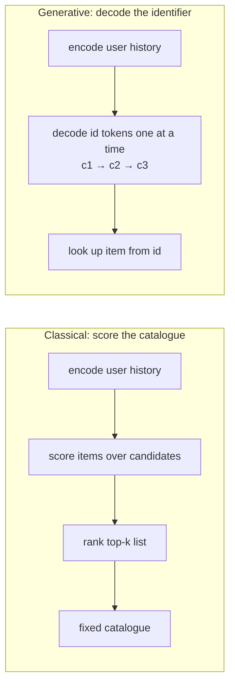
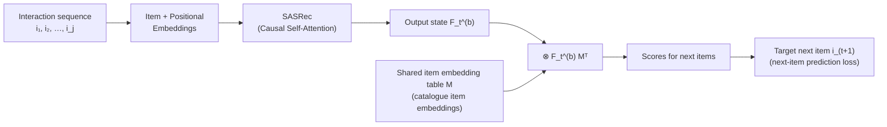
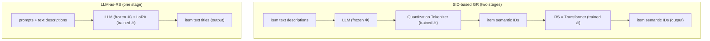

# RS-L04 - Generative Recommendation

> [!abstract] Overview
> This lecture introduces **[[Generative Recommendation]]** (GenRec): instead of *scoring* a fixed catalogue of items and ranking them, the model **generates an item identifier token-by-token** and looks up the corresponding catalogue item. The core enabling idea is **[[Item Tokenization]]** — turning each item into a short, structured sequence of tokens. We contrast **[[Atomic Item IDs]]** (one token per item) with **[[Semantic IDs]]** (a few shared codebook tokens), study how **TIGER** builds Semantic IDs with an **[[RQ-VAE]]**, and then walk the full training + inference pipeline: ground the ID embeddings → next-token cross-entropy → optional RL (**GRPO**) → **[[Trie-Constrained Decoding|trie-constrained]] [[Beam Search]]**. We close with what becomes *harder* (fragile cold-start, strong dense baselines, expensive/biased decoding, moving catalogues, LLM-shaped safety) and what becomes *newly possible* (scaling laws, one model for many tasks, instruction-based recommendation, test-time reasoning).
>
> **The one-line shift:** from $s(u,i)$ (score every item) to $p(z_1,\dots,z_L \mid \text{history})$ (generate the next item's code). The framing follows **TIGER** (Rajput et al., *Recommender Systems with Generative Retrieval*, NeurIPS 2023).

---

## 1. Where Are We? Classical vs. Generative

The course so far: L1 introduction, L2 evaluation, L3 [[Sequential Recommendation|sequential]] and LLM-based recommendation. This lecture is **generative** recommendation.

The fundamental change is in the **output space**. Two pipelines side by side:



> [!key] The key shift
> Instead of directly scoring catalogue items, the model **generates item-identifier tokens** that must map back to real items.

### 1.1 What does "Generative" mean here? (disambiguation)

"Generative" is overloaded in RecSys. Three distinct meanings:

| Meaning | Flow | What is generated | Example (NOT linkable) |
|---|---|---|---|
| **Generate item identifiers** (MAIN FOCUS) | `user history → item-id tokens → catalogue item` | a tokenized item ID, mapped back to an existing item | **TIGER** (NeurIPS 2023) |
| **Diffusion for embedding denoising** | `user/item embeddings → diffusion denoising → existing candidates` | nothing new; reverse-denoises recommender embeddings, output grounded in existing pool | **DDRM** (SIGIR 2024) |
| **Generative models for content** | `user history + conditions → new images → outfit` | genuinely **new item content** (GANs/VAEs/diffusion) | **DiFashion** (SIGIR 2024) |

This lecture means the **first** meaning throughout: generate **catalogue-grounded item IDs**.

---

## 2. Recap: Classical Sequential Recommendation

**Task — next-item prediction.** Given a chronologically ordered sequence of past interactions, predict the next item:

$$\text{item}_1 \to \text{item}_2 \to \text{item}_3 \to \text{item}_4 \to \;?$$

The user interaction history is
$$\mathcal{H}_t = (i_1, i_2, \ldots, i_t),$$
where each $i_j$ is an item the user clicked / watched / purchased / listened to. The classical solution:
1. Encode the history $\mathcal{H}_t$.
2. Score each candidate catalogue item: $s(\mathcal{H}_t, i)$.
3. Rank items by score.

> [!note] Score-and-rank skeleton
> [[SASRec]], [[BERT4Rec]] and [[GRU4Rec]] differ only in **how they encode** $\mathcal{H}_t$ — they all keep the same *score-and-rank* skeleton over [[Atomic Item IDs]].

### 2.1 Example: SASRec



Each catalogue item has a unique [[Atomic Item ID]] and a learned embedding. [[SASRec|SASRec]] adds positional embeddings and applies **causal [[Self-Attention]]**; the output state $F_t^{(b)}$ scores candidates.

> [!formula] SASRec score
> $$r_{i,t} = F_t^{(b)}\, M_i^\top$$
> - $F_t^{(b)}$ — the output state of block $b$ at position $t$ (encodes the history).
> - $M_i$ — the shared embedding row for catalogue item $i$.
> - Higher $r_{i,t}$ ⇒ item $i$ more likely to be the next interaction.

**Takeaway:** SASRec is still score-and-rank — it encodes history then scores **atomic** item IDs directly. (Refs: Kang & McAuley, *Self-Attentive Sequential Recommendation*, ICDM 2018; Petrov & Macdonald tutorial, ECIR 2024.)

### 2.2 From Language-Model ideas to GenRec

Language-model ideas entered recommendation in three ways, but most kept recommendation as **scoring** or **text generation**:

| Angle | What LMs did | Examples (NOT linkable) | Still… |
|---|---|---|---|
| **Architecture** | Transformer encoders over interaction sequences | **SASRec** (2018), **BERT4Rec** (2019) | scores catalogue items |
| **Representation** | LMs encode item text / metadata / reviews | **RecFormer** (2023) | learned reps for ranking |
| **Task formulation** | tasks written as prompts | **P5** (2022), **M6-Rec** (2022) | generates text / ratings / explanations |

The **GenRec shift**: in Semantic-ID-based generative recommendation the generated sequence is not an explanation — it **is the item identifier**:
$$\text{user history} \longrightarrow \text{generated item id} \longrightarrow \text{catalogue item}.$$
(GenRec examples: **TIGER** NeurIPS 2023, **OneRec** arXiv 2025.)

### 2.3 Example: P5 frames recommendation as language generation

**P5** writes every recommendation task as a **text-to-text** problem (sequential recommendation, rating prediction, explanation generation, review summarization, direct recommendation), each as a natural-language prompt feeding a single shared model that emits a textual answer; trained as multi-task pretraining over a personalized prompt collection with zero-shot generalization to new prompts.

**Bridge:** P5 casts recommendation as text-to-text generation; **GenRec instead generates catalogue-grounded item IDs**. (Geng et al., RecSys 2022.)

### 2.4 Two formulations of Generative Recommendation



| | Quantization Tokenizer? | Inputs to RS | RS Backbone | Outputs of RS |
|---|---|---|---|---|
| **SID-based GR** | Yes | Item Semantic IDs | [[Transformer Model\|Transformer]] | Item Semantic IDs |
| **LLM-as-RS** | No | Text Descriptions | [[LLM]] | Item text Titles |

> [!note] Scope
> This lecture focuses on **SID-based GenRec** (items → semantic IDs, recommender generates those IDs). **LLM-as-RS** (uses item text directly, e.g. via [[LoRA]]) is a related formulation. (Liu et al., ICLR 2026 submission.)

---

## 3. Motivation: From Cascades to Generation

### 3.1 Cascade vs. end-to-end (OneRec)

Real industrial recommenders are **multi-stage cascades**; the generative view collapses them into one model:

```text
(a) Unified / End-to-End Generation:
    Video Corpus (~10^10) ──► Encoder → Decoder ──► recommended videos (dozens)

(b) Cascade Architecture:
    Video Corpus (~10^10)
        └─► Retrieval        ──► Coarse-grained Corpus (~10^5)
              └─► Coarse Ranking  ──► (~10^3)
                    └─► Fine Ranking  ──► (~10^2)
                          └─► recommended videos (dozens)
```

> [!warning] Why cascades hurt
> Each stage narrows the pool. **Recall errors in early stages cannot be recovered by later rankers.** An end-to-end generative recommender learns candidate selection and ranking *jointly*, reducing hand-offs. (Deng et al., **OneRec**, arXiv 2025.)

### 3.2 Recommendation as sequence generation

- User behaviour is *already* a sequence: $i_1, i_2, \ldots, i_t \to i_{t+1}$.
- Next-**item** prediction $\approx$ next-**token** prediction.
- So: instead of scoring every candidate, **generate the next-item output directly**.

| | Pipeline |
|---|---|
| **Classical** | encode history → score catalogue → rank |
| **Generative** | encode history → **decode identifier** → look up item |

**Key challenge:** generation needs a **token space**. Before we can decode an item we must decide *what an item identifier looks like*.

### 3.3 Why move beyond Atomic IDs?

Classical setup: one [[Atomic Item ID]] per item (a unique integer, one learned embedding); recommend by scoring candidate IDs. The embedding table grows **linearly** with the catalogue. Where it breaks:

- **Scale:** output space = catalogue size ⇒ a softmax over millions of items.
- **Arbitrary:** `item_3487` says nothing about the item.
- **Cold start:** every new item needs a new ID *and* a freshly trained embedding.

⇒ Replace arbitrary IDs with **generated identifiers** that are compact, valid, and carry structure.

---

## 4. Generative Recommendation: Formal Setup

For each item $i$ in catalogue $\mathcal{I}$, a fixed-length identifier $\mathbf{z}_i = (z_{i,1}, \ldots, z_{i,L})$; a user history $\mathbf{x} = (x_1, \ldots, x_t)$ with $x_j \in \mathcal{I}$.

> [!formula] Autoregressive generation of the identifier
> $$p_\theta(\mathbf{z}_i \mid \mathbf{x}) = \prod_{\ell=1}^{L} p_\theta\!\left(z_{i,\ell} \mid \mathbf{x},\, z_{i,<\ell}\right)$$
> - $L$ — identifier length (number of tokens).
> - $z_{i,\ell}$ — the $\ell$-th identifier token of item $i$.
> - $z_{i,<\ell}$ — the tokens generated so far for this item.
> - Each token is decoded one at a time ([[Autoregressive Generation]]), conditioned on history **and** the partial identifier.

> [!formula] Scoring view
> $$s_\theta(\mathbf{x}, i) = \log p_\theta(\mathbf{z}_i \mid \mathbf{x})$$
> The identifier's likelihood **is** the item's score. Higher likelihood = more compatible with the history. Recommendations come from **decoding valid identifiers**, not from scoring a fixed candidate set.

### 4.1 Two stages (TIGER)

**Stage (a): Semantic ID generation** — quantize content embeddings.
```text
Item Content (Title, Description, Categories, Brand)
        └─► Content Encoder ─► Embedding ─► Quantization ─► Semantic ID
```

**Stage (b): encoder–decoder generative retrieval.**
```text
User 5 history:  t_u5 , Item233 SID=(5,23,55) , Item515 SID=(5,25,78) , …
        └─► Bidirectional Transformer ENCODER ─► "Encoded Context"
                  └─► Transformer DECODER (autoregressive):
                        inputs:  <BOS> t_5  t_25  t_55 …
                        outputs:        t_5  t_25  t_55  <EOS>
                        ⇒ Next Item = Item64, SID=(5,25,55)
```
(Rajput et al., NeurIPS 2023.)

### 4.2 Illustrative example

```text
Inception     → 12.48.7.91
Interstellar  → 12.48.3.22     ──► Generative model (predicts next id token-by-token)
Tenet         → 12.51.9.14          ──► 12.48.5.73 ──► id-to-item lookup ──► Dunkirk
```

The shared prefix `12.48…` is *illustrative*: it suggests the tokenizer placed these films in a similar coarse semantic region (genre, director/style, metadata, or similar user behaviour — depending on what signals built the IDs).

### 4.3 A useful parallel: Generative IR

Earlier [[Generative Retrieval|Generative IR]] work (e.g. **DSI**) asked whether a model could generate a *document* identifier directly. GenRec applies the same idea to *item* identifiers.

| Generative IR | Generative RecSys |
|---|---|
| `query → GenIR → document id` | `user history → GenRec → item id` |

**Shared challenge:** the generated ID must be **valid, generatable, and grounded** in a real collection/catalogue. (Background: **GENRE** 2020, **DSI** 2022, **NCI** 2022, **TIGER** 2023.)

---

## 5. Item Tokenization: From Atomic IDs to Semantic IDs

### 5.1 Recap: tokenization turns data into tokens

Generative models operate over **token sequences**. A language tokenizer (e.g. **BPE**, OpenAI `o200k_base`):

```text
"The user watched Inception and Interstellar last night"
  → The | user | watched | In | ception | and | Inter | stellar | last | night
  → 976, 1825, 25301, 730, 1317, 326, 5605, 151024, 2174, 4856
```

The model operates on **token ids**, not raw words. **Bridge:** LMs generate *text* tokens; GenRec generates *item* tokens. The question shifts from text tokenization to **[[Item Tokenization]]**.

### 5.2 Why item tokenization is harder

```text
LM:     text          → subword tokens   → language model
RecSys: user actions  → item-id tokens?  → GenRec model
```

| Text tokenization (easy) | Item / action tokenization (hard) |
|---|---|
| Reusable subwords (Inter + stellar) | No natural subwords (`item_3487` has no reusable structure) |
| Fixed vocabulary (30k–100k+) | Large catalogues (millions of items) |
| Dense supervision (tokens recur in many contexts) | Sparse interactions; long-tail items with little feedback |
| Built into the pretrained LM | Validity constraint: generated IDs must map to real items |

**Core question:** can we design item tokens that are **compact, valid, learnable, and structured**?

### 5.3 What should the identifier look like?

The identifier choice **defines the output space** the generator learns. A good item ID should be **compact** (short to generate), **grounded** (maps to a real item), **learnable** (predictable from histories), **structured** (related items share parts). Three design choices:

1. **Atomic IDs** — one unique token per item.
2. **Textual IDs** — use item text/metadata directly.
3. **Semantic IDs** — short reusable token sequences.

#### Option 1 — one Atomic token per item

```text
Inception → item_3487 ,  Interstellar → item_124 ,  Tenet → item_19240 ,  Dune → item_772
```
Four related films get four **unrelated** atomic tokens.

| (+) Why attractive | (−) Why weak |
|---|---|
| simple lookup, short sequence, direct mapping | vocab grows with catalogue ($10^6$ items ⇒ $10^6$ tokens); arbitrary; no shared structure; new items need new tokens + embeddings |

#### Option 2 — full description as the ID

Make the identifier the item's full text ("A visually ambitious science-fiction film about memory, identity, artificial intelligence…").

| (+) Why attractive | (−) Why weak |
|---|---|
| meaningful; reuses existing language tokens; exploits text/metadata | sequences very long; expensive to model/generate; hard to constrain (many texts match no item); may not map uniquely |

⇒ Can we use a *few reusable tokens* — shorter than full text, more structured than one atomic token? This motivates **Semantic IDs**.

### 5.4 Semantic IDs: the middle ground

> [!definition] Semantic ID (SID)
> A short sequence of tokens that identifies one catalogue item:
> $$\text{item} \longleftrightarrow (z_1, z_2, \ldots, z_L).$$
> SID tokens are **shared across items**: related items share some tokens, while the full sequence still identifies one item.

Example:
- item A ↔ $(z_1{=}12,\, z_2{=}48,\, z_3{=}5,\, z_4{=}73)$
- item B ↔ $(z_1{=}12,\, z_2{=}48,\, z_3{=}19,\, z_4{=}91)$

**Prefix granularity.** In [[Hierarchical Semantic IDs|hierarchical SIDs]], shared prefixes describe coarser groups; later tokens refine toward a specific item:
$$(12, 48, *, *) \;\to\; (12, 48, 5, 73).$$
A and B share $(12,48,\ldots)$ (coarse similarity) then diverge. The full tuple identifies the item, usually after **collision handling**. (A movie poster annotated `t3, t321, t643, t1011` — a few tokens that jointly index one item; Hou et al., CIKM 2025 tutorial.)

### 5.5 Small codebooks, large item space

Use $L$ token positions, each with $K$ choices: $L$ = ID length, $K$ = [[Codebook]] size per position.

> [!formula] Capacity from a tiny vocabulary
> $$\underbrace{256 \times 256 \times 256 \times 256}_{L=4,\; K=256} = K^L = 256^4 \approx 4.3 \times 10^9$$
> Only $4 \times 256 = 1024$ code tokens define **billions** of possible ID sequences.

**Why it helps:** avoids one-token-per-item, reuses tokens, keeps IDs short. **Caveat:** not every sequence is a real item — valid IDs come from the catalogue lookup table, and decoding can be **constrained** to valid IDs. **Takeaway: Semantic IDs separate capacity from vocabulary size.**

### 5.6 TIGER: constructing the Semantic ID (offline)

**TIGER** builds an item→SID lookup *before* training the generator; the tokenizer is then **frozen**.

```text
Item text/metadata (title, brand, category)
  └─► Embedding (Sentence-T5 vector)
        └─► RQ-VAE (one index per level)
              └─► Semantic id:  i ↦ (z₁, …, z_L)
```

**Hierarchical codewords:** $\text{SID}(i) = (z_1{=}7, z_2{=}1, z_3{=}4)$ — earlier indices coarser, later ones refine the residual ($z_1$ = broad category, $z_2/z_3$ = finer detail).

**Collision handling.** Different items can map to the same tuple, so TIGER appends an extra token:
$$(12, 24, 52) \;\to\; (12, 24, 52, 0),\ (12, 24, 52, 1).$$
Each final SID is unique and maps back to one item.

> [!key] Tokenization is offline
> Semantic-ID construction is typically an **offline** step. The recommender later generates the selected **indices**, not the continuous embeddings.

### 5.7 TIGER: RQ-VAE-based Semantic IDs

> [!definition] [[RQ-VAE]] (Residual-Quantized VAE)
> A DNN **encoder** maps an item embedding to a latent vector. **Residual quantization** runs over $L$ [[Codebook|codebooks]]: at each level pick the nearest codeword, *subtract* it, pass the **residual** to the next codebook. The chosen indices form the SID; their codeword vectors sum to the quantized representation, which the **decoder** reconstructs.

```text
Embedding ─► DNN Encoder ─► r(0)
   ├─ codebook_1: nearest codeword #7   →  subtract  →  residual d=1
   ├─ codebook_2: nearest codeword #1   →  subtract  →  residual d=2
   └─ codebook_3: nearest codeword #4   →  subtract  →  residual
   sum of 3 codeword vectors (+ + +) = Quantized representation
        └─► DNN Decoder ─► reconstructed embedding
   Semantic codes = (7, 1, 4)
```
(Toy illustration: $L=3$ codebooks, $K=8$ codes each; Rajput et al., NeurIPS 2023.)

### 5.8 TIGER: training the RQ-VAE tokenizer

**Goal:** learn an encoder, decoder, and residual codebooks so discrete codeword indices preserve the original item embedding.

```text
x_i ─► encoder ─► z_i ─► RQ ─► ẑ_i = Σ_d e_{d, c_{i,d}} ─► decoder ─► x̂_i
Semantic id:  id(i) = (c_{i,1}, c_{i,2}, …, c_{i,L})   ← keep the selected codeword indices
```

> [!formula] RQ-VAE objective
> $$\mathcal{L} = \mathcal{L}_{\text{recon}} + \mathcal{L}_{\text{rqvae}}, \qquad \mathcal{L}_{\text{recon}} = \lVert \mathbf{x}_i - \hat{\mathbf{x}}_i \rVert_2^2$$
> - $\mathcal{L}_{\text{recon}}$ — squared error between original embedding $\mathbf{x}_i$ and reconstruction $\hat{\mathbf{x}}_i$.
> - $\mathcal{L}_{\text{rqvae}}$ — the quantization/commitment term that pulls residuals toward chosen codewords.

After training the decoder is **not** the recommender output: the generator predicts the **indices**, not the continuous vectors.

### 5.9 Semantic IDs form a category hierarchy

**Shared prefixes = shared semantics.** Items under the same coarse code sit in the same broad category; deeper codes split it into finer ones.

```text
Sports (1722, *, *)
 └─ (1723, *, *)
     ├─ Powerlifting & body building (1723, 1090, *)
     ├─ Combat sports               (1723, 998, *)
     └─ Outdoor sports              (1723, 541, *)
          ├─ Surfing          (1723, 541, 1129)
          ├─ Triathlon        (1723, 541, 235)
          └─ Beach volleyball (1723, 541, 95)
```
(`*` = wildcard over deeper codeword positions; Singh et al., RecSys 2024.)

**Why it matters:** the model can generate a coarse prefix (*Sports*) and refine token-by-token — enabling [[Cold Start|cold-start]] and controllable, diverse retrieval.

### 5.10 Does the identifier choice matter?

TIGER compares three identifier choices: **Random IDs** (arbitrary), **LSH-based IDs** (hash similar embeddings to similar codes via random projections), **RQ-VAE Semantic IDs** (learned residual-quantized codes).

Evaluated on three Amazon datasets (**Sports and Outdoors**, **Beauty**, **Toys and Games**) with Recall@5/@10 and NDCG@5/@10, against baselines **P5, Caser, HGN, GRU4Rec, BERT4Rec, FDSA, SASRec, S³-Rec**:

| Dataset | TIGER Recall@5 | TIGER NDCG@5 | Gain over best baseline (R@5 / N@5) |
|---|---|---|---|
| Sports and Outdoors | ≈ 0.0264 | ≈ 0.0181 | +5.22% / +12.55% (and +3.90% / +10.29% at @10) |
| Beauty | ≈ 0.0454 | — | similar gains |
| Toys and Games | ≈ 0.0521 | — | similar gains |

> [!result] TIGER's finding
> **RQ-VAE Semantic IDs perform best** among the three identifier choices.
> **Caveat:** later work shows the best SID-construction method depends on the embedding space, task, and setup.
> **Lesson:** item tokenization is **not** just preprocessing — it is a *modelling choice*.

### 5.11 Beyond TIGER: SID design is still open

- **Controlled ablations:** comparing **RK-Means, R-VQ, RQ-VAE** under controlled settings, simpler residual-quantization methods can be competitive with or better than RQ-VAE.
- **Embedding space & task matter:** a tokenizer good for recommendation may not be best for search; in joint search+recommendation, task-specific IDs can help one task while hurting the other.

**Takeaway:** RQ-VAE is a canonical *starting point*, not a universal answer. (Ju et al., *A Practitioner's Handbook*, CIKM 2025; Penha et al., *Semantic IDs for Joint Generative Search and Recommendation*, RecSys 2025.)

### 5.12 Main design families

| Family | Idea (coarse→fine) | Examples (NOT linkable) |
|---|---|---|
| **[[Residual Quantization]]** | ordered codes | RQ-VAE, RQ-KMeans, RK-Means, R-VQ |
| **[[Product Quantization]]** | split embedding, quantize subspaces | VQ-Rec |
| **Hierarchical Clustering** | tree-path IDs, root→leaf | P5-CID, RecForest |
| **LM / Textual IDs** | language tokens / generated IDs | LMIndexer, IDGenRec |

Each trades off **semantic content** vs. **behaviour alignment** vs. **validity / decoding efficiency**. There is no universally best method.

### 5.13 What shapes a Semantic ID?

Two things: **what representation we quantize** and **what objective we learn it with**.

- **Content / metadata:** text (title, description); multimodal (image, audio, video); categorical (category, brand); no content (random/raw ID).
- **Behaviour / context:** objectives ([[Contrastive Learning|contrastive]], diversity); fusion (text + behaviour); multi-behaviour (click, view, purchase); context-aware (depends on history).

> "A Semantic ID is only as good as the representation it quantizes." The field is moving from static, content-only IDs toward **behaviour-aware, context-aware, task-aware** IDs.

### 5.14 Content signals vs. collaborative signals

| Content signal | Collaborative signal |
|---|---|
| info from the **item itself** (title, description, category, brand, image) | info from **interaction patterns** (clicks, views, purchases, co-consumption) |
| two movies share a description; two products share a brand | users who watch Inception also watch Interstellar; buyers of running shoes also buy running socks |

Content IDs capture what items *are*; collaborative signals capture how users *use* items together. **Behaviour-aware tokenizers** try to reflect both.

### 5.15 Frontier tokenizers

| Method (NOT linkable) | Problem it targets | What it adds |
|---|---|---|
| **CoST** (RecSys 2024) | reconstruction-only quantization ignores *neighbourhood structure* | a **[[Contrastive Learning\|contrastive]] objective** so a quantized rep stays closer to its own item than to others in the batch (two losses: reconstruction + contrastive) |
| **LETTER** (CIKM 2024) | content IDs miss **collaborative** signals | three regularizers — **semantic hierarchy** $\mathcal{L}_{sem}$, **collaborative alignment** $\mathcal{L}_{CF}$, **diversity** $\mathcal{L}_{div}$ — on top of $\mathcal{L}_{recon}$ |
| **ActionPiece** (ICML 2025) | most methods assign a *fixed* token sequence per action | **context-aware** tokens: represent each action as an unordered feature set, learn a subword-style vocabulary by merging feature patterns within & across adjacent actions ⇒ same action tokenizes differently in different contexts |

---

> ☕ **15-minute coffee break** — resume with training and decoding.

---

## 6. Training and Decoding

### 6.1 Architecture: encoder–decoder or decoder-only?

Both are Transformers; they differ only in **how the history is read** before the next item is written.

| | Encoder–decoder ("read fully, then write") | Decoder-only ("one continuous stream") |
|---|---|---|
| Style | T5-style | GPT-style |
| Examples (NOT linkable) | TIGER, LETTER, CoST | HSTU, OneRec, GPTRec |
| How | encoder reads history → decoder writes SID; history encoded once | `[history ‖ target SID]` one sequence; predict next token throughout |
| Fit | natural when history is bounded | scales to very long histories; industrial trend (2024–25) |

Either way the item's code is produced one token at a time:

> [!formula] Factorized generation
> $$p(z_1, \ldots, z_L \mid h) = \underbrace{p(z_1 \mid h)}_{\text{first code}} \prod_{\ell=2}^{L} \underbrace{p(z_\ell \mid h, z_{<\ell})}_{\text{next code, given so far}}$$
> $h$ = encoded history; $z_\ell$ = the $\ell$-th SID token.

### 6.2 How do we represent items?

| | Atomic IDs | Semantic IDs |
|---|---|---|
| mapping | $i_j \to \langle \text{item}_j \rangle$ (one item = one token) | $i_j \to (z_{j,1}, \ldots, z_{j,L})$ (one item = $L$ codebook tokens) |
| vocab | $\lvert\mathcal{I}\rvert$; finite, stable catalogues | small shared codebook ($K \approx 256$–$4096$); large/growing catalogues |
| (+) | simple, no tokenizer stage | compact vocab; warm cold-start; content-aware |
| (−) | vocab explodes; **no cold-start generalization**; popularity bias in softmax | extra tokenization stage; decoding must stay **valid** |
| ex. | GPTRec, P5 | TIGER, LETTER, CoST, OneRec |

Rest of section assumes **SIDs** (the harder case). **Atomic IDs are the special case $L=1$** with codebook = catalogue.

### 6.3 Building training examples

**Atomic IDs** — input $(i_1, \ldots, i_t, i_{t+1})$; predict $i_{t+1}$. Each item is one token:
```text
history (3 tokens):  ⟨i₁⟩ ⟨i₂⟩ ⟨i₃⟩   →   target (1 token):  ⟨i₄⟩
```
Learning problem $p(i_{t+1} \mid i_1, \ldots, i_t)$. One item = one position ⇒ predicting the next item is **one** autoregressive step; vocabulary = catalogue.

**Semantic IDs** — each item expands into $L$ tokens; the history becomes an $L\times$ longer flat sequence:
```text
history (9 tokens):  i₁=(12,48,7) i₂=(12,48,3) i₃=(12,51,9)   →   target (3 tokens):  i₄=(12,48,5)
```
Learning problem $p(z_{t+1,1}, \ldots, z_{t+1,L} \mid \text{history of SID tokens})$. One item = $L$ positions ⇒ predicting the next item takes **$L$** autoregressive steps — this is what beam search operates on.

### 6.4 Cold-start at inference: new items, no retraining

A new item $i^\star$ arrives *after* training:

| Atomic IDs | Semantic IDs |
|---|---|
| token $\langle i^\star \rangle$ does **not exist** in vocab; embedding row must be added and **learned** from interactions | run $i^\star$ through the **frozen tokenizer** → SID $(z_1^\star,\ldots,z_L^\star)$ |
| until then $i^\star$ is unrecommendable (**strict cold start**) | all sub-tokens already exist in the codebook |
| fix: periodic retraining / content warm-up | add the path to the **trie** ⇒ $i^\star$ is now **decodable**; shared prefixes ⇒ generalization for free |

```text
new item i* → content/text → RQ-VAE tokenizer → (5, 23, 91) → trie ∪ {(5,23,91)}
```

### 6.5 Training stages: grounding the SID vocabulary

> [!warning] The cold-token problem
> Extending an LM's vocabulary with $K \cdot L$ fresh SID tokens gives **randomly initialized** embeddings. Jumping straight to next-item cross-entropy forces the model to learn (i) what each SID *means* and (ii) how to compose them — from a single signal.

**Fix:** a **grounding stage** before next-item training. Typical grounding tasks (text-to-text, item $i$ ↔ SID($i$)):
- **SID → description:** "Item (12, 48, 7) is:" → title/desc.
- **Description → SID:** "A sci-fi film by Nolan" → (12, 48, 7).
- **Attribute / category alignment:** "Genre of (12, 48, 7)?" → "Sci-fi".
- **Co-occurrence / similarity:** "Items similar to (12, 48, 7):" → list.

**Three-stage pipeline:**
1. **Tokenize** — learn SIDs (Sec. 5).
2. **Ground** — multi-task tuning so SID embeddings carry semantic + collaborative signal.
3. **Recommend** — next-item cross-entropy + optional RL.

Stages can be sequential or jointly multi-task. (Grounding examples NOT linkable: **LC-Rec**, **LETTER**.)

### 6.6 Training objective: next-token cross-entropy

> [!formula] Next-token CE loss
> $$\mathcal{L} = -\sum_{\ell=1}^{L} \log p(z_\ell \mid \text{history},\, z_{<\ell})$$
> At training time the target SID is known. For each position $\ell$, predict $z_\ell$ given everything before it (**teacher forcing**). Averaged over all positions and all items in the batch.

| Same as a language model | Different |
|---|---|
| the loss function and training loop | tokens are **item codes** from a small learned codebook (~256–4096), not a 50K BPE vocab |

**Important distinction:** the model is **not** generating natural language — it is generating **item identifiers**.

### 6.7 Beyond cross-entropy: reward-based fine-tuning (GRPO)

> [!intuition] Why go beyond CE?
> Next-token CE only rewards copying the *exact* next click. It never says whether a recommendation is a **real item**, whether the **whole list** is good, or whether goals like **diversity** and **freshness** are met.

**Idea:** let the model *generate* a few recommendations, *score* them, then *nudge* it to produce more good ones — like chatbots tuned with human feedback. This is [[Reinforcement Learning]].

> [!algorithm] GRPO recipe (per user history, repeat)
> 1. **Generate** a small *group* of candidate recommendations.
> 2. **Score** each with a reward (higher = better).
> 3. **Compare** each candidate to the group's *average*: above average ⇒ make **more** likely; below ⇒ make **less** likely.
> 4. Take a **small, careful** step in that direction.

**Why compare to the group:** we don't need the "true best" recommendation, only which candidates beat the others we just tried. That relative signal suffices and needs **no extra value/critic network** (the defining property of [[Group Relative Policy Optimization|GRPO]]).

**Worked example** — user watched *Inception, Interstellar, Tenet*. Generate 4 candidates, scored 0 (bad) → 1 (great):

| Candidate | Reward | Why |
|---|---|---|
| Oppenheimer | 1.0 | valid, relevant, fresh |
| Dunkirk | 0.7 | valid, relevant |
| Interstellar | 0.2 | already watched |
| made-up code | 0.0 | not a real item |

Group average $= (1.0+0.7+0.2+0.0)/4 = 0.475$. ⇒ Oppenheimer & Dunkirk are **above average** (push up); Interstellar & the invalid code are **below average** (push down).

A reward scores higher when it is **valid** (real catalogue item), **relevant** (matches the user), and meets goals like **freshness, diversity, safety**.

> [!warning] Two safety rails when nudging
> Take only **small steps** each update, and **stay close to the original model** (KL constraint) so it can't drift into nonsense to chase reward. (Related: **DPO / S-DPO / Rec-R1**.)

### 6.8 Inference: beam search over SIDs

[[Beam Search|Greedy decoding]] keeps only the top-1 next token — fine for *the* next item, but we want a **ranked list**. **[[Beam Search]]** maintains $B$ partial candidates at each step.

```text
            root
          /  |   \
        12   9    7        ← keep {12, 7}, prune 9
       /  \        \
      48   51      18 21   ← keep {48, 18}, prune {51, 21, …}   (beam size B=3)
   (red = kept, gray = pruned)

After L steps, B complete SIDs:  (12,48,5), (12,48,7), (7,18,3)  →  B ranked items
```

### 6.9 The validity problem

| Language generation | Recommendation generation |
|---|---|
| any token sequence is a valid (if weird) sentence | most SIDs **don't correspond to any real item** |

```text
model generates (5, 99, 13) → no such item in catalogue
```

**Why:** the SID space has $K^L$ codes (e.g. ~$10^9$); the catalogue uses a tiny fraction (~$10^7$ items); most combinations are **unused**. **Fix: constrain decoding** to emit only sequences that exist in the catalogue.

### 6.10 Trie-constrained decoding

> [!definition] [[Trie-Constrained Decoding]]
> Store all valid catalogue SIDs in a **[[Trie]]**. At each step, only allow tokens lying on a valid path; the output distribution is **renormalized over allowed tokens only** (implemented as a **logit mask**).

```text
root ∅
 ├─ 5 ─ 23 ─ {55, 18, 91}
 ├─ 9 ─ 4
 └─ 12 ─ 48

At prefix (5, 23):  Allowed next = {55, 18, 91};  Forbidden = everything else
```

**Effect:** every generated sequence *is* a real item. **Trade-off:** validity guaranteed, but the trie must be **updated** whenever the catalogue changes — non-trivial in fast-moving systems.

### 6.11 Reward validity instead of masking it

A complementary idea: **teach** the model to prefer valid SIDs by making "is this a real item?" part of the GRPO reward. Candidates generated *freely* (no mask), valid ones rewarded, invalid penalized.

**Example (validity-only reward, 1 = real, 0 = not):**

| Candidate | Reward |
|---|---|
| (12, 48, 7) | 1.0 (real) |
| (12, 48, 5) | 1.0 (real) |
| (5, 99, 13) | 0.0 (no such item) — below average ⇒ generated **less** |
| (12, 51, 2) | 1.0 (real) |

| Trie | Reward |
|---|---|
| **guaranteed** valid, but needs syncing | only **likely** valid, but no live trie needed |

Often **combined**.

### 6.12 End-to-end: from history to ranked list

> [!example] Six-step inference
> 1. **User history:** {Inception, Interstellar, Tenet}
> 2. **Look up SIDs:** (12, 48, 7), (12, 48, 3), (12, 51, 9)
> 3. **Generative model + constrained beam search** ($B = 5$)
> 4. **Generated SIDs:** (12, 48, 5), (12, 48, 7)†, (12, 51, 2), (7, 18, 3), …
> 5. **Filter:** remove SIDs already in history; † deduplicate; apply business rules
> 6. **Final ranked list:** Dunkirk, Oppenheimer, The Prestige, …
>
> † (12, 48, 7) matches Interstellar (already in history) ⇒ filtered out.
> With **Atomic IDs** the flow is identical, but step 2 maps each item to a single token and step 4 generates one token per recommendation.

### 6.13 Decoding is not free

LLM-style beam search has known pathologies that hit GenRec especially hard:

- **Amplification bias:** popular SID prefixes (e.g. (12, 48, ·)) dominate the beam; long-tail items pruned early.
- **Homogeneity:** beam candidates share long prefixes ⇒ the top-$B$ items are near-identical (five similar action movies).
- **Local optima:** a greedy first-token choice locks in a region of SID space; a better item with a different prefix is unreachable.
- **Inference cost:** each recommendation = $L$ autoregressive steps + trie lookup; at scale, decoding dominates latency.

#### Why all recommendations look the same

```text
Inception    → (12, 48, 7)
Interstellar → (12, 48, 3)   all share prefix (12, 48, ·)  ⇒  beam stays here
Tenet        → (12, 48, 9)
Parasite     → (31,  5, 2)   different prefix  ⇒  low score, pruned early
```
Goal: keep recommendations valid and relevant, but **spread them across different prefixes**.

### 6.14 Two ways to add diversity

| At decoding time (change *how we pick*) | At training time (change *what we learn*) |
|---|---|
| **Add randomness** (temperature / sampling): don't always take the single most likely item | **Reward diversity in RL:** in the GRPO group, penalize candidates that look too alike |
| **Force groups to differ** (diverse beam search): split lists into groups, penalize repeats | **Fix it at the tokenizer (LETTER):** design SIDs so popular items don't collapse onto the same prefix |
| **Re-rank afterwards ([[Maximal Marginal Relevance\|MMR]]):** build the list one item at a time, preferring items *unlike* those already chosen | |

> [!tip] The diversity trade-off
> More diversity usually means slightly **lower accuracy** at guessing the exact next click, but higher **novelty** and engagement. The right balance depends on the product, not the benchmark.

### 6.15 Design choices, at a glance

| Choice | Options (examples NOT linkable) |
|---|---|
| Item representation | **Atomic IDs** — GPTRec, P5; **Semantic IDs** — TIGER, LETTER, OneRec |
| History length | Short (~50) — TIGER; Long (~1000+) — HSTU, OneRec |
| Architecture | Encoder–decoder — TIGER, OneRec; Decoder-only — HSTU, OneRec-V2 |
| Training stages | CE only — TIGER; Grounding + CE — LC-Rec, LETTER; CE + **RL/DPO** — OneRec, S-DPO, Rec-R1 |
| Decoding | Greedy; Beam; **Constrained beam**; Sampling |
| Post-processing | Filter; Dedup; Business rules; Re-rank |

**Recap:** *tokenize → ground SID embeddings → next-token CE → optional RL/DPO* for validity, listwise quality, business goals. Inference: **constrained beam search** to guarantee valid items. Decoding pathologies (bias, homogeneity, cost) shape modern GenRec research.

---

## 7. Limitations, Open Challenges, and Outlook

Three frameworks established the paradigm:

| Framework (NOT linkable) | Year | Contribution |
|---|---|---|
| **TIGER** | NeurIPS '23 | RQ-VAE SIDs, encoder–decoder |
| **HSTU** | ICML '24 | decoder-only, industrial scale |
| **OneRec** | 2025 | unified retrieve+rank, multi-modal |

Moving from retrieve-and-rank to *generate* makes some things harder and others newly possible.

### 7.1 What becomes HARDER

**#1 — Cold-start becomes fragile.**
*Promise:* a brand-new item gets a valid SID from its content the moment it is tokenized.
*Catch:* being **decodable** ≠ being **recommended**. The model was trained only on SIDs of items people actually clicked, so a fresh item's SID has almost no probability and beam search prunes it.
*Fix (hybrid):* stop relying on the generator to "think of" cold items —
```text
1. Generate the usual (mostly warm) candidates
2. Inject cold items by hand into the candidate pool
3. Re-rank everything with dense embeddings (compare by content) → cold items get a fair score
```
**Lesson:** the future of GenRec may be **hybrid**, not purely generative. (**LIGER**, Yang et al., 2024.)

**#2 — Dense retrieval is still strong.**

| [[Dense Retrieval]] | Generative retrieval |
|---|---|
| (+) strong ranking, simple to train/serve | (+) compact SIDs; generates candidates without scanning the whole catalogue |
| (+) cold-start easy (new item → text embedding) | (−) cold-start fragile (#1) |
| (−) must store *every* item vector + [[ANN Search\|ANN]] search; costly at billions | (−) ranking quality less consistent |

**Takeaway:** generative retrieval is **not strictly better** — it trades storage/search cost for cheaper generation, at some cost to ranking and cold-start. (Yang et al., 2024.)

**#3 — Decoding is expensive and biased.**
- *Biased:* **popularity amplification** (popular prefixes win the beam, long-tail pruned) and **homogeneity** (near-duplicate top results).
- *Expensive:* **latency** ($L$ sequential steps, hard within a **<50 ms** budget) and **trie upkeep** (must stay synced with a changing catalogue).
- *Research on cost:* **speculative decoding** (small model drafts, big model verifies), **parallel generation (RPG)** (emit all $L$ codes at once), **caching** popular prefixes.

**#4 — Catalogues move; evaluation lags.**
- *Catalogue churn:* new items need a SID (re-run the tokenizer — fine; retraining would shift *all* existing SIDs); removed items' SIDs linger in the "vocabulary."
- *Metric mismatch:* offline Recall@$K$ / NDCG@$K$ ask "did we predict the one logged click?" A generative model may surface a **good item the user never saw** — counted as **wrong**. Benchmarks **under-credit** the novelty we built GenRec for; diversity, novelty, fairness, long-term engagement aren't captured.

**#5 — Safety, privacy, governance.** GenRec inherits **all LLM safety problems** on top of classical RecSys ones.
- *Content & policy:* the decoder can emit a *valid* SID for an item that is NSFW / deprecated / region-locked / recalled. The **trie** is the only hard safety net — must be filtered *per request* (per user, per locale).
- *Privacy:* SIDs derive from content ⇒ **content-leakage** risk in the codebook; long histories used as context can be **memorized**; GDPR right-to-be-forgotten vs. a frozen tokenizer.
- *Auditability:* a non-LLM ranker can explain *why* item $i$ fired; a decoder emitting (12, 48, 7) offers no trace — explanation becomes its own generation task.

> *The honest summary: we are deploying **LLM-shaped systems** into a domain (recommendation) with **LLM-shaped risks**.*

### 7.2 What becomes POSSIBLE

**#1 — Scaling laws for recommendation.**
For LLMs, more *data + compute + parameters* reliably means a better model — classical recommenders **plateau**. *Actions Speak Louder than Words* (Zhai et al., ICML '24) says recommenders *can* keep improving, by treating the stream of user actions like LLM tokens and using a long-history Transformer (**HSTU**).
*Result:* performance keeps climbing with compute and beats a heavily-tuned production **DLRM**. A compute-vs-year scatter (AlexNet → GPT-3 → LLaMa-2, plus DLRM-20/21/22 and GR-23/GR-24) shows **GR** models following the LLM compute-[[Scaling Laws|scaling]] trend. *Shift:* from small task-specific recommenders that plateau → **large generative recommenders** that improve with scale.

**#2 — One model, many tasks.**
```text
cascade:    retrieve → pre-rank → rank → re-rank
generative: ONE generative model
```
Same backbone can do sequential recommendation, search, query suggestion, explanation generation; multi-domain transfer (books → movies) via a **shared SID vocabulary**; combined with pretrained LLMs (**LC-Rec, OneRec-Think**) for zero-shot generalization and instruction following. **The reframe:** RecSys becomes a sequence-modelling task — the whole LLM toolkit becomes available.

**#3 — Instruction-based recommendation.**
Once recommendation is sequence generation, the user can speak in **natural language**, not just clicks.

| Classical input | GenRec + LLM input |
|---|---|
| history $(i_1, \ldots, i_t)$ | history + instruction ("something upbeat for a morning run, no true-crime") |

Output is still a **constrained SID sequence** ⇒ catalogue-grounded, no hallucination. Captures **intent** (not just long-term preference), enables **controllability** (diversity/mood/novelty knobs), and unifies search + recommendation.
*Case study — **GLIDE** (Spotify, 2026):* podcast discovery as instruction-following over SIDs; recent listening + lightweight context as prompt; long-term user embedding injected as a **soft prompt**; trie keeps generation grounded.
*Example prompts a user could type:* "A 20-minute true-crime podcast for my commute"; "More like the last one, but lighter and funnier"; "Cozy movies for a rainy Sunday, nothing scary"; "Surprise me with something outside my usual taste"; "Albums similar to this one but in Spanish." None are clicks — the user states **intent** directly.

**#4 — Test-time reasoning for RecSys.**
LLMs improved by **thinking step-by-step** before answering, spending extra compute at prediction time. *Think Before Recommend* (Tang et al., 2025) takes several **internal refinement steps** first:
$$\text{user history} \to \text{think}_1 \to \text{think}_2 \to \cdots \to \text{next item}.$$
(The "thinking" lives in hidden states, not written-out text.) *Intuition:* history = cooking videos → flight-booking app → Rome guide; a few reasoning steps infer "planning a trip to Italy."

| Backbone (NOT linkable) | NDCG@20 gain |
|---|---|
| SASRec | +9% |
| BERT4Rec | +6% |
| UniSRec | +7% |
| MoRec | +3% |
| **oracle reasoning** | **+37% to +53%** (headroom remains) |

---

## Key Takeaways

> [!tip] Exam focus
> **The core reframe:** GenRec turns recommendation from *scoring* $s(u,i)$ over a fixed catalogue into *generating* the next item's code $p(z_1,\ldots,z_L \mid \text{history})$ one token at a time, then looking up the item.
>
> **Identifier choice is THE design decision** (defines the output space):
> - **Atomic IDs** — one token/item; vocab = catalogue; simple but explodes, no cold-start generalization. Special case $L=1$.
> - **Semantic IDs** — $L$ shared codebook tokens; $K^L$ capacity from a tiny vocab ($256^4 \approx 4.3\times10^9$); compact, structured (shared prefix = shared semantics), warm cold-start; but decoding must stay valid.
>
> **TIGER pipeline (know it cold):** item text → Sentence-T5 embedding → **RQ-VAE** (residual quantization: nearest codeword → subtract → residual → next codebook) → SID indices; **frozen offline**; collisions broken with an extra token. The generator predicts **indices**, not vectors. RQ-VAE SIDs beat Random / LSH IDs in TIGER.
>
> **Training:** *tokenize → ground SID embeddings (multi-task SID↔text) → next-token cross-entropy (teacher forcing) → optional RL.* GRPO = generate a group, score with a reward (valid + relevant + diversity/freshness), push above-average candidates up and below-average down, **no critic network**, with small-step + stay-close-to-original safety rails.
>
> **Decoding is part of the model:** [[Beam Search]] over SIDs ($L$ steps/item) + **[[Trie-Constrained Decoding|trie constraint]]** (logit mask renormalized over valid paths) guarantees real items. Pathologies: amplification bias, homogeneity, local optima, latency. Diversity fixes at decoding (temperature, diverse beam, MMR) or training (RL reward, LETTER tokenizer).
>
> **Harder:** cold-start fragile (decodable ≠ recommended ⇒ hybrid LIGER), dense retrieval still strong, decoding expensive/biased, catalogues move + metrics under-credit novelty, LLM-shaped safety/privacy.
> **Possible:** scaling laws (HSTU), one model many tasks, instruction-based recommendation (GLIDE), test-time reasoning.
>
> **One line:** GenRec makes RecSys a **sequence-modelling problem** — unlocking the LLM toolkit, but the **tokenizer, the trie, and decoding become first-class parts of the system.**

---

## Links

**Concepts**
- [[Generative Recommendation]] · [[Generative Retrieval]] · [[Generative Recommender]]
- [[Item Tokenization]] · [[Semantic IDs]] · [[Hierarchical Semantic IDs]] · [[Atomic Item IDs]] · [[Codebook]]
- [[RQ-VAE]] · [[Residual Quantization]] · [[Product Quantization]] · [[Item ID Tokenization]]
- [[Autoregressive Generation]] · [[Beam Search]] · [[Trie-Constrained Decoding]] · [[Trie]] · [[Constrained Decoding]]
- [[Group Relative Policy Optimization]] · [[Reinforcement Learning]] · [[Direct Preference Optimization (DPO)]]
- [[Cold Start]] · [[Dense Retrieval]] · [[ANN Search]] · [[Scaling Laws]]
- [[Contrastive Learning]] · [[Maximal Marginal Relevance (MMR)]] · [[Diversity]] · [[Novelty]]
- [[Self-Attention]] · [[Transformer Model]] · [[LLM]] · [[LoRA]]

**Related RecSys lectures**
- [[RS-L01 - Course Overview & Introduction]]
- [[RS-L02 - Evaluation Beyond Accuracy]] — why offline Recall@K / NDCG@K under-credit novelty (Harder #4)
- [[RS-L03a - Sequential Recommendation Models]] — SASRec / BERT4Rec / GRU4Rec, the score-and-rank baselines
- [[RS-L03b - From LLMs to LRMs]] — LLM-as-RS, scaling laws, the bridge to generation
